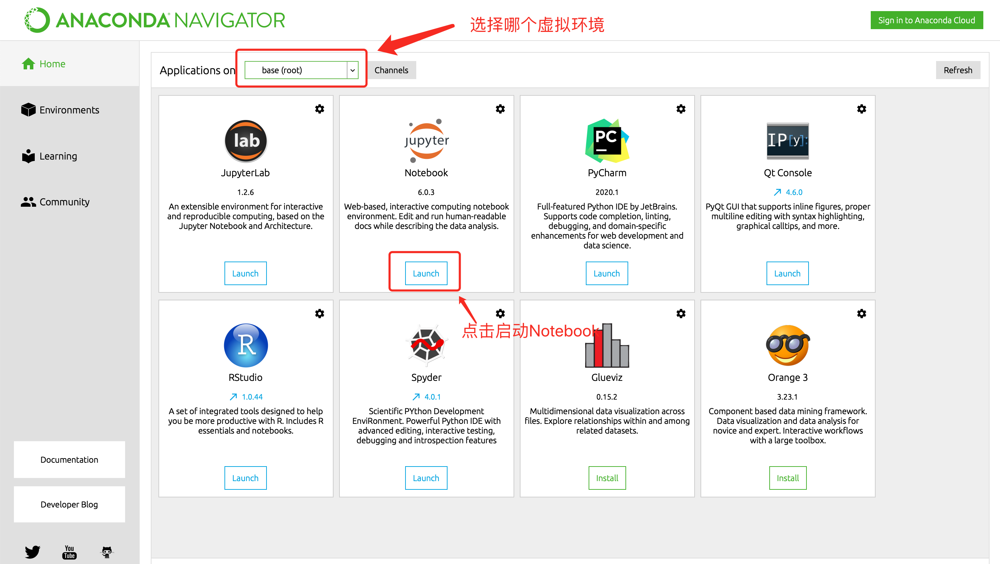
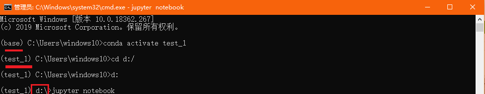

# Python数据分析开发环境搭建

## 学习目标

- 独立完成开发环境搭建
- 掌握 Anaconda的使用方法
- 掌握 Jupyter Notebook的使用方法

## 1 开发环境搭建

### 1.1  简介

- Anaconda 是最流行的数据分析平台，全球两千多万人在使用
- Anaconda 附带了一大批常用数据科学包
  - conda
  - Python 
  - 集成150 多个科学包及其依赖项（默认的base环境）
- Anaconda 是在 conda（一个包管理器和环境管理器）上发展出来的
  - Conda可以帮助你在计算机上安装和管理数据分析相关包
  - Anaconda的仓库中包含了7000多个数据科学相关的开元库
- Anaconda 包含了虚拟环境管理工具
  - 通过虚拟环境可以使不同的Python或者开元库的版本同时存在
- Anaconda 可用于多个平台（ Windows、Mac OS X 和 Linux）
- 我们平时使用Anaconda 自带的jupyter notebook来进行开发，Anaconda 是工具管理器，jupyter notebook是代码编辑器（类似于pycharm，但jupyter notebook是基于html网页运行的）

### 1.2 Anaconda安装

> - 可以在官网上[下载](https://www.anaconda.com/products/individual)对应平台的安装包
> - 本课程中使用的版本为：Anaconda Navigator 1.10.0
> - 如果计算机上已经安装了 Python，安装不会对你有任何影响
> - 安装的过程很简单，一路下一步即可；这里以win10系统作为下载安装演示仅供大家参考

- 访问https://www.anaconda.com/products/individual，如下图所示点击下载


- 根据你的操作系统来选择相应的版本下载


- 点击安装


- 选择操作系统中的用户


- 选择安装路径


- 建议都勾选，自动添加环境变量，自动安装python


- 等待安装


- 安装完毕


- 勾选使用个人版


- 安装好之后部分版本不会在你的桌面创建快捷方式，但是在开始菜单的最近添加中我们可以看到安装好的anaconda3图标；点击就可以打开anaconda了


## 2 Anaconda的使用

### 2.1 Anaconda的界面

- 安装好Anaconda后点击图标可以打开Anaconda的管理面板

  


### 2.2 Anaconda的虚拟环境管理

> 不同的python项目，可能使用了各自不同的python的包、模块；
>
> 不同的python项目，可能使用了相同的python的包、模块，但版本不同；
>
> 不同的python项目，甚至使用的Python的版本都是不同；
>
> 为了让避免项目所使用的Python及包模块版本冲突，所以需要代码运行的依赖环境彼此分开，业内有各种各样的成熟解决方案，但原理都是一样的：不同项目代码的运行，使用保存在不同路径下的python和各自的包模块；不同位置的python解释器和包模块就称之为虚拟环境，具体关系图如下：
>
> 
>
> **虚拟环境的本质，就是在你电脑里安装了多个Python解释器（可执行程序），每个Python解释器又关联了很多个包、模块；项目代码在运行时，是使用特定路径下的那个Python解释器来执行**

#### 2.3.1 虚拟环境的作用

- 很多开源库版本升级后API有变化，老版本的代码不能在新版本中运行
- 将不同Python版本/相同开源库的不同版本隔离
- 不同版本的代码在不同的虚拟环境中运行

#### 2.3.2 可以通过Anaconda界面创建虚拟环境


#### 2.3.2 也可以通过命令行创建虚拟环境

- 在anaconda管理界面打开cmd命令行终端


- 命令行终端对虚拟环境的操作命令如下

  ```shell
  conda create -n 虚拟环境名字 python=3.8  #创建虚拟环境 python=3.8 指定python版本
  conda activate 虚拟环境名字 #进入虚拟环境
  conda deactivate 虚拟环境名字 #退出虚拟环境
  conda remove -n 虚拟环境名字 --all  #删除虚拟环境
  ```


### 2.2 Anaconda的包管理功能

#### 2.2.1 通过Anaconda管理界面安装包

- 点击Environment选项卡，进入到环境管理界面，通过当前管理界面安装python的包模块

  

  

#### 2.2.2 也可以通过anaconda3提供的CMD终端工具进行python包的安装

- 在anaconda管理界面打开cmd命令行终端


- 可以通过conda install 安装【不推荐】

  ```shell
  conda install 包名字
  ```

- 但更推荐使用pip命令来安装python的第三方包【推荐】

  ```shell
  pip install 包名字
  ```

- 安装其他包速度慢可以指定国内镜像

  ```shell
  # 阿里云：https://mirrors.aliyun.com/pypi/simple/
  # 豆瓣：https://pypi.douban.com/simple/
  # 清华大学：https://pypi.tuna.tsinghua.edu.cn/simple/
  # 中国科学技术大学 http://pypi.mirrors.ustc.edu.cn/simple/
  
  pip install 包名 -i https://mirrors.aliyun.com/pypi/simple/  #通过阿里云镜像安装
  ```


## 3 Jupyter Notebook的使用

> 注意：Jupyter  notebook一旦启动，无法打开当前所在磁盘以外的其他磁盘上的文件

### 3.1 启动 Jupyter Notebook 

#### 3.1.1 可以通过Anaconda启动 Jupyter Notebook

> 这种方式直接启动Jupyter  notebook，无法打开当前所在磁盘以外的其他磁盘上的文件




#### 3.1.2 推荐通过终端启动 Jupyter Notebook

> 这种方式先启动cmd，通过切换虚拟环境和磁盘位置，再启动Jupyter  notebook

- 在启动anaconda提供的CMD启动后，输入命令如下

```shell
# 可选操作，切换虚拟环境，使用不同的python解释器和包
conda activate 虚拟环境名字 

# 切换磁盘位置，可选操作
cd d:/
d:

# 启动jupyter notebook
jupyter notebook
```

- 上述操作如下图所示



- 此时浏览器会自动打开jupyter notebook


### 3.2 Jupyter Notebook的使用

#### 3.2.1 Jupyter notebook的功能扩展

- 在启动anaconda提供的CMD启动后，安装jupyter_contrib_nbextensions库，在CMD中输入下列命令

  ```shell
  #进入到虚拟环境中
  conda activate 虚拟环境名字
  #安装 jupyter_contrib_nbextensions
  pip install jupyter_contrib_nbextensions
  # jupyter notebook安装插件
  jupyter contrib nbextension install --user --skip-running-check
  ```

- 安装结束后启动jupyter notebook

  

- 配置扩展功能，在原来的基础上勾选： “Table of Contents” 以及 “Hinterland”

  


#### 3.2.2 Jupyter Notebook的界面

- 新建notebook文档

  > 注意：Jupyter Notebook 文档的扩展名为`.ipynb`，与我们正常熟知的`.py`后缀不同

  

- 新建文件之后会打开Notebook界面

  

- 菜单栏中相关按钮功能介绍：

  > Jupyter Notebook的代码的输入框和输出显示的结果都称之为cell，cell行号前的 * ，表示代码正在运行


#### 3.2.3 Jupyter Notebook常用快捷键

> Jupyter Notebook中分为两种模式：命令模式和编辑模式

- 两种模式通用快捷键
  - **`Shift+Enter`，执行本单元代码，并跳转到下一单元**
  - **`Ctrl+Enter`，执行本单元代码，留在本单元**
  
- 按ESC进入**命令模式**

  

  - `Y`，cell切换到Code模式
  - `M`，cell切换到Markdown模式
  - `A`，在当前cell的上面添加cell
  - `B`，在当前cell的下面添加cell
  - `双击D`：删除当前cell

- **编辑模式**：按Enter进入，或鼠标点击代码编辑框体的输入区域

  

  - 多光标操作：`Ctrl键点击鼠标`（Mac:CMD+点击鼠标）
  - 回退：`Ctrl+Z`（Mac:CMD+Z）
  - 重做：`Ctrl+Y`（Mac:CMD+Y)
  - 补全代码：变量、方法后跟`Tab键`
  - 为一行或多行代码添加/取消注释：`Ctrl+/`（Mac:CMD+/）


### 3.3 Jupyter Notebook中使用Markdown

- 在命令模式中，按M即可进入到Markdown编辑模式

- 使用Markdown语法可以在代码间穿插格式化的文本作为说明文字或笔记

- Markdown基本语法：标题和缩进

  

- 效果如下图所示


## 总结

- 独立完成开发环境搭建
  - 安装Anaconda作为开发环境的管理器
- 掌握 Anaconda 的使用方法
  - Anaconda可以管理虚拟环境
  - Anaconda可以管理虚拟环境中的软件包
- 掌握 Jupyter Notebook 的使用方法
  - 文件扩展名为.ipynb
  - 在cell中编辑代码和展示输出结果
  - 支持Markdown语法


## 涉及软件及版本号

- Anaconda Navigator 1.10.0
  - conda 4.9.2
  - python 3.8


## 外篇:快速打开ipynb文件

> 每次打开ipynb文件，都需要启动jupyter notebook，不能直接双击ipynb文件直接打开；有没有好的办法直接打开ipynb文件呢？我们以win10系统为例，解决办法如下：

- 找到jupyter notebook的快捷方式，并打开文件位置


- 右键单击jupyter notebook快捷方式图标，选择`属性`->`快捷方式`，复制`目标`中的内容


- 将复制的文本内容保存在新创建`.txt`文本文件中


- 将文本中的`%USERPROFILE%`改为`%1%`后，保存文件并退出


- 修改文件名，后缀名一定改为`.bat`，比如`setipynb.bat`


- 找到任意的`.ipynb`文件，右键`属性`->点击更改打开方式->选择`更多应用`


- 向下拉动，点击最后的`在这台电脑上查找其他应用`


- 找到并选择刚才重名的、后缀为`.bat`的文件


- 选择完`.ipynb`文件的打开方式之后，最后点击确定，此时再打开`.ipynb`文件直接双击即可

