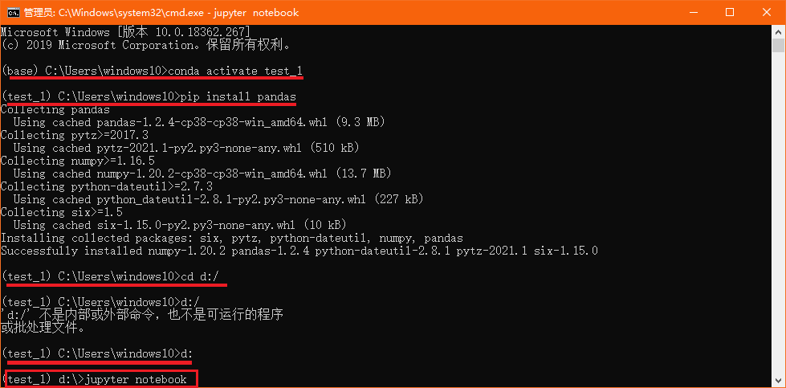
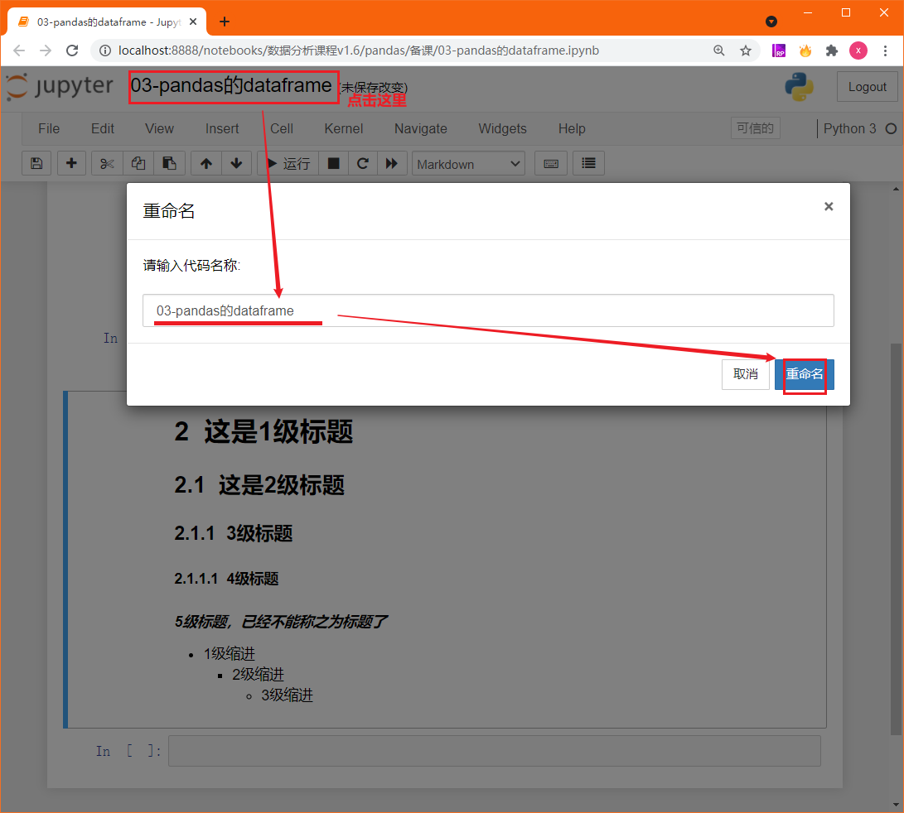
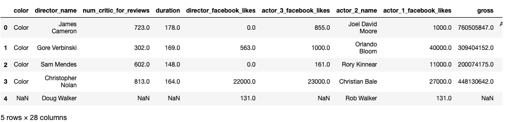
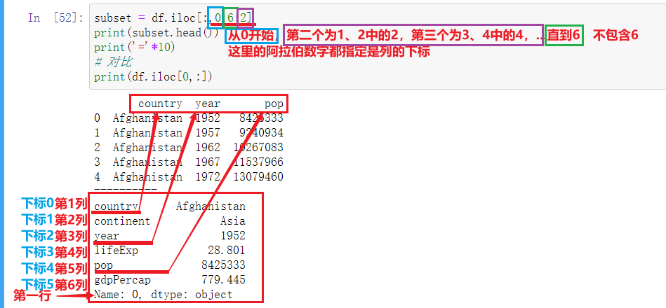
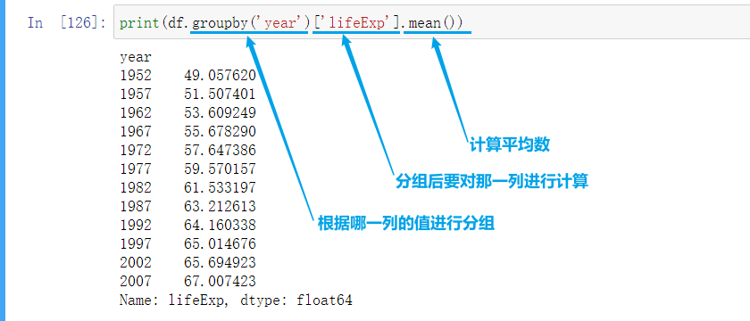
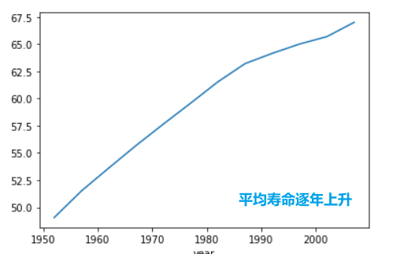

# Pandas DataFrame 入门

## 学习目标

- 掌握DataFrame加载数据文件的方法
- 知道如何加载部分数据
- 知道如何对数据进行简单的分组聚合操作

## 1 Pandas的DataFrame简介

- Pandas是用于数据分析的开源Python库，可以实现数据加载，清洗，转换，统计处理，可视化等功能
- DataFrame和Series是Pandas最基本的两种数据结构
- DataFrame用来处理结构化数据（SQL数据表，Excel表格）
- Series用来处理单列数据，也可以把DataFrame看作由Series对象组成的字典或集合

## 2 加载数据集

- 做数据分析首先要加载数据，并查看其结构和内容，对数据有初步的了解
  - 查看行，列
  - 查看每一列中存储信息的类型

### 2.1 前置准备

#### 2.1.1 安装pandas并打开jupyter notebook

- 通过anaconda的CMD切换虚拟环境后，安装pandas，切换盘符路径后、再启动jupyter notebook

  > 注意：anaconda提供的默认环境名字叫做`base`，已安装了pandas；但我们自行创建的虚拟环境中需要额外安装pandas
  >
  > ```shell
  > conda activate test_1
  > pip install pandas
  > cd d:/
  > d:/
  > jupyter notebook
  > ```
  >
  > 如下图所示



- 接下来在浏览器自动打开jupyter notebook，新建ipynb文件后，修改文件名，并在其中完成本节代码




#### 2.1.2 数据准备

**数据在随本课件一并提供的`data`文件夹中，后续课程中所有数据集都在该文件夹中**


### 2.2 认识DataFrame数据对象

#### 2.2.1 导入pandas包

Pandas 并不是 Python 标准库，所以先导入Pandas

```python
import pandas as pd
```

#### 2.2.2 加载读取文件

> 导入Pandas库之后，通过read_csv加载文件

- 加载CSV文件（Comma-Separated Values）


```python
df = pd.read_csv('data/movie.csv') # 加载movie.csv文件
df.head() # 展示前5条数据
```



- 加载TSV文件（Tab-Separated Values）

```python
# 参数1 要加载的文件路径，参数2 sep传入分隔符，默认是','  '\t'制表符
df = pd.read_csv('data/gapminder.tsv',sep='\t')  
print(df) 
# 输出结果如下
    country continent  year  lifeExp       pop   gdpPercap
0     Afghanistan      Asia  1952   28.801   8425333  779.445314
1     Afghanistan      Asia  1957   30.332   9240934  820.853030
2     Afghanistan      Asia  1962   31.997  10267083  853.100710
3     Afghanistan      Asia  1967   34.020  11537966  836.197138
4     Afghanistan      Asia  1972   36.088  13079460  739.981106
...           ...       ...   ...      ...       ...         ...
1699     Zimbabwe    Africa  1987   62.351   9216418  706.157306
1700     Zimbabwe    Africa  1992   60.377  10704340  693.420786
1701     Zimbabwe    Africa  1997   46.809  11404948  792.449960
1702     Zimbabwe    Africa  2002   39.989  11926563  672.038623
1703     Zimbabwe    Africa  2007   43.487  12311143  469.709298

[1704 rows x 6 columns]
```


#### 2.2.3 DataFrame对象类型

- 可以通过Python的内置函数type查看返回的数据类型，读取文件返回的`df`就是一个DataFrame类型的对象

```python
type(df)
# 输出结果如下
pandas.core.frame.DataFrame
```


- 每个dataframe都有一个**shape属性**，可以获取DataFrame的行数，列数；*注：shape是属性 不是方法 不可以使用df.shape() 会报错*

```python
df.shape
# 输出结果如下
(1704, 6)
```


- 可以通过DataFrame的**columns属性**，获取DataFrame中的列名

```python
df.columns
# 输出结果如下
Index(['country', 'continent', 'year', 'lifeExp', 'pop', 'gdpPercap'], dtype='object')
```


#### 2.2.4 获取DataFrame中的数据类型

**与SQL中的数据表类似，DataFrame中的每一列的数据类型必须相同，不同列的数据类型可以不同**

- 可以通过**dtypes属性**获取数据类型
  
```python
df.dtypes
# 输出结果如下
country       object
continent     object
year           int64
lifeExp      float64
pop            int64
gdpPercap    float64
dtype: object
```

- 通过**info()方法**获取数据类型

```python
df.info()
# 输出结果如下
<class 'pandas.core.frame.DataFrame'>
RangeIndex: 1704 entries, 0 to 1703
Data columns (total 6 columns):
#   Column     Non-Null Count  Dtype  
---  ------     --------------  -----  
0   country    1704 non-null   object 
1   continent  1704 non-null   object 
2   year       1704 non-null   int64  
3   lifeExp    1704 non-null   float64
4   pop        1704 non-null   int64  
5   gdpPercap  1704 non-null   float64
dtypes: float64(2), int64(2), object(2)
memory usage: 80.0+ KB
```

- Pandas与Python常用数据类型对照

<table>
  <tr>
    <td>Pandas类型</td><td>Python类型</td><td>说明</td>
  </tr>
  <tr>
    <td>Object</td><td>string</td><td>字符串类型</td>
  </tr>
  <tr>
    <td>int64</td><td>int</td><td>整形</td>
  </tr>
  <tr>
    <td>float64</td><td>float</td><td>浮点型</td>
  </tr>
  <tr>
    <td>datetime64</td><td>datetime</td><td>日期时间类型，python中需要加载</td>
  </tr>
</table>


## 3 查看部分数据

### 3.1 根据列名加载部分列数据

#### 3.1.1 加载一列数据

加载一列数据，通过`df['列名']`方式获取

```python
country_df = df['country']
# 获取数据前5行
country_df.head()
# 输出结果如下
0    Afghanistan
1    Afghanistan
2    Afghanistan
3    Afghanistan
4    Afghanistan
Name: country, dtype: object
```

#### 3.1.2 加载多列数据

通过列名加载多列数据，通过`df[['列名1','列名2',...]]`；注意这里是两层`[]` 可以理解为 `df[列名的list]`

```python
subset = df[['country','continent','year']]
#打印后五行数据
print(subset.tail())
# 输出结果如下
       country continent  year
1699  Zimbabwe    Africa  1987
1700  Zimbabwe    Africa  1992
1701  Zimbabwe    Africa  1997
1702  Zimbabwe    Africa  2002
1703  Zimbabwe    Africa  2007
```


### 3.2 按行加载部分数据

#### 3.2.1 行索引

- 先打印前5行数据 观察第一列

```python
print(df.head())
# 输出结果如下
       country continent  year  lifeExp       pop   gdpPercap
0  Afghanistan      Asia  1952   28.801   8425333  779.445314
1  Afghanistan      Asia  1957   30.332   9240934  820.853030
2  Afghanistan      Asia  1962   31.997  10267083  853.100710
3  Afghanistan      Asia  1967   34.020  11537966  836.197138
4  Afghanistan      Asia  1972   36.088  13079460  739.981106
```

- 上述结果中发现，最左边一列是行号，这一列没有列名的数据是DataFrame的**行索引**，Pandas会使用行号作为默认的行索引。

#### 3.2.2 通过行索引获取指定行数据

> 使用 `df.loc[n]` 传入行索引，来获取DataFrame的部分数据（一行，或多行）

- 获取第一行数据，并打印

```python
print(df.loc[0])
# 输出结果如下
country      Afghanistan
continent           Asia
year                1952
lifeExp           28.801
pop              8425333
gdpPercap        779.445
Name: 0, dtype: object
```

- 获取第100行数据，并打印

```python
print(df.loc[99])
# 输出结果如下
country      Bangladesh
continent          Asia
year               1967
lifeExp          43.453
pop            62821884
gdpPercap       721.186
Name: 99, dtype: object
```

- 获取最后一行数据

```python
# 通过shape 获取一共有多少行
number_of_rows = df.shape[0]
# 总行数-1 获取最后一行行索引
last_row_index = number_of_rows - 1 
# 获取最后一行数据，并打印
print(df.loc[last_row_index])
# 输出结果如下
country      Zimbabwe
continent      Africa
year             2007
lifeExp        43.487
pop          12311143
gdpPercap     469.709
Name: 1703, dtype: object
```

#### 3.2.3 使用tail方法获取最后一行数据

- 还可以使用tail方法获取最后一行数据

```python
# tail方法默认输出一行 传入n=1控制只显示1行
print(df.tail(n=1)) 
# 输出结果如下
country continent  year  lifeExp       pop   gdpPercap
1703  Zimbabwe    Africa  2007   43.487  12311143  469.709298
```
- 注意：**`df.loc` 和`df.tail` 两种方式获得的最后一行数据的类型不同**，我们可以打印两种结果的类型

```python
subset_loc = df.loc[0] 
subset_head = df.head(n=1) 
print(type(subset_loc))
print(type(subset_head))
# 输出结果如下
<class 'pandas.core.series.Series'>
<class ’pandas.core.frame.DataFrame’>
# pandas.core.series.Series 单列（单行）数据对象
# pandas.core.frame.DataFrame 表状数据对象
```

#### 3.2.4 通过多个指定的行索引的值获取指定多行数据

```python
print(df.loc[[0, 99, 999]])
# 输出结果如下
      country continent  year  lifeExp       pop    gdpPercap
0    Afghanistan      Asia  1952   28.801   8425333   779.445314
99    Bangladesh      Asia  1967   43.453  62821884   721.186086
999     Mongolia      Asia  1967   51.253   1149500  1226.041130
```

#### 3.2.5 通过行索引下标使用iloc获取指定数据

> - 需要注意的是，`iloc`传入的是索引的序号（行索引下标），loc是索引的标签（行索引的值）；在当前案例中，索引标签和索引序号刚好相同，所以使用`iloc` 和 `loc`效果是一样的
>
> - **并不是所有情况下`索引标签=索引序号`**；例如：在做时间序列分析的时候，有些数据集默认使用日期作为行索引的值
>   - 此时索引标签（行索引的值）是日期
>   - 索引序号（行索引下标）依然是0，1，2，3
> - 总结：
>   - `iloc` : 通过行索引的下标获取行数据
>   - `loc` : 通过行索引的值获取行数据

- 使用`iloc`获取第一行数据，并打印

```python
print(df.iloc[0])
# 输出结果如下
country      Afghanistan
continent           Asia
year                1952
lifeExp           28.801
pop              8425333
gdpPercap        779.445
Name: 0, dtype: object
```

- 使用`iloc`获取第100行数据，并打印

```python
print(df.iloc[99])
# 输出结果如下
country      Bangladesh
continent          Asia
year               1967
lifeExp          43.453
pop            62821884
gdpPercap       721.186
Name: 99, dtype: object
```

- 通过`shape`获取一共有多少行，再使用`iloc`获取最后一行  

```python
number_of_rows = df.shape[0]
# 总行数-1 获取最后一行行索引
last_row_index = number_of_rows - 1 
# 获取最后一行数据，并打印
print(df.iloc[[0, 99, 999]])
# 输出结果如下
        country continent  year  lifeExp       pop    gdpPercap
0    Afghanistan      Asia  1952   28.801   8425333   779.445314
99    Bangladesh      Asia  1967   43.453  62821884   721.186086
999     Mongolia      Asia  1967   51.253   1149500  1226.041130
```

- 使用iloc时传入-1可以获取最后一行数据，这里-1是下标

```python
print(df.iloc[-1])
# 输出结果如下
country      Zimbabwe
continent      Africa
year             2007
lifeExp        43.487
pop          12311143
gdpPercap     469.709
Name: 1703, dtype: object
```

- 返回指定范围的多行数据，注意左包右闭

```python
print(df.iloc[4:7])
# 输出结果如下
       country continent  year  lifeExp       pop   gdpPercap
4  Afghanistan      Asia  1972   36.088  13079460  739.981106
5  Afghanistan      Asia  1977   38.438  14880372  786.113360
6  Afghanistan      Asia  1982   39.854  12881816  978.011439
7  Afghanistan      Asia  1987   40.822  13867957  852.395945
```

- 返回前3行数据，注意左包右闭

```python
print(df.iloc[:3])
# 输出结果如下
       country continent  year  lifeExp       pop   gdpPercap
0  Afghanistan      Asia  1952   28.801   8425333  779.445314
1  Afghanistan      Asia  1957   30.332   9240934  820.853030
2  Afghanistan      Asia  1962   31.997  10267083  853.100710
```

- 返回后3行数据，注意左包右闭

```python
print(df.iloc[-3:])
# 输出结果如下
       country continent  year  lifeExp       pop   gdpPercap
1701  Zimbabwe    Africa  1997   46.809  11404948  792.449960
1702  Zimbabwe    Africa  2002   39.989  11926563  672.038623
1703  Zimbabwe    Africa  2007   43.487  12311143  469.709298
```


#### 3.2.6 PandasV0.20 开始不再支持使用ix获取数据

> - 可以把ix看作loc 和 iloc的结合，因为它允许通过标签或者整数取子集
> - 默认情况下，它会搜索标签，如果找不到相应的标签，就会改用整数索引，这可能导致混乱
> - 使用ix时与使用loc或iloc时的代码完全相同，只是将loc或者iloc换成ix

```python
# 以下代码只能在pandas 版本低于0.20的时候才能成功运行
df.ix[0] #获取第一行数据
df.ix[99] # 获取第100行数据
df.ix[[0,99,999]] # 获取第1行，第100行，第1000行数据
```


### 3.3 根据行或列获取指定范围的数据

#### 3.3.1 loc和iloc属性既可以用于获取行数据,也可以用于获取列数据

- `df.iloc[[行索引下标]，[列索引下标]]`

```python
# 返回第一行，第一列的数据
print(df.iloc[[0],[0]])
print(type(df.iloc[[0],[0]]))
print('='*10)
print(df.iloc[42,0])
print(type(df.iloc[42,0]))
# 输出结果如下
       country
0  Afghanistan
<class 'pandas.core.frame.DataFrame'>
==========
Angola
<class 'str'>
```

- `df.loc[[行索引值]，[列索引值]]`

```python
# 返回第一行，第一列的数据
print(df.loc[[0],['country']])
print(type(df.loc[[0],['country']]))
print('='*10)
print(df.loc[42,'country'])
print(type(df.loc[42,'country']))
# 输出结果如下
       country
0  Afghanistan
<class 'pandas.core.frame.DataFrame'>
==========
Angola
<class 'str'>
```

#### 3.3.2 使用loc获取数据中的1列或几列

- `df.loc[:,[列名]] `，冒号表示所有行

```python
subset = df.loc[:,['year','pop']] 
print(subset.head())
# 输出结果如下
   year       pop
0  1952   8425333
1  1957   9240934
2  1962  10267083
3  1967  11537966
4  1972  13079460
```

#### 3.3.3 使用iloc获取数据中的1列或几列

- `df.iloc[:,[列序号]]`

```python
subset = df.iloc[:,[2,4,-1]]
print(subset.head())
# 输出结果如下
   year       pop   gdpPercap
0  1952   8425333  779.445314
1  1957   9240934  820.853030
2  1962  10267083  853.100710
3  1967  11537966  836.197138
4  1972  13079460  739.981106
```

#### 3.3.4 通过range内置函数生成序号,结合iloc获取连续多列数据

- 通过range内置函数取出前5列的数据

```python
tmp_range = list(range(5))
print(tmp_range)
subset = df.iloc[:,tmp_range]
print(subset.head())
# 输出结果如下
[0, 1, 2, 3, 4]
       country continent  year  lifeExp       pop
0  Afghanistan      Asia  1952   28.801   8425333
1  Afghanistan      Asia  1957   30.332   9240934
2  Afghanistan      Asia  1962   31.997  10267083
3  Afghanistan      Asia  1967   34.020  11537966
4  Afghanistan      Asia  1972   36.088  13079460
```

- 通过range内置函数取出第3、4列的数据

```python
tmp_range = list(range(3,5))
print(tmp_range)
subset = df.iloc[:,tmp_range]
print(subset.head())
# 输出结果如下
[3, 4]
   lifeExp       pop
0   28.801   8425333
1   30.332   9240934
2   31.997  10267083
3   34.020  11537966
4   36.088  13079460
```

#### 3.3.5 在 iloc中使用切片语法获取几列数据

- 使用切片语法获取前三列

```python
subset = df.iloc[:,3:6]
print(subset.head())
# 输出结果如下
   lifeExp       pop   gdpPercap
0   28.801   8425333  779.445314
1   30.332   9240934  820.853030
2   31.997  10267083  853.100710
3   34.020  11537966  836.197138
4   36.088  13079460  739.981106
```

- 获取第0,2,4列，要求使用切片step

```python
# 0:6:2 表示从0列到5列，包含5，但每次跳过1列（选择每2列中的最后1列）
subset = df.iloc[:,0:6:2]
print(subset.head())
print('='*10)
# 对比
print(df.iloc[0,:])
# 输出结果如下
       country  year       pop
0  Afghanistan  1952   8425333
1  Afghanistan  1957   9240934
2  Afghanistan  1962  10267083
3  Afghanistan  1967  11537966
4  Afghanistan  1972  13079460
==========
country      Afghanistan
continent           Asia
year                1952
lifeExp           28.801
pop              8425333
gdpPercap        779.445
Name: 0, dtype: object
```

>解析：
>
>


#### 3.3.6 查看所有列的列名

```python
# 通过columns字段获取，返回一个numpy类型的array
print(df.columns.values)
# 通过list表列出
print(list(df))
#df.columns返回index，通过tolist()或者list(df.columns)转换为list类型
print(df.columns.tolist())
# 输出结果如下
['country' 'continent' 'year' 'lifeExp' 'pop' 'gdpPercap']
['country', 'continent', 'year', 'lifeExp', 'pop', 'gdpPercap']
['country', 'continent', 'year', 'lifeExp', 'pop', 'gdpPercap']
```

#### 3.3.7 行号列号取数据

获取 第1列，第4列，第6列（country,lifeExp,gdpPercap) 中的第1行，第100行和第1000行数据

```python
print(df.iloc[[0,99,999],[0,3,5]])
# 输出结果如下
         country  lifeExp    gdpPercap
0    Afghanistan   28.801   779.445314
99    Bangladesh   43.453   721.186086
999     Mongolia   51.253  1226.041130
```

#### 3.3.8 行名列名取数据

> **在实际工作中，获取某几列数据的时候，建议传入实际的列名**，使用列名的好处：
>
> - **增加代码的可读性**
> - **避免因列顺序的变化导致取出错误的列数据**

```python
print(df.loc[[0,99,999],['country','lifeExp','gdpPercap']])
# 输出结果如下
         country  lifeExp    gdpPercap
0    Afghanistan   28.801   779.445314
99    Bangladesh   43.453   721.186086
999     Mongolia   51.253  1226.041130
```

#### 3.3.9 行切片列名或列号取数据

> 可以在loc 和 iloc 属性的行部分使用切片获取数据

- 根据行名、列名取值

```python
print(df.loc[2:6, ['country','lifeExp','gdpPercap']]) # 根据行名、列名取值
# 输出结果如下
       country  lifeExp   gdpPercap
2  Afghanistan   31.997  853.100710
3  Afghanistan   34.020  836.197138
4  Afghanistan   36.088  739.981106
5  Afghanistan   38.438  786.113360
6  Afghanistan   39.854  978.011439
```

- 根据行号、列号取值

```python
print(df.iloc[2:6, [0,3,5]]) # 根据行号、列号取值
# 输出结果如下
       country  lifeExp   gdpPercap
2  Afghanistan   31.997  853.100710
3  Afghanistan   34.020  836.197138
4  Afghanistan   36.088  739.981106
5  Afghanistan   38.438  786.113360
```

- 注意两者返回结果的区别

```python
print(df.loc[2:6, ['country','lifeExp','gdpPercap']]) # 根据行名、列名取值
print(df.iloc[2:6, [0,3,5]]) # 根据行号、列号取值
# 输出结果如下，注意输出结果中的差异
       country  lifeExp   gdpPercap
2  Afghanistan   31.997  853.100710
3  Afghanistan   34.020  836.197138
4  Afghanistan   36.088  739.981106
5  Afghanistan   38.438  786.113360
6  Afghanistan   39.854  978.011439
       country  lifeExp   gdpPercap
2  Afghanistan   31.997  853.100710
3  Afghanistan   34.020  836.197138
4  Afghanistan   36.088  739.981106
5  Afghanistan   38.438  786.113360
# 差异原因解析：值切片的原则是左包右也包，下标切片的原则是左包右闭
#loc[2:6,...] loc是按值取数，所以行号的值是2到6的都取出
#iloc[2:6,...] iloc是按下标取数，所以行下标是2到5的都取出
```

- 根据行号、列名取值

```python
print(df.loc[df.index[2:6], ['country','lifeExp','gdpPercap']]) # 根据行号、列名取值
print(df.index[2:6]) # 根据行号取行名，返回RangeIndex对象
# 输出结果如下
       country  lifeExp   gdpPercap
2  Afghanistan   31.997  853.100710
3  Afghanistan   34.020  836.197138
4  Afghanistan   36.088  739.981106
5  Afghanistan   38.438  786.113360
RangeIndex(start=2, stop=6, step=1)
```

- 根据行名、列号取值

```python
print(df.loc[[2, 3, 4, 5], [df.columns[:][0], df.columns[:][3], df.columns[:][5]]])
# 输出结果如下
       country  lifeExp   gdpPercap
2  Afghanistan   31.997  853.100710
3  Afghanistan   34.020  836.197138
4  Afghanistan   36.088  739.981106
5  Afghanistan   38.438  786.113360
```


#### 3.3.10 行列的名号获取【了解】

> 本小节方便速查、不做讲解演示

- 根据行名取行号【不常用】

```python
print(df.index[:])
print([list(df.index).index(0), list(df.index).index(99), list(df.index).index(999)])
# 输出结果如下
RangeIndex(start=0, stop=1704, step=1)
[0, 99, 999]
```

- 根据行号取行名

```python
print(df.index[2:6]) # 返回对象
print(list(df.index[2:6])) # 返回列表
print(df.index[2:6].values) # 返回矩阵
# 输出结果如下
RangeIndex(start=2, stop=6, step=1)
[2, 3, 4, 5]
[2 3 4 5]
```

- 根据列名取列号【不常用】

```python
print([df.columns[:][0], df.columns[:][3], df.columns[:][5]])
print([list(df.columns).index('country'), list(df.columns).index('lifeExp'), list(df.columns).index('gdpPercap')])
# 输出结果如下
['country', 'lifeExp', 'gdpPercap']
[0, 3, 5]
```

- 根据列号取列名

```python
print(df.columns[2:6]) # 返回对象
print(list(df.columns[2:6])) # 返回列表
print(df.columns[2:6].values) # 返回矩阵
print([df.columns[:][0], df.columns[:][3], df.columns[:][5]])
# 输出结果如下
Index(['year', 'lifeExp', 'pop', 'gdpPercap'], dtype='object')
['year', 'lifeExp', 'pop', 'gdpPercap']
['year' 'lifeExp' 'pop' 'gdpPercap']
['country', 'lifeExp', 'gdpPercap']
```

- 根据行名、该行的某一个数据，获取该数据的列名

```python
df.columns[list(df.loc['行名']).index('列值')]
```

- 根据行号、该行的某一个数据，获取该数据的列名

```python
df.columns[list(df.iloc[行号]).index('列值')]
```

- 根据列名、该列的某一个数据，获取该数据的行号

```python
# 行号
list(df.loc[:, '列名']).index('列值')
# 行名
df.index[list(df.loc[:, '列名']).index('列值')]
```

- 根据列号、该列的某一个数据，获取该数据的行号

```python
# 行号
list(df.iloc[:, 列号]).index('列值')
# 行名
df.index[list(df.iloc[:, 列号]).index('列值')]
```

- 根据某一个数据取所在的行名和列名

```python
rows = list(df.index)
columns = list(df.columns)
ret = [(i, j) for i in rows for j in columns if df.loc['{}'.format(i), '{}'.format(j)] == 46]

# 根据某一个数据取所在的行号和列号(直接有上面的ret获得)
index_ret = [(df.index.get_loc(i), df.columns.get_indexer([j])[0]) for i, j in ret]
```

- 根据某一个数据取所在的行号和列号

```python
rows = range(len(df))
columns = range(len(df.columns))
index_ret = [(i, j) for i in rows for j in columns if df.iloc[int('{}'.format(i)), int('{}'.format(j))] == 46]
```


## 4 分组和聚合计算

> 在我们使用Excel或者SQL进行数据处理时，Excel和SQL都提供了基本的统计计算功能，Pandas也提供了统计计算的功能
>
> 我们先来查看gapminder数据
>
> ```python
> print(df.head(10))
> # 输出结果如下
>     country continent  year  lifeExp       pop   gdpPercap
> 0  Afghanistan      Asia  1952   28.801   8425333  779.445314
> 1  Afghanistan      Asia  1957   30.332   9240934  820.853030
> 2  Afghanistan      Asia  1962   31.997  10267083  853.100710
> 3  Afghanistan      Asia  1967   34.020  11537966  836.197138
> 4  Afghanistan      Asia  1972   36.088  13079460  739.981106
> 5  Afghanistan      Asia  1977   38.438  14880372  786.113360
> 6  Afghanistan      Asia  1982   39.854  12881816  978.011439
> 7  Afghanistan      Asia  1987   40.822  13867957  852.395945
> 8  Afghanistan      Asia  1992   41.674  16317921  649.341395
> 9  Afghanistan      Asia  1997   41.763  22227415  635.341351
> ```
>
> 可以根据数据提出几个问题：
>
> ① 每一年的平均预期寿命是多少？每一年的平均人口和平均GDP是多少？
>
> ② 如果我们按照大洲来计算，每年个大洲的平均预期寿命，平均人口，平均GDP情况又如何？
>
> ③ 在数据中，每个大洲列出了多少个国家和地区？
>
> 对于这些问题，就需要进行分组-聚合计算，接下来我就学习pandas的分组-聚合计算


### 4.1 分组方式

> 分组-聚合计算:
>
> - 先将数据分组（比如每一年的平均预期寿命问题，按照年份将相同年份的数据分成一组） 
> - 对每组的数据再去进行统计计算如，求平均，求每组数据条目数（频数）等
> - 再将每一组计算的结果合并起来
> - 可以使用DataFrame的groupby方法完成分组/聚合计算


#### 4.1.1 指定列分组之后对指定的列计算平均值

> 计算每一年的平均预期寿命

```python
print(df.groupby('year')['lifeExp'].mean())
# 输出结果如下
year
1952    49.057620
1957    51.507401
1962    53.609249
1967    55.678290
1972    57.647386
1977    59.570157
1982    61.533197
1987    63.212613
1992    64.160338
1997    65.014676
2002    65.694923
2007    67.007423
Name: lifeExp, dtype: float64
```

> 我们将上面一行代码拆开，逐步分析
>
> 

- 通过`df.groupby('year')`先创一个分组对象，如果打印这个分组的DataFrame，会返回一个内存地址

```python
grouped_year_df = df.groupby('year')
print(type(grouped_year_df))
print(grouped_year_df)
# 输出结果如下
<class 'pandas.core.groupby.generic.DataFrameGroupBy'>
<pandas.core.groupby.generic.DataFrameGroupBy object at 0x123493f10>
```

- 我们可以从分组之后的DataFrameGroupBy数据分组对象中，传入列名获取我们感兴趣的数据，并进行进一步计算
  - 计算每一年的平均预期寿命，我们需要用到 *lifeExp*  这一列
  - 我们可以使用上一小节介绍的方法获取分组之后数据中的一列

```python
grouped_year_df_lifeExp = grouped_year_df['lifeExp']
print(type(grouped_year_df_lifeExp)) 
print(grouped_year_df_lifeExp)
# 输出结果如下
<class 'pandas.core.groupby.generic.SeriesGroupBy'>
<pandas.core.groupby.generic.SeriesGroupBy object at 0x000001E1938D0710>
# 返回结果为一个 SeriesGroupBy （只获取了DataFrameGroupBy中的一列），其内容是分组后的数据
```

- 最后对分组后的数据计算平均值

```python
mean_lifeExp_by_year = grouped_year_df_lifeExp.mean()
print(mean_lifeExp_by_year)
# 输出结果如下
year
1952    49.057620
1957    51.507401
1962    53.609249
1967    55.678290
1972    57.647386
1977    59.570157
1982    61.533197
1987    63.212613
1992    64.160338
1997    65.014676
2002    65.694923
2007    67.007423
Name: lifeExp, dtype: float64
```


#### 4.1.2 指定多列分组之后对指定的多列计算平均值

> 上面的例子只是对一列 *lifeExp* 进行了分组求平均，如果想对多列值进行分组聚合代码也类似

```python
print(df.groupby(['year', 'continent'])[['lifeExp','gdpPercap']].mean())
# 输出结果如下
                  lifeExp     gdpPercap
year continent                         
1952 Africa     39.135500   1252.572466
     Americas   53.279840   4079.062552
     Asia       46.314394   5195.484004
     Europe     64.408500   5661.057435
     Oceania    69.255000  10298.085650
1957 Africa     41.266346   1385.236062
     Americas   55.960280   4616.043733
     Asia       49.318544   5787.732940
     Europe     66.703067   6963.012816
     Oceania    70.295000  11598.522455
1962 Africa     43.319442   1598.078825
     Americas   58.398760   4901.541870
     Asia       51.563223   5729.369625
     Europe     68.539233   8365.486814
     Oceania    71.085000  12696.452430
1967 Africa     45.334538   2050.363801
     Americas   60.410920   5668.253496
     Asia       54.663640   5971.173374
     Europe     69.737600  10143.823757
     Oceania    71.310000  14495.021790
1972 Africa     47.450942   2339.615674
     Americas   62.394920   6491.334139
     Asia       57.319269   8187.468699
     Europe     70.775033  12479.575246
     Oceania    71.910000  16417.333380
1977 Africa     49.580423   2585.938508
     Americas   64.391560   7352.007126
     Asia       59.610556   7791.314020
     Europe     71.937767  14283.979110
     Oceania    72.855000  17283.957605
1982 Africa     51.592865   2481.592960
     Americas   66.228840   7506.737088
     Asia       62.617939   7434.135157
     Europe     72.806400  15617.896551
     Oceania    74.290000  18554.709840
1987 Africa     53.344788   2282.668991
     Americas   68.090720   7793.400261
     Asia       64.851182   7608.226508
     Europe     73.642167  17214.310727
     Oceania    75.320000  20448.040160
1992 Africa     53.629577   2281.810333
     Americas   69.568360   8044.934406
     Asia       66.537212   8639.690248
     Europe     74.440100  17061.568084
     Oceania    76.945000  20894.045885
1997 Africa     53.598269   2378.759555
     Americas   71.150480   8889.300863
     Asia       68.020515   9834.093295
     Europe     75.505167  19076.781802
     Oceania    78.190000  24024.175170
2002 Africa     53.325231   2599.385159
     Americas   72.422040   9287.677107
     Asia       69.233879  10174.090397
     Europe     76.700600  21711.732422
     Oceania    79.740000  26938.778040
2007 Africa     54.806038   3089.032605
     Americas   73.608120  11003.031625
     Asia       70.728485  12473.026870
     Europe     77.648600  25054.481636
     Oceania    80.719500  29810.188275
```

> 上面的代码按年份和大洲对数据进行分组，针对每一组数据计算了对应的平均预期寿命 *lifeExp* 和 平均GDP
>
> 输出的结果中  year continent 和 lifeExp gdpPercap 不在同一行， year continent两个行索引存在层级结构，后面的章节会详细介绍这种复合索引的用法
>
> 如果想去掉 year continent的层级结构，可以使用reset_index方法（重置行索引）

```python
multi_group_var = df.groupby(['year', 'continent'])[['lifeExp','gdpPercap']].mean() 
flat = multi_group_var.reset_index()
print(flat.head(15))
# 输出结果如下
	year continent    lifeExp     gdpPercap
0   1952    Africa  39.135500   1252.572466
1   1952  Americas  53.279840   4079.062552
2   1952      Asia  46.314394   5195.484004
3   1952    Europe  64.408500   5661.057435
4   1952   Oceania  69.255000  10298.085650
5   1957    Africa  41.266346   1385.236062
6   1957  Americas  55.960280   4616.043733
7   1957      Asia  49.318544   5787.732940
8   1957    Europe  66.703067   6963.012816
9   1957   Oceania  70.295000  11598.522455
10  1962    Africa  43.319442   1598.078825
11  1962  Americas  58.398760   4901.541870
12  1962      Asia  51.563223   5729.369625
13  1962    Europe  68.539233   8365.486814
14  1962   Oceania  71.085000  12696.452430
```


### 4.2 分组频数计算

> 在数据分析中，一个常见的任务是计算频数
>
> - 可以使用 *nunique* 方法 计算Pandas Series的唯一值计数
> - 可以使用 *value_counts* 方法来获取Pandas Series 的频数统计

在数据中，每个大洲列出现了多少个国家和地区？

```python
df.groupby('continent')['country'].nunique()
# 输出结果如下
continent
Africa      52
Americas    25
Asia        33
Europe      30
Oceania      2
Name: country, dtype: int64
```


## 5 基本绘图

- 可视化在数据分析的每个步骤中都非常重要，在理解或清理数据时，可视化有助于识别数据中的趋势，比如我们计算了每一年的平均寿命：

```python
global_yearly_life_expectancy = df.groupby('year')['lifeExp'].mean()
print(global_yearly_life_expectancy)
# 输出结果如下
year
1952    49.057620
1957    51.507401
1962    53.609249
1967    55.678290
1972    57.647386
1977    59.570157
1982    61.533197
1987    63.212613
1992    64.160338
1997    65.014676
2002    65.694923
2007    67.007423
Name: lifeExp, dtype: float64
```

- 可以通过plot函数画图，通过图片更直观的得出结论

``` python
global_yearly_life_expectancy.plot()
# 输出结果如下，并出现下图中的图表
<AxesSubplot:xlabel='year'>
```




## 小结

本节课程介绍了如何使用Pandas的DataFrame加载数据，并介绍了如何对数据进行简单的分组聚合

```python
pd.read_csv # 加载CSV文件
pd.loc      # 从DataFrame中获取部分数据，传入索引名字
pd.iloc     # 从DataFrame中获取部分数据，传入索引序号
pd.groupby  # 分组
```


