# Pandas 数据结构

## 学习目标

- 掌握Series的常用属性及方法
- 掌握DataFrame的常用属性及方法
- 掌握更改Series和DataFrame的方法
- 掌握如何导入导出数据

## 1 创建Series和DataFrame

> - DataFrame和Series是Pandas最基本的两种数据结构
> - DataFrame和Series的区别联系：在Pandas中，Series是一维容器，Series表示DataFrame的每一列：
>   - 可以把DataFrame看作由Series对象组成的字典，其中key是列名，值是Series
>   - Series和Python中的列表非常相似，但是它的每个元素的数据类型必须相同

### 1.1 创建Series

- 创建 Series 的最简单方法是传入一个Python列表

  -  如果传入的数据类型是统一的数字，那么最终的dtype类型是int64
  -  如果传入的数据类型是统一的字符串，那么最终的dtype类型是object
  -  如果传入的数据类型是多种类型，那么最终的dtype类型也是object

  ```python
  import pandas as pd
  s = pd.Series(['banana', 42])
  print(s)
  s = pd.Series(['banana', 'apple'])
  print(s)
  s = pd.Series([50, 42])
  print(s)
  # 输出结果如下
  0    banana
  1        42
  dtype: object
  0    banana
  1     apple
  dtype: object
  0    50
  1    42
  dtype: int64
  # 上面的结果中，左边显示的0,1是Series的索引，默认为0,1,2,3...
  ```

- 创建Series时，也可以通过index参数 来指定行索引

  ```python
  s = pd.Series(['Wes McKinney','Male'],index = ['Name','Gender'])
  print(s)
  # 输出结果如下
Name      Wes McKinney
  Gender            Male
  dtype: object
  ```
  

### 1.2 创建 DataFrame

- 可以使用字典来创建DataFrame

  ```python
  name_df = pd.DataFrame({
      'Name':['Tome','Bob'],
      'Occupation':['Teacher','IT Engineer'],
      'age':[28,36]
      })
  print(name_df)
  # 输出结果如下
     Name   Occupation  age
  0  Tome      Teacher   28
  1   Bob  IT Engineer   36
  ```

- 创建DataFrame的时候可以使用colums参数指定列的顺序，也可以使用index来指定行索引

  ```python
  name_df = pd.DataFrame(
      data={
          'Occupation': ['Teacher', 'IT Engineer'],
        'Age': [28,36]
      },
      columns=['Age', 'Occupation'],
      index=['Tome', 'Bob']
  )
  print(name_df)
  # 输出结果如下
        Age   Occupation
  Tome   28      Teacher
  Bob    36  IT Engineer
  ```
  


## 2 Series 常用操作

### 2.1 Series常用属性

- 使用 DataFrame的loc 属性获取数据集里的一行，就会得到一个Series对象

  ```python
  data = pd.read_csv('data/nobel_prizes.csv',index_col='id')
  data.head()
  # 输出结果如下图
  ```

  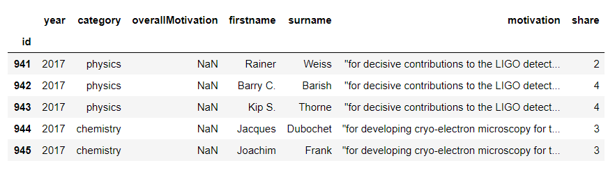

- 使用行索引标签选择一条记录

  ```python
  one_row = data.loc[941]
  print(type(one_row))
  print(one_row)
  # 输出结果如下
  <class 'pandas.core.series.Series'>
  year                                                              2017
  category                                                       physics
  overallMotivation                                                  NaN
  firstname                                                       Rainer
  surname                                                          Weiss
  motivation           "for decisive contributions to the LIGO detect...
  share                                                                2
  Name: 941, dtype: object
  ```

- 可以通过 index 和 values属性获取行索引和值

  ```python
  print(one_row.index)
  print(one_row.values)
  # 输出结果如下
  Index(['year', 'category', 'overallMotivation', 'firstname', 'surname',
         'motivation', 'share'],
        dtype='object')
  [2017 'physics' nan 'Rainer' 'Weiss'
   '"for decisive contributions to the LIGO detector and the observation of gravitational waves"'
   2]
  ```

- Series的keys方法，作用与index属性一样

  ```python
  data.keys()
  # 输出结果如下
Index(['year', 'category', 'overallMotivation', 'firstname', 'surname',
         'motivation', 'share'],
        dtype='object')
  ```
  
- Series的其他属性

  <table>
    <tr>
      <td>属性</td><td>说明</td>
    </tr>
    <tr>
      <td>loc</td><td>使用索引值取子集</td>
    </tr>
    <tr>
      <td>iloc</td><td>使用索引位置取子集</td>
    </tr>
    <tr>
      <td>dtype或dtypes</td><td>Series内容的类型</td>
    </tr>
    <tr>
      <td>T</td><td>Series的转置矩阵</td>
    </tr>
     <tr>
      <td>shape</td><td>数据的维数</td>
    </tr>
    <tr>
      <td>size</td><td>Series中元素的数量</td>
    </tr>
    <tr>
      <td>values</td><td>Series的值</td>
    </tr>
  </table>
  
  例如
  
  ```python
  print(data.loc[941])
  print(data.iloc[0])
  print(data.shape, data.size)
  # 输出结果如下
  year                                                              2017
  category                                                       physics
  overallMotivation                                                  NaN
  firstname                                                       Rainer
  surname                                                          Weiss
  motivation           "for decisive contributions to the LIGO detect...
  share                                                                2
  Name: 941, dtype: object
  year                                                              2017
  category                                                       physics
  overallMotivation                                                  NaN
  firstname                                                       Rainer
  surname                                                          Weiss
  motivation           "for decisive contributions to the LIGO detect...
  share                                                                2
  Name: 941, dtype: object
  (923, 7) 6461
  ```
  
  

### 2.2 Series常用方法

#### 2.2.1 常见计算

> 针对数值型的Series，可以进行常见计算

- 平均值

```python
#print(data.head())
share = data.share  # 从DataFrame中 获取Share列（几人获奖）返回Series
#print(share)
print(share.mean())    #计算几人获奖的平均值
# 输出结果如下
1.982665222101842
```

- 最大值

```python
share.max() # 计算最大值
# 输出结果如下
4
```

- 最小值

```python
share.min() # 计算最小值
# 输出结果如下
1
```

- 标准差

```python
share.std() # 计算标准差
# 输出结果如下
0.9324952202244597
```

#### 2.2.2 value_counts函数

> 在获取某一列数据的Series对象后，通过`value_counts()`方法，可以返回以该列的值为分类依据，不同值的条目总数量；现在我们要对`data/movie.csv`数据集进行统计，分别统计相同点赞数的主演数量；实现如下：

- 主演的facebook点赞数

```python
movie = pd.read_csv('data/movie.csv')    # 加载电影数据
actor_1_fb_likes = movie['actor_1_facebook_likes'] # 从电影数据中取出主演的facebook点赞数
actor_1_fb_likes.head() #查看主演的facebook点赞数
# 输出结果如下
0     1000.0
1    40000.0
2    11000.0
3    27000.0
4      131.0
Name: actor_1_facebook_likes, dtype: float64
```

- 分别统计相同点赞数的主演数量（有多少个主演的点赞数相同，且点赞数是多少）

```python
actor_1_fb_likes.value_counts()
# 输出结果如下【左列为点赞数，右列为主演数量】
1000.0     436
11000.0    206
2000.0     189
3000.0     150
     ... 
216.0        1
859.0        1
225.0        1
334.0        1
Name: actor_1_facebook_likes, Length: 877, dtype: int64
```

> 再来看一个例子，现用vlaue_count函数统计不同导演指导的电影数量

- 获取导演名字`director_name`列的Series对象

```python
# movie = pd.read_csv('data/movie.csv')    # 加载电影数据
director = movie['director_name']   # 从电影数据中获取导演名字 返回Series
director.head()  #查看导演Series数据
# 输出结果如下
0        James Cameron
1       Gore Verbinski
2           Sam Mendes
3    Christopher Nolan
4          Doug Walker
Name: director_name, dtype: object
```

- 统计不同导演指导的电影数量，本质就是以`director_name`列的值做分类，分别统计不同数据的数量

```python
pd.set_option('max_rows', 8) # 设置最多显示8行
director.value_counts()      # 统计不同导演指导的电影数量
# 输出结果如下
Steven Spielberg    26
Woody Allen         22
Clint Eastwood      20
Martin Scorsese     20
               ..
Gavin Wiesen         1
Andrew Morahan       1
Luca Guadagnino      1
Richard Montoya      1
Name: director_name, Length: 2397, dtype: int64
```

#### 2.2.3 count函数

> count函数可以统计Series对象中的非空值的总数（指定列中的数据没有空值，则计数+1）

- 统计有导演的电影数量

```python
director.count() 
# 输出结果如下
4814
```

- 查看全部电影数量，查看整个数据集的数据总条数（行数）

```python
print(movie.iloc[-1]) # 查看最后一行数据，并得到行索引值
print(movie.shape) # 也可以通过df对象的shape属性查看行和列的总数
# 输出结果如下
color                        Color
director_name             Jon Gunn
num_critic_for_reviews          43
duration                        90
                            ...   
actor_2_facebook_likes          23
imdb_score                     6.6
aspect_ratio                  1.85
movie_facebook_likes           456
Name: 4915, Length: 28, dtype: object
(4916, 28)
```

- 注意Series对象的count函数和value_counts函数的区别
  - Series对象的count函数：统计Series对象中的非空值的总数
  - Series对象的value_counts函数：统计以Series对象的值为分类依据，不同值的条目总数量

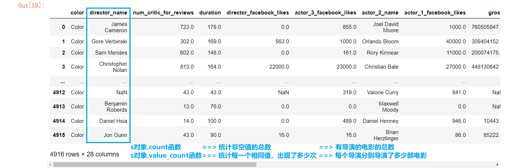

#### 2.2.4 describe函数

> Series对象的describe函数可以输出统计描述

- 查看`facebook上对主演点赞数`这一列数据的统计描述

```python
actor_1_fb_likes.describe()
# 输出结果如下
count      4909.000000
mean       6494.488491
std       15106.986884
min           0.000000
25%         607.000000
50%         982.000000
75%       11000.000000
max      640000.000000
Name: actor_1_facebook_likes, dtype: float64
```

- 查看`导演名字`这一列数据的统计描述

```python
director.describe()
# 输出结果如下
count                 4814
unique                2397
top       Steven Spielberg
freq                    26
Name: director_name, dtype: object
```

- 结果描述如下图所示

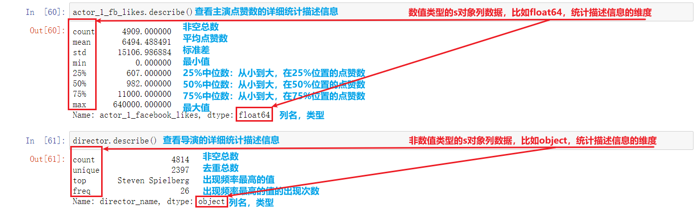


#### 2.2.5 Series的其他方法列表


<table>
  <tr>
    <td>方法</td><td>说明</td>
  </tr>
  <tr>
    <td>append</td><td>连接两个或多个Series</td>
  </tr>
  <tr>
    <td>corr</td><td>计算与另一个Series的相关系数</td>
  </tr>
  <tr>
    <td>cov</td><td>计算与另一个Series的协方差</td>
  </tr>
  <tr>
    <td>describe</td><td>计算常见统计量</td>
  </tr>
   <tr>
    <td>drop_duplicates</td><td>返回去重之后的Series</td>
  </tr>
  <tr>
    <td>equals</td><td>判断两个Series是否相同</td>
  </tr>
  <tr>
    <td>get_values</td><td>获取Series的值，作用与values属性相同</td>
  </tr>
  <tr>
    <td>hist</td><td>绘制直方图</td>
  </tr>
  <tr>
    <td>isin</td><td>Series中是否包含某些值</td>
  </tr>
  <tr>
    <td>min</td><td>返回最小值</td>
  </tr>
  <tr>
    <td>max</td><td>返回最大值</td>
  </tr>
  <tr>
    <td>mean</td><td>返回算术平均值</td>
  </tr>
  <tr>
    <td>median</td><td>返回中位数</td>
  </tr>
  <tr>
    <td>mode</td><td>返回众数</td>
  </tr>
  <tr>
    <td>quantile</td><td>返回指定位置的分位数</td>
  </tr>
  <tr>
    <td>replace</td><td>用指定值代替Series中的值</td>
  </tr>
  <tr>
    <td>sample</td><td>返回Series的随机采样值</td>
  </tr>
  <tr>
    <td>sort_values</td><td>对值进行排序</td>
  </tr>
  <tr>
    <td>to_frame</td><td>把Series转换为DataFrame</td>
  </tr>
  <tr>
    <td>unique</td><td>去重返回数组</td>
  </tr>
</table>


### 2.3 布尔值列表获取Series对象中部分数据

> 从`scientists.csv`数据集中，列出大于`Age`列的平均值的具体值，具体步骤如下：

- 加载并观察数据集

```python
scientists = pd.read_csv('data/scientists.csv')
print(scientists)
#print(scientists.head())
# 输出结果如下
                   Name        Born        Died  Age          Occupation
0     Rosaline Franklin  1920-07-25  1958-04-16   37             Chemist
1        William Gosset  1876-06-13  1937-10-16   61        Statistician
2  Florence Nightingale  1820-05-12  1910-08-13   90               Nurse
3           Marie Curie  1867-11-07  1934-07-04   66             Chemist
4         Rachel Carson  1907-05-27  1964-04-14   56           Biologist
5             John Snow  1813-03-15  1858-06-16   45           Physician
6           Alan Turing  1912-06-23  1954-06-07   41  Computer Scientist
7          Johann Gauss  1777-04-30  1855-02-23   77       Mathematicia
```

- 计算`Age`的平均值

```python
ages = scientists['Age']
ages.mean()
# 输出结果如下
59.125
```

- 输出大于`Age`列的平均值的具体值

```python
print(ages[ages>ages.mean()])
# 输出结果如下
1    61
2    90
3    66
7    77
Name: Age, dtype: int64
```

> 在本例中，`ages>ages.mean()`，到底是什么？
>
> 为什么`ages[ages>ages.mean()]`就能返回我们想要的结果？

- 利用表达式 `ages > ages.mean()` ，获取布尔值构成的series对象

```python
new_ages_s = ages>ages.mean()
print(new_ages_s)
print(new_ages_s.values)
print(list(new_ages_s.values))
# 输出结果如下
0    False
1     True
2     True
3     True
4    False
5    False
6    False
7     True
Name: Age, dtype: bool
[False  True  True  True False False False  True]
[False, True, True, True, False, False, False, True]
```

- 从Series中获取部分数据，可以通过标签，索引，也可以传入布尔值的列表

```python
bool_values = (list(new_ages_s.values)) # 构造布尔值列表
ages[bool_values] # 通过布尔索引来控制，输出指定范围
# 输出结果如下
1    61
2    90
3    66
7    77
Name: Age, dtype: int64
```


### 2.4 Series 的运算

#### 2.4.1 Series和数值型变量计算

> Series和数值型变量计算时，变量会与Series中的每个元素逐一进行计算

- 加法

```python
ages+100
# 输出结果如下
0    137
1    161
2    190
3    166
4    156
5    145
6    141
7    177
Name: Age, dtype: int64
```

- 乘法

```python
ages*2
# 输出结果如下
0     74
1    122
2    180
3    132
4    112
5     90
6     82
7    154
Name: Age, dtype: int64
```

#### 2.4.2 两个Series之间计算

- 两个Series之间计算，如果Series元素个数相同，则将两个Series对应元素进行计算

```python
print(ages+ages)
print('='*10)
print(ages*ages)
# 输出结果如下
0     74
1    122
2    180
3    132
4    112
5     90
6     82
7    154
Name: Age, dtype: int64
==========
0    1369
1    3721
2    8100
3    4356
4    3136
5    2025
6    1681
7    5929
Name: Age, dtype: int64
```

- 元素个数不同的Series之间进行计算，会根据索引进行。索引不同的元素最终计算的结果会填充成缺失值，用NaN表示

```python
print(ages)
print('='*10)
print(pd.Series([1,100]))
print('='*10)
print(ages + pd.Series([1,100]))
# 输出结果如下
0    37
1    61
2    90
3    66
4    56
5    45
6    41
7    77
Name: Age, dtype: int64
==========
0      1
1    100
dtype: int64
==========
0     38.0
1    161.0
2      NaN
3      NaN
4      NaN
5      NaN
6      NaN
7      NaN
dtype: float64:
```

- 练习1：元素个数不同的Series之间的乘法计算

```python
print(ages * pd.Series([1,100]))
# 合并多个Series为一个DataFrame
new_df = pd.concat([ages, pd.Series([1,100]), ages * pd.Series([1,100])], axis=1)
new_df
# 输出结果如下
0      37.0
1    6100.0
2       NaN
3       NaN
4       NaN
5       NaN
6       NaN
7       NaN
dtype: float64
Age	0	1
0	37	1.0	37.0
1	61	100.0	6100.0
2	90	NaN	NaN
3	66	NaN	NaN
4	56	NaN	NaN
5	45	NaN	NaN
6	41	NaN	NaN
7	77	NaN	NaN
```

- 练习2：Series对象ages和倒序的ages做相乘计算

```python
rev_ages = ages.sort_index(ascending=False)
# 合并多个Series为一个DataFrame
pd.concat([ages, rev_ages, ages*ages, ages*rev_ages], axis=1)
# 输出结果如下
    Age	Age	Age	Age
0	37	37	1369	1369
1	61	61	3721	3721
2	90	90	8100	8100
3	66	66	4356	4356
4	56	56	3136	3136
5	45	45	2025	2025
6	41	41	1681	1681
7	77	77	5929	5929
```

- 练习3：构造两个默认索引、且索引数量相同的Series，二者做相乘计算

```python
# 构造两个默认索引、且数量相同的Series
print(pd.Series([1,2])) 
print(pd.Series([3,4]))
# 计算相乘
print(pd.Series([1,2])* pd.Series([3,4]))
# 输出结果如下
0    1
1    2
dtype: int64
0    3
1    4
dtype: int64
0    3
1    8
dtype: int64
```

- 练习4：索引值不同的两个Series相乘

```python
print(pd.Series([2,1])* pd.Series([3,4]))
print(pd.Series([2,1],index = [2,3])* pd.Series([3,4]))
# 输出结果如下
0    6
1    4
dtype: int64
0   NaN
1   NaN
2   NaN
3   NaN
dtype: float64
```

- 练习5：索引值部分相同的两个Series相乘

```python
print(pd.Series([2,1],index = [2,3]))
print(pd.Series([3,4],index = [1,2]))
print(pd.Series([3,4],index = [1,2])*pd.Series([2,1],index = [2,3]))
# 输出结果如下
2    2
3    1
dtype: int64
1    3
2    4
dtype: int64
1    NaN
2    8.0
3    NaN
dtype: float64
```

- 通过上述练习，得出**Series之间计算的结论**：
  - **Series之间进行计算时，数据会尽可能依据索引标签的值进行相互计算**
  - **索引值相同的，对应计算得出新的Series**
  - **索引值不同的元素最终计算的结果会填充成缺失值，用NaN表示**


## 3 DataFrame常用操作

### 3.1 DataFrame的常用属性和方法

> DataFrame是Pandas中最常见的对象，Series数据结构的许多属性和方法在DataFrame中也一样适用

- `df.shape` 行数和列数

```python
movie = pd.read_csv('data/movie.csv')
# 打印行数和列数
print(movie.shape)
# 输出结果
(4916, 28)
```

- `df.size` 数据的个数（列数*行数，NaN值也算）

```python
# 打印数据的个数
movie.size
# 输出结果
137648
```

- `df.ndim` 数据的维度

```python
# 该数据集的维度
movie.ndim
# 输出结果
2
```

- 数据的长度（行数）

```python
# 该数据集的长度
len(movie)
# 输出结果
4916
```

- 各个列的非空值的个数

```python
# 各个列的值的个数
movie.count()
# 输出结果
color                     4897
director_name             4814
num_critic_for_reviews    4867
duration                  4901
                          ... 
actor_2_facebook_likes    4903
imdb_score                4916
aspect_ratio              4590
movie_facebook_likes      4916
Length: 28, dtype: int64
```

- 各个列的最小值

```python
# 各列的最小值
movie.min()
# 输出结果
num_critic_for_reviews        1
duration                      7
director_facebook_likes       0
actor_3_facebook_likes        0
                           ... 
actor_2_facebook_likes        0
imdb_score                  1.6
aspect_ratio               1.18
movie_facebook_likes          0
Length: 19, dtype: object
```

- 对整个df的统计描述，和series的统计描述返回相同

```python
movie.describe()
# 输出结果如下图
```

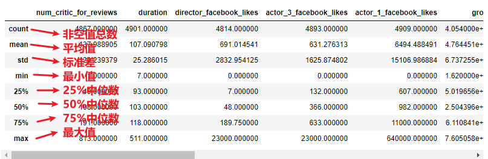

### 3.2 DataFrame的布尔索引

- 同Series一样，DataFrame也可以使用布尔索引获取数据子集。

```python
# 使用布尔索引获取duration列的值大于平均值的数据
print(movie['duration'] > movie['duration'].mean())
movie[movie['duration'] > movie['duration'].mean()]
# 输出结果如下
```


- 本质就是传入布尔值构成的列表，来获取部分数据，True所对应的数据会被保留

```python
# 获取前5行数据中的第1、2、4个
movie.head()[[True,True,False,True,False]]
# 输出结果如下
```

| color | director_name | num_critic_for_reviews | duration | director_facebook_likes | actor_3_facebook_likes | actor_2_name | actor_1_facebook_likes |   gross |      genres |                                ... | num_user_for_reviews | language | country | content_rating | budget |  title_year | actor_2_facebook_likes | imdb_score | aspect_ratio | movie_facebook_likes |        |
| ----: | ------------: | ---------------------: | -------: | ----------------------: | ---------------------: | -----------: | ---------------------: | ------: | ----------: | ---------------------------------: | -------------------: | -------: | ------: | -------------: | -----: | ----------: | ---------------------: | ---------: | -----------: | -------------------: | ------ |
|     0 |         Color |          James Cameron |    723.0 |                   178.0 |                    0.0 |        855.0 |       Joel David Moore |  1000.0 | 760505847.0 | Action\|Adventure\|Fantasy\|Sci-Fi |                  ... |   3054.0 | English |            USA |  PG-13 | 237000000.0 |                 2009.0 |      936.0 |          7.9 |                 1.78 | 33000  |
|     1 |         Color |         Gore Verbinski |    302.0 |                   169.0 |                  563.0 |       1000.0 |          Orlando Bloom | 40000.0 | 309404152.0 |         Action\|Adventure\|Fantasy |                  ... |   1238.0 | English |            USA |  PG-13 | 300000000.0 |                 2007.0 |     5000.0 |          7.1 |                 2.35 | 0      |
|     3 |         Color |      Christopher Nolan |    813.0 |                   164.0 |                22000.0 |      23000.0 |         Christian Bale | 27000.0 | 448130642.0 |                   Action\|Thriller |                  ... |   2701.0 | English |            USA |  PG-13 | 250000000.0 |                 2012.0 |    23000.0 |          8.5 |                 2.35 | 164000 |

3 rows × 28 columns


### 3.3 DataFrame的运算

#### 3.3.1 DataFrame和数值进行运算

> 当DataFrame和数值进行运算时，DataFrame中的每一个元素会分别和数值进行运算

- 加载数据集并观察

```python
scientists = pd.read_csv('data/scientists.csv')
scientists.head()
# 输出的结果如下
	Name	Born	Died	Age	Occupation
0	Rosaline Franklin	1920-07-25	1958-04-16	37	Chemist
1	William Gosset	1876-06-13	1937-10-16	61	Statistician
2	Florence Nightingale	1820-05-12	1910-08-13	90	Nurse
3	Marie Curie	1867-11-07	1934-07-04	66	Chemist
4	Rachel Carson	1907-05-27	1964-04-14	56	Biologist
```

- df和数值进行运算

```python
scientists*2
# 输出的结果如下图
```

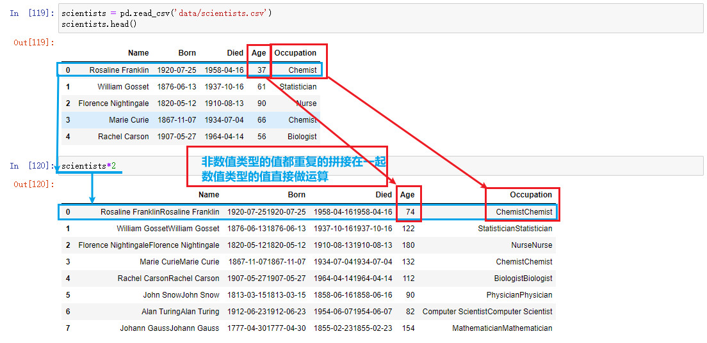

- 两个DataFrame之间进行计算，和series一样会根据索引的值进行对应计算

```python
scientists+scientists
# 输出结果和 scientists*2 相同
```

- 当两个DataFrame索引值不能对应时，不匹配的会返回NaN

```python
print(scientists)
print('='*10)
print(scientists[:4])
print('='*10)
scientists+scientists[:4]
# 输出的结果如下图
```

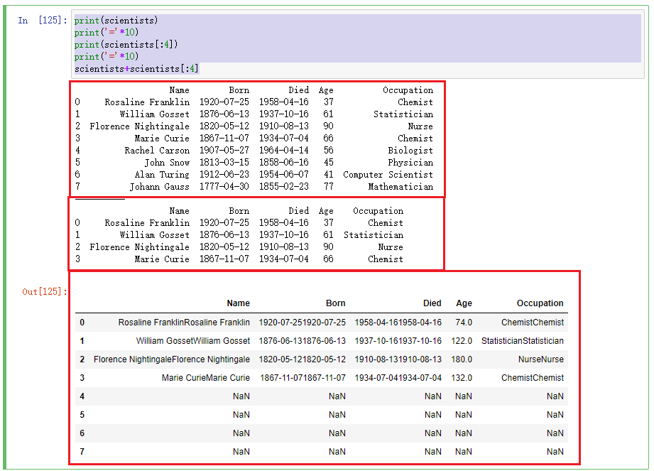


## 4 DataFrame其他操作

### 4.1 给行索引操作

####  4.1.1 加载数据文件后指定某列为索引 

**加载数据文件时，如果不指定行索引，Pandas会自动加上从0开始的索引；可以通过`df.set_index('列名')`的方法重新对指定的列设置为索引**

- 查看数据集，注意数据的列数

```python
movie = pd.read_csv('data/movie.csv')
# new_col_list = movie.columns.tolist()[:5]+['movie_title'] # 获取前5列列名并加入电影名称
# movie.loc[:,new_col_list].head()
movie
# 输出结果如下图
```

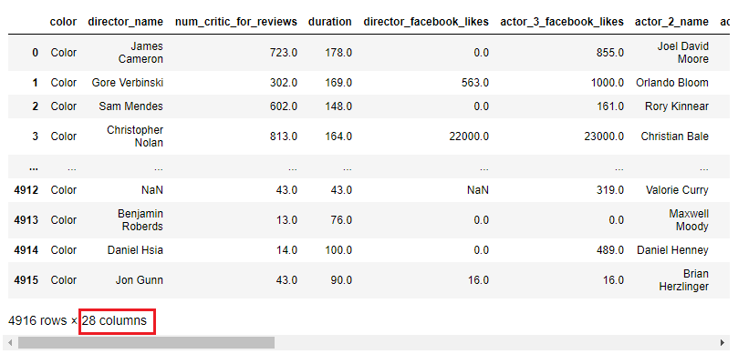

- 指定某列为索引，并观察列数

```python
movie2 = movie.set_index('movie_title')
movie2
# movie2.loc[:,new_col_list].head()
```

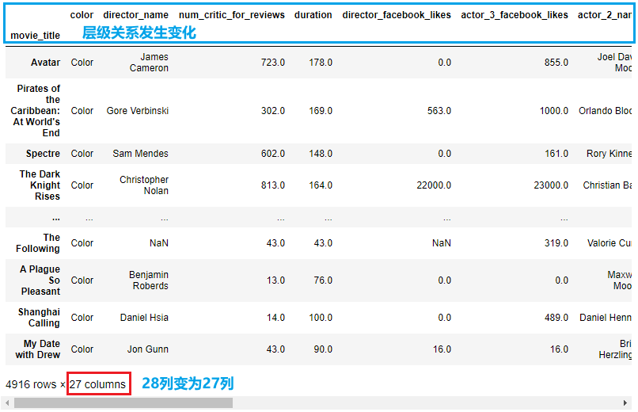

- 此时可以使用`df.reset_index()`重置索引，恢复为原来的df对象

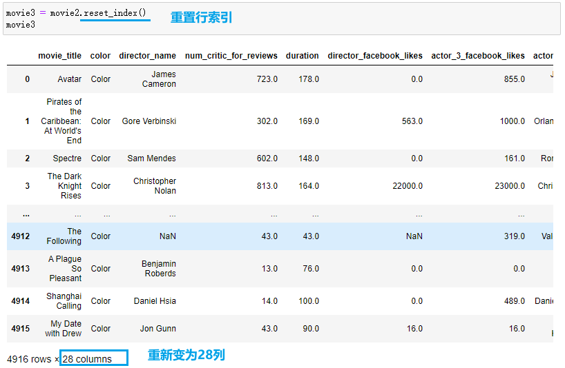

#### 4.1.2 加载数据文件时指定某列为行索引

**加载数据文件的时候，可以通过通过index_col参数，指定使用某一列数据作为行索引；并通过`reset_index()`方法可以重置索引**

```python
pd.read_csv('data/movie.csv', index_col='movie_title')
```


### 4.2 DataFrame修改行名和列名

#### 4.2.1 `df.rename()`函数修改行列名

**DataFrame创建之后，可以通过rename()方法对原有的行索引名和列名进行修改**

- 单独运行：加载数据，并指定列作为索引

```python
pd.read_csv('data/movie.csv', index_col='movie_title')
```

- 单独运行：查看索引列前5个值

```python
movie = pd.read_csv('data/movie.csv', index_col='movie_title')
movie.index[:5]
```

- 单独运行：查看前5个列名

```python
movie.columns[:5]
```

- 单独运行：替换索引值和列名

```python
# 构造要修改的索引值对应字典
idx_rename = {'Avatar':'Ratava', 'Spectre': 'Ertceps'} 
# 构造要修改的列名对应字典
col_rename = {'director_name':'Director Name', 'num_critic_for_reviews': 'Critical Reviews'} 
# 替换并显示前5行数据
movie.rename(index=idx_rename, columns=col_rename).head()
```

- 整个执行过程如下图所示

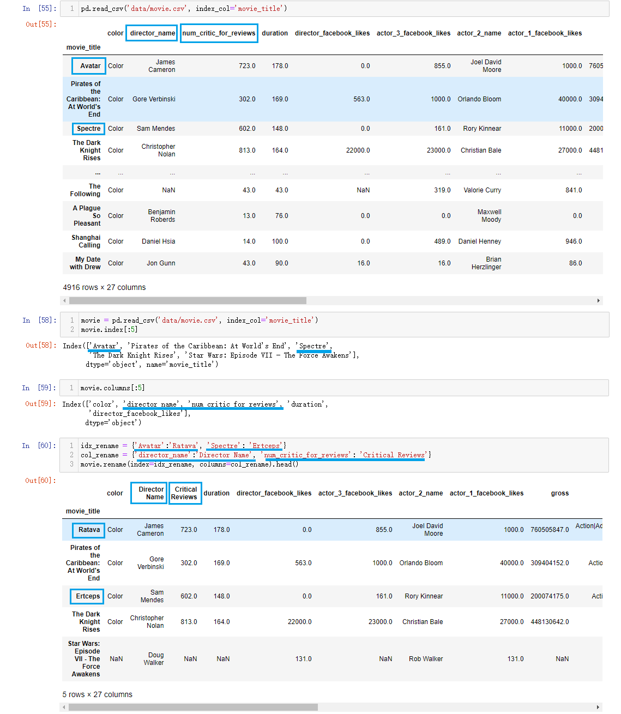

#### 4.2.2 对df的行列名重新赋值

**如果不使用`dfrename()`，也可以将`df.index` 和 `df.columns`属性提取出来，修改之后，再赋值回去**

- 单独运行：加载数据，并指定列作为索引，查看前3行数据

```python
movie = pd.read_csv('data/movie.csv', index_col='movie_title')
movie.head(3)
```

- 单独运行：分别查看数据的前5个索引值，和前5个列名

```python
index_list = movie.index.tolist()
column_list = movie.columns.tolist()
print(index_list[:5],'\n',column_list[:5])
```

- 单独运行：修改列表中的具体的值

```python'
index_list[0] = 'Ratava'
index_list[2] = 'Ertceps'
column_list[1] = 'Director Name'
column_list[2] = 'Critical Reviews'
print(index_list[:5], '\n', column_list[:5])
```

- 单独运行：将修改值的列表分别赋值给df数据对象的index属性和columns属性

```python
movie.index = index_list
movie.columns = column_list
movie.head(3)
```

- 整个执行过程如下图所示

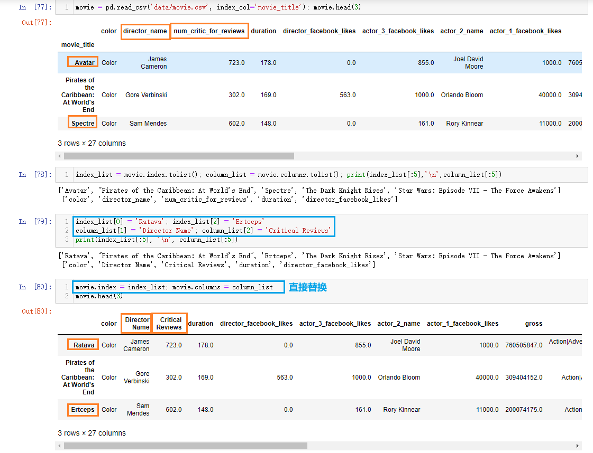


### 4.3 添加删除插入列

#### 4.3.1 添加列

> 通过`dataframe['列名']`添加新列，添加至最后

- 添加列名为 `has_seen` 的一列，值都为0

```python
movie = pd.read_csv('data/movie.csv')
movie['has_seen'] = 0
movie
# 输出结果如下图
```

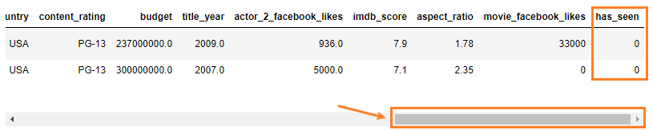

- 添加一个新列，列名为`actor_director_facebook_likes`，统计导演和123号主演的点赞数的总和

```python
movie['actor_director_facebook_likes'] = (
    movie['actor_1_facebook_likes'] + 
    movie['actor_2_facebook_likes'] + 
    movie['actor_3_facebook_likes'] + 
    movie['director_facebook_likes']
)
movie.head()
# 输出结果如下图，注意：NaN与数值进行运算的结果都是NaN
```

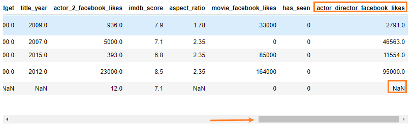


#### 4.3.2 删除列

- 调用`df.drop('列名', axis='columns')`方法删除列，参数`axis='columns'`表示对列进行删除操作

```python
new_movie = movie.drop('actor_director_facebook_likes', axis='columns')
new_movie.head(5)
```

- 注意：错误演示，此时运行的结果还是会出现指定删除的列；原因是`df.drop()`返回的是一个新的`df对象`，新df中没有指定删除的列，但原来的旧df中还是存在该列的

```python
movie.drop('actor_director_facebook_likes', axis='columns')
movie.head(5)
```


#### 4.3.3 插入列

**使用`df.insert(loc=列下标数字, column='列名', value=该列所有的值)`方法插入列**

- 计算在点赞数上，主演1的比主演2多多少；将计算的值作为列插入到原来第一列的前边；显示5行5列数据

```python
movie = pd.read_csv('data/movie.csv')
movie.insert(loc=0,column='actor1_likes-actor2_likes',value=movie['actor_1_facebook_likes'] - movie['actor_2_facebook_likes'])
movie.iloc[list(range(5)), list(range(5))]
# 输出结果如下
actor1_likes-actor2_likes	color	director_name	num_critic_for_reviews	duration
0	64.0	Color	James Cameron	723.0	178.0
1	35000.0	Color	Gore Verbinski	302.0	169.0
2	10607.0	Color	Sam Mendes	602.0	148.0
3	4000.0	Color	Christopher Nolan	813.0	164.0
4	119.0	NaN	Doug Walker	NaN	NaN
```


## 5 导出和导入数据

### 5.1 Pickle文件

#### 5.1.1 保存为pickle文件

- 调用to_pickle方法将以二进制格式保存数据
- 如要保存的对象是计算的中间结果，或者保存的对象以后会在Python中复用，可把对象保存为.pickle文件
- 如果保存成pickle文件，只能在python中使用
- 文件的扩展名可以是.p，.pkl，.pickle

```python
scientists = pd.read_csv('data/scientists.csv')
names = scientists['Name']
names.to_pickle('scientists_name.pickle')
scientists.to_pickle('scientists_df.pickle')
```

#### 5.1.2 读取pickle文件

可以使用pd.read_pickle函数读取.pickle文件中的数据

```python
scientists_name = pd.read_pickle('output/scientists_name.pickle')
print(scientists_name)
# 输出结果如下
0       Rosaline Franklin
1          William Gosset
2    Florence Nightingale
3             Marie Curie
4           Rachel Carson
5               John Snow
6             Alan Turing
7            Johann Gauss
Name: Name, dtype: object
```


### 5.2 CSV文件

我们用`pd.read_csv()`函数读取csv文件，使用`df.to_csv()`将数据保存为csv文件

- 在CSV文件中，对于每一行，各列采用逗号分隔；使用`\n`换行符换行
- 除了逗号，还可以使用其他类型的分隔符，比如TSV文件，使用制表符作为分隔符
- CSV是数据协作和共享的首选格式，因为可以使用excel打开

```python
# 默认使用逗号作为分隔符
names.to_csv('scientists_name.csv')
# TSV文件，设置分隔符必须为\t
scientists.to_csv('scientists_df.tsv', sep='\t')
#不在csv文件中写行名
scientists.to_csv('scientists_df_noindex.csv', index=False)
```


### 5.3 Excel文件

> 注意：根据anaconda的版本不同，pandas读写excel有时需要额外安装`xlwt`、`xlrd`、`openpyxl`三个包
>
> ```shell
> pip install -i https://pypi.tuna.tsinghua.edu.cn/simple xlwt 
> pip install -i https://pypi.tuna.tsinghua.edu.cn/simple openpyxl
> pip install -i https://pypi.tuna.tsinghua.edu.cn/simple xlrd 
> ```


#### 5.3.1 保存成Excel文件

- **Series这种数据结构不支持to_excel方法，想保存成Excel文件，需要把Series转换成DataFrame**

```python
names_df = names.to_frame()
import xlwt
names_df.to_excel('scientists_name_df.xls')
names_df.to_excel('scientists_name_df.xlsx')
# xls 是一个特有的二进制格式,其核心结构是复合文档类型的结构,而 xlsx 的核心结构是 XML 类型的结构,采用的是基于 XML 的压缩方式,使其占用的空间更小；xlsx的最后一个x表是xml
# xls是excel2003及以前版本生成的文件格式,而xlsx是excel2007及以后版本生成的文件格式。
```

- **DataFrame直接保存为Excel格式**

```python
scientists.to_excel('scientists_df.xlsx', sheet_name='scientists', index=False)
```

#### 5.3.2 读取Excel文件

使用`pd.read_excel()` 读取Excel文件

```python
pd.read_excel('scientists_df.xlsx')
# 输出结果如下

    Name	Born	Died	Age	Occupation
0	Rosaline Franklin	1920-07-25	1958-04-16	37	Chemist
1	William Gosset	1876-06-13	1937-10-16	61	Statistician
2	Florence Nightingale	1820-05-12	1910-08-13	90	Nurse
3	Marie Curie	1867-11-07	1934-07-04	66	Chemist
4	Rachel Carson	1907-05-27	1964-04-14	56	Biologist
5	John Snow	1813-03-15	1858-06-16	45	Physician
6	Alan Turing	1912-06-23	1954-06-07	41	Computer Scientist
7	Johann Gauss	1777-04-30	1855-02-23	77	Mathematician
```


### 5.4 【了解】`feather`格式文件

> - feather是一种文件格式，用于存储二进制对象
> - feather对象也可以加载到R语言中使用
> - feather格式的主要优点是在Python和R语言之间的读写速度要比CSV文件快
> - feather数据格式通常只用中间数据格式，用于Python和R之间传递数据
> - 一般不用做保存最终数据

### 5.5 【了解】数据导出的其他方法

> - 将excel中的数据读出，并导出为json文件
>
> ```python
> pd.read_excel('scientists_df.xlsx').to_json('scientists_df.json')
> ```
>
> - 其他导出方法清单
>
> <table>
> <tr>
>   <td>导出方法</td>
>   <td>说明</td>
>  </tr>
>   <tr>
>   <td>to_clipboard</td>
>   <td>把数据保存到系统剪贴板，方便粘贴</td>
>  </tr>
>   <tr>
>   <td>to_dict</td>
>   <td>把数据转换成Python字典</td>
>  </tr>
>   <tr>
>   <td>to_hdf</td>
>   <td>把数据保存为HDF格式</td>
>  </tr>
>   <tr>
>   <td>to_html</td>
>   <td>把数据转换成HTML</td>
>  </tr>
>   <tr>
>   <td>to_json</td>
>   <td>把数据转换成JSON字符串</td>
>  </tr>
>   <tr>
>   <td>to_sql</td>
>   <td>把数据保存到SQL数据库</td>
>  </tr>
> </table>


## 小结

> - 创建Series和DataFrame
>   - pd.Series
>   - pd.DataFrame
> - Series常用操作
>   - 常用属性
>     - index
>     - values
>     - shape,size,dtype
>   - 常用方法
>     - max(),min(),std()
>     - count()
>     - describe()
>   - 布尔索引
>   - 运算
>     - 与数值之间进行算数运算会对每一个元素进行计算
>     - 两个Series之间进行计算会索引对齐
> - DataFrame常用操作
>   - 常用属性
>   - 常用方法
>   - 布尔索引
>   - 运算
> - 更改Series和DataFrame
>   - 指定行索引名字
>     - dataframe.set_index()
>     - dataframe.reset_index()
>   - 修改行/列名字
>     - dataframe.rename(index=,columns = )
>     - 获取行/列索引 转换成list之后，修改list再赋值回去
>   - 添加、删除、插入列
>     - 添加 dataframe['新列‘']
>     - 删除 dataframe.drop
>     - 插入列 dataframe.insert()
> - 导入导出数据
>   - pickle
>   - csv
>   - Excel
>   - feather


## 处女座小Tips

> ### jupyter notebook显示代码行号
>
> 
>
> ### jupyter notebook重置代码单元执行编号
>
> - 在完成代码的过程中，每当运行一次代码区，执行编号就会自动+1
>
> 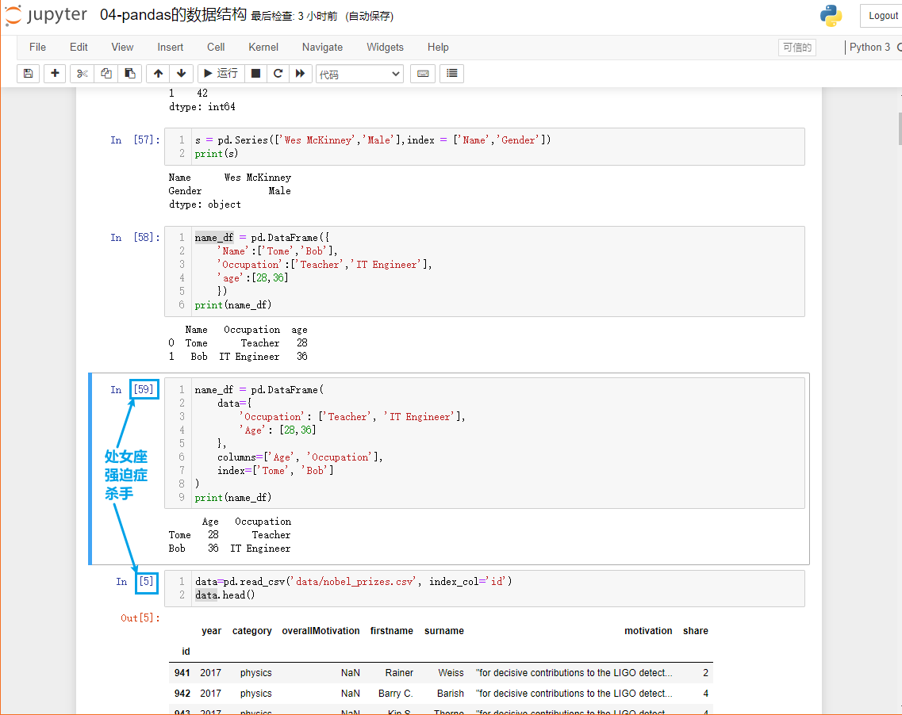
>
> - 点击重启服务
>
> 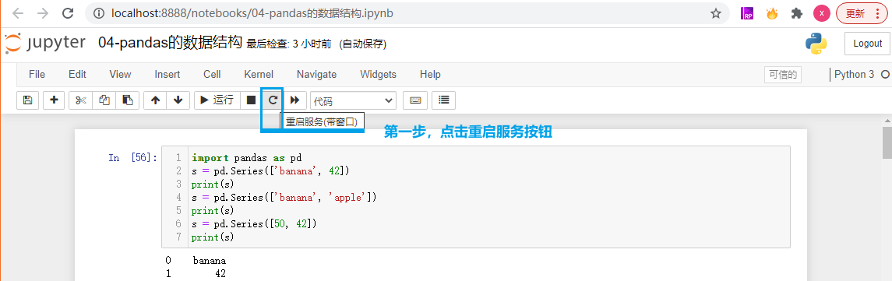
>
> - 点击重启
>
> 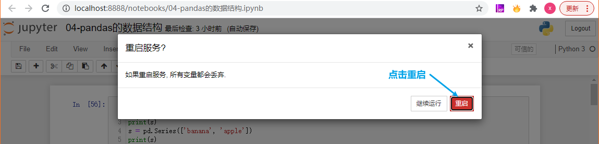
>
> - 点击执行全部
>
> 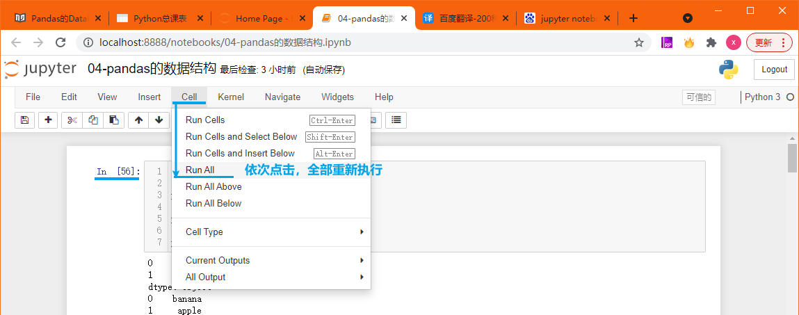
>
> - 等待全部执行完毕后，代码单元编号就会按顺序从1开始
>
> 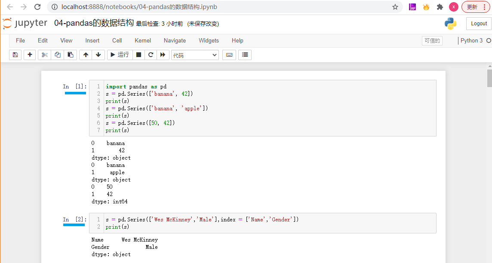

