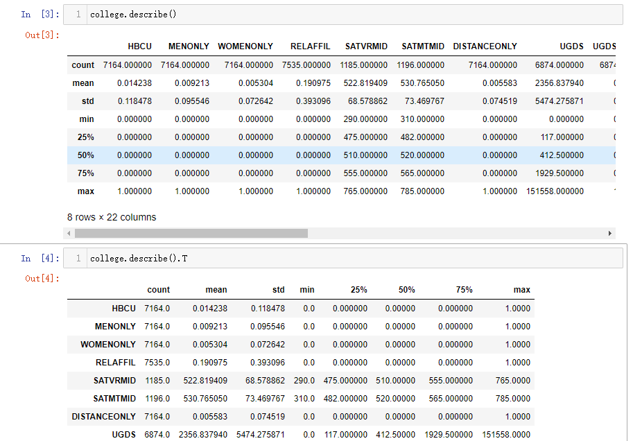
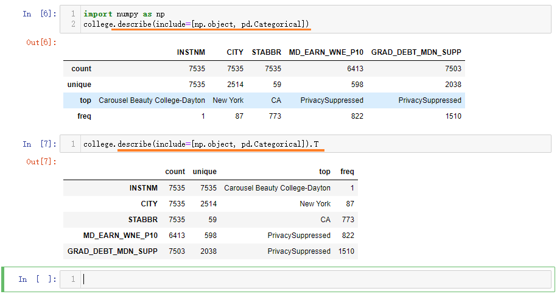
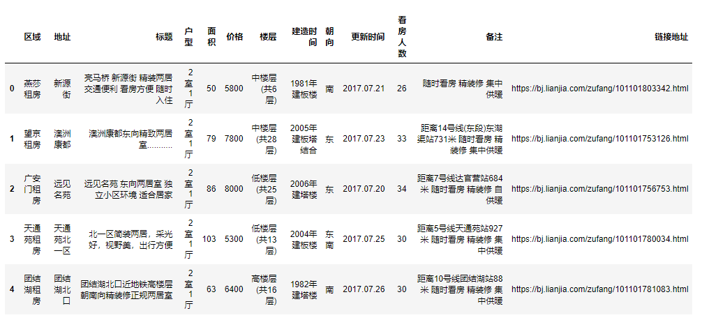
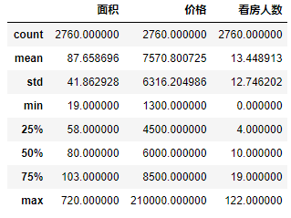
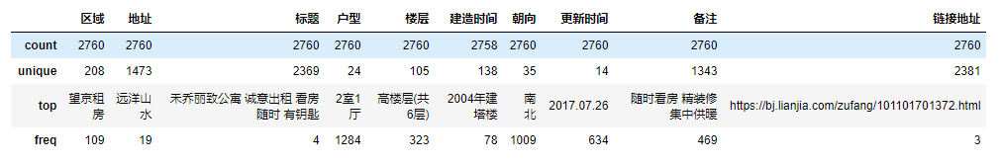
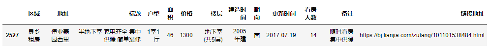
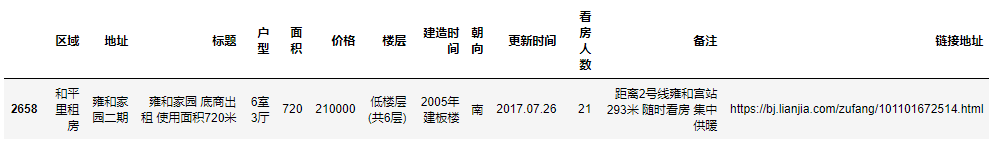

Pandas 数据分析入门

## 学习目标

- 掌握在Pandas中计算常用统计量的方法
- 初步使用pandas进行简单排序、分组、聚合等计算

## 1 计算常用统计值

- 加载数据之后，可以通过之前学习的内容计算最大值，最小值，平均值，分位数，方差等方式对数据的分布情况做基本了解，这里就不再重复讲解

```python
import pandas as pd
college = pd.read_csv('data/college.csv')
college.head()
# 输出结果如下
```

> |     | INSTNM                              | CITY       | STABBR | HBCU | MENONLY | WOMENONLY | RELAFFIL | SATVRMID | SATMTMID | DISTANCEONLY | ... | UGDS_2MOR | UGDS_NRA | UGDS_UNKN | PPTUG_EF | CURROPER | PCTPELL | PCTFLOAN | UG25ABV | MD_EARN_WNE_P10 | GRAD_DEBT_MDN_SUPP |
> | ---:| -----------------------------------:| ----------:| ------:| ----:| -------:| ---------:| --------:| --------:| --------:| ------------:| ---:| ---------:| --------:| ---------:| --------:| --------:| -------:| --------:| -------:| ---------------:| ------------------ |
> | 0   | Alabama A & M University            | Normal     | AL     | 1.0  | 0.0     | 0.0       | 0        | 424.0    | 420.0    | 0.0          | ... | 0.0000    | 0.0059   | 0.0138    | 0.0656   | 1        | 0.7356  | 0.8284   | 0.1049  | 30300           | 33888              |
> | 1   | University of Alabama at Birmingham | Birmingham | AL     | 0.0  | 0.0     | 0.0       | 0        | 570.0    | 565.0    | 0.0          | ... | 0.0368    | 0.0179   | 0.0100    | 0.2607   | 1        | 0.3460  | 0.5214   | 0.2422  | 39700           | 21941.5            |
> | 2   | Amridge University                  | Montgomery | AL     | 0.0  | 0.0     | 0.0       | 1        | NaN      | NaN      | 1.0          | ... | 0.0000    | 0.0000   | 0.2715    | 0.4536   | 1        | 0.6801  | 0.7795   | 0.8540  | 40100           | 23370              |
> | 3   | University of Alabama in Huntsville | Huntsville | AL     | 0.0  | 0.0     | 0.0       | 0        | 595.0    | 590.0    | 0.0          | ... | 0.0172    | 0.0332   | 0.0350    | 0.2146   | 1        | 0.3072  | 0.4596   | 0.2640  | 45500           | 24097              |
> | 4   | Alabama State University            | Montgomery | AL     | 1.0  | 0.0     | 0.0       | 0        | 425.0    | 430.0    | 0.0          | ... | 0.0098    | 0.0243   | 0.0137    | 0.0892   | 1        | 0.7347  | 0.7554   | 0.1270  | 26600           | 33118.5            |
> 
> 5 rows × 27 columns

- 数据集字段说明，大家课后可以自行探索该数据集背后的内容

| 列名               | 字段含义                            |
| ------------------ | ----------------------------------- |
| INSTNM             | 大学名称                            |
| CITY               | 所在城市                            |
| STABBR             | 所在州简称                          |
| HBCU               | 历史上的黑人学员和大学              |
| MENONLY            | 0/1 只有男学生                      |
| WOMENONLY          | 0/1 只有女学生                      |
| RELAFFIL           | 0/1 宗教信仰                        |
| SATVRMID           | SAT考试 Verbal分数中位数            |
| SATMTMID           | SAT考试 数学分数中位数              |
| DISTANCEONLY       | 只接受远程教育学生                  |
| UGDS               | 本科招生                            |
| UGDS_WHITE         | 本科生白人比例                      |
| UGDS_BLACK         | 本科生黑人比例                      |
| UGDS_HISP          | 本科生拉丁裔比例                    |
| UGDS_ASIAN         | 本科生亚裔比例                      |
| UGDS_AIAN          | 本科生美洲印第安人/阿拉斯加土著比例 |
| UGDS_NHPI          | 本科生夏威夷/太平洋群岛土著比例     |
| UGDS_2MOR          | 本科生混血比例                      |
| UGDS_NRA           | 本科生中留学生比例                  |
| UGDS_UNKN          | 本科生未知族裔比例                  |
| PPTUG_EF           | 非全日制学生比例                    |
| CURROPER           | 0/1 正在运营                        |
| PCTPELL            | 佩尔资助计划学生比例                |
| PCTFLOAN           | 学费贷款学生比例                    |
| UG25ABV            | 年龄大于25岁的学生比例              |
| MD_EARN_WNE_P10    | 入学10年后收入中位数                |
| GRAD_DEBT_MDN_SUPP | 毕业生债务中位数                    |
|                    |                                     |

- 查看数据行列数

```python
college.shape
# 输出结果如下
(7535, 27)
```

- 【重要】以数据统计信息为例，做**行列转换**

```python
college.describe() # 单独运行并查看
college.describe().T # 单独运行并查看
# 单独运行结果如下图所示
```



- 非数值数据的统计信息

> - 在04章节中 `2.2.4 describe函数` 小节中，我们用describe函数对数据集中的某一列数据做基本统计，在刚才我们发现：`df.describe()`返回的仅是所有数值列的统计信息
> - 列值是数值类型的统计返回和非数值类型的统计返回结果不一样
> - 那么在对整个数据集做基本统计时，也是使用describe函数
> - 默认的返回结果，是对所有数值类型的列做基础统计
> - 如果想返回非数值类型的所有列的基本统计结果，在使用describe函数时，需要使用特定参数

```python
# 固定用法
import numpy as np
college.describe(include=[np.object, pd.Categorical]) # 单独运行并查看
college.describe(include=[np.object, pd.Categorical]).T # 单独运行并查看
# 单独运行结果如下图所示
```



- `df.info()`方法返回所有字段的条目数量、数据类型、是否缺失，及当前数据集整体的内存占用情况

```python
college.info()
# 输出结果如下
<class 'pandas.core.frame.DataFrame'>
RangeIndex: 7535 entries, 0 to 7534
Data columns (total 27 columns):
INSTNM                7535 non-null object
CITY                  7535 non-null object
STABBR                7535 non-null object
HBCU                  7164 non-null float64
MENONLY               7164 non-null float64
WOMENONLY             7164 non-null float64
RELAFFIL              7535 non-null int64
SATVRMID              1185 non-null float64
SATMTMID              1196 non-null float64
DISTANCEONLY          7164 non-null float64
UGDS                  6874 non-null float64
UGDS_WHITE            6874 non-null float64
UGDS_BLACK            6874 non-null float64
UGDS_HISP             6874 non-null float64
UGDS_ASIAN            6874 non-null float64
UGDS_AIAN             6874 non-null float64
UGDS_NHPI             6874 non-null float64
UGDS_2MOR             6874 non-null float64
UGDS_NRA              6874 non-null float64
UGDS_UNKN             6874 non-null float64
PPTUG_EF              6853 non-null float64
CURROPER              7535 non-null int64
PCTPELL               6849 non-null float64
PCTFLOAN              6849 non-null float64
UG25ABV               6718 non-null float64
MD_EARN_WNE_P10       6413 non-null object
GRAD_DEBT_MDN_SUPP    7503 non-null object
dtypes: float64(20), int64(2), object(5)
memory usage: 1.6+ MB
```


## 2 常用排序方法

### 2.1 从最大的N个值中选取最小值

> 找到小成本高口碑的5部电影，思路：
>
> - 输出和需求相关的列，观察数据
> - 选出口碑评分（imdb_score字段）最高的电影
> - 上一步的结果中，挑出预算最小的五部

- 指定分析需求相关字段，输出新的df

```python
movie = pd.read_csv('data/movie.csv')
# 仅显示 电影名字 imdb评分 花费预算
movie2 = movie[['movie_title', 'imdb_score', 'budget']]
movie2.head()
```

> <font color = red>输出结果</font>
> 
> |     | movie_title                                | imdb_score | budget      |
> | ---:|:------------------------------------------ |:---------- |:----------- |
> | 0   | Avatar                                     | 7.9        | 237000000.0 |
> | 1   | Pirates of the Caribbean: At World's End   | 7.1        | 300000000.0 |
> | 2   | Spectre                                    | 6.8        | 245000000.0 |
> | 3   | The Dark Knight Rises                      | 8.5        | 250000000.0 |
> | 4   | Star Wars: Episode VII - The Force Awakens | 7.1        | NaN         |

- 用nlargest方法，选出imdb_score分数最高的100个

```python
# df.nlargest(n, '列名') # 根据指定列的值由大到小排列，返回n行数据
movie2.nlargest(100, 'imdb_score').head()
```

> <font color = red>输出结果</font>
> 
> |      | movie_title              | imdb_score | budget     |
> |:---- |:------------------------ |:---------- |:---------- |
> | 2725 | Towering Inferno         | 9.5        | NaN        |
> | 1920 | The Shawshank Redemption | 9.3        | 25000000.0 |
> | 3402 | The Godfather            | 9.2        | 6000000.0  |
> | 2779 | Dekalog                  | 9.1        | NaN        |
> | 4312 | Kickboxer: Vengeance     | 9.1        | 17000000.0 |

- 使用nsmallest方法再从中挑出预算最小的五部

```python
# df.nsmallest(n, '列名') # 根据指定列的值由小到大排列，返回n行数据
movie2.nlargest(100, 'imdb_score').nsmallest(5, 'budget')
```

> <font color = red>输出结果</font>
> 
> |      | movie_title          | imdb_score | budget   |
> |:---- |:-------------------- |:---------- |:-------- |
> | 4804 | Butterfly Girl       | 8.7        | 180000.0 |
> | 4801 | Children of Heaven   | 8.5        | 180000.0 |
> | 4706 | 12 Angry Men         | 8.9        | 350000.0 |
> | 4550 | A Separation         | 8.4        | 500000.0 |
> | 4636 | The Other Dream Team | 8.4        | 500000.0 |


### 2.2 通过排序选取每组的最大值

> 找到每年imdb评分最高的电影，思路：
>
> - 年份由大到小排序，观察数据，找规律
> - 按年份、评分，由大到小排序，观察数据（分组）
> - 上述结果按照年份去重、仅保留第一个（去重）

- sort_values 按照年份排序，ascending 升序排列

```python
# df.sort_values('列名', ascending=False) # 指定字段由大到小降序排列
movie2 = movie[['movie_title', 'title_year', 'imdb_score']]
movie2.sort_values('title_year', ascending=False).head()
#movie2.sort_values('title_year', ascending=False).iloc[-500:-450]
```

> <font color = red>输出结果</font>
> 
> |      | movie_title                  | title_year | imdb_score |
> |:---- |:---------------------------- |:---------- |:---------- |
> | 3884 | The Veil                     | 2016.0     | 4.7        |
> | 2375 | My Big Fat Greek Wedding 2   | 2016.0     | 6.1        |
> | 2794 | Miracles from Heaven         | 2016.0     | 6.8        |
> | 92   | Independence Day: Resurgence | 2016.0     | 5.5        |
> | 153  | Kung Fu Panda 3              | 2016.0     | 7.2        |

- 同时对`title_year`、`imdb_score` 两列进行排序，由大到小降序排列

```python
movie3 = movie2.sort_values(['title_year','imdb_score'], ascending=False)
movie3.head()
# movie3.iloc[-500:-450]
```

> <font color = red>输出结果</font>
> 
> |      | movie_title                 | title_year | imdb_score |
> | ----:|:--------------------------- |:---------- |:---------- |
> | 4312 | Kickboxer: Vengeance        | 2016.0     | 9.1        |
> | 4277 | A Beginner's Guide to Snuff | 2016.0     | 8.7        |
> | 3798 | Airlift                     | 2016.0     | 8.5        |
> | 27   | Captain America: Civil War  | 2016.0     | 8.2        |
> | 98   | Godzilla Resurgence         | 2016.0     | 8.2        |

- 用drop_duplicates去重，只保留每年的第一条数据

```python
# df.drop_duplicates(subset='列名') # 对指定列的值去重，只保留第一个
movie_top_year = movie3.drop_duplicates(subset='title_year')
movie_top_year.head()
```

> <font color = red>输出结果</font>
> 
> |      | movie_title                             | title_year | imdb_score |
> | ----:|:--------------------------------------- |:---------- |:---------- |
> | 4312 | Kickboxer: Vengeance                    | 2016.0     | 9.1        |
> | 3745 | Running Forever                         | 2015.0     | 8.6        |
> | 4369 | Queen of the Mountains                  | 2014.0     | 8.7        |
> | 3935 | Batman: The Dark Knight Returns, Part 2 | 2013.0     | 8.4        |
> | 3    | The Dark Knight Rises                   | 2012.0     | 8.5        |


### 2.3 关于sort_values多列排序

> 提取出每年，每种电影分级中预算少的电影

- 多列排序时，ascending 参数传入一个列表，排序参数也是一个列表，并且一一对应

```python
# 构造新的df，保留有效列
movie4 = movie[['movie_title', 'title_year', 'content_rating', 'budget']]
# 分组：多列排序，ascending=[False, False, True] 降序，降序，升序
movie4_sorted = movie4.sort_values(['title_year', 'content_rating', 'budget'], ascending=[False, False, True])
# 去重：删除'title_year', 'content_rating'相同的数据
movie4_sorted.drop_duplicates(subset=['title_year', 'content_rating']).head(10)
```

> <font color = red>输出结果</font>
> 
> |      | movie_title                                     | title_year | content_rating | budget    |
> | ----:|:----------------------------------------------- |:---------- |:-------------- |:--------- |
> | 4026 | Compadres                                       | 2016.0     | R              | 3000000.0 |
> | 4658 | Fight to the Finish                             | 2016.0     | PG-13          | 150000.0  |
> | 4661 | Rodeo Girl                                      | 2016.0     | PG             | 500000.0  |
> | 3252 | The Wailing                                     | 2016.0     | Not Rated      | NaN       |
> | 4659 | Alleluia! The Devil's Carnival                  | 2016.0     | NaN            | 500000.0  |
> | 4731 | Bizarre                                         | 2015.0     | Unrated        | 500000.0  |
> | 812  | The Ridiculous 6                                | 2015.0     | TV-14          | NaN       |
> | 4831 | The Gallows                                     | 2015.0     | R              | 100000.0  |
> | 4825 | Romantic Schemer                                | 2015.0     | PG-13          | 125000.0  |
> | 3796 | R.L. Stine's Monsterville: The Cabinet of Souls | 2015.0     | PG             | 4400000.0 |


## 3 简单数据分析练习

> 租房数据

### 3.1 初步查探数据集信息


- 载入数据，并查看列名
  

```python
import pandas as pd
house_data = pd.read_csv('data/LJdata.csv')
house_data.columns
# 输出结果如下
Index(['区域', '地址', '标题', '户型', '面积', '价格', '楼层', '建造时间', '朝向', '更新时间', '看房人数','备注', '链接地址'],dtype='object')
```


- 把列名替换成英文
  
  ```python
  #查看原始列名
  house_data.columns
  ```
  
  > <font color = red>输出结果</font>
  > 
  > ```shell
  > Index(['区域', '地址', '标题', '户型', '面积', '价格', '楼层', '建造时间', '朝向', '更新时间', '看房人数','备注', '链接地址'],dtype='object')
  > ```
  
  ```python
  house_data.columns = ['district', 'address', 'title', 'house_type', 'area', 'price', 'floor', 'build_time', 'direction', 'update_time', 'view_num', 'extra_info', 'link']
  ```

- 查看数据基本情况

```python
house_data.head()
# 输出结果如下图
```



- 查看数据集基本信息，每个字段值的数量，是否非空值，以及该字段的数据类型

```python
house_data.info()
# 输出结果如下
<class 'pandas.core.frame.DataFrame'>
RangeIndex: 2760 entries, 0 to 2759
Data columns (total 13 columns):
district       2760 non-null object
address        2760 non-null object
title          2760 non-null object
house_type     2760 non-null object
area           2760 non-null object
price          2760 non-null int64
floor          2760 non-null object
build_time     2758 non-null object
direction      2760 non-null object
update_time    2760 non-null object
view_num       2760 non-null int64
extra_info     2760 non-null object
link           2760 non-null object
dtypes: int64(2), object(11)
memory usage: 280.4+ KB
```

- 查看数据行列数量

```python
house_data.shape
# 输出结果如下
(2760, 13)
```

- 查看数据集中，所有数值字段的基本统计信息

```python
house_data.describe()
# 输出结果如下图
```



- 查看数据集中，所有非数值字段的基本统计信息

```python
import numpy as np
house_data.describe(include=[np.object, pd.Categorical]) 
#house_data.describe(include=[np.object, pd.Categorical]).T # 行列转换查看
# 输出结果如下图
```



### 3.2 找到租金最低和最高的房子的全部信息

#### 3.2.1 方法1-通过指定的字段和字段值获取整行数据

- 租金最低的房子

```python
house_data[house_data['价格']==house_data['价格'].min()]
# 输出结果如下图
```



- 租金最高的房子

```python
house_data[house_data['价格']==house_data['价格'].max()]
# 输出结果如下图
```



#### 3.2.2 方法2-按指定字段的值进行排序

- sort_values函数按照字段的值排序，ascending参数默认为True，由小到大升序，取第一个最小值的数据

```python
house_data.sort_values(by='价格').head(1)
# 输出结果如下图
```


- sort_values函数按照字段的值排序，ascending参数默认为True，由小到大升序，取最后一个最大值的数据

```python
house_data.sort_values(by='价格').tail(1)
```


### 3.3 找到最近新上的10套房源

```python
# 指定字段，由小到大升序，取前10
house_data.sort_values(by='更新时间', ascending=True).head(10)
# 输出结果如下图
```


### 3.4 查看所有更新时间

```python
# 查看指定字段的值，去重
house_data['更新时间'].unique()
# 输出结果如下
array(['2017.07.21', '2017.07.23', '2017.07.20', '2017.07.25',
       '2017.07.26', '2017.07.16', '2017.07.22', '2017.07.24',
       '2017.07.27', '2017.07.19', '2017.07.14', '2017.07.15',
       '2017.07.17', '2017.07.18'], dtype=object)
```

### 3.5 统计看房人数

- 看房人数

```python
print(house_data['看房人数'].mean()) # 平均值
print(house_data['看房人数'].median()) # 中位数
# 一组数据按从小到大的顺序依次排列,处在中间位置的一个数
# 输出结果如下
13.44891304347826
10.0
```

- 根据不同看房人数分别统计房源数量（分别统计相同看房人数的房源数量）；参数`as_index=False`表示分组字段不作为行索引（默认为True)，同时默认行索引

```python
# 根据看房人数字段的值对标题字段做分组，对字段标题（房源）统计总数，行索引设为默认
tmp_df = house_data.groupby('看房人数', as_index=False)['标题'].count()
tmp_df.columns = ['看房人数', '总和'] # 设置列名
tmp_df.head()
# 输出结果如下
	看房人数	总和
0	0	152
1	1	149
2	2	143
3	3	129
4	4	147
```

- 图形展示多少人看了多少套房

```python
# Jupyter notebook有一些版本中需要做内嵌绘图声明 %matplotlib inline 的功能是内嵌绘图
%matplotlib inline
tmp_df['总和'].plot(kind='bar',figsize=(20,10))
# 后边我们会有专门的章节来讲解可视化
```

![img](data:image/png;base64,iVBORw0KGgoAAAANSUhEUgAABIMAAAJCCAYAAABTbwfcAAAABHNCSVQICAgIfAhkiAAAAAlwSFlzAAALEgAACxIB0t1+/AAAIABJREFUeJzt3XuUZVddJ/Dvj3SAkPBMOo0ZIWU0OvIwqA2GmIQAiYoNjiIBX6CgBhkejjhIQ0J0oYwtIqIoYCAqPkbNCqhIowZMgJAQnA74Qse10CkWxkFbwyTijGucrD1/nNOmKLqr7qtevT+fte6qe8+5v7N33dp16tb37nNOtdYCAAAAQB/usdUdAAAAAGDzCIMAAAAAOiIMAgAAAOiIMAgAAACgI8IgAAAAgI4IgwAAAAA6IgwCAAAA6IgwCAAAAKAjwiAAAACAjuzaikZPO+20trS0tBVNAwAAAByXbr311n9ore1e73lbEgYtLS3l0KFDW9E0AAAAwHGpqj4+yfMcJgYAAADQEWEQAAAAQEeEQQAAAAAdEQYBAAAAdEQYBAAAANARYRAAAABAR4RBAAAAAB0RBgEAAAB0RBgEAAAA0BFhEAAAAEBHhEEAAAAAHREGAQAAAHREGAQAAADQEWEQAAAAQEeEQQAAAAAdEQYBAAAAdEQYBAAAANARYRAAAABAR4RBAAAAAB0RBgEAAAB0RBgEAAAA0BFhEAAAAEBHhEEAAAAAHREGAQAAAHRk11Z3IEmW9h885rrlA/s2sScAAAAAxzczgwAAAAA6IgwCAAAA6IgwCAAAAKAjwiAAAACAjgiDAAAAADoiDAIAAADoiDAIAAAAoCPCIAAAAICOCIMAAAAAOrJrqzswr6X9B4+5bvnAvk3sCQAAAMD2Z2YQAAAAQEeEQQAAAAAdEQYBAAAAdEQYBAAAANARYRAAAABAR4RBAAAAAB3Z8ZeW34mW9h9cc/3ygX2b1BMAAACgN2YGAQAAAHREGAQAAADQEWEQAAAAQEeEQQAAAAAdEQYBAAAAdEQYBAAAANARYRAAAABAR4RBAAAAAB0RBgEAAAB0RBgEAAAA0BFhEAAAAEBHhEEAAAAAHdm11R3YSkv7D665fvnAvk3qCQAAAMDmMDMIAAAAoCPCIAAAAICOCIMAAAAAOiIMAgAAAOiIMAgAAACgI8IgAAAAgI4IgwAAAAA6IgwCAAAA6MhEYVBV7amqG1cte0RVXTfeP7Gq3llVN1fVczaiowAAAADMb90wqKoemOStSU5esaySvDbJPcdFL0xyqLV2XpKnVdV9N6CvAAAAAMxpkplBdyV5RpI7Vyx7dpIbVjy+KMk14/33J9m7eiNVdVlVHaqqQ4cPH56ttwAAAADMZd0wqLV2Z2vtjiOPq+rUJN+W5DUrnnZyktvG+7cn2XOU7VzVWtvbWtu7e/fu+XoNAAAAwExmOYH0gSQva63964pln05y0nj/lBm3CwAAAMAG2zVDzeOSnD2cNiiPqqofSXJrkvOTXJvknCS3LKyHAAAAACzM1GFQa+0Lj9yvqve21q6oqjOTvKuqLkjysCQfWmAfAQAAAFiQiQ/naq1ddKxlrbWPJ7kkyU1JLm6t3bWg/gEAAACwQLMcJnZUrbW/zd1XFAMAAABgG3KiZwAAAICOCIMAAAAAOiIMAgAAAOiIMAgAAACgI8IgAAAAgI4IgwAAAAA6srBLy3N8W9p/cM31ywf2bVJPAAAAgHmYGQQAAADQEWEQAAAAQEeEQQAAAAAdEQYBAAAAdEQYBAAAANARYRAAAABAR4RBAAAAAB0RBgEAAAB0RBgEAAAA0BFhEAAAAEBHhEEAAAAAHREGAQAAAHREGAQAAADQEWEQAAAAQEeEQQAAAAAdEQYBAAAAdEQYBAAAANARYRAAAABAR4RBAAAAAB0RBgEAAAB0RBgEAAAA0BFhEAAAAEBHhEEAAAAAHdm11R3YqZb2H1xz/fKBfZvUk8ntxD4DAAAAi2VmEAAAAEBHhEEAAAAAHREGAQAAAHREGAQAAADQEWEQAAAAQEeEQQAAAAAdcWl5tr2l/QePuW75wL5N7AkAAADsfGYGAQAAAHREGAQAAADQEWEQAAAAQEeEQQAAAAAdEQYBAAAAdEQYBAAAANARYRAAAABAR4RBAAAAAB0RBgEAAAB0RBgEAAAA0BFhEAAAAEBHhEEAAAAAHREGAQAAAHREGAQAAADQEWEQAAAAQEeEQQAAAAAdEQYBAAAAdEQYBAAAANARYRAAAABAR4RBAAAAAB0RBgEAAAB0ZKIwqKr2VNWN4/2HVtV7q+r6qrqqBidW1Tur6uaqes7GdhkAAACAWa0bBlXVA5O8NcnJ46LnJnlea+0JSR6S5JFJXpjkUGvtvCRPq6r7blB/AQAAAJjDJDOD7kryjCR3Jklr7fLW2l+M605N8g9JLkpyzbjs/Un2rt5IVV1WVYeq6tDhw4fn7TcAAAAAM1g3DGqt3dlau2P18qp6RpKPttb+NsOsodvGVbcn2XOU7VzVWtvbWtu7e/fuObsNAAAAwCx2zVJUVWcl+c9JLh4XfTrJSUnuSHLK+BgAAACAbWbqMGg8h9CvJXnOihlDtyY5P8m1Sc5JcsvCeshnWNp/cM31ywf2bVJPAAAAgJ1olplB+5M8NMnrqypJfjDDCabfVVUXJHlYkg8trIcAAAAALMzEYVBr7aLx60uTvHT1+qq6JMPsoCtba3ctqoMAAAAALM5M5ww6mvFE0tes+0QAAAAAtswkl5YHAAAA4DghDAIAAADoiDAIAAAAoCPCIAAAAICOCIMAAAAAOiIMAgAAAOiIMAgAAACgI8IgAAAAgI4IgwAAAAA6IgwCAAAA6IgwCAAAAKAjwiAAAACAjgiDAAAAADoiDAIAAADoiDAIAAAAoCPCIAAAAICOCIMAAAAAOiIMAgAAAOiIMAgAAACgI8IgAAAAgI4IgwAAAAA6IgwCAAAA6IgwCAAAAKAjwiAAAACAjgiDAAAAADoiDAIAAADoiDAIAAAAoCPCIAAAAICOCIMAAAAAOiIMAgAAAOiIMAgAAACgI8IgAAAAgI4IgwAAAAA6IgwCAAAA6IgwCAAAAKAjwiAAAACAjgiDAAAAADoiDAIAAADoiDAIAAAAoCPCIAAAAICOCIMAAAAAOiIMAgAAAOiIMAgAAACgI8IgAAAAgI7s2uoOwEZa2n/wmOuWD+zbxJ4AAADA9mBmEAAAAEBHhEEAAAAAHREGAQAAAHREGAQAAADQEWEQAAAAQEeEQQAAAAAdcWl5Ntxal3dPXOIdAAAANpOZQQAAAAAdEQYBAAAAdMRhYrAB1jo0zmFxAAAAbCUzgwAAAAA6IgwCAAAA6IgwCAAAAKAjwiAAAACAjkwUBlXVnqq6cbx/YlW9s6purqrnHGsZAAAAANvPumFQVT0wyVuTnDwuemGSQ62185I8rarue4xlAAAAAGwzk8wMuivJM5LcOT6+KMk14/33J9l7jGWfoaouq6pDVXXo8OHDc3QZAAAAgFmtGwa11u5srd2xYtHJSW4b79+eZM8xlq3ezlWttb2ttb27d++er9cAAAAAzGSWE0h/OslJ4/1Txm0cbRkAAAAA28wsoc2tSc4f75+TZPkYywAAAADYZnbNUPPWJO+qqguSPCzJhzIcIrZ6GQAAAADbzMQzg1prF41fP57kkiQ3Jbm4tXbX0ZZtQF8BAAAAmNMsM4PSWvvb3H31sGMuAwAAAGB7caJnAAAAgI4IgwAAAAA6IgwCAAAA6MhM5wyCHiztP3jMdcsH9m1iTwAAAGBxzAwCAAAA6IgwCAAAAKAjwiAAAACAjgiDAAAAADoiDAIAAADoiDAIAAAAoCPCIAAAAICOCIMAAAAAOiIMAgAAAOjIrq3uAPCZlvYfPOa65QP7NrEnAAAAHI/MDAIAAADoiDAIAAAAoCPCIAAAAICOCIMAAAAAOiIMAgAAAOiIMAgAAACgI8IgAAAAgI4IgwAAAAA6IgwCAAAA6IgwCAAAAKAjwiAAAACAjgiDAAAAADoiDAIAAADoiDAIAAAAoCPCIAAAAICOCIMAAAAAOiIMAgAAAOiIMAgAAACgI8IgAAAAgI4IgwAAAAA6IgwCAAAA6IgwCAAAAKAjwiAAAACAjgiDAAAAADoiDAIAAADoiDAIAAAAoCPCIAAAAICOCIMAAAAAOiIMAgAAAOiIMAgAAACgI8IgAAAAgI4IgwAAAAA6IgwCAAAA6IgwCAAAAKAjwiAAAACAjgiDAAAAADoiDAIAAADoiDAIAAAAoCPCIAAAAICOCIMAAAAAOiIMAgAAAOiIMAgAAACgI8IgAAAAgI4IgwAAAAA6IgwCAAAA6MjUYVBVPbCq3lVVh6rq58ZlV1fVzVV1xeK7CAAAAMCizDIz6JlJfrW1tjfJKVX1A0lOaK2dl+Ssqjp7oT0EAAAAYGFmCYP+MckjquoBSR6SZCnJNeO665Kcf7SiqrpsnE106PDhw7P0FQAAAIA5zRIGfSDJmUlelOS/J7lXktvGdbcn2XO0otbaVa21va21vbt3756lrwAAAADMaZYw6AeTfE9r7ZUZwqBvSXLSuO6UGbcJAAAAwCaYJbh5YJJHVtUJSb4iyYHcfWjYOUmWF9M1AAAAABZt1ww1P5rkFzIcKvbBJD+Z5MaqOiPJk5Kcu7juAQAAALBIU4dBrbU/TPLwlcuq6qIklyR5dWvtjsV0DQAAAIBFm2Vm0GdprX0qd19RDAAAAIBtysmeAQAAADoiDAIAAADoiDAIAAAAoCPCIAAAAICOCIMAAAAAOiIMAgAAAOiIMAgAAACgI8IgAAAAgI4IgwAAAAA6IgwCAAAA6IgwCAAAAKAjwiAAAACAjgiDAAAAADoiDAIAAADoiDAIAAAAoCPCIAAAAICOCIMAAAAAOiIMAgAAAOiIMAgAAACgI8IgAAAAgI4IgwAAAAA6IgwCAAAA6IgwCAAAAKAjwiAAAACAjuza6g4Ai7O0/+Ca65cP7NukngAAALBdmRkEAAAA0BFhEAAAAEBHhEEAAAAAHREGAQAAAHREGAQAAADQEWEQAAAAQEeEQQAAAAAdEQYBAAAAdEQYBAAAANARYRAAAABAR4RBAAAAAB0RBgEAAAB0RBgEAAAA0BFhEAAAAEBHhEEAAAAAHREGAQAAAHREGAQAAADQEWEQAAAAQEeEQQAAAAAdEQYBAAAAdEQYBAAAANARYRAAAABAR4RBAAAAAB3ZtdUdAJjV0v6Da65fPrBvk3oCAACwc5gZBAAAANARYRAAAABAR4RBAAAAAB0RBgEAAAB0RBgEAAAA0BFhEAAAAEBHhEEAAAAAHREGAQAAAHREGAQAAADQkV1b3QFge1jaf3DN9csH9m1STwAAANhIM88Mqqo3VNVTxvtXV9XNVXXF4roGAAAAwKLNFAZV1QVJHtxa+52qemqSE1pr5yU5q6rOXmgPAQAAAFiYqcOgqjoxyZuTLFfVf0hyUZJrxtXXJTn/GHWXVdWhqjp0+PDhGbsLAAAAwDxmmRn0rCR/nuTVSR6T5PlJbhvX3Z5kz9GKWmtXtdb2ttb27t69e5a+AgAAADCnWU4g/aVJrmqtfbKqfiXJeUlOGtedElcoAwAAANi2ZgluPpbkrPH+3iRLufvQsHOSLM/dKwAAAAA2xCwzg65O8vNV9U1JTsxwzqB3VNUZSZ6U5NzFdQ8AAACARZo6DGqt/VOSS1cuq6qLklyS5NWttTsW0zUAAAAAFm2WmUGfpbX2qdx9RTEAAAAAtiknewYAAADoiDAIAAAAoCPCIAAAAICOCIMAAAAAOiIMAgAAAOiIMAgAAACgI8IgAAAAgI7s2uoOAGyFpf0H11y/fGDfJvUEAABgc5kZBAAAANARYRAAAABAR4RBAAAAAB0RBgEAAAB0RBgEAAAA0BFhEAAAAEBHhEEAAAAAHREGAQAAAHREGAQAAADQEWEQAAAAQEeEQQAAAAAdEQYBAAAAdGTXVncA2PmW9h9cc/3ygX0bUgsAAMD0zAwCAAAA6IgwCAAAAKAjwiAAAACAjjhnEEAn1jo/k3MzAQBAP8wMAgAAAOiIMAgAAACgI8IgAAAAgI4IgwAAAAA6IgwCAAAA6IgwCAAAAKAjwiAAAACAjgiDAAAAADoiDAIAAADoiDAIAAAAoCPCIAAAAICOCIMAAAAAOiIMAgAAAOiIMAgAAACgI8IgAAAAgI4IgwAAAAA6smurOwDA5Jb2HzzmuuUD+zaxJwAAwE5lZhAAAABAR4RBAAAAAB1xmBjAJnOoFwAAsJXMDAIAAADoiDAIAAAAoCPCIAAAAICOCIMAAAAAOiIMAgAAAOiIMAgAAACgIy4tD8C6lvYfPOa65QP7jrt2AQDgeGZmEAAAAEBHhEEAAAAAHREGAQAAAHREGAQAAADQEWEQAAAAQEeEQQAAAAAdEQYBAAAAdGTmMKiq9lTVR8b7V1fVzVV1xeK6BgAAAMCizTMz6DVJTqqqpyY5obV2XpKzqursxXQNAAAAgEWbKQyqqick+eckn0xyUZJrxlXXJTn/GDWXVdWhqjp0+PDhWZoFAAAAYE5Th0FVdc8kVybZPy46Oclt4/3bk+w5Wl1r7arW2t7W2t7du3fP0lcAAAAA5jTLzKD9SX62tfa/xsefTnLSeP+UGbcJAAAAwCbYNUPNxUmeUFXPT/KoJA9N8okktyQ5J8lfLq57AAAAACzS1GFQa+3CI/er6r1Jvi7JjVV1RpInJTl3Yb0D2IaW9h9cc/3ygX2b1BOON8YWAACbYa5DulprF7XW7sxwEulbkjy+tXbHIjoGAAAAwOLNcpjYZ2mtfSp3X1EMAAAAgG3KyZ4BAAAAOiIMAgAAAOiIMAgAAACgI8IgAAAAgI4IgwAAAAA6IgwCAAAA6IgwCAAAAKAjwiAAAACAjgiDAAAAADoiDAIAAADoiDAIAAAAoCPCIAAAAICOCIMAAAAAOiIMAgAAAOiIMAgAAACgI8IgAAAAgI4IgwAAAAA6IgwCAAAA6IgwCAAAAKAjwiAAAACAjgiDAAAAADqya6s7AAAbYWn/wTXXLx/Yt0k9AQCA7cXMIAAAAICOCIMAAAAAOiIMAgAAAOiIMAgAAACgI8IgAAAAgI64mhgAG2qtq3q5ohcAAGw+M4MAAAAAOiIMAgAAAOiIMAgAAACgI8IgAAAAgI4IgwAAAAA6IgwCAAAA6IhLywPAKkv7D665fvnAvg2p3So7sc8AAMzOzCAAAACAjgiDAAAAADoiDAIAAADoiDAIAAAAoCPCIAAAAICOCIMAAAAAOiIMAgAAAOiIMAgAAACgI8IgAAAAgI4IgwAAAAA6IgwCAAAA6IgwCAAAAKAjwiAAAACAjuza6g4AAPNb2n9wzfXLB/ZtUk8AANjuzAwCAAAA6IgwCAAAAKAjwiAAAACAjgiDAAAAADoiDAIAAADoiDAIAAAAoCPCIAAAAICOCIMAAAAAOiIMAgAAAOiIMAgAAACgI1OHQVV1/6r63ap6d1X9ZlXds6qurqqbq+qKjegkAAAAAIsxy8ygb03y2tbaJUk+meSbkpzQWjsvyVlVdfYiOwgAAADA4kwdBrXW3tBae/f4cHeSb0tyzfj4uiTnH62uqi6rqkNVdejw4cMzdRYAAACA+cx8zqCqemySByb5RJLbxsW3J9lztOe31q5qre1tre3dvXv3rM0CAAAAMIeZwqCqelCS1yd5TpJPJzlpXHXKrNsEAAAAYOPNcgLpe2Y4LOxlrbWPJ7k1dx8adk6S5YX1DgAAAICF2jVDzXcm+fIkl1fV5Ul+Ickzq+qMJE9Kcu4C+wcAsHBL+w8ec93ygX2b2BMAgM03dRjUWntjkjeuXFZV70hySZJXt9buWFDfAAAAAFiwWWYGfZbW2qdy9xXFAAAAANimnOwZAAAAoCPCIAAAAICOCIMAAAAAOiIMAgAAAOiIMAgAAACgI8IgAAAAgI4IgwAAAAA6IgwCAAAA6IgwCAAAAKAjwiAAAACAjuza6g4AADvb0v6Dx1y3fGDfhtUCADAbM4MAAAAAOiIMAgAAAOiIMAgAAACgI84ZBADsSM43BAAwGzODAAAAADoiDAIAAADoiDAIAAAAoCPCIAAAAICOCIMAAAAAOiIMAgAAAOiIS8sDAOwAS/sPrrl++cC+TeoJALDTmRkEAAAA0BFhEAAAAEBHhEEAAAAAHREGAQAAAHREGAQAAADQEVcTAwA4zvV2JbLevl8AmJaZQQAAAAAdEQYBAAAAdEQYBAAAANAR5wwCAGDbcd4fANg4ZgYBAAAAdEQYBAAAANARh4kBALAhHOp1/FvrZ+znC7B9mRkEAAAA0BFhEAAAAEBHhEEAAAAAHXHOIACAKThHCgCw05kZBAAAANARYRAAAABARxwmBgDAMbk8/PHPoY8A/TEzCAAAAKAjwiAAAACAjgiDAAAAADrinEEAAAATcA4t4HhhZhAAAABAR4RBAAAAAB1xmBgAAGwD81zi3eXhOd4Y07CxzAwCAAAA6IgwCAAAAKAjDhMDAIAFcWjL5nBVL7aj3n7//R7ubGYGAQAAAHREGAQAAADQEWEQAAAAQEecMwgAYJP0dj6Jncg5MDbPVr3WfsbTmWe/tRP3eTuxzxz/NmJcmhkEAAAA0BFhEAAAAEBHHCYGAACwweY5PG2raneqnXioV2/jYyv7vFWHPm63cbmwmUFVdXVV3VxVVyxqmwAAAAAs1kLCoKp6apITWmvnJTmrqs5exHYBAAAAWKxFzQy6KMk14/3rkpy/oO0CAAAAsEDVWpt/I1VXJ/np1tofV9VXJfmy1tqBVc+5LMll48MvSvKXa2zytCT/MGN31KrdiNqtbFut2u1Wu5Vtq1W7EbVb2bZatRtRu5Vtq1W73Wq3sm21ajeidr36M1tru9fdQmtt7luSn0py7nj/qUlePuf2DqlVu51qd2q/1ardiNqd2m+1ardj22rVbkTtTu23WrUbUbtT+61W7UbWt9YWdpjYrbn70LBzkiwvaLsAAAAALNCiLi3/W0lurKozkjwpybkL2i4AAAAAC7SQmUGttTsznET6liSPb63dMecmr1KrdpvVbmXbatVut9qtbFut2o2o3cq21ardiNqtbFut2u1Wu5Vtq1W7EbWLqF/MCaQBAAAA2BkWdc4gAAAAAHYAYRAAAABAR7ZNGFRVn19V315VP1BV+6vqm6rqvhvY3q6qenJVPWbV8ksnqD21qi6pqlOq6l5VdWlVXTJHXyY63q+qHj5+vcfY9++rqifM0N4LquraqvqJqvqcCWveWFVfOm1bK+q/rKpOq6oTquq7quo7q+o+E9RdWFVPmeS5AAAAwPq2RRhUVS9P8vIk/5LkI0n+Msm/T3JLVZ2+Qc3+RpKvTfKSqnp3VX3uuPx56/T11CQ3JPmqJO9M8utJHpnkKVX1M+s1WlUfrqo/r6rrx9sNSS6tqusn6PPrx69XJXlakv+X5PKqeuUE7e4bv35dkgcnuSLJHyW5doJ2k+EKcc+uql+vqsdNWHOk7TcmeXGStyX52ST3TXJJkrevU/fjSf7j+NyPVNXLqure07Q9bufkqnpcVT19DBnPraqadjtTtvmIqnrwqmUXTFi7q6rOPtLHqnp0VZ09R1/WHR/j805dcf8RVfUNs7Q7BpWvqaoXVtXJEzz/pZOGkseoP7WqThjvX1xVT5z051tVZ1bVI2dsd1MD7LFNIfaEIfZWBdhj7VwhtrFlbK1Ru6PGlnG1Mz54G2tnHltV9YSq+sGqekNVvWkcW2dO/x1M1eb9x9f46UfeA4zLXzhB7RdX1XeP7wEeVFUvGR/fc8a+vGOWuhnbukcN77Furaq3HRmv69T8blV9/RxtnlBVT62qR9bwnvpVVfXDE+4vT6iqZ9XwnvChM7Tt7+Fkz9uRfw/HbWzVfqvrsfVv290OJ5Cuqg+01s4/yvKfSPLB1toxA4uqen+S+yS5c+XiJK21dsxfgqr6/dbaV4/3H5vkp5K8LMnl69RdnOTRrbUfraoLkzy9tfaCcd17W2sXrfGtpqr2JHlNkk8neWlr7c6quqG19vi16sba61trT6iqW1pr547LTkjy4dbaOevU/mySPUmWk7y6tfb34/L3tdbWDXdWtH1GkudnuHrch5K8v7X2W+vU/mFr7TFVdf8kL2yt/cjY70+11u63Rt2/9a2qnpzku5I8JMlrW2u/ul6fx7rvSHJpkvcl+VSSU5Kck+SLk1zcWvunSbYzjap6U5KHJjk1yZ8l+d7W2qePvIbr1J4y9vWvkzwgyceT3HO8/6HW2qvWqf/9JCceeTh+fVSSj0zQ9pGf8auSPDZDMPtVSd7QWnvjOrXntNb+uKouSvKsJNck2ZvkgiO/Z2vU/kWSP0lyW5LXt9b+x1rPX1V7eZKvyfA935BhX/BlST7eWvu2dWpfnOQbk/xjkjOTHGit/dqE7b48yecnuS7J7bl7XF2a4YqKfz/p9zCNqnpbkr9LsjvDmHh2a+1v1htbdXeI/ftJHp3hd+FPx23c48g+bI36Dye5d5JPHlmU6cfVW5LsSnJrkq9PclNr7cp1ave11g7WEGI/JsmvjP3/ntbaV65T+5EkNyY5PckbW2vvW+v5q2rfmCG0fkiSv8jwAcVXJHlAa+1r1qn98bHu75N8dZJfTPKTrbV/mbBtY8vYOlbtjhtbxtXk42qs33Fjq6p+Osk/ZPhZrRxXL03ypNba8qTfwzSq6j0ZxvLuJI9P8t2ttY9MMLb+XZJ3JPn5JN+QYWz8aoaxtbe19i3rtPuxJJ+T4T1wMt3YemJr7Q9q+KDs2UnOTvLHSd7aWrtrndrnJ3lDkm/J8Bq/NcPYel1r7cvXqf1ghg9kL0nyX5Nc01r7P2vVrKp/W4Yx9fAM/7+8Pcl5Sc5vrT12ndpfzPB7+PdJvjPJTUmubK19cq26sdbfw22+35pnnzXWb9V+q6uxtabW2pbfkrwlw075azLMsnlMku/P8M/o/dep3ZPkd5Pcb8o235XkiSsePyjJu5P84zp1D8ywI3vMquXPTHLdFO0/Psn1Gf4ZvX7Cmo8n+dHxh79nXPYlSf54wvoLMvyiXZvhn/znZfiDMEntDaseV5ILk7xqgtqnEfsTAAAJn0lEQVSDSb45yasy7GBOyfBH5M/WqXvnOOB3JfnhJF+Z5OQkPzTF6/yBYyx/XZKnrVH3W+PPZ+Xthkl+Vknes+L+MzK8YXj4hLVPTPKK8f6+JL+4Yt37Jqh/RIYdxUuTnHC0n90atdePXw/l7qD4Pkn+aILa307y2iSvSHL6eq//0cZWhvDol5P8XpIXJXnUBLUfHr+enuSHx/v3TnLHNGNjHJ83JflAkq+cY1z9xFrjanzO+8fXeJax9fsr7j82yR+OY2bN2iQXJ3nZeP/CJD+zYt17J2h3z/izeWPGfe0M4+qWFctOyAT7rQwzCa/NEKCvHFeT/C4cafeMDPuem8Yx+vUT1P7h+PX+Sa5Y0ec7J6h934r7T86wL7k1ybdO+Hpt1di6bsV9Y2u6sXXz8Ty25hxX9lkTjqtjjK1tv9860u5Rlr8uyVPXqf1whg+/joypI7dJxtbvrbh/VoYP0r59grH1hCQvH+9/acb3XFOMrZPGn81vJzlzxrH1m0l+KMlTMoQ6PzdB7UvG38W3JDljmrG1ot17J/nu8fV+e5L/NGG/Pzh+PfnI7+X4+J8mqL1hxf2Lk7w5yQczfPi+Xu2i/h5OO7bst6YfW1P/PRzrVu63XrGi3xu93+rqvdaa256neJG3DOn8T2XYyb0uQ7hy3wlrH5DklCnbu1+S561admKGFHSS9i5ctewHMqSY0/ThxAz/PE/6JuGEDH+4npfkyzPMGPmNJA+fos1dSZ6T4ZCzF036uk3yuqzzer0ww6cZD01ydYZPKB69Tt3S+P19OOMf7hna/p0kV2Y47PC+GUKDb8wwY+fBa9R98Vh7zxnavCHJF654fFaSW5LcNkHtgzO8ofm88ed9/3H5BUlunKIPz07yngxh2qRh4yeSPDfJf0ty8or+/MWE9d+a5H+Ov8dfmORJSQ5O8nqtenz/DLOLfmWC2veMO9PnJvmFcdlDkvzVBLXvzviGKsPhiE9M8rlZEcCtUXt15g+wJ9q/rardySH2n2W2EPv8fHaI/RszjKsjAfaPTFA7U4A91s4VYufYH4780RRja6oPR44xth64Q8fWI+ccW+t+QLLG2Jrmw5H/Mo6tkzPsw2YZW+dNObaOtt968Xpja8Hjat591rdt0bia54O375lkXG3A2NqU/VaGUOPd4/f5lCRPz/Ae88Yk91qn9j4Z3mt9zgxj69eSfPuKx/fMMMPnnydo871JvnbV8iuSXDtF+1+UYYbR92f6sO8Dq5b/yYT1X5Dhfc9NSS5L8mNJrpp2XI3Lzswwm2qSdn8jw9ETvzzeHjGOtQ9NUHtNhtkWX5Dh79ujxnH9HRPUHu3v4YuzgZMFxtpF/z08bvdbq8dWpthnjc9f5Putif8mHmNsTfo+/vQFjq1p/iZ+4Chja6r3Wkfd9jzFbm7b/TbuIL4vwyc478mQGr8iyUMnqD0ryWkztPmQrPqHc/wlPjBh/dlJvnHVsjckWZqyH6dmOL/UX074/DMyhLI/luRxGd5Y3ZDkoinafFCSV2Z4c/faTPAGb5Kd9hq1n5chxX95hsPDrsmQsn/tBLVfNu5Y/3x8nWqKdk8cd8C/l+FTriMB9jMnHJPPyjC9euXySyeovV+SF6z8YzD25coJak8fx/7K2h+YsN1dGT51eUxWhNgT1h55/v58Zoj9iinaPT93h9jfO+Hr/KIjfZ7hdT49Q4D9stwdYL89yUsmqP3CDIce/u+sCLEnaXd83qkZ/pl6yzi2PjqOrXXfdIy1l2Z4M3Wv8f4lE7b70PF7Xln7VZnsA5LTxp/xytqXZJ03VCv6fMlYe78M4f1NE/b5tHEMvyDDP69PH1/7dT8gWdHu/TKEwR8d+3zyBLVXrOjztK/zaePYfOb4mv/12Oc1PxwZa/dmmM7+sSSXT9Puim18Q4b91ZuT/OS4rXU/FMoQ0p+y4vG6/4COz7vf6jE0/j49d4LaB2Q41HjlsrsmGVerao7sgz424fNXf/B2Yob3Dw+bos2VH7z930nG1Vj3Wa/LFK/1A8bfhW8ex9ZbkvxBhkOf1qtdyqoP36Zo9+Hj6/SS8XV+ccaZSRPW3mN8jZ+c4f3a4yesfUSG8OkeK2qfkORrJqx92KraS5PsmqTP49d7jO1fmeRvJuzzhzMcpvVXST5/XPaUrJjNMUG7JyT5ugz7vqdmgvcuuXum2Ge8VlOM5y8Z+3lhhn3XlRlmYHzeBLUXZnhf+Y6xdtq2j0wW+NcMAclfJXnIFL8Tp2Q4vcW1Gd4vTvK+9N8mDIy/U9dmeE/7sgnbvHC8//wMH37fNUm7q7bzorHu1gn7vHK/dXmG9yxvy6p96Drb2DW2+wdj2+u+zlmxf5/2dV7xeh2ZMHDl2PZE/c5n7rcuH+sm/Rm/aRyLr8uUE1EyzNz60kw5EWWs/fnV4yiTT0Z50+rXJTNMRll92xbnDALYSY5yzO9zWmufmPC8UDMdL7zNarfq+52m3bdnOO5+J32/p2Z4s3tdhuDt9kx4TPiq48lnqT3S7lTHoi+wzzup3a3q80y1K7ax8nwUE59Tbta6NWrPyXD48Sy1s7SbTHfujUV/vxPVLrjtZLbv+e9WLJ7lXCUnZjh8YtJzlSyqduU5Um5urb1ixtp52p2k9hFJ/jZDeH1mhllKz8jwAdbfrVN7pN03Z3itNqXPC/iet+pcNouu3ZshINrsdjez9ikZztezKe1u8fd85FxHezKcG3Wa87N9JMOhYnsy/bnd5jkv3FznZzqmeZIkN7ftfsuMx3XOWjdv7Rr118/R9lbVbvjrtYV9numY3/H5Mx2LvoB2d2Kf52l3J/Z55mPC1XZVe8E0tSued+R8FG/IFOejmLVuRe0vZbZzYMxz/oxF1M76/c7U7vjc0+fs9y/N+XOapXaec5X0WvuWDOcKemGGmRCvnKL2Q5vZ5y1+veY5l43abV67xf2+Yfw6y/nZ5jm32zztzly75nbnKXZz2+63zH6C8XmONZ65divbVjtV7UzH/KpVu07tzOffUat20ltmOB/FPHVqp6vdaf3OHBc36bB2nmBkS/q8Ddqe5+I3ard57Va1nfnOz7bjatfc7jzFbm474ZYZTjA+T928tVvZttqJ6+Y5Ab1ateuNyZkuUKBW7aS3THkBi3nr1E5Xu5P6nTkubtJh7Tyhypb0eavbHrcx08Vv1O6M2q1oO/NdGGnH1a51c84gAACADVRVJ2QIf87NcAjxn2Y4LPCVrbWPbmXfgD4JgwAAAAA6co+t7gAAAAAAm0cYBAAAANARYRAAAABAR4RBAAAAAB35/8cHjFuXRNBxAAAAAElFTkSuQmCC)

- 找到看房人数最多的区域，并计算该区域房源的看房总人数

```python
# 按区域对看房人数进行分组，再计算看房人数字段值的综合，返回新的df,并设行索引为默认
new_df = house_data.groupby('区域',as_index=False)['看房人数'].sum()
print(new_df.head())
# 按指定列的指定值返回df类型的数据：df[df['列名']==’具体的一个值‘] ；返回数据的行数不确定
new_df[new_df['看房人数']==new_df['看房人数'].max()]
# 输出结果如下
      区域  看房人数
0  CBD租房   108
1  七里庄租房   234
2  万寿路租房   119
3   万柳租房   397
4  三元桥租房   277
	区域	看房人数
109	望京租房	1569
```

### 3.6 房租价格分布

> 查看房租价格的平均值和中位数

```python
print(house_data['价格'].mean())   #平均值
print(house_data['价格'].median())  #中位数
# 输出结果如下
7570.800724637681
6000.0
```

### 3.7 看房人数最多的朝向

> 可参看3.2.5小节最后的`找到看房人数最多的区域，并计算该区域房源的看房总人数`

```python
popular_direction = house_data.groupby('朝向',as_index=False)['看房人数'].sum()
popular_direction[popular_direction['看房人数']==popular_direction['看房人数'].max()]
# 返回结果如下
	朝向	看房人数
23	南 北	11785
```

### 3.8 户型分布情况

```python
house_type_dis = house_data.groupby(['户型']).count()
# 注意，如果报错或在图表中不能正常显示中，请打开下面3行注释，指定默认字体
#import matplotlib
#matplotlib.rcParams['font.sans-serif'] = ['SimHei']
#matplotlib.rcParams['font.family']='sans-serif'
# 出图
house_type_dis['标题'].plot(kind='bar') # 这里的标题字段可以尝试换其他字段名
# 输出结果如下图所示
```

![img](data:image/png;base64,iVBORw0KGgoAAAANSUhEUgAABIgAAAJtCAYAAABddUvIAAAABHNCSVQICAgIfAhkiAAAAAlwSFlzAAALEgAACxIB0t1+/AAAIABJREFUeJzs3XuU5nldH/j3Z6YZHGaUazuKK44IKsolSMPCZMCBcJ+IBkEJahTMDslRkhyTDaNwcNd1wxwSVzeutwlg8JpFuQQZjEAGhDgC9kAShYBktccwijQMMA5rWBk++8fzFFNTXd1dXdNVz/Ot7+t1Tp966vtUP/Xub39/v6p61+9S3R0AAAAA5nXOqgMAAAAAsFoKIgAAAIDJKYgAAAAAJqcgAgAAAJicgggAAABgcgoiAAAAgMkpiAAAAAAmpyACAAAAmJyCCAAAAGByh1YdYMO97nWvvvjii1cdAwAAAODAuP766z/W3YdP93FrUxBdfPHFOXr06KpjAAAAABwYVXXDTj7OKWYAAAAAk1MQAQAAAExOQQQAAAAwOQURAAAAwOQURAAAAACTUxABAAAATE5BBAAAADA5BREAAADA5BREAAAAAJNTEAEAAABMTkEEAAAAMDkFEQAAAMDkFEQAAAAAk1MQAQAAAExOQQQAAAAwOQURAAAAwOQURAAAAACTUxABAAAATE5BBAAAADA5BREAAADA5BREAAAAAJNTEAEAAABMTkEEAAAAMDkFEQAAAMDkDq06AHDwXHzlNXv22seuunzPXhsAAGBWjiACAAAAmJyCCAAAAGByCiIAAACAySmIAAAAACanIAIAAACYnIIIAAAAYHIKIgAAAIDJKYgAAAAAJqcgAgAAAJicgggAAABgcgoiAAAAgMkpiAAAAAAmpyACAAAAmJyCCAAAAGByCiIAAACAySmIAAAAACanIAIAAACYnIIIAAAAYHIKIgAAAIDJKYgAAAAAJqcgAgAAAJicgggAAABgcgoiAAAAgMkpiAAAAAAmpyACAAAAmJyCCAAAAGByCiIAAACAySmIAAAAACanIAIAAACYnIIIAAAAYHIKIgAAAIDJ7aggqqqLquody8f3qaq3VdW1VXV1Ldypqt5QVddV1XOXH3fCGAAAAADr57QFUVXdPckrk1ywHHpekr/f3Y9L8uVJHpTk+UmOdvclSZ5RVV94kjEAAAAA1sxOjiC6Ncm3J7k5Sbr7hd39X5bP3TPJx5JcluRVy7G3JzlykrHbqaorqupoVR09fvz4Lv8JAAAAANwRpy2Iuvvm7v7U1vGq+vYk7+vuP83i6KIbl0/dlOSik4xtfe2ru/tIdx85fPjwLv8JAAAAANwRu7pIdVXdN8k/SfKPlkO3JDl/+fjC5etuNwYAAADAmjnj0mZ5TaJfTfLcTUcWXZ/k0uXjhyQ5dpIxAAAAANbMoV38nSuT3CfJT1ZVkvxwFhexfmNVPTrJ1yV5Vxanl20dAwAAAGDN7Lgg6u7Llm9fkOQFW5+vqidkccTQi7v71iQ3bDMGAAAAwJrZzRFE21perPpVpxsDAAAAYL24cDQAAADA5BREAAAAAJNTEAEAAABMTkEEAAAAMDkFEQAAAMDkFEQAAAAAk1MQAQAAAExOQQQAAAAwOQURAAAAwOQURAAAAACTUxABAAAATE5BBAAAADA5BREAAADA5BREAAAAAJNTEAEAAABMTkEEAAAAMDkFEQAAAMDkFEQAAAAAk1MQAQAAAExOQQQAAAAwOQURAAAAwOQURAAAAACTUxABAAAATE5BBAAAADA5BREAAADA5BREAAAAAJNTEAEAAABMTkEEAAAAMDkFEQAAAMDkFEQAAAAAk1MQAQAAAExOQQQAAAAwOQURAAAAwOQURAAAAACTUxABAAAATE5BBAAAADA5BREAAADA5BREAAAAAJNTEAEAAABMTkEEAAAAMDkFEQAAAMDkFEQAAAAAk1MQAQAAAExOQQQAAAAwOQURAAAAwOQURAAAAACTUxABAAAATE5BBAAAADA5BREAAADA5BREAAAAAJNTEAEAAABMTkEEAAAAMDkFEQAAAMDkFEQAAAAAk1MQAQAAAExOQQQAAAAwOQURAAAAwOQURAAAAACTUxABAAAATE5BBAAAADA5BREAAADA5BREAAAAAJNTEAEAAABMTkEEAAAAMDkFEQAAAMDkFEQAAAAAk1MQAQAAAExOQQQAAAAwOQURAAAAwOQURAAAAACTUxABAAAATG5HBVFVXVRV71g+vlNVvaGqrquq557JGAAAAADr57QFUVXdPckrk1ywHHp+kqPdfUmSZ1TVF57BGAAAAABrZidHEN2a5NuT3Lx8/7Ikr1o+fnuSI2cwBgAAAMCaOW1B1N03d/enNg1dkOTG5eObklx0BmO3U1VXVNXRqjp6/Pjx3f0LAAAAALhDdnOR6luSnL98fOHyNXY6djvdfXV3H+nuI4cPH95FFAAAAADuqN0URNcnuXT5+CFJjp3BGAAAAABr5tAu/s4rk7yxqh6d5OuSvCuLU8l2MgYAAADAmtnxEUTdfdny7Q1JnpDkd5I8vrtv3enY2Q4PAAAAwB23myOI0t1/mtvuUHZGYwAAAACsl91cgwgAAACAA0RBBAAAADA5BREAAADA5BREAAAAAJNTEAEAAABMTkEEAAAAMDkFEQAAAMDkFEQAAAAAk1MQAQAAAExOQQQAAAAwOQURAAAAwOQURAAAAACTUxABAAAATE5BBAAAADA5BREAAADA5BREAAAAAJNTEAEAAABMTkEEAAAAMDkFEQAAAMDkFEQAAAAAk1MQAQAAAExOQQQAAAAwOQURAAAAwOQURAAAAACTUxABAAAATE5BBAAAADA5BREAAADA5BREAAAAAJNTEAEAAABMTkEEAAAAMDkFEQAAAMDkFEQAAAAAk1MQAQAAAExOQQQAAAAwOQURAAAAwOQURAAAAACTUxABAAAATE5BBAAAADA5BREAAADA5BREAAAAAJNTEAEAAABMTkEEAAAAMDkFEQAAAMDkFEQAAAAAk1MQAQAAAExOQQQAAAAwOQURAAAAwOQURAAAAACTUxABAAAATE5BBAAAADA5BREAAADA5BREAAAAAJNTEAEAAABMTkEEAAAAMDkFEQAAAMDkFEQAAAAAk1MQAQAAAExOQQQAAAAwOQURAAAAwOQURAAAAACTUxABAAAATE5BBAAAADA5BREAAADA5BREAAAAAJNTEAEAAABMTkEEAAAAMDkFEQAAAMDkFEQAAAAAk1MQAQAAAExOQQQAAAAwOQURAAAAwOQURAAAAACTO+OCqKruXlVvrKqjVfVzy7GXV9V1VfWiTR93whgAAAAA62c3RxB9V5Jf7u4jSS6sqn+a5NzuviTJfavq/lX19K1jZzEzAAAAAGfRbgqijyd5YFXdLcmXJ7k4yauWz70pyaVJLttm7ARVdcXySKSjx48f30UUAAAAAO6o3RRE/yHJVyT5B0k+kOTOSW5cPndTkouSXLDN2Am6++ruPtLdRw4fPryLKAAAAADcUbspiH44yd/r7h/JoiB6dpLzl89duHzNW7YZAwAAAGAN7aa4uXuSB1XVuUn+xyRX5bZTyB6S5FiS67cZAwAAAGANHdrF33lJkp/P4jSz303y40neUVX3TvKUJI9M0tuMAQAAALCGzvgIou5+d3d/fXdf2N1P6O6bs7go9TuTPLa7P7Xd2NkMDQAAAMDZs5sjiE7Q3Z/IbXctO+kYAAAAAOvHxaMBAAAAJqcgAgAAAJicgggAAABgcgoiAAAAgMkpiAAAAAAmpyACAAAAmJyCCAAAAGByCiIAAACAySmIAAAAACanIAIAAACYnIIIAAAAYHIKIgAAAIDJKYgAAAAAJqcgAgAAAJicgggAAABgcgoiAAAAgMkpiAAAAAAmpyACAAAAmJyCCAAAAGByCiIAAACAySmIAAAAACanIAIAAACYnIIIAAAAYHIKIgAAAIDJKYgAAAAAJqcgAgAAAJicgggAAABgcgoiAAAAgMkpiAAAAAAmpyACAAAAmJyCCAAAAGByCiIAAACAySmIAAAAACanIAIAAACYnIIIAAAAYHIKIgAAAIDJKYgAAAAAJqcgAgAAAJicgggAAABgcgoiAAAAgMkpiAAAAAAmpyACAAAAmJyCCAAAAGByCiIAAACAySmIAAAAACanIAIAAACYnIIIAAAAYHIKIgAAAIDJKYgAAAAAJqcgAgAAAJicgggAAABgcgoiAAAAgMkpiAAAAAAmpyACAAAAmJyCCAAAAGByCiIAAACAySmIAAAAACanIAIAAACYnIIIAAAAYHIKIgAAAIDJKYgAAAAAJqcgAgAAAJicgggAAABgcgoiAAAAgMkpiAAAAAAmpyACAAAAmJyCCAAAAGByCiIAAACAySmIAAAAACanIAIAAACYnIIIAAAAYHK7Loiq6qer6puWj19eVddV1Ys2PX/CGAAAAADrZ1cFUVU9OsmXdPdvVNXTk5zb3ZckuW9V3X+7sbOYGQAAAICz6IwLoqq6U5J/leRYVX1zksuSvGr59JuSXHqSMQAAAADW0G6OIPo7Sd6f5KVJHpHk+5LcuHzupiQXJblgm7ETVNUVVXW0qo4eP358F1EAAAAAuKN2UxA9NMnV3f2RJL+U5O1Jzl8+d+HyNW/ZZuwE3X11dx/p7iOHDx/eRRQAAAAA7qjdFET/Ncl9l4+PJLk4t51C9pAkx5Jcv80YAAAAAGvo0C7+zsuTvKKqnpXkTllcb+j1VXXvJE9J8sgkneQdW8YAAAAAWENnXBB1918keebmsaq6LMkTkry0uz91sjEAAAAA1s9ujiA6QXd/IrfdteykYwAAAACsn91cgwgAAACAA0RBBAAAADA5BREAAADA5BREAAAAAJNTEAEAAABMTkEEAAAAMDkFEQAAAMDkFEQAAAAAk1MQAQAAAExOQQQAAAAwOQURAAAAwOQURAAAAACTUxABAAAATE5BBAAAADA5BREAAADA5BREAAAAAJNTEAEAAABMTkEEAAAAMDkFEQAAAMDkFEQAAAAAk1MQAQAAAExOQQQAAAAwOQURAAAAwOQURAAAAACTUxABAAAATE5BBAAAADA5BREAAADA5BREAAAAAJNTEAEAAABMTkEEAAAAMDkFEQAAAMDkFEQAAAAAk1MQAQAAAExOQQQAAAAwOQURAAAAwOQURAAAAACTUxABAAAATE5BBAAAADA5BREAAADA5BREAAAAAJNTEAEAAABMTkEEAAAAMDkFEQAAAMDkFEQAAAAAk1MQAQAAAExOQQQAAAAwOQURAAAAwOQURAAAAACTUxABAAAATE5BBAAAADA5BREAAADA5BREAAAAAJM7tOoAs7n4ymv27LWPXXX5nr02AAAAcHA5gggAAABgcgoiAAAAgMkpiAAAAAAmpyACAAAAmJyCCAAAAGByCiIAAACAySmIAAAAACanIAIAAACYnIIIAAAAYHIKIgAAAIDJKYgAAAAAJqcgAgAAAJicgggAAABgcgoiAAAAgMkpiAAAAAAmpyACAAAAmJyCCAAAAGByCiIAAACAySmIAAAAACa364Koqi6qqvcuH7+8qq6rqhdtev6EMQAAAADWzx05guhfJDm/qp6e5NzuviTJfavq/tuNnY2wAAAAAJx9uyqIqupxST6d5CNJLkvyquVTb0py6UnGAAAAAFhDZ1wQVdV5SV6c5Mrl0AVJblw+vinJRScZ2+61rqiqo1V19Pjx42caBQAAAICzYDdHEF2Z5Ke6+5PL929Jcv7y8YXL19xu7ATdfXV3H+nuI4cPH95FFAAAAADuqN0URI9P8n1V9bYkfy3JN+W2U8gekuRYkuu3GQMAAABgDR0607/Q3Y/ZeLwsiZ6W5B1Vde8kT0nyyCS9zRgAAAAAa+iO3MUs3X1Zd9+cxUWp35nksd39qe3G7mhQAAAAAPbGGR9BtJ3u/kRuu2vZSccAAAAAWD936AgiAAAAAManIAIAAACYnIIIAAAAYHIKIgAAAIDJKYgAAAAAJndW7mIGAIzj4iuv2bPXPnbV5Xv22gAA7B1HEAEAAABMTkEEAAAAMDkFEQAAAMDkFEQAAAAAk1MQAQAAAExOQQQAAAAwOQURAAAAwOQURAAAAACTUxABAAAATE5BBAAAADA5BREAAADA5BREAAAAAJNTEAEAAABMTkEEAAAAMDkFEQAAAMDkFEQAAAAAk1MQAQAAAExOQQQAAAAwOQURAAAAwOQURAAAAACTUxABAAAATE5BBAAAADA5BREAAADA5BREAAAAAJNTEAEAAABMTkEEAAAAMDkFEQAAAMDkFEQAAAAAk1MQAQAAAExOQQQAAAAwOQURAAAAwOQURAAAAACTUxABAAAATE5BBAAAADA5BREAAADA5BREAAAAAJNTEAEAAABMTkEEAAAAMDkFEQAAAMDkFEQAAAAAk1MQAQAAAExOQQQAAAAwOQURAAAAwOQURAAAAACTUxABAAAATE5BBAAAADA5BREAAADA5BREAAAAAJNTEAEAAABMTkEEAAAAMDkFEQAAAMDkFEQAAAAAk1MQAQAAAExOQQQAAAAwOQURAAAAwOQURAAAAACTUxABAAAATE5BBAAAADA5BREAAADA5BREAAAAAJNTEAEAAABMTkEEAAAAMDkFEQAAAMDkFEQAAAAAk1MQAQAAAEzu0KoDAADsxMVXXrNnr33sqsv37LUBAEZwxkcQVdVdq+o3q+rNVfXaqjqvql5eVddV1Ys2fdwJYwAAAACsn92cYvYdSf6P7n5Cko8keVaSc7v7kiT3rar7V9XTt46dvcgAAAAAnE1nfIpZd//0pncPJ/nOJD+xfP9NSS5N8tAkr9oy9qGtr1VVVyS5Iknuc5/7nGkUAAAAAM6CXV+kuqoeleTuSf5bkhuXwzcluSjJBduMnaC7r+7uI9195PDhw7uNAgAAAMAdsKuCqKrukeQnkzw3yS1Jzl8+deHyNbcbAwAAAGAN7eYi1edlcfrYD3b3DUmuz+IUsiR5SJJjJxkDAAAAYA3t5jb335vkYUleWFUvTPLzSb6rqu6d5ClJHpmkk7xjyxgAAAAAa2g3F6n+mSQ/s3msql6f5AlJXtrdn1qOXbZ1DAAAAID1s5sjiE7Q3Z/IbXctO+kYAAAAAOvHxaMBAAAAJqcgAgAAAJicgggAAABgcgoiAAAAgMkpiAAAAAAmpyACAAAAmJyCCAAAAGByCiIAAACAySmIAAAAACanIAIAAACY3KFVB9iti6+8Zs9e+9hVl+/ZawMAAACsG0cQAQAAAExOQQQAAAAwOQURAAAAwOQURAAAAACTUxABAAAATE5BBAAAADC5YW9zD7AXLr7ymj177WNXXb5nrw0AAHBHOIIIAAAAYHIKIgAAAIDJKYgAAAAAJqcgAgAAAJicgggAAABgcgoiAAAAgMkpiAAAAAAmpyACAAAAmJyCCAAAAGByCiIAAACAySmIAAAAACanIAIAAACYnIIIAAAAYHIKIgAAAIDJKYgAAAAAJqcgAgAAAJicgggAAABgcgoiAAAAgMkpiAAAAAAmpyACAAAAmJyCCAAAAGByCiIAAACAySmIAAAAACanIAIAAACYnIIIAAAAYHIKIgAAAIDJKYgAAAAAJqcgAgAAAJicgggAAABgcgoiAAAAgMkpiAAAAAAmpyACAAAAmJyCCAAAAGByCiIAAACAySmIAAAAACanIAIAAACYnIIIAAAAYHIKIgAAAIDJKYgAAAAAJndo1QEAAIDxXXzlNXv22seuunzPXhuABUcQAQAAAExOQQQAAAAwOQURAAAAwOQURAAAAACTUxABAAAATE5BBAAAADA5BREAAADA5A6tOgAAALBw8ZXX7NlrH7vq8j17bQDG5wgiAAAAgMk5gogd8xstAAAAOJgcQQQAAAAwOQURAAAAwOScYgZrzGl9AAAA7Ic9LYiq6uVJHpDkjd39o3v5ueBklCzMwDoHAEbh+xZYT3tWEFXV05Oc292XVNUrqur+3f2hvfp8AACwwQ+gzMA633/mnINsL48guizJq5aP35Tk0iQKIgBuZ9RvtEbNzWqMul5GzQ1nwjpnBiOv81Gzj5i7untvXnhxetm/7O7/VFVPTPIN3X3Vlo+5IskVy3e/JskH9yRMcq8kH9uj195ro2YfNXcybvZRcyfjZh81dzJu9lFzJ+NmHzV3Mm72UXMn42YfNXcybvZRcyfjZh81dzJu9lFzJ+NmHzV3srfZv6K7D5/ug/byCKJbkpy/fHxhtrljWndfneTqPcyQJKmqo919ZK8/z14YNfuouZNxs4+aOxk3+6i5k3Gzj5o7GTf7qLmTcbOPmjsZN/uouZNxs4+aOxk3+6i5k3Gzj5o7GTf7qLmT9ci+l7e5vz6L08qS5CFJju3h5wIAAABgl/byCKLXJXlHVd07yVOSPHIPPxcAAAAAu7RnRxB1981ZXKj6nUke292f2qvPtQN7fhrbHho1+6i5k3Gzj5o7GTf7qLmTcbOPmjsZN/uouZNxs4+aOxk3+6i5k3Gzj5o7GTf7qLmTcbOPmjsZN/uouZM1yL5nF6kGAAAAYAx7eQ0iAAAAAAagIAIAAACYnIIIAAAAYHIHviCqqr28UxvbOEhzXgsPXHWOrarqXpsef/kqs9wRI62VgzLnW1XVOVX1xFXn2I2qOreqvmfVObZzENbLSNtnMu6cj5r7dOxb9t5I2+jI63zU7APnrqp68KbHj1h1pp0YNfdOVNWhqvqhVefYzqjrPFnf7AeuIFp+Uf8PG4+TXLviSDuyzP1rmx6/btWZdmrUOd+sqh5UVV9TVV+xeWNNcm6Sf72iWNuqqnOSvH7T419abaKdG3WtjDznG6rqm6rqSVX1jVV1pKruvPFUkv99ldlOp6qeX1XPq6rvrqpnVNWXLp/qJH9/ldm2M+p6GXX7TIae8yFzb2bfsn9G3UZHXuejZh819yY/s+nxS1eW4syNmjtJUlU/VlUvqaofrqp/slF4Jbk1ydNWmW07I6/zdc5+4Aqi7r41iy/sG49vXW2inVlm/ZJNj++62kQ7N+qcb/G2LHbkP5vkNVX1hiTp7s8m+asV5jpBd38uyzlePv7cahPt3KhrZeQ53+Tnkjw1ybOS/IMkb00+///w2RXm2okfSHKXLPaRD07yxmR9/y9GXS+jbp/J0HM+ZO4t7Fv2yajb6MjrfNTso+ZOkl7cYvtzWx+vu1Fzb3F5kt9L8oEkNyX5N8nn/z1rd+vzwdf52mYf5tDUM7R5Ad+tqh6z5fkPd/cf7WegHdqc+85VdZ8tz3+8uz+9n4HOwKhzvuEPu/ubN96pqj/c9Nza7RBz+0xfUlV/Z8vzf9zd79jPQGdg1LUy8pwnyQ3d/Q833qmq/7zpuXVc45t9pLt/fOOdLWtmXbOPul5G3T6TgzHnI+XeYN+yv0bdRkde56NmHzV3cvvsX1lVL97y/B9199occbHJqLk3fKK7X7PxTlU9ftNzI+wTR17na5P9oBZEtenxXZNcumnsnCTfW1UP6O6/3Pdkp7Y598VJXpTb5/4bVfXV3f3/7XewHRh1zjds3ek9diUpdm7zfHcWv6XdPN+vqKqHdffN+57s9EZdKyPPeXLiGn/4SlLszu2yd/dlK8pxJkZdL6Nun8nBmPORcm+wb9lfo26jI6/zUbOPmju5ffZPJHlLbp/9p6vqjd19074nO7VRc2/Yuk989qqCnIGDss7XJvtBLYg2u6G7/9nmgaqqJBckWbcvnpt9sLuv2DxQVT+V5B5JPrKaSDs24pzfu6p+YPPAIvLtNtx19efd/SubB6rqLhnjFNIR10oy5px/ZVX9y80DA63xr62q128zPkL2ZMz1koy7fSbjzvmIue1bVmfUbXTEdb5h1Oyj5k6ST3b3dZsHlkfmrOMvzDcbMfdDlkeBVm5fFlWSv1hNpDMy8jpfm+wHtSDq5PNfJE+Y1O7+kX1PtDNbN8TbP9n9ffuY5UyNOucbPpvkYxnnm8KN+T4niwtp3/7J7p/b90Q7N+paGXnOk8W55K8+yXMP288gu3AsyfO3Ga8kv7LN+DoYdb2Mun0m48/5aLk32Lfsr1G30ZHX+ajZR82d3Jb93Gzz82p3v3bfE+3MqLk3/OfuftR2T1TVdduNr4GDsM7XKvtBLYjuWlWXZPGF8z1V9fAsvoG5oRcXHV5X5y3voHEoye9W1eEszgVd58wbRp3zDR/t7l/Y7omqet5+h9mBL66qZ2cx339QVc/MYr4/2N0fXm200xp1rYw850lyc3f/9nZPLH/bv84+0903bPfEGmcfdb2Mun0m4875qLk32Lfsr1G30ZHX+ajZR82dJPepxW3VK8mHqup/zjJ7kt/r7s+sNN3JjZp7w9ru+E5h5HW+ltlrcVHyg6Wq/lWS/75p6LwkX57kPlmcnvWLSX5xecXwtVFVb87ikOCNjXMj961J3pVF5m2/CVu1Uec8SarqUJJ3dfe2v+msqnd29yP3OdYpVdULs/18f3WSi5L8epIf7cVdTtbKqGtl8Dm/U5I3n+z6GlX17u5+xP6m2pnl9vmL3f23t3mukry7u9fumiejrpdRt89k6DkfMndi37IKo26jg6/zIbOPmjtJquo7cvLslyR5Z5L/ad2yj5o7+fw+8aXd/QPbPHdOFgXX2h0VOvg6X8vsB7IgOpWqul+Sb+7uH1t1lp1abrDfmOSbk/yjdfuifzpV9VVJvmWd57yqLuzuW7YZv1OS13T3N60g1q5U1RcmeWJ3n+yQ/7U1wlrZTlVdmORJg875nZL8X929jkfKndJy3/jC7v5fV53lTIy6jY66fSbjbqOjrpXEvmUVRt1GR90+k3G30cHnvJI8rLuPrjrLmRg1d/L5U+ae090vW3WWMzH4Ol/ZvuVAF0RVdUGSI1k0cOdkca75u/og/6NXrKoemORj3f2RTWOP7vW9veDQlt8MXprbr/FrunuEC8kNZ/lDw5OzOCXx3ZvGn9ndv7a6ZAfbyPNuG91fo66Vqrpnkm9I8rtJ/irJ07K4wOmbVxrsgBt1vYxq5Pm2je6/qrprku9K8tEkr944iqKqnt/dP7nScKdQVQ/I4uv+m7KzAIxXAAAT3ElEQVS4sPP3Jvlkklf2et6J+vMGnnP7lrOZ6aB2JVX1nCTPSPLbWdxm8MIkD0nygCSP98352VdVP5vFIc73TPIHSf5hd99SVdd29+NWm+7gWZ7j/FVZfAG6Kbet8WcmeWx3f3SF8Q6kqnp1kj9PcjjJ3bL4bcqHrfG9Neq820b334hrZfnN4VuT/FaSR2SxVn4/i/zndPf3rzDegTbiehnZqPNtG12NqnpLFl8/Dyd5bBanZr13nddLVX1ZktcneUWSv5XFZUN+OYu1cqTX/LbxI855Yt9yth3Ui1Qnyfd296VbB6vqJ5I8KYtz+tZOVb0uyRdtHU7S67zAl+7X3Y9Pkqr69iT/vqqeu+JMOzLovD91mzX+2uUhiY/Jmq7xJKmqtye5S5KbNw9nvec7SS7s7m9Nkqp6VJLXVNUPrjjTjgw858m48z7kNmqt7LuHJvnV7n5JVT0mybd194uTpKrettJkO2C97L+B53zI+c7A22hVvSeLHzaPbR7O+q+VJPlsd780Sarqvkl+vqpeseJMp/M1WRx581O1uOvX3+zuVyTrv1aWRpzzxL7l7OruA/knyW8keXGSr03yhUm+OMm3ZnFky5esOt8pcj9gmf28VWfZRfa3JvnqTe/fN4uLsd246mwHcd6TvCyL31A8OcmDsmie/3GS9ya566rznSb7RUl+M8kXrTrLGeZ+Y5K/sen9eyR5c5KPrzrbQZ3zked91G3UWtn3zHdP8jtJHrFl/LuSvGnV+ayX9fsz6pwPPN/DbqNZFIm/keRLV51lF9l/Ncl3b3r/vCS/kuTTq852mvl+Wxa/INo8/qIkv77qfAdxzpc57VvO4p+DfIrZoSTPT3JZkguyOAf0+iS/0N1/ssJop7VsbG/u7o+tOsuZqKr7JLmiu1+0aezuSV7Q3VeuLtnOjDjvVfW3ctsavyWLNf66HuAUyqq6Wxa/qTjh4uDrqqq+KMl3dPfPbBq7UxZHLP7s6pLtzIhznow976Nuo9bK/lrO94O7++2bxv5pkqu7+5OrS7Yz1sv+G3HOD8B8D7mN1uIOVN2D/dC3/FnuKd39G1vGn9zd/25FsU5rmfuru/v9m8a+Lclru/uvVpfs9Aaec/uWs5lpsH3FHVZVlcVG+8FVZzkTo+ZOxs6+zqrqXkk+1903bRk/J8mju/u3V5Ps9EbNPnDuL0rymSTb7fA/192f3edIOzZ49lHXy5C5k3GzD5x75O1z5OyjrpchcyfjZq+qb0jyV939+1vGz03yjO7+v1eT7PRGzT5w7gfnFPvELM4I+cv9TbUzo26fyXpmP7AFUVXdkOT3u/tv1uKK7F+Q5PwkNyZ5Q3c/aaUBT2LU3Mm42avqxiQnO6rsUJL/p7uftY+RdqSq/iTJtd39Pcujt74gi0Mqj2Yx309eacBTGDX7wLlvSvIfs7juwFbnJTm3ux+5v6l2ZvDso66XIXMn42YfOPfI2+fI2UddL0PmTsbNXlUfSvLqJC/M4lTnL0jypVlcSPkN3f2UFcY7pVGzD5z7xiwulnyyfeIjuvv++5tqZ0bdPpP1zH7Ofn/CffSHSV5QVd+Z5NosNtCXLQ/tW+dbDI6aOxk3+/u7+1En+fPwJF9WVResOuQ2Ppjk/1wehvjWLC5C+CPL33qu9SGsGTf7qLmv78XFKB/f3Y/d+JPF+dp/Pcl/XdM1noydfdT1MmruZNzso+YeefscOfuo62XU3Mm42Y8l+bUkL83i7lQfT/K8Xty+fG2Pkls6ljGzH8uYud/f3c/Notj6X5L88PLt/9bd35Hk16rqLquLd0qjbp/JGmY/yAVRJzk3i2s/fEF3vyXJWh4Wt8WouZNxs3eSVNWvVNW1VfW+5dsPJkl3P7q7P73aiNvqJLdmcQH2m7v73Un++2oj7dio2UfOnSS/uVzbH6+qa5N8NEm6+zvXdI0n42cfdb2MmDsZN/vIuZNxt89k3OyjrpcRcyfjZu8sfsj8eJI/6u4PZb1/abvZqNlHzp0k/zqLYui65du3J0l3/1B3/7+rCLYDo26fyRpmP5AFUVU9NItD4ZLFlfs/UVWXJrlbVV2S7c+tXLlRcydjZ89th1IeXv428U+Xb9fyYuZVdU5VPT2LQxCT5B1JblkeufVlVfXsrOl8j5p91NybbOzra7m237N8+94VZtqp4bKPul5GzZ2Mm33U3JsMt31uMlz2UdfLqLmTcbNX1flV9QNZ3FUrSd6X5LNV9aIk96uqH8oa5k7GzT5q7uTz14s9d+Pd7n5Okv+y8XZ1yU5t1O0zWe/sB64gqqovTvLPc9u/7X5ZHM73PUnuneRvrybZqY2aOxk++6HclrtP8nbd3C3JU7O4YFySPDyL5vl+ue0853U1avZRc2+s8Y8u3x1ljScZOvuo62XU3Mm42UfNPfL2OXL2UdfLqLmTcbOfk0VRsXHkylOyOKrlz5J8OovTWtbVqNlHzZ0ssv/H5WP7xP2xttkPXEHU3R/t7sdncRX2ZFFOfFWSH03yvu5+fra/+NZKjZo7GT77Z5M8e3lObVXVryZ50Mbb1abbXnff1N1/N7edl3pJkq9P8gtZXFD7x7K+8z1k9lFzJ59f4/+sqg4n+VxVvSXJ11XVm5M8dLXpTm3U7KOul1FzJ+NmHzV3Mu72mYybfdT1MmruZNzs3f3p7v7RLH7gTJJ7JjmS5LeT/Fl3vzprmDsZN/uouZNkeX2k36qqr0ryZ8t94j2W+8R7rzbdyY26fSbrnf3AFUSbdJI7JfmxJLdk0cLdeaWJdmbU3MmA2avqqUmuT/L0JM9K8vwkD0zy/UketsJoO9FZzO/PJfnjLL4Q3WXTc+ts1OzD5a6qZ2Vx2uel3f3k7n58d/8P3f2E7j686nynMnL2peHWy9KouZNxsw+Xe+Ttc+TsS8Otl6VRcyfjZu8sfsh8ZZI3J7kgyYWbnltno2YfLndV/d0kL0nyFd393ct94pHlPvGBq863A6Nun8kaZj/It7n/YJLXZXFxrQu7+/jyPL9/m/W+xeCQuZMxs1fVV2Zx2OfnkvxETryIXCW5c3c/e7+znU5V/XGSt3b3c6vqnO7+XFU9KsnvJbmmu5+04ognNWr2EXNX1T2yKGzvkeTXc+IaPyfJed19yX5nO52Rsydjrpdk3NzJuNlHzD3y9jly9mTM9ZKMmzsZN3tV/WmSP+juJ24a+8okH84i9xNP+pdXbNTsI+auqjt392eq6suS/Lskf7HlQw4luUd332//053eSbbPR2Zxq/i13T6T9cx+kAuib0zy2e7+nS3j5yZ5Vnf/8mqSndqouZPhs5+X5Gtz22lyG87Jouz6vf1PdWpVdf8kj0rygV5c8X5j/JlJburuf7+ycKcxavZRcyeLi+Fl8Rusk63x4/ufamdGzV5Vj0jyNUlem8UhxE9L8skkb0nyuHVdL6PmTsbNPmruZNztMxk3+/KHzc9293/bNHZ1kudljdfLqLmTcbNX1QOTvH/57lOT3D/Jf+rua6vq67v7fatLd2qjZh8198iW2+et3f0nVfV9SR6b5IYk/yLJ163r9pmsZ/YDWxDBblXVRUk+092fXHWWU6mqVyf58ySHs7jQ2XO6+8NVdW0v7sSytkbNPmrurarqvkn+srv/bNVZztQo2avqnkmuTfKmJI9IclOS389i3ZzT3d+/wngnNWruZNzso+bezijb53ZGyl5V78niIqYfyW3XqPhrSd67zl+LRs2djJt94/uTqnpZFpeBOJrkW5L8Tne/eLXpTm3U7KPm3qqqHpTklu7+41VnOZ2qury7r6mqp2XxdfSXsrjo89/r7r++2nSnto7ZD63ik+6Hqnp7Fufv3bx5OEmv+Y58yNzJ8Nl/PIs7rx3L4ov/8ap6cJIPJbmuu7cearkOLuzub02S5WHOr6mqH1xxpp0aNfuouVNVr81ijX8gi9s4f6yq/nEWa/y3uvvYCuOd0qDZH5rk33T3S6rqMUm+beMbw6p620qTndqouZNxs4+aO8mw22eSobM/JYvfLt+S5AXdfXNVvXXdv9fKuLmTsbMnyQO7+5FJUlU/neQ9SUYpK0bNPlzuqnpnkuNZ/Cz0xiz2if88i33iv+3ud64y3yk8taqek8XPcS/t7o8m+UAtrq207tYu+0G+SPUzs1jg39Ldj1v+eewAO/JRcydjZ394kpcleUb+//buP2arso7j+Ptb6OSnMocGulkompKANgk2I4OGJDEyJqLGStaaZlprc9PIBHOD+ZdtjZlmOeYmaBHrxz82EUFiuGArkdLVVmYb9EPKhhL58O2Pc575+MSPG3h4zn3d9/u1sXPOdd9n53PDc+7nnC/Xua6qe38P8KW6fVODuY6kJyJmAWTmVmAOcBcwudFUrSk1e6m5AUYCnwWupLoh6gFmUo3B9bMGc7WixOzbgU9FxNTM3NTbCyQiFvP/4520k1JzQ7nZS83dq8Tzs1eR2TNzT2YuBp4E1kfEAtp/INZic0PR2c+PiBXA8LqHPFQzJZWg1Oyl5gb4d2bOo5pqvYdqjNZxwM+p7pPaUmbeBnwbmAusiojZEXErVa//ttaO2Tu2QJSZe6imWz/YdJZjUWpuKDs78GZmvlyv93Yd3p3VdJV/j4hhh9mvSYuAC3s3MvN1qmedlzaWqHWlZi81N8DBzOwdZ6N3No1/ZubjwCsRMbShXK0oLntm7qX6ZX9av5fGAgsHP1FrSs0N5WYvNXcfxZ2ffZScncx8FrgauAR4b8NxWlZqbigy+3iqotYq4Nx6zM2lQNtNvnIIpWYvNTe8u+h5Xr3cn5nPA5sjov/vqbaRmZuBS6l6Ps2jerxvSaOhWtRu2R2DSF2tvvj7AjAvM2dHxC5gFNVF+f31M8TDM3Nfo0Gl4xQRo4B7gUvrn/HfAkOBm4BvtXMPv5KzS52u5POz5OySNNAiYjRVD6GRfb4T3wLuA+7wO7G7dGwPIqlFB6kuCnvtAb4GPAxcHBGLLQ6pcPuAF/ps7wa+AjwEnBcR90Q102A7Kjm71OlKPj9Lzi5JA6ruyfpAn6bdwHLgdmBERDwaESMOubM6jgUidbXM/E9mPtCveT/VtKUTgUkRsXLwk0kDIzN7MnNt/2bgFqrH5fbSps+Vl5xd6nQln58lZ5ekkyEzt/VvAu7JzKnAj4HHI8LaQRfwH1mqnBkRM4HRwCTgA1RT3d8JDI2IsxpNJ524cyJiCdW4Jp8ApgMTMvM7wK6IGNNouiMrObvU6Uo+P0vOLkkD7YKIuI/qPuhGYEFEzAGeBZ4CTm8ynAaHYxBJQEQs553R+odQFYom19uPZOYTDcaTTlg9hWb/n/EPAxcB6zJzRYPxjqjk7FKnK/n8LDm7JA20iPg4h/5OnAn8OjNvbTCeBokFIukI6v89vCkzH2w6i3QiImIIMAf4a2a+0Kd9IXAgM9c3Fu4oSs4udbqIOBO4HNgK/BeYT/WI1nPANe18fpacXZIGWkRMzMyX6kfJrgEmUBWGNkTE5Zm5o+GIGgQWiCSpC0TEj6gGYR8DnAHcnJmvRcSGdp+douTsUierCywbgKeBK6iKKy9SnafvycwvNxjviErOLkknQ+91VUR8j6oH0Xbg08CWzPxms+k0WIY0HUBqBxGxCRgGvNG3GUhvQNUhRmbmAoCImA6si4i7G87UqpKzS53sMmBNZq6IiBnAwt6biIjY2Giyoys5uySdTB/KzGkAEbEK2AFYIOoSFoikynXAY8D1mfnGUd4rlejtiJiVmc9k5tZ60MG1VGNttbuSs0udbDuwPCKeycxNwCaAiFgMHGg02dGVnF2STobzI2IFMDwizs7MPVSzOquLOIuZBNRfgDdQDcomdaJFVNM3A5CZr1M9X760sUStKzm71LEycy8wFzit30tjgYWDn6h1JWeXpJNkPPAksAo4NyJOpbrWurHRVBpUjkEkSZIkSZLU5exBJEmSJEmS1OUsEEmSJEmSJHU5C0SSJEmSJEldzgKRJEnqOBGxLCKuauC4UyJiymAfV5Ik6URZIJIkSRo4U+o/kiRJRXEWM0mS1HEiYhlwCnAlcDowH1gJjANeA24Gvg5szMyNEfH5ete1wFPAKOAfwHXAqcBq4Czgxcy87TDHXAFcW2/+JTNnRcRy4HeZ+URE3Au8DHwQ+AgwDPgbsAjoAR4GLqzbrs/MngH5y5AkSWqBPYgkSVKnuiAzPwasAz4H7Ky3XwGWHGafS4CDmTkD+AEwAvhive8MYGxETDrUjpl5N1URamVmzqqbVwM31OtzgPX1+uY6yx6q4tV84JS67VVg7nF+ZkmSpONigUiSJHWq1fXyVeAuYFu9vQ24uN97h9bLHcDOiHgauBp4E7gIuDYiNgLjgXNaDZCZfwBG1uMh7czM/fVL2+vlb4D318eYXh9jBnB2q8eQJEkaCBaIJElSp9rXZ/1OYFq9Pg14CTgAjKnb5tTLycCWzJwNjAY+SvVY2IOZeRXwDaqC0+G8RfXoGBERddsa4Pu8U7ACmFovLwN+Xx9jTX2MrwK7WvyMkiRJA8ICkSRJ6gZvAxMjYhMwAXgM+Alwe0Q8RDXeEMAfgTsi4pfA+4BfAY8An6z3vQX48xGO8wvgMxGxhaq4BPBDIIHn+7zvirq30BnAT+ss4yLiOeB+4E8n8mElSZKOlYNUS5IknSQRMZFqLKPvZuajddsy6sGxG4wmSZL0LhaIJEmSjlHd+6evf2Xm/CaySJIkDQQLRJIkSZIkSV3OMYgkSZIkSZK6nAUiSZIkSZKkLmeBSJIkSZIkqctZIJIkSZIkSepyFogkSZIkSZK63P8AnOh2paq1WjsAAAAASUVORK5CYII=)

### 3.9 最受欢迎的户型

> 获取看房人数最多的户型，思路：
>
> - 按户型分组，然后对看房人数字段的值进行求和，返回新的dataframe
> - 根据指定的列（看房人数总和）和值（最大值）返回结果

```python
# 后边我们会详细学习分组以及聚合，这里只是先让大家提前感受
tmp = house_data.groupby('户型', as_index=False).agg({'看房人数':'sum'})
tmp[tmp['看房人数']==tmp['看房人数'].max()]
# 输出结果如下
	户型	看房人数
5	2室1厅	17589
```

### 3.10 房子的平均租房价格-元/平米

```python
# 通过计算添加一列
house_data['单价-元/平米'] = house_data['价格']/house_data['面积']
house_data['单价-元/平米'].mean() # 求平均值
# 输出结果如下
87.72268429900454
```

### 3.11 热门小区

```python
# 按指定列地址、看房人数取新的df，再按地址分组，求相同地址下看房人数值的总和，返回新的df
address_df = house_data[['地址','看房人数']].groupby(['地址'],as_index=False).sum()
# 按看房总人数由大到小倒序排序
address_df.sort_values(by='看房人数', ascending=False).head()
# 返会结果如下
	地址	看房人数
951	清芷园	246
369	卡布其诺	245
938	润枫水尚	217
1149	芍药居北里	194
743	新康园	186
```

### 3.12 出租房源最多的小区

```python
# 按地址（校区）分组，并求和，返回新df
tmp_df2 = house_data[['地址','标题']].groupby(['地址'],as_index=False).count()
# 给新DF设置列名
tmp_df2.columns =  ['地址','房源总数数']
# 获取指定列为最大值的数据，返回1个（n=1）
tmp_df2.nlargest(columns='房源总数数', n=1)
# 输出结果如下
		地址	房源总数数
1288	远洋山水	19
```


## 小结

- 掌握在Pandas中计算常用统计量的方法
  - info 了解不同字段的条目数量，数据类型，是否缺失及内存占用情况
  - describe 计算数值类型数据的常用统计量
- 了解使用pandas进行简单排序、分组、聚合等计算
  - nlargest              返回指定字段的前n个最大值
  - nsmallest           返回指定字段的前n个最小值
  - sort_values        指定字段，按值排序
  - groupby             按字段分组
  - agg                     分组之后聚合