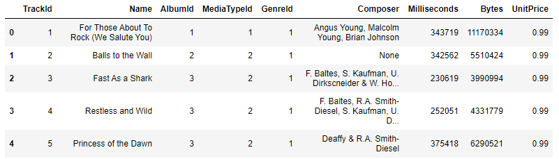
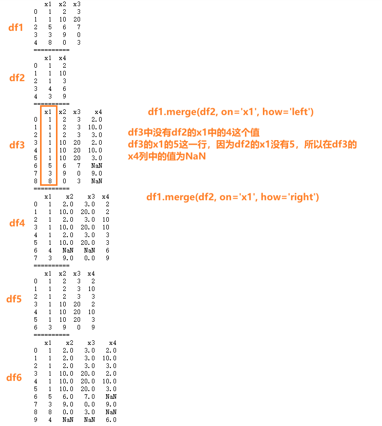
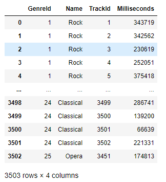
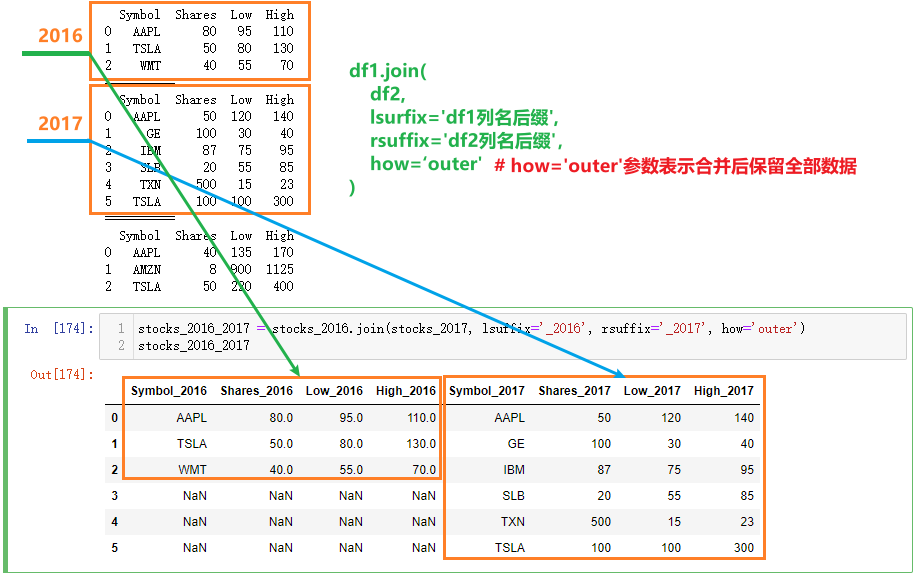
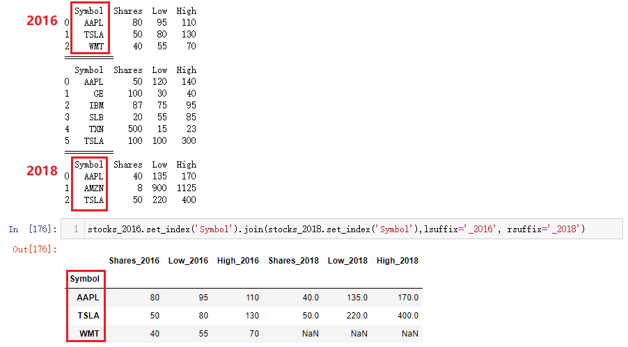
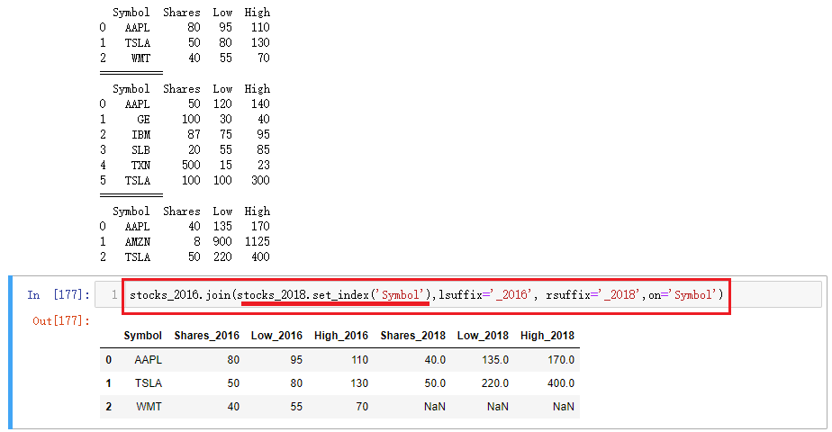

# 数据组合

## 学习目标

- 熟练使用Pandas连接数据
- 熟练使用Pandas合并数据集

## 1 简介

- 在动手进行数据分析工作之前，需要进行数据清理工作，数据清理的主要目标是
  - 每个观测值成一行
  - 每个变量成一列
  - 每种观测单元构成一张表格
- 数据整理好之后，可能需要多张表格组合到一起才能进行某些问题的分析
  - 一张表保存公司名称，另一张表保存股票价格
  - 单个数据集也可能会分割成多个，比如时间序列数据，每个日期可能再一个单独的文件中

## 2 数据连接

- 组合数据的一种方法是使用“连接”（concatenation)
  - 连接是指把某行或某列追加到数据中
  - 数据被分成了多份可以使用连接把数据拼接起来
  - 把计算的结果追加到现有数据集，可以使用连接

### 2.1 添加行

#### 2.1.1 DataFrame纵向连接并重置索引

> `pd.concat([df1, df2, ...])` 多个df纵向连接返回一个新的df

- 加载多份数据，打印并观察

```python
import pandas as pd
df1 = pd.read_csv('data/concat_1.csv')
df2 = pd.read_csv('data/concat_2.csv')
df3 = pd.read_csv('data/concat_3.csv')
print(df1)
print('='*10)
print(df2)
print('='*10)
print(df3)
# 输出结果如下
    A   B   C   D
0  a0  b0  c0  d0
1  a1  b1  c1  d1
2  a2  b2  c2  d2
3  a3  b3  c3  d3
==========
    A   B   C   D
0  a4  b4  c4  d4
1  a5  b5  c5  d5
2  a6  b6  c6  d6
3  a7  b7  c7  d7
==========
     A    B    C    D
0   a8   b8   c8   d8
1   a9   b9   c9   d9
2  a10  b10  c10  d10
3  a11  b11  c11  d11
```

- 使用concat函数将上面3个DataFrame连接起来，此时新的df有可能存在重复的行索引值

```python
row_concat = pd.concat([df1,df2,df3])
print(row_concat)
# 输出结果如下，注意行索引的值
     A    B    C    D
0   a0   b0   c0   d0
1   a1   b1   c1   d1
2   a2   b2   c2   d2
3   a3   b3   c3   d3
0   a4   b4   c4   d4
1   a5   b5   c5   d5
2   a6   b6   c6   d6
3   a7   b7   c7   d7
0   a8   b8   c8   d8
1   a9   b9   c9   d9
2  a10  b10  c10  d10
3  a11  b11  c11  d11
```

- 从上面的结果中可以看到，concat函数把3个DataFrame连接在了一起（纵向简单堆叠），可以通过 iloc ,loc等方法取出连接后的数据的子集

```python
# 获取行索引下标为3的第4行数据
print(row_concat.iloc[3,])
print('='*10)
# 获取行索引值为3的所有行数据
print(row_concat.loc[3,])
# 输出结果如下
A    a3
B    b3
C    c3
D    d3
Name: 3, dtype: object
==========
     A    B    C    D
3   a3   b3   c3   d3
3   a7   b7   c7   d7
3  a11  b11  c11  d11
```

- 此时我们发现有3个行索引值是相同的，使用`df.reset_index(drop=True)`可以重置行索引为默认

```python
#row_concat = row_concat.reset_index()
row_concat = row_concat.reset_index(drop=True)
print(row_concat)
# 输出结果如下
      A    B    C    D
0    a0   b0   c0   d0
1    a1   b1   c1   d1
2    a2   b2   c2   d2
3    a3   b3   c3   d3
4    a4   b4   c4   d4
5    a5   b5   c5   d5
6    a6   b6   c6   d6
7    a7   b7   c7   d7
8    a8   b8   c8   d8
9    a9   b9   c9   d9
10  a10  b10  c10  d10
11  a11  b11  c11  d11
```


#### 2.1.2 DataFrame和Series做数据连接

- 分别准备一个s和一个df

```python
new_series = pd.Series(['n1','n2','n3','n4'])
print(new_series)
df1 = pd.read_csv('data/concat_1.csv')
print(df1)
# 输出结果如下
0    n1
1    n2
2    n3
3    n4
dtype: object
    A   B   C   D
0  a0  b0  c0  d0
1  a1  b1  c1  d1
2  a2  b2  c2  d2
3  a3  b3  c3  d3
```

- 使用concat连接DataFrame和Series

```python
pd.concat([df1,new_series])
# # 输出结果如下
	A	B	C	D	0
0	a0	b0	c0	d0	NaN
1	a1	b1	c1	d1	NaN
2	a2	b2	c2	d2	NaN
3	a3	b3	c3	d3	NaN
0	NaN	NaN	NaN	NaN	n1
1	NaN	NaN	NaN	NaN	n2
2	NaN	NaN	NaN	NaN	n3
3	NaN	NaN	NaN	NaN	n4
```

- **注意**：上面的结果中包含NaN值，NaN是Pandas用于表示“缺失值”的方法，由于Series是列数据，concat方法默认是添加行，由于Series数据没有行索引，所以添加了一个新列，缺失的数据用NaN填充

- 如果想将`['n1','n2','n3','n4']`作为行连接到df1后，可以创建DataFrame并指定列名

```python
# 注意[['n1','n2','n3','n4']] 是两个中括号
new_row_df = pd.DataFrame([['n1','n2','n3','n4']],columns=['A','B','C','D'])
print(new_row_df)
print('='*10)
# 参数ignore_index=True表示不使用原索引，使用默认的从0开始自动递增索引
print(pd.concat([df1,new_row_df], ignore_index=True))
# 输出结果如下
    A   B   C   D
0  n1  n2  n3  n4
==========
    A   B   C   D
0  a0  b0  c0  d0
1  a1  b1  c1  d1
2  a2  b2  c2  d2
3  a3  b3  c3  d3
4  n1  n2  n3  n4
```


#### 2.1.3 `df.append`添加行数据

- `df.append`函数：concat可以连接多个对象，如果只需要向现有DataFrame追加一个对象，可以通过append函数来实现

```python
print(df1)
print('='*10)
print(df2)
print('='*10)
print(df1.append(df2, ignore_index=True))
# 输出结果如下
    A   B   C   D
0  a0  b0  c0  d0
1  a1  b1  c1  d1
2  a2  b2  c2  d2
3  a3  b3  c3  d3
==========
    A   B   C   D
0  a4  b4  c4  d4
1  a5  b5  c5  d5
2  a6  b6  c6  d6
3  a7  b7  c7  d7
==========
    A   B   C   D
0  a0  b0  c0  d0
1  a1  b1  c1  d1
2  a2  b2  c2  d2
3  a3  b3  c3  d3
4  a4  b4  c4  d4
5  a5  b5  c5  d5
6  a6  b6  c6  d6
7  a7  b7  c7  d7
```

- 使用Python字典添加数据行

```python
data_dict = {'A':'n1','B':'n2','C':'n3','D':'n4'}
print(df1)
print('='*10)
print(df1.append(data_dict, ignore_index=True))
# 输出结果如下
    A   B   C   D
0  a0  b0  c0  d0
1  a1  b1  c1  d1
2  a2  b2  c2  d2
3  a3  b3  c3  d3
==========
    A   B   C   D
0  a0  b0  c0  d0
1  a1  b1  c1  d1
2  a2  b2  c2  d2
3  a3  b3  c3  d3
4  n1  n2  n3  n4
```


### 2.2 添加列

#### 2.2.1 df添加列

- 通过`df['列名']=[列值列表]`的方式添加

```python
print(df1)
print('='*10)
new_df = df1
new_df['E'] = ['e0', 'e1', 'e2', 'e3']
print(new_df)
# 输出结果如下
    A   B   C   D
0  a0  b0  c0  d0
1  a1  b1  c1  d1
2  a2  b2  c2  d2
3  a3  b3  c3  d3
==========
    A   B   C   D   E
0  a0  b0  c0  d0  e0
1  a1  b1  c1  d1  e1
2  a2  b2  c2  d2  e2
3  a3  b3  c3  d3  e3
```

- 也可以通过`dataframe['列名'] = Series对象` 这种方式添加一列

```python
new_df['N'] = pd.Series(['n1','n2','n3','n4'])
print(new_df)
# 输出结果如下
    A   B   C   D   E   N
0  a0  b0  c0  d0  e0  n1
1  a1  b1  c1  d1  e1  n2
2  a2  b2  c2  d2  e2  n3
3  a3  b3  c3  d3  e3  n4
```


#### 2.2.2 多个df横向连接

- 使用concat函数添加列，与添加行的方法类似，需要多传一个`axis=1`的参数

```python
print(df1)
print('='*10)
print(df2)
print('='*10)
print(df3)
print('='*10)
col_concat = pd.concat([df1,df2,df3], axis=1)
print(col_concat)
# 输出结果如下
    A   B   C   D
0  a0  b0  c0  d0
1  a1  b1  c1  d1
2  a2  b2  c2  d2
3  a3  b3  c3  d3
==========
    A   B   C   D
0  a4  b4  c4  d4
1  a5  b5  c5  d5
2  a6  b6  c6  d6
3  a7  b7  c7  d7
==========
     A    B    C    D
0   a8   b8   c8   d8
1   a9   b9   c9   d9
2  a10  b10  c10  d10
3  a11  b11  c11  d11
==========
    A   B   C   D   A   B   C   D    A    B    C    D
0  a0  b0  c0  d0  a4  b4  c4  d4   a8   b8   c8   d8
1  a1  b1  c1  d1  a5  b5  c5  d5   a9   b9   c9   d9
2  a2  b2  c2  d2  a6  b6  c6  d6  a10  b10  c10  d10
3  a3  b3  c3  d3  a7  b7  c7  d7  a11  b11  c11  d11
```

- 新的df即可通过列名获取子集

```python
print(col_concat['A'])
# 输出结果如下
    A   A    A
0  a0  a4   a8
1  a1  a5   a9
2  a2  a6  a10
3  a3  a7  a11
```

#### 2.2.3 列索引重置

> 按列合并数据之后，可以重置列索引，获得有序索引

```python
col_concat = pd.concat([df1,df2,df3], axis=1)
print(col_concat)
print('='*10)
# 参数axis='columns'表示对列进行设置
# 参数ignore_index=True表示索引值为默认的从0开始的自增
print(pd.concat([df1,df2,df3], axis='columns', ignore_index=True))
# 输出结果如下
    A   B   C   D   E   N   A   B   C   D    A    B    C    D
0  a0  b0  c0  d0  e0  n1  a4  b4  c4  d4   a8   b8   c8   d8
1  a1  b1  c1  d1  e1  n2  a5  b5  c5  d5   a9   b9   c9   d9
2  a2  b2  c2  d2  e2  n3  a6  b6  c6  d6  a10  b10  c10  d10
3  a3  b3  c3  d3  e3  n4  a7  b7  c7  d7  a11  b11  c11  d11
==========
   0   1   2   3   4   5   6   7   8   9    10   11   12   13
0  a0  b0  c0  d0  e0  n1  a4  b4  c4  d4   a8   b8   c8   d8
1  a1  b1  c1  d1  e1  n2  a5  b5  c5  d5   a9   b9   c9   d9
2  a2  b2  c2  d2  e2  n3  a6  b6  c6  d6  a10  b10  c10  d10
3  a3  b3  c3  d3  e3  n4  a7  b7  c7  d7  a11  b11  c11  d11
```


### 2.3 concat连接具有不同行列索引的数据

#### 2.3.1 纵向连接-连接具有不同列索引的数据

- 重新加载数据

```python
df1 = pd.read_csv('data/concat_1.csv')
df2 = pd.read_csv('data/concat_2.csv')
df3 = pd.read_csv('data/concat_3.csv')
print(df1)
print('='*10)
print(df2)
print('='*10)
print(df3)
# 输出结果如下
    A   B   C   D
0  a0  b0  c0  d0
1  a1  b1  c1  d1
2  a2  b2  c2  d2
3  a3  b3  c3  d3
==========
    A   B   C   D
0  a4  b4  c4  d4
1  a5  b5  c5  d5
2  a6  b6  c6  d6
3  a7  b7  c7  d7
==========
     A    B    C    D
0   a8   b8   c8   d8
1   a9   b9   c9   d9
2  a10  b10  c10  d10
3  a11  b11  c11  d11
```

- 将上面的数据集做调整，修改列名

```python
df1.columns = ['A','B','C','D']
df2.columns = ['E','F','G','H']
df3.columns = ['A','C','F','H']
print(df1)
print('='*10)
print(df2)
print('='*10)
print(df3)
# 输出结果如下
    A   B   C   D
0  a0  b0  c0  d0
1  a1  b1  c1  d1
2  a2  b2  c2  d2
3  a3  b3  c3  d3
==========
    E   F   G   H
0  a4  b4  c4  d4
1  a5  b5  c5  d5
2  a6  b6  c6  d6
3  a7  b7  c7  d7
==========
     A    C    F    H
0   a8   b8   c8   d8
1   a9   b9   c9   d9
2  a10  b10  c10  d10
3  a11  b11  c11  d11
```

- 此时使用concat直接连接，数据会堆叠在一起，列名相同的数据会合并到一列，合并后不存在的数据会用NaN填充

```python
row_concat = pd.concat([df1,df2,df3])
print(row_concat)
# 输出结果如下
     A    B    C    D    E    F    G    H
0   a0   b0   c0   d0  NaN  NaN  NaN  NaN
1   a1   b1   c1   d1  NaN  NaN  NaN  NaN
2   a2   b2   c2   d2  NaN  NaN  NaN  NaN
3   a3   b3   c3   d3  NaN  NaN  NaN  NaN
0  NaN  NaN  NaN  NaN   a4   b4   c4   d4
1  NaN  NaN  NaN  NaN   a5   b5   c5   d5
2  NaN  NaN  NaN  NaN   a6   b6   c6   d6
3  NaN  NaN  NaN  NaN   a7   b7   c7   d7
0   a8  NaN   b8  NaN  NaN   c8  NaN   d8
1   a9  NaN   b9  NaN  NaN   c9  NaN   d9
2  a10  NaN  b10  NaN  NaN  c10  NaN  d10
3  a11  NaN  b11  NaN  NaN  c11  NaN  d11
```

- 如果在连接的时候只想保留所有数据集中都有的数据，可以使用join参数，默认是'outer'，保留所有数据，如果将join参数的值设置为'inner' ，只保留数据中的共有部分

```python
print(pd.concat([df1,df2,df3],join='inner')) # 三者没有共有的列，所以返回空df
print('='*10)
print(pd.concat([df1,df3],join='inner'))
# 返回结果如下
Empty DataFrame
Columns: []
Index: [0, 1, 2, 3, 0, 1, 2, 3, 0, 1, 2, 3]
==========
     A    C
0   a0   c0
1   a1   c1
2   a2   c2
3   a3   c3
0   a8   b8
1   a9   b9
2  a10  b10
3  a11  b11
```


#### 2.3.2 横向连接-连接具有不同行索引的数据

- 重新加载数据

```python
df1 = pd.read_csv('data/concat_1.csv')
df2 = pd.read_csv('data/concat_2.csv')
df3 = pd.read_csv('data/concat_3.csv')
print(df1)
print('='*10)
print(df2)
print('='*10)
print(df3)
# 输出结果如下
    A   B   C   D
0  a0  b0  c0  d0
1  a1  b1  c1  d1
2  a2  b2  c2  d2
3  a3  b3  c3  d3
==========
    A   B   C   D
0  a4  b4  c4  d4
1  a5  b5  c5  d5
2  a6  b6  c6  d6
3  a7  b7  c7  d7
==========
     A    B    C    D
0   a8   b8   c8   d8
1   a9   b9   c9   d9
2  a10  b10  c10  d10
3  a11  b11  c11  d11
```

- 修改行索引的值

```python
df1.index = [0,1,2,3]
df2.index = [4,5,6,7]
df3.index = [0,2,5,7]
print(df1)
print('='*10)
print(df2)
print('='*10)
print(df3)
# 返回结果如下
    A   B   C   D
0  a0  b0  c0  d0
1  a1  b1  c1  d1
2  a2  b2  c2  d2
3  a3  b3  c3  d3
==========
    A   B   C   D
4  a4  b4  c4  d4
5  a5  b5  c5  d5
6  a6  b6  c6  d6
7  a7  b7  c7  d7
==========
     A    B    C    D
0   a8   b8   c8   d8
2   a9   b9   c9   d9
5  a10  b10  c10  d10
7  a11  b11  c11  d11
```

- `pd.concat`函数传入参数`axis='columns'` ，横向连接按列添加，并匹配各自行索引，缺失值用NaN表示

```python
col_concat = pd.concat([df1,df2,df3], axis='columns')
print(col_concat)
# 返回结果如下
     A    B    C    D    A    B    C    D    A    B    C    D
0   a0   b0   c0   d0  NaN  NaN  NaN  NaN   a8   b8   c8   d8
1   a1   b1   c1   d1  NaN  NaN  NaN  NaN  NaN  NaN  NaN  NaN
2   a2   b2   c2   d2  NaN  NaN  NaN  NaN   a9   b9   c9   d9
3   a3   b3   c3   d3  NaN  NaN  NaN  NaN  NaN  NaN  NaN  NaN
4  NaN  NaN  NaN  NaN   a4   b4   c4   d4  NaN  NaN  NaN  NaN
5  NaN  NaN  NaN  NaN   a5   b5   c5   d5  a10  b10  c10  d10
6  NaN  NaN  NaN  NaN   a6   b6   c6   d6  NaN  NaN  NaN  NaN
7  NaN  NaN  NaN  NaN   a7   b7   c7   d7  a11  b11  c11  d11
```

- 使用`join='inner'`参数，只保留索引匹配的结果

```python
print(pd.concat([df1,df3], axis=1, join='inner'))
# 输出结果如下
    A   B   C   D   A   B   C   D
0  a0  b0  c0  d0  a8  b8  c8  d8
2  a2  b2  c2  d2  a9  b9  c9  d9
```


## 3 多个数据集合并

> - 在使用concat连接数据时，涉及到了参数join，比如`join='inner'`，`join='outer'`
> - 数据库中，比如mysql，也有join操作，可以依据共有数据把两个或者多个数据表组合起来
> - Pandas的DataFrame 也可以实现类似数据库的join操作
> - Pandas可以通过pd.join命令组合数据，也可以通过pd.merge命令组合数据，二者区别：
>   - merge更灵活
>   - 如果想依据行索引来合并DataFrame可以考虑使用join函数

### 3.1 加载数据

> sqlite是一个微型的、本地的数据库，不必像mysql需要额外启动运行，依靠其特殊的文件，用来存储数据，并提供和数据文件交互的方法；或者称sqlite为本地数据文件系统更为贴切
>
> 这一章节就以sqlite数据文件为例，来学习pandas如何合并多个数据集

- 加载数据并查看

```python
# 部分版本的anaconda没有sqlalchemy模块，需要额外单独安装：pip install sqlalchemy
from sqlalchemy import create_engine
# 创建数据库连接对象，并指定数据文件路径
engine = create_engine('sqlite:///data/chinook.db')
# 创建操作具体数据表的对象
tracks = pd.read_sql_table('tracks', engine)
# 查看前5个数据
tracks.head()
```



- read_sql_table函数可以从数据库中读取表，第一个参数是表名，第二个参数是数据库连接对象

```python
genres = pd.read_sql_table('genres', engine)
print(genres)
# 输出结果如下
    GenreId                Name
0         1                Rock
1         2                Jazz
2         3               Metal
3         4  Alternative & Punk
4         5       Rock And Roll
5         6               Blues
6         7               Latin
7         8              Reggae
8         9                 Pop
9        10          Soundtrack
10       11          Bossa Nova
11       12      Easy Listening
12       13         Heavy Metal
13       14            R&B/Soul
14       15   Electronica/Dance
15       16               World
16       17         Hip Hop/Rap
17       18     Science Fiction
18       19            TV Shows
19       20    Sci Fi & Fantasy
20       21               Drama
21       22              Comedy
22       23         Alternative
23       24           Classical
24       25               Opera
```

- 为了学习pandas中的merge与join，此时我们不用理会两个表的业务上的意义；只需要观察到两个表中都有相同的`GenreId`字段，此时`genres`表对`tracks`表的关系为一对多；为了学习，所以我们先来构造一个新的df对象(表)，起名为`tracks_subset`，使genres对tracks_subset的关系为一对一

```python
# 从df对象tracks中抽取部分数据，返回新的df对象tracks_subset，新df中GenreId列的值都是唯一的: 按字段分组，然后取组内第一个数据
tracks_subset = tracks.drop_duplicates(['GenreId'])
tracks_subset.head()
# 输出结果如下图
```


- 此时，基于`GenreId`列的值，genres对tracks_subset两个df对象的关系为一对一


### 3.2 df.merge一对一合并

- 基于GenreId列合并genres和tracks_subset

```python
genre_track = genres.merge(tracks_subset[['TrackId', 'GenreId', 'Milliseconds']], on='GenreId', how='left')   
print(genre_track.head())
# 输出结果如下
   GenreId                Name  TrackId  Milliseconds
0        1                Rock        1        343719
1        2                Jazz       63        185338
2        3               Metal       77        221701
3        4  Alternative & Punk       99        255529
4        5       Rock And Roll      111        147591
```

- 函数说明

```python
df1.merge(df2[['列名1', '列名2', ...]], on='列名', how='固定值')
# 也可以写为 pd.merge(df1, df2, on=, how=)
# df1合并指定列的df2
# 参数on='列名'，表示基于那一列进行合并操作
# 参数how='固定值'，表示合并后如何处理行索引，固定参数具体如下：
#- how=’left‘ 对应SQL中的left outer，保留左侧表df1中的所有数据
#- how=’right‘ 对应SQL中的right outer，保留右侧表df2中的所有数据
#- how='outer' 对应SQL中的full outer，保留左右两侧侧表df1和df2中的所有数据
#- how='inner' 对应SQL中的inner，只保留左右两侧df1和df2都有的数据
# 注意：本例中并不能体现how参数的作用
```

- df.merge中的how参数示例

```python
import pandas as pd
df1 = pd.DataFrame([[1,2,3],[1,10,20],[5,6,7],[3,9,0],[8,0,3]],columns=['x1','x2','x3'])
df2 = pd.DataFrame([[1,2],[1,10],[1,3],[4,6],[3,9]],columns=['x1','x4'])
print (df1)
print('='*10)
print (df2)
print('='*10)
df3 = pd.merge(df1,df2,how='left',on='x1')
print (df3)
print('='*10)
df4 = pd.merge(df1,df2,how='right',on='x1')
print (df4)
print('='*10)
df5 = pd.merge(df1,df2,how='inner',on='x1')
print (df5)
print('='*10)
df6 = pd.merge(df1,df2,how='outer',on='x1')
print (df6)
# 输出结果如下图
```




### 3.2 df.merge一对多合并

#### 3.2.1 示例1

- genres与tracks基于GenreId合并

```python
genre_track = genres.merge(tracks[['TrackId','GenreId', 'Milliseconds']], on='GenreId', how='left')                           
genre_track
```




- 基于合并后的df数据集，就可以计算每种类型音乐的平均时长

  1. 基于Name字段做分组，分组后，在每组内对Milliseconds字段的所有值计算平均值，返回一个Series对象

     ```python
     genre_time_s = genre_track.groupby('Name')['Milliseconds'].mean()
     print(genre_time.head())
     # 输出结果如下
     Name
     Alternative           264058.525000
     Alternative & Punk    234353.849398
     Blues                 270359.777778
     Bossa Nova            219590.000000
     Classical             293867.567568
     Name: Milliseconds, dtype: float64
     ```

  2. 将名为genre_time的Series对象中的值，转换为时间，单位为ms，依旧返回一个Series对象

     ```python
     ret = pd.to_timedelta(genre_time, unit='ms')
     print(ret.head())
     # 输出结果如下
     Name
     Alternative             0 days 00:04:24.058525
     Alternative & Punk   0 days 00:03:54.353849398
     Blues                0 days 00:04:30.359777778
     Bossa Nova              0 days 00:03:39.590000
     Classical            0 days 00:04:53.867567568
     Name: Milliseconds, dtype: timedelta64[ns]
     ```

  3. 继续对该Series对象中的时间值进行截取操作，截取到秒

     ```python
     # Series对象.dt.floor('时间单位缩写') 对时间类型数据，按指定单位截断数据
     ret = ret.dt.floor('s')
     print(ret.head())
     # 输出结果如下
     Name
     Alternative          0 days 00:04:24
     Alternative & Punk   0 days 00:03:54
     Blues                0 days 00:04:30
     Bossa Nova           0 days 00:03:39
     Classical            0 days 00:04:53
     Name: Milliseconds, dtype: timedelta64[ns]
     ```

  4. 对该Series对象中的值进行排序，由小到大

     ```python
     ret = ret.sort_values()
     print(ret.head())
     # 输出结果如下
     Name
     Rock And Roll    0 days 00:02:14
     Opera            0 days 00:02:54
     Hip Hop/Rap      0 days 00:02:58
     Easy Listening   0 days 00:03:09
     Bossa Nova       0 days 00:03:39
     Name: Milliseconds, dtype: timedelta64[ns]
     ```

  5. 上述2-4步骤，可以合并操作，结果一致

     ```python
     ret = pd.to_timedelta(genre_time, unit='ms').dt.floor('s').sort_values()
     print(ret.head())
     print(ret['Rock'])
     # 输出结果如下
     Name
     Rock And Roll    0 days 00:02:14
     Opera            0 days 00:02:54
     Hip Hop/Rap      0 days 00:02:58
     Easy Listening   0 days 00:03:09
     Bossa Nova       0 days 00:03:39
     Name: Milliseconds, dtype: timedelta64[ns]
     0 days 00:04:43
     ```


#### 3.2.2 示例2

> 计算每名用户的消费总额

- 从三张表中获取数据：
  - 用户表获取用户id, 姓名
  - 发票表，获取发表id，用户id
  - 发票详情表，获取发票id,单价，数量

```python
# 从customers表中取出 用户id、姓、名，3列数据
cust = pd.read_sql_table('customers', engine, columns=['CustomerId', 'FirstName', 'LastName'])
print(cust.head(3))
print('='*10)
# 从invoices表中取出 发票id、用户id，2列数据 
invoice = pd.read_sql_table('invoices', engine, columns=['InvoiceId','CustomerId'])
print(invoice.head(3))
print('='*10)
# 从invoice_items表中取出 发票id、单价、数量，3列数据 
ii = pd.read_sql_table('invoice_items',engine,columns=['InvoiceId', 'UnitPrice', 'Quantity'])
print(ii.head(3))
# 输出结果如下
   CustomerId FirstName   LastName
0           1      Luís  Gonçalves
1           2    Leonie     Köhler
2           3  François   Tremblay
==========
   InvoiceId  CustomerId
0         98           1
1        121           1
2        143           1
==========
   InvoiceId  UnitPrice  Quantity
0          1       0.99         1
1          1       0.99         1
2          2       0.99         1
```

- 合并表：
  - 根据用户Id('CustomerId')合并用户表和发票表
  - 根据发票Id ('InvoiceId')合并发票和发票详情表

```python
cust_inv = cust.merge(invoice, on='CustomerId').merge(ii, on='InvoiceId')
print(cust_inv.head())
# 输出结果如下
   CustomerId FirstName   LastName  InvoiceId  UnitPrice  Quantity
0           1      Luís  Gonçalves         98       1.99         1
1           1      Luís  Gonçalves         98       1.99         1
2           1      Luís  Gonçalves        121       0.99         1
3           1      Luís  Gonçalves        121       0.99         1
4           1      Luís  Gonçalves        121       0.99         1
```

- 计算用户每笔消费的总金额

```python
# 总金额 = 数量 * 单价；两个series相乘
total = cust_inv['Quantity'] * cust_inv['UnitPrice']
# 合并表添加列，并指定值
cust_inv['Total'] = total
# 也可以使用DataFrame的assign方法 创建新列
# cust_inv = cust_inv.assign(Total = total)
print(cust_inv.head())
# 返回结果如下
   CustomerId FirstName   LastName  InvoiceId  UnitPrice  Quantity  Total
0           1      Luís  Gonçalves         98       1.99         1   1.99
1           1      Luís  Gonçalves         98       1.99         1   1.99
2           1      Luís  Gonçalves        121       0.99         1   0.99
3           1      Luís  Gonçalves        121       0.99         1   0.99
4           1      Luís  Gonçalves        121       0.99         1   0.99
```

- 计算每一个用户的总消费金额，由大到小排列

```python
# 按照【用户Id、姓、名】分组，分组后对总金额求和，并排序
# 设定分组列表
cols = ['CustomerId', 'FirstName', 'LastName']
# cust_inv.分组([列名构成的列表])[指定字段].求和().按值排序(由大到小倒序).head(5)
cust_inv.groupby(cols)['Total'].sum().sort_values(ascending=False).head()
# 返回结果如下
CustomerId  FirstName  LastName  
6           Helena     Holý          49.62
26          Richard    Cunningham    47.62
57          Luis       Rojas         46.62
46          Hugh       O'Reilly      45.62
45          Ladislav   Kovács        45.62
Name: Total, dtype: float64
```


### 3.3 join合并

使用join合并，可以是依据两个DataFrame的行索引，或者一个DataFrame的行索引另一个DataFrame的列索引进行数据合并

- 加载数据

```python
stocks_2016 = pd.read_csv('data/stocks_2016.csv')
stocks_2017 = pd.read_csv('data/stocks_2017.csv')
stocks_2018 = pd.read_csv('data/stocks_2018.csv')
print(stocks_2016)
print('='*10)
print(stocks_2017)
print('='*10)
print(stocks_2018)
# 返回结果如下
  Symbol  Shares  Low  High
0   AAPL      80   95   110
1   TSLA      50   80   130
2    WMT      40   55    70
==========
  Symbol  Shares  Low  High
0   AAPL      50  120   140
1     GE     100   30    40
2    IBM      87   75    95
3    SLB      20   55    85
4    TXN     500   15    23
5   TSLA     100  100   300
==========
  Symbol  Shares  Low  High
0   AAPL      40  135   170
1   AMZN       8  900  1125
2   TSLA      50  220   400
```

- join合并，依据两个DataFrame的行索引，如果合并的两个数据有相同的列名，需要通过lsuffix，和rsuffix，指定合并后的列名的后缀，how参数与merge用法一致

```python
stocks_2016_2017 = stocks_2016.join(stocks_2017, lsuffix='_2016', rsuffix='_2017', how='outer')
stocks_2016_2017
# 输出结果如下图
```




- 将两个DataFrame的Symbol设置为行索引，再次join数据

```python
stocks_2016.set_index('Symbol').join(stocks_2018.set_index('Symbol'),lsuffix='_2016', rsuffix='_2018')
```




- 将一个DataFrame的Symbol列设置为行索引，与另一个DataFrame的Symbol列进行join

```python
stocks_2016.join(stocks_2018.set_index('Symbol'),lsuffix='_2016', rsuffix='_2018',on='Symbol')
```




## 小结

**concat, join, 和merge的区别**

>`concat`：
>
>- Pandas函数
>- 可以垂直和水平地连接两个或多个pandas对象
>- 只用索引对齐
>- 默认是外连接（也可以设为内连接）
>
>`join`：
>
>- DataFrame方法
>- 只能水平连接两个或多个pandas对象
>- 对齐是靠被调用的DataFrame的列索引或行索引和另一个对象的行索引（不能是列索引）
>- 默认是左连接（也可以设为内连接、外连接和右连接）
>
>`merge`：
>
>- DataFrame方法
>- 只能水平连接两个DataFrame对象
>- 对齐是靠被调用的DataFrame的列或行索引和另一个DataFrame的列或行索引
>- 默认是内连接（也可以设为左连接、外连接、右连接）

