# 缺失数据处理

## 学习目标

- 知道什么是缺失值，为什么会产生缺失值
- 熟练掌握缺失值处理的方式


## 1 NaN简介

> 好多数据集都含缺失数据。缺失数据有多重表现形式
>
> - 数据库中，缺失数据表示为`NULL`
> - 在某些编程语言中用`NA`或`None`表示
> - 缺失值也可能是空字符串`''`或数值 `0`
> - 在Pandas中使用`NaN`表示缺失值
>   - Pandas中的NaN值来自NumPy库，NumPy中缺失值有几种表示形式：NaN，NAN，nan，他们都一样

- 缺失值和其它类型的数据不同，它毫无意义，NaN不等于0，也不等于空字符串
```python
from numpy import NaN,NAN,nan
print(NaN==True)
print(NaN==False)
print(NaN==0)
print(NaN=='')
print(NaN==None)
# 输出结果如下
False
False
False
False
False
```

- 两个NaN也不相等

```python
print(NaN==NaN)
print(NaN==nan)
print(NaN==NAN)
print(nan==NAN)
# 输出结果如下
False
False
False
False
```

- Pandas提供了`isnull/isna`方法，用于测试某个值是否为缺失值

```python
import pandas as pd
print(pd.isnull(NaN))
print(pd.isnull(nan))
print(pd.isnull(NAN))
# 输出结果如下
True
True
True
```

- Pandas的`notnull/notna`方法也可以用于判断某个值是否为缺失值

```python
print(pd.notnull(NaN))
print(pd.notnull(42))
# 输出结果如下
False
True
```


- 缺失值从何而来呢？缺失值的来源有两个：
  - 原始数据包含缺失值
  - 数据整理过程中产生缺失值


## 2 加载包含缺失的数据

> 加载数据时可以通过`keep_default_na` 与 `na_values` 指定加载数据时的缺失值

- 加载数据，观察缺失值默认的显示情况

```python
print(pd.read_csv('data/survey_visited.csv'))
# 输出结果如下
   ident   site       dated
0    619   DR-1  1927-02-08
1    622   DR-1  1927-02-10
2    734   DR-3  1939-01-07
3    735   DR-3  1930-01-12
4    751   DR-3  1930-02-26
5    752   DR-3         NaN
6    837  MSK-4  1932-01-14
7    844   DR-1  1932-03-22
```

- 使用`keep_default_na=False`参数加载数据，不显示默认缺失值

```python
print(pd.read_csv('data/survey_visited.csv', keep_default_na=False))
# 输出结果如下
   ident   site       dated
0    619   DR-1  1927-02-08
1    622   DR-1  1927-02-10
2    734   DR-3  1939-01-07
3    735   DR-3  1930-01-12
4    751   DR-3  1930-02-26
5    752   DR-3            
6    837  MSK-4  1932-01-14
7    844   DR-1  1932-03-22
```

- 使用`na_values`参数加载数据，通过该参数指定我们认为的缺失值

```python
# 在这里我们通过na_values参数，指鹿为马
print(pd.read_csv('data/survey_visited.csv', na_values=["1927-02-08"], keep_default_na=False))
# 输出结果如下
   ident   site       dated
0    619   DR-1         NaN
1    622   DR-1  1927-02-10
2    734   DR-3  1939-01-07
3    735   DR-3  1930-01-12
4    751   DR-3  1930-02-26
5    752   DR-3            
6    837  MSK-4  1932-01-14
7    844   DR-1  1932-03-22
```

- 在做数据合并的时候，比如`merge`、`join`等操作时，也会产生缺失值，参数用法一致，这里不再累述


## 3 处理缺失值


### 3.1 加载数据并初步查看缺失值情况

> 此数据为泰坦尼克生存预测数据，Survived字段，代表该名乘客是否获救

#### 3.1.1 加载数据集

- 数据集字段说明

```python
train=pd.read_csv('data/titanic_train.csv')
print(train.shape)
train.head()
# 输出结果如下图
```

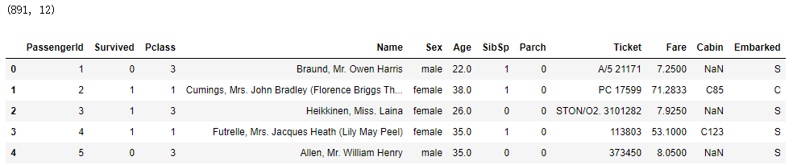

- 字段说明
  - PassengerId：乘客的ID
  - Survived：乘客是否获救，0=没获救，1=已获救
  - Pclass：乘客船舱等级（1/2/3三个等级舱位）
  - Name：乘客姓名
  - Sex：性别
  - Age：年龄
  - SibSp：乘客在船上的兄弟姐妹/配偶数量
  - Parch：乘客在船上的父母/孩子数量
  - Ticket：船票号
  - Fare：船票价
  - Cabin：客舱号码
  - Embarked：登船的港口


- 比如此时我们想查看泰坦尼克号上获救与否的人数统计

```python
# 对Survived列的值的数量分别求和
train['Survived'].value_counts()
# 输出结果如下
0    549
1    342
Name: Survived, dtype: int64
```

#### 3.1.2 构造缺失值统计函数

手写通用的缺失值统计函数

```python
# 构造一个函数，传入dataframe，返回计算每一列数据缺失值数量和比例的df
def missing_values_table(df):
        # 计算所有列的缺失值，返回每一列缺失值数量构成的series
        mis_val = df.isnull().sum()
        
        # 计算所有列缺失值比例，返回每一列缺失值数量占比的series
        mis_val_percent = df.isnull().sum() / len(df) * 100
        
        # 将结果拼接成dataframe
        mis_val_table = pd.concat([mis_val, mis_val_percent], axis=1)
        
        # 将列重命名
        mis_val_table_ren_columns = mis_val_table.rename(
            columns={0 :'缺失值', 1:'占比（%'}
        )
        
        # 排除缺失值为0的数据
        # df的缺失值列（第1列）的值不为0
        mis_val_table_ren_columns = mis_val_table_ren_columns[mis_val_table_ren_columns.iloc[:,0] != 0]
        
        # 按照缺失值降序排列
        mis_val_table_ren_columns = mis_val_table_ren_columns.sort_values('缺失值', ascending=False)
        
        # 打印信息
        print_info = '传入的数据集中共有{}列。\n其中{}列含有缺失值。'.format(
            df.shape[1],
            mis_val_table_ren_columns.shape[0]
        )
        print(print_info)
        
        # 返回缺失值信息的dataframe
        return mis_val_table_ren_columns
```

#### 3.1.3 查看数据集中的缺失值情况

```python
train_missing = missing_values_table(train)
train_missing
# 输出结果如下图
```

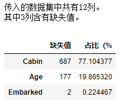


### 3.2 使用Missingno库对缺失值的情况进行可视化探查

> 我们可以使用Missingno来对缺失值进行可视化

#### 3.2.1 安装missingno并初步查看

1. 完全关闭`jupyter notebook`

2. 重新打开anaconda提供的终端中，通过pip安装missingno

```shell
pip install missingno
```

3. 安装成功后重新打开`jupyter notebook`，并运行全部代码

#### 3.2.2 缺失值数量可视化

- 导包并利用`missingno.bar(df)`函数查看数据集数据完整性

```python
import missingno as msno
msno.bar(train)
```

- 此时运行结果如下图

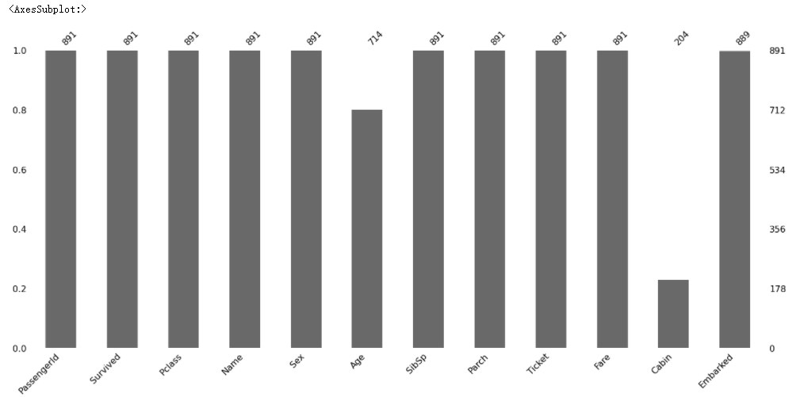

- 看图说话：
  - 在图的下测是列名，可以看到“年龄”，“客舱号码”和“登船的港口”列包含值缺失
  - 左侧数值为百分比，右侧数值为具体数字，上方数字位非缺失值的数量


#### 3.2.3 缺失值位置的可视化

- `missingno.matrix` 函数 提供了快速直观的查看缺失值的分布情况

```python
msno.matrix(train)
# 输出结果如下图
```

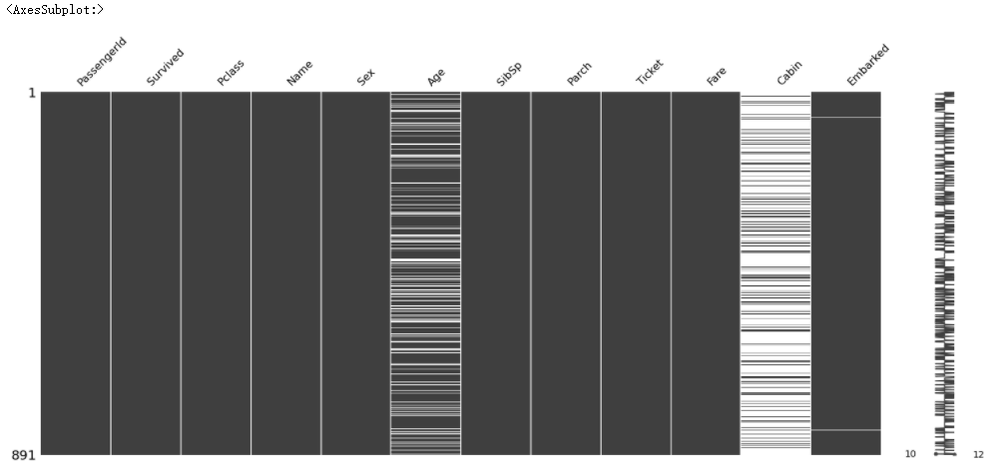

- 看图说话：
  - 在有缺失值的地方，图都显示为空白。 例如，在“ Embarked”列中，只有两个丢失数据的实例，因此有两个白线。
  - 右侧的迷你图给出了数据完整性的情况，并在底部指出了最少有10列数据是完整的，最多有12列数据是完整的

- 对数据集进行随机取样后再查看数据缺失情况

```python
# df.sample(n) # 随机取出n行数据，返回新的df
msno.matrix(train.sample(100))
# 输出结果如下图
```

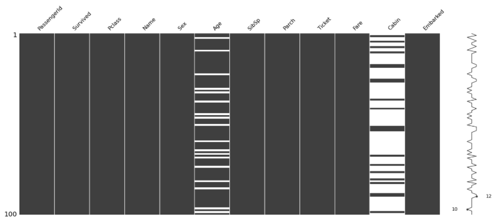


#### 3.2.4 缺失值之间相关性

- 查看缺失值之间是否具有相关性

```python
msno.heatmap(train)
# 输出结果如下图
```

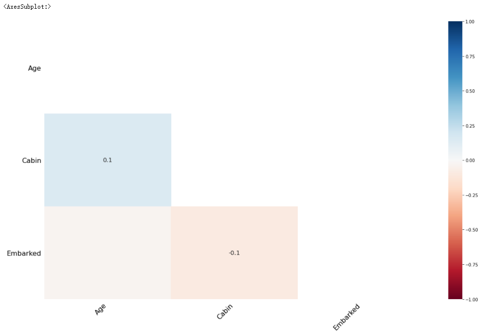

- 看图说话：
  - 相关性取值 0 不相关，1强相关，-1强负相关
  - 通过上图发现，age 和 cabin的相关性为0.1，所以相关性不强，也就是说，age是否缺失，与Cabin是否缺失没多大关系

- 进一步按age进行排序，再图形化展示缺失值情况，以验证age的缺失与cabin确实无关

```python
sorted = train.sort_values('Age')
msno.matrix(sorted)
# 输出结果如下图
```

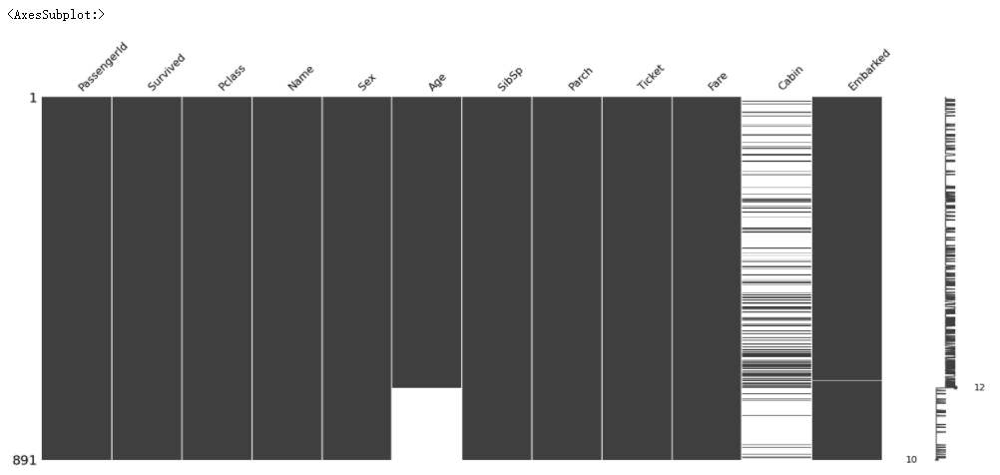


### 3.3 缺失值处理

#### 3.3.1 删除缺失值

> 删除缺失值：删除缺失值会损失信息，并不推荐删除，当缺失数据占比较低的时候，可以尝试使用删除缺失值

- 按行删除：删除指定列为缺失值的行记录

```python
# 复制一份数据
train_1 = train.copy() 
# 对Age列进行处理，空值就删除整行数据
train_1.dropna(subset=['Age'], how='any', inplace=True)
# 输出Age列缺失值的总数
print(train_1['Age'].isnull().sum())
# 图形化缺失值情况
msno.matrix(train_1)
# 输出结果如下图
```

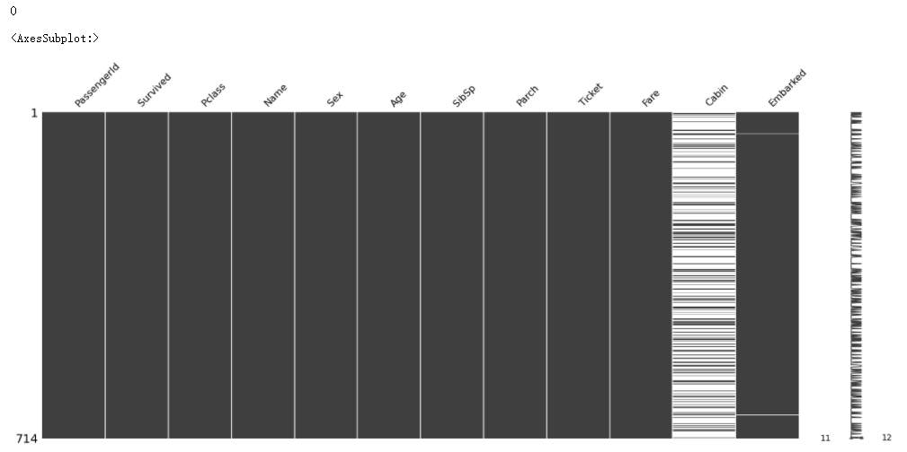

- df.dropna函数的其他用法：注意df.dropna只能处理NaN，不能处理空字符串

```python
# 函数用法
df.dropna(axis=0, how='any', thresh=10, subset=['列名',...], inplace=True, thresh=n)
# 参数解释
#可选参数subset，不与thresh参数一起使用
接收一个列表，列表中的元素为列名: 对特定的列进行缺失值删除处理
    
#可选参数thresh=n
参数值为int类型，按行去除NaN值，去除NaN值后该行剩余数值的数量（列数）大于等于n，便保留这一行

#可选参数 axis=0
0, or 'index'：删除包含丢失值的行
1, or 'columns'：删除包含丢失值的列
默认为0

#可选参数 how='any'，与inplace=True参数一起使用
'any': 如果存在NA值，则删除该行或列
'all': 如果所有值都是NA，则删除该行或列
默认为'any'
#可选参数inplace=False
默认False，不执行how参数的作用
inplce=True，使how参数的作用生效
```

- 按列删除：当一列包含了很多缺失值的时候（比如超过80%），可以使用`df.drop(['列名',..], axis=1)`函数将指定列删除，但最好不要删除数据

```python
msno.matrix(train_1.drop(['Age'], axis=1))
# 输出结果如下图
```

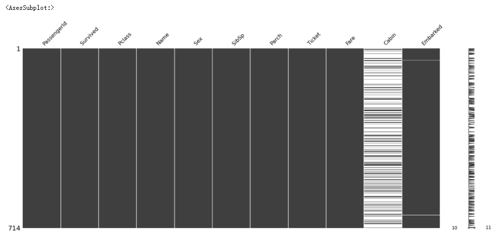


#### 3.3.2 填充缺失值

> 填充缺失值（非时间序列数据）：填充缺失值是指用一个估算的值来去替代缺失数

- 使用常量来替换（默认值）

```python
# 复制一个df
train_constant = train.copy()
# 将空值都填为0，inplace=True为必要参数
train_constant.fillna(0, inplace=True)
# 计算各列空值总数
print(train_constant.isnull().sum())
print('='*10)
#查看Cabin列值为0的总数
print(train_constant[train_constant['Cabin']==0].shape[0])
# 输出结果如下
PassengerId    0
Survived       0
Pclass         0
Name           0
Sex            0
Age            0
SibSp          0
Parch          0
Ticket         0
Fare           0
Cabin          0
Embarked       0
dtype: int64
==========
687
```

- 使用统计量替换（缺失值所处列的平均值、中位数、众数）

```python
# 复制一个df
train_mean = train.copy()
# 对Age列的空值，用mean平均值来填充
train_mean['Age'].fillna(train_mean['Age'].mean(), inplace=True)
# 计算各列空值总数
print(train_constant.isnull().sum())
# 输出结果如下
PassengerId      0
Survived         0
Pclass           0
Name             0
Sex              0
Age              0
SibSp            0
Parch            0
Ticket           0
Fare             0
Cabin          687
Embarked         2
dtype: int64
```


#### 3.3.3 时序数据缺失值处理

- **时序数据在某一列值的变化往往有一定线性规律**，绝大多数的时序数据，具体的列值随着时间的变化而变化，所以对于有时序的行数据缺失值处理有三种方式：
  - 用时间序列中空值的上一个非空值填充
  - 用时间序列中空值的下一个非空值填充
  - 线性插值方法

- 加载样例时序数据集，该数据集为印度城市空气质量数据（2015-2020）

```python
city_day = pd.read_csv('data/city_day.csv',parse_dates=True,index_col='Date')
city_day_2 = city_day.copy()
msno.matrix(city_day_2)
# 输出结果如下图所示
```


- 用之前封装的方法（本章3.1.2小节），查看数据缺失情况

```python
city_day2_missing = missing_values_table(city_day_2)
city_day2_missing
# 输出结果如下图
```

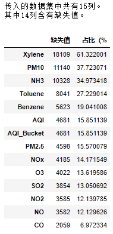


- 我们可以观察到数据中有很多缺失值，比如Xylene有超过60%的缺失值（二甲苯），PM10 有超过30%的缺失值；再继续抽样查看数据的确实情况

```python
# 抽样查看Xylene字段的数据缺失情况
city_day_2['Xylene'].sample(20)
# 输出结果如下
Date
2015-08-25    0.75
2019-02-04     NaN
2018-12-09     NaN
2020-03-18     NaN
2016-02-28    0.00
2016-07-17    0.19
2019-07-22     NaN
2018-01-19     NaN
2015-08-21     NaN
2017-10-18     NaN
2017-03-07     NaN
2019-12-29     NaN
2018-05-03     NaN
2019-11-26     NaN
2019-06-28     NaN
2020-04-12     NaN
2015-10-04    0.64
2016-07-07    4.74
2019-07-08     NaN
2019-03-11     NaN
Name: Xylene, dtype: float64
```

- **使用`fillna`函数中的`ffill`参数，用时间序列中空值的上一个非空值填充**

```python
city_day_2.fillna(method='ffill', inplace=True)
msno.matrix(city_day_2)
# 输出结果如下图
```

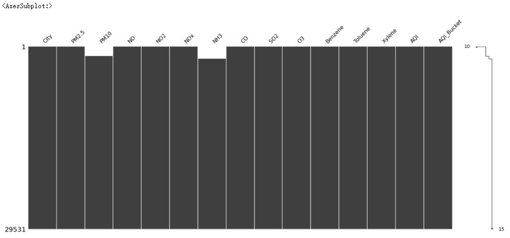

- 此时可以看到 PM10 NH3两列还是存在缺失值的，所以此时我们可以**使用`fillna`函数中的`bfill`参数，用时间序列中空值的下一个非空值填充**

```python
city_day_2.fillna(method='bfill',inplace=True)
msno.matrix(city_day_2)
# 输出结果如下图
```

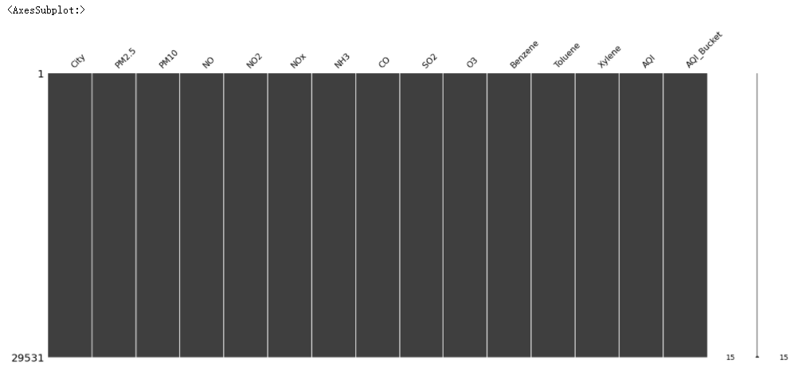

- **使用`df.interpolate(limit_direction="both", inplace=True)` 对缺失数据进行线性填充**
  - 绝大多数的时序数据，具体的列值随着时间的变化而变化。 因此，使用bfill和ffill进行插补并不是解决缺失值问题的最优方案。
  - 线性插值法是一种插补缺失值技术，它假定数据点之间存在严格的线性关系，并利用相邻数据点中的非缺失值来计算缺失数据点的值。

```python
# 为了演示效果，查看指定范围的Xylene列的数据
print(city_day['Xylene'][50:65])
print('='*10)
# 复制数据集df
city_day_3 = city_day.copy()
# 使用df.interpolate(limit_direction="both", inplace=True) 对缺失数据进行线性填充
city_day_3.interpolate(limit_direction="both", inplace=True)
# 再次查看
print(city_day_3['Xylene'][50:65])
# 输出结果如下
Date
2015-02-20     7.48
2015-02-21    15.44
2015-02-22     8.47
2015-02-23    28.46
2015-02-24     6.05
2015-02-25     0.81
2015-02-26      NaN
2015-02-27      NaN
2015-02-28      NaN
2015-03-01     1.32
2015-03-02     0.22
2015-03-03     2.25
2015-03-04     1.55
2015-03-05     4.13
2015-03-06      NaN
Name: Xylene, dtype: float64
==========
Date
2015-02-20     7.4800
2015-02-21    15.4400
2015-02-22     8.4700
2015-02-23    28.4600
2015-02-24     6.0500
2015-02-25     0.8100
2015-02-26     0.9375
2015-02-27     1.0650
2015-02-28     1.1925
2015-03-01     1.3200
2015-03-02     0.2200
2015-03-03     2.2500
2015-03-04     1.5500
2015-03-05     4.1300
2015-03-06     2.2600
Name: Xylene, dtype: float64
```

- 画图查看

```python
# 画图看的清楚
city_day_3['Xylene'][50:65].plot()
city_day['Xylene'][50:65].plot()
# 输出结果如下图
```

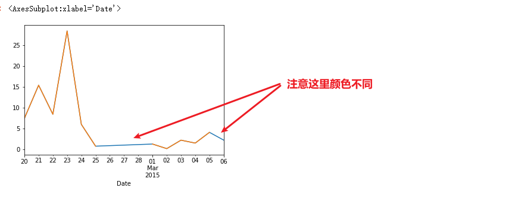


- 其它填充缺失值的方法
  - 上面介绍的线性填充缺失值的方法，其本质就是机器学习算法预测；当然还有其他机器学习算法可以用来做缺失值的计算，绝大多数场景只需要我们掌握上述缺失值填充的办法即可；一旦无法用上述办法来解决问题，那么将交由算法工程师来解决


## 小结

- 数据中包含缺失值是很常见的情况，缺失值可能在很多环节产生（用户没填，程序错误，数据合并...)

- pandas中用np.NaN 表示缺失值，通过pd.isnull()或者pd.notnull()来判断是否是缺失值

- 常用的缺失值处理方式包括

  - 删除缺失值
    - 按行删除
    - 按列删除
  - 填充缺失值
    - 默认值填充
    - 统计值填充
    - 用前、后值填充
    - 线性插值填充

  