# 整理数据

## 学习目标

- 掌握melt函数整理数据的方法
- 掌握stack、unstack的用法
- 掌握wide_to_long函数的用法


## 1 melt整理数据

### 1.1 宽数据集变为长数据集

- 加载美国收入与宗教信仰数据

```python
import pandas as pd
pew = pd.read_csv('data/pew.csv')
pew
# 输出结果如下图
```

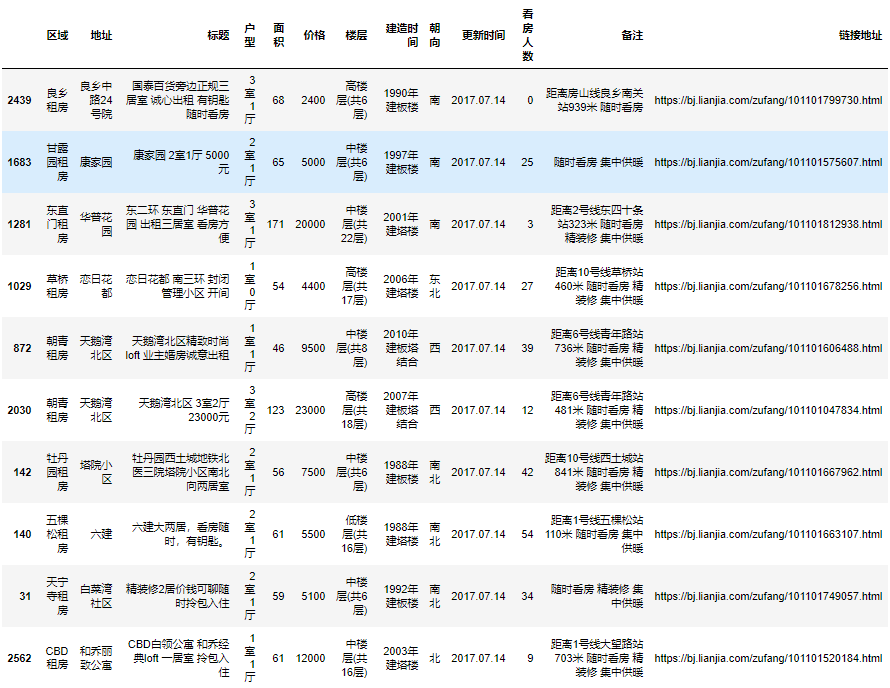

- 先执行下面的代码，将输出的结果和上面的输出结果进行对比

```python
pew_long = pd.melt(pew, id_vars='religion')
print(pew_long)
# 输出结果如下图
```

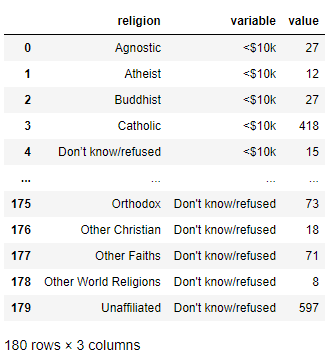

- 我们发现，基于religion列，把原来的df拉长了，我们称原来的df为**`宽数据集`**，拉长之后的df称之为**`长数据集`**
  - 对于展示数据而言，下图中`pwe`返回的这种"宽"数据没有任何问题，如第一行数据，展示了Agnostic（不可知论（者））所有的收入分布情况
  - 从数据分析的角度，有时候我们需要把数据由"宽"数据，转换成”长”数据，就如同下图中`pew_long`返回的数据
  - 在pandas中我们就可以使用`df.melt()`函数，通过各种参数，来达成宽数据集转换为长数据集的效果

```python
pew # 单独运行
pew_long.sort_values('religion').head(20) # 单独运行
```


### 1.2 melt函数的参数

- melt 是溶解/分解的意思， 即拆分数据；melt即是类函数也是实例函数，也就是说既可以用`pd.melt()`, 也可使用`dataframe.melt()`

| 参数       | 类型               | 说明                                                         |
| ---------- | ------------------ | ------------------------------------------------------------ |
| frame      | dataframe          | 必要参数，被 melt 的数据集名称在 pd.melt() 中使用，比如上例中`pd.melt(pew, id_vars='religion')`的`pew` |
| id_vars    | tuple/list/ndarray | 可选项，**不需要被转换的列名**，在转换后作为标识符列（不是索引列），比如上例`pd.melt(pew, id_vars='religion')` |
| value_vars | tuple/list/ndarray | 可选项，**需要被转换的现有列**，如果未指明value_vars，除id_vars指定的其他列都将被转换 |
| var_name   | string             | 自定义设置variable列的列名                                   |
| value_name | string             | 自定义设置value列的列名                                      |

- 比如，可以更改melt之后的数据的列名

```python
pew_long = pd.melt(pew, id_vars='religion', var_name='income', value_name='count')
pew_long.head()
# 输出结果如下
	religion	income	count
0	Agnostic	<$10k	27
1	Atheist		<$10k	12
2	Buddhist	<$10k	27
3	Catholic	<$10k	418
4	Don’t know/refused	<$10k	15
```


### 1.3 练习

> - 加载`data/billboard.csv`，将歌曲周排行数据集拆分成2个数据集：
>   - 数据集1：保存歌曲的基本信息
>   - 数据集2：保存歌曲的每周排行信息
>   - 要求两个数据集以一个`id`列，在逻辑上互相关联

#### 1.3.1 加载并观察数据集

- 加载数据

```python
bill_board = pd.read_csv('data/billboard.csv')
bill_board.head()
# 输出结果如下图
```

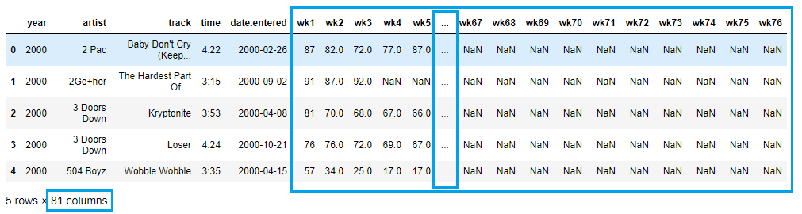

- 经观察思考，最终结果如下图

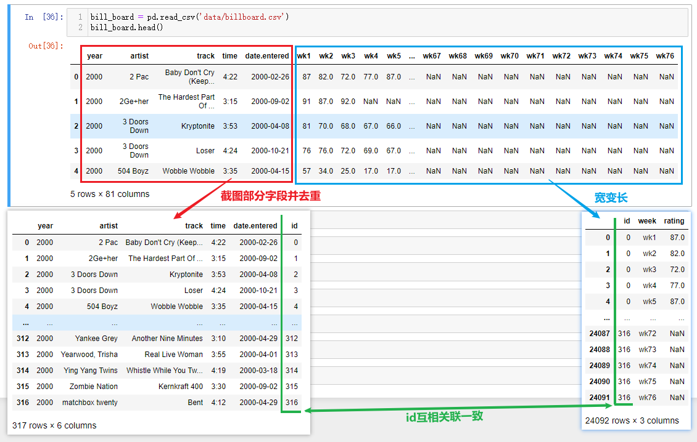

- 实现思路如下：
  - 变换为长数据集
  - 提取歌曲信息表并添加歌曲id列
  - 长数据集添加歌曲id
  - 提取每周评分数据表

#### 1.3.2 变换为长数据集

- 在使用melt函数转换数据的时候，也可以固定多数列，只转换少数列；对上面数据的周评分进行处理，转换成长数据

```python
bill_borad_long = pd.melt(
    bill_board,
    id_vars=['year','artist','track','time','date.entered'],
    var_name='week',
    value_name='rating'
)
bill_borad_long
# 输出结果如下图
```

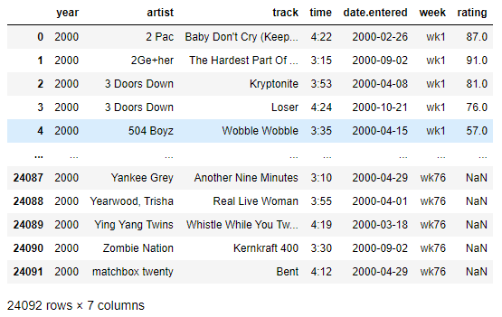

#### 1.3.3 提取歌曲信息表并添加歌曲id列

- 取出指定的列，生成歌曲信息表

```python
# 歌曲信息表
billboard_songs = bill_borad_long[['year','artist','track','time','date.entered']]
billboard_songs
# 输出结果如下图
```

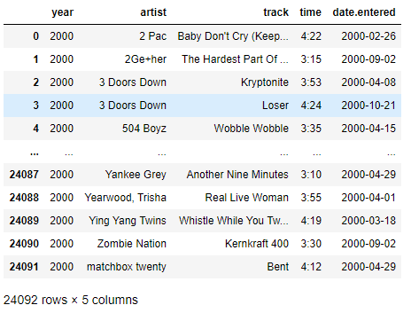

- 此时，当我们查询任意一首歌曲信息时，会发现数据的存储有冗余的情况

```python
# 以歌曲名字Loser为例，发现歌曲信息表中有很多重复的数据
billboard_songs[billboard_songs.track =='Loser']
# 输出结果如下图
```

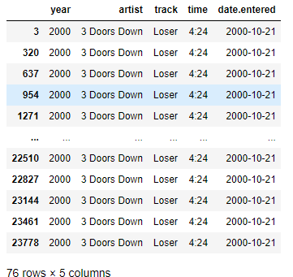

- 对歌曲信息表进行去重

```python
# 歌曲信息表去重
billboard_songs = billboard_songs.drop_duplicates() # 去重
billboard_songs
# 输出结果如下图
```

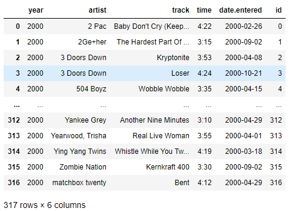

- 歌曲信息表添加id列

```python
billboard_songs['id'] = range(len(billboard_songs))
billboard_songs
# 此处会出现警告信息，无需理会
# 输出结果如下图
```

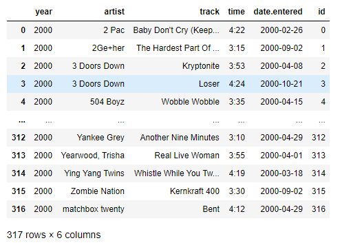


#### 1.3.4 长数据集添加歌曲id

- 将歌曲信息表中的歌曲id关联到原始的长数据集中

```python
# 原长数据集与歌曲信息表进行merge合并，基于指定的的字段，这样就歌曲id放到了长数据集中
new_bill_borad_long = bill_borad_long.merge(billboard_songs, on=['year','artist','track','time','date.entered'])
new_bill_borad_long
# 输出结果如下图
```

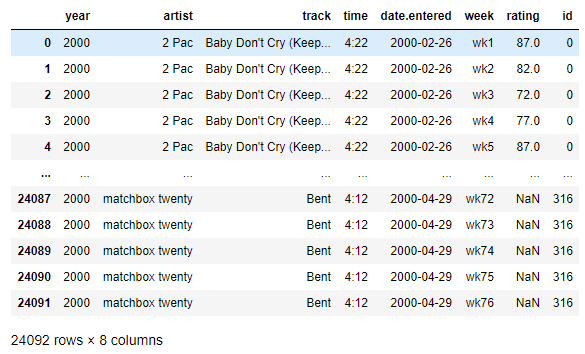

#### 1.3.5 提取每周评分数据表

- 从有歌曲id的长数据集中，提取每周评分数据表

```python
billboard_ratings = new_bill_borad_long[['id','week','rating']]
billboard_ratings
# 输出结果如下图
```

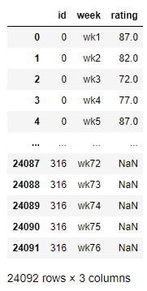

#### 1.3.6 拆分数据集的作用

- 此时我们就完成了拆分数据集的需求，两个分开的数据集包含了两类数据：歌曲信息、周评分信息；随时可以基于歌曲id合并为完整的长数据集

```python
billboard_songs.merge(billboard_ratings, on=['id'])
# 输出结果如下图
```

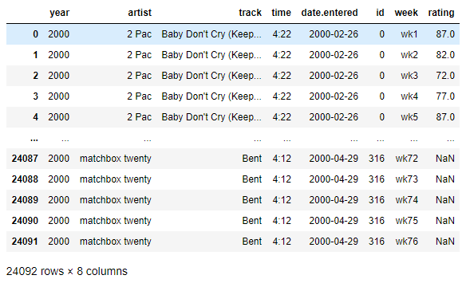

- 拆分后的2个数据集在内存占用上，也比长数据集要少的多

```python
print(billboard_songs.info(memory_usage='deep'))
print('='*10)
print(billboard_ratings.info(memory_usage='deep'))
print('='*10)
print(bill_board.info(memory_usage='deep'))
print('='*10)
print(bill_borad_long.info(memory_usage='deep'))
# 输出结果如下
...
memory usage: 98.9 KB
...
memory usage: 1.9 MB
...
memory usage: 273.5 KB
...
memory usage: 7.9 MB
```

- 至此，我们完成这个练习


## 2 stack整理数据

> - pandas进行数据重排时，经常用到stack和unstack两个函数。stack的意思是堆叠、堆积，unstack即“不要堆叠”
> - 常见的数据的层次化结构有两种，一种是表格，一种是“花括号”，即下面这样的l两种形式：
>
> 
>
> - stack函数会将数据从”表格结构“变成”花括号结构“（返回的是series类型），即将其行索引变成列索引，反之，unstack函数将数据从”花括号结构“变成”表格结构“，即要将其中一层的列索引变成行索引
>
> 接下来我们就来感受一下stack函数的使用，本节无需理会数据集本身的业务

- 加载state_fruit数据集

```python
state_fruit = pd.read_csv('data/state_fruit.csv', index_col=0)
state_fruit
# 返回结果如下图
```

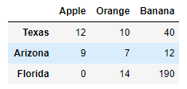

- 使用`df.stack()`函数，查看返回结果

```python
state_fruit_series = state_fruit.stack()
print(state_fruit_series)
print(type(state_fruit_series))
# 输出结果如下图
```

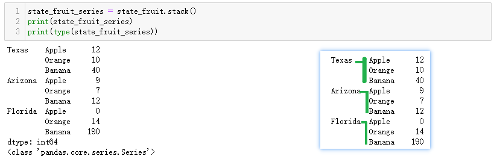


- 此时可以使用`reset_index()`，将结果变为DataFrame

```python
state_fruit_tidy = state_fruit.stack().reset_index()
state_fruit_tidy
# 输出结果如下图
```

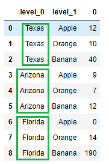


- 给列重新命名

```python
state_fruit_tidy.columns = ['state', 'fruit', 'weight']
state_fruit_tidy
# 输出结果如下图
```

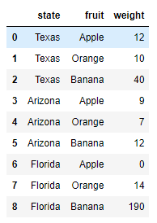


- 也可以使用rename_axis给不同的行索引层级命名

```python
state_fruit.stack().rename_axis(['state', 'fruit'])
# 输出结果如下图
```

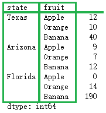


- 再次使用reset_index方法

```python
# 此时发现最后一列因为没有指定，所以列名为0
state_fruit.stack().rename_axis(['state', 'fruit']).reset_index() # 单独执行
# reset_index方法传入name参数，指定缺少的列名
state_fruit.stack().rename_axis(['state', 'fruit']).reset_index(name='weight') # 单独执行
# 输出结果如下图
```


- unstack函数

```python
state_fruit_series.unstack()
# 输出结果如下
```


## 3 wide_to_long整理数据

> 我们通过一个数据整理的具体需求来学习 wide_to_long 函数，需求：
>
> - 加载`data/movie.csv`数据，统计每部电影的每个主演的被点赞数，返回新的df
> - 新df的列名为 **movie_title**、**actor_num**、**actor**、**actor_facebook_likes**；分别代表电影名称、演员编号、演员姓名、该演员被点赞数


### 3.1 初步整理数据

- 加载数据

```python
movie = pd.read_csv('data/movie.csv')
movie.head()
# 输出结果如下图
```

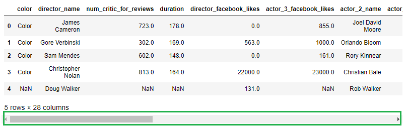

- 去除无关字段

```python
actor = movie[[
    'movie_title', 'actor_1_name', 'actor_2_name', 'actor_3_name', 
    'actor_1_facebook_likes', 'actor_2_facebook_likes', 'actor_3_facebook_likes'
]]
actor.head()
# 输出结果如下图
```

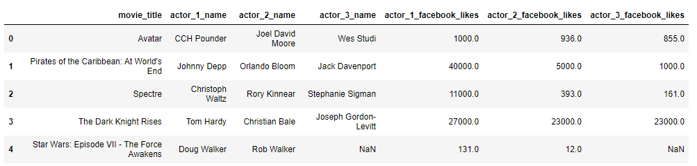

- 整理列名

```python
actor2 = actor.copy()
actor2.columns = [
    'movie_title', 'actor_1', 'actor_2', 'actor_3', 
    'actor_facebook_likes_1', 'actor_facebook_likes_2', 'actor_facebook_likes_3'
]
actor2.head()
# 输出结果如下图
```

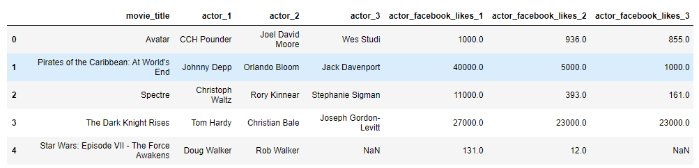

### 3.2 wide_to_long函数的具体使用

- 先执行下面的代码，观看输出结果

```python
stubs = ['actor', 'actor_facebook_likes']
actor2_tidy = pd.wide_to_long(
    actor2, 
    stubnames=stubs, 
    i=['movie_title'], 
    j='actor_num', 
    sep='_'
).reset_index()
actor2_tidy.head()
# 输出结果如下图
```

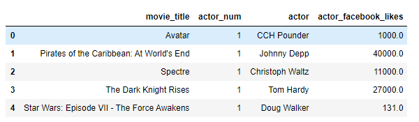

- 查看名为`Avatar`的电影的演员信息

```python
actor2_tidy[actor2_tidy['movie_title']=='Avatar']
# 输出结果如下图
```

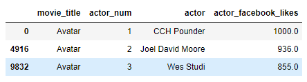


- wide_to_long函数的作用是将列名起始部分相同的列进行拆解，使宽数据变换为长数据

```python
new_df = pd.wide_to_long(
	actor2, # dataframe
    stubnames=['actor', 'actor_facebook_likes'],  # 要处理的列名开头，提取以指定字符串开头的列,可以是多个
    i=['movie_title'],  # 用作索引的列名
    j='actor_num',  # 提取列名开头后剩余的部分会成一列，在此指定列名
    sep='_' # 指定列名中的分隔符
)
```

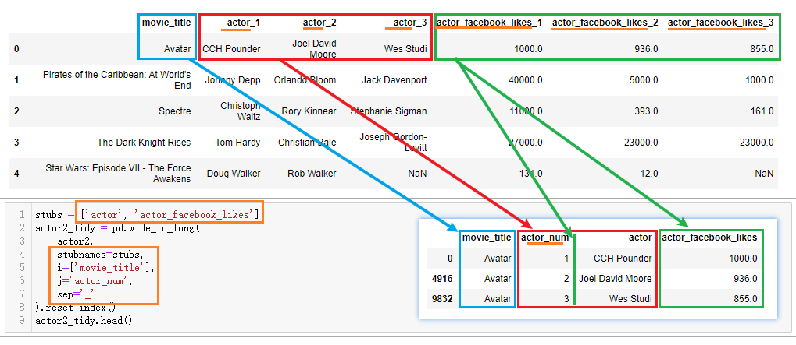


## 小结

- melt，stack，wide_to_long函数均可以实现讲宽数据整理成长数据
  - melt：指定数据列，将指定列变成长数据
  - stack：返回一个具有多层级索引的数据，配合reset_index可以实现宽数据变成长数据
  - wide_to_long：处理列名带数字后缀的宽数据
- stack/unstack, melt/pivot_table 互为逆向操作

