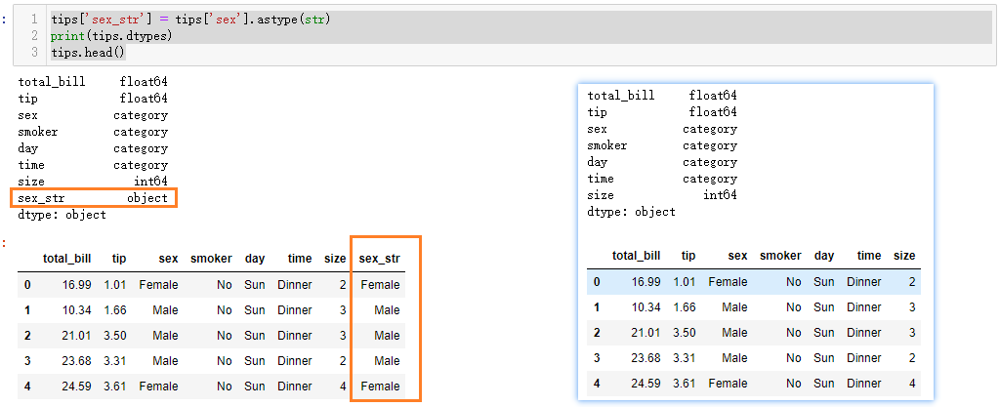
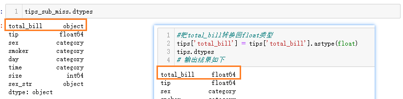
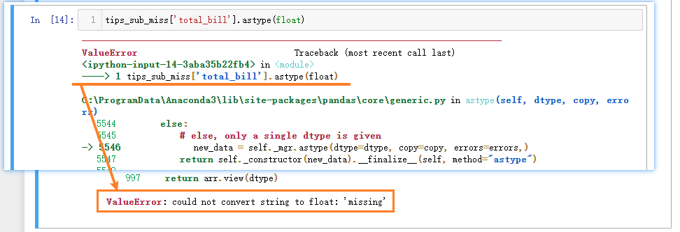
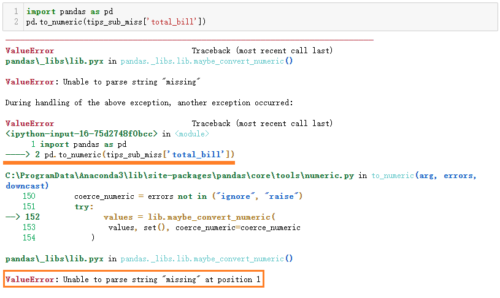
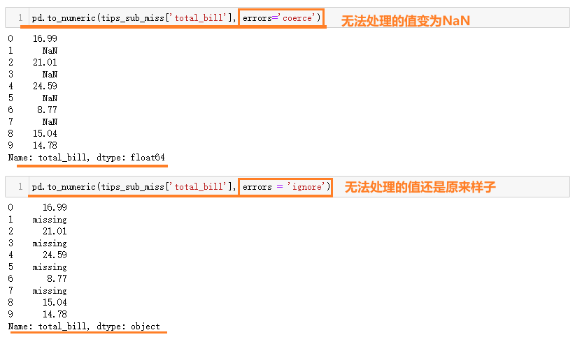
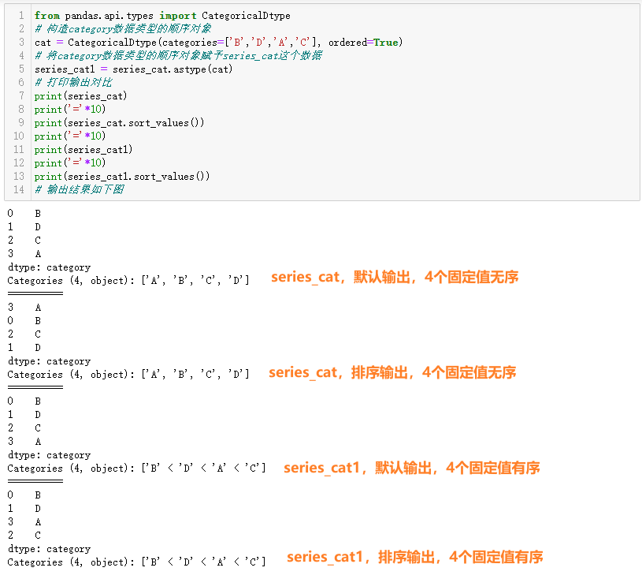
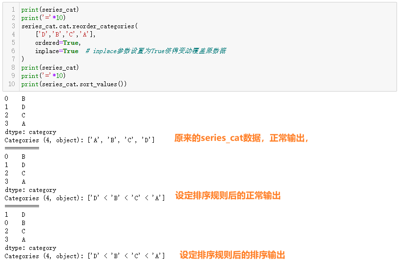

# Pandas 数据类型

## 学习目标

- 了解Numpy的特点
- 应用Pandas 数据类型转换
- 掌握Pandas 分类数据类型使用方法

## 1 Pandas数据类型简介

### 1.1 Numpy 介绍

- Numpy（Numerical Python）是一个开源的Python科学计算库，用于快速处理任意维度的数组。

  Numpy支持常见的数组和矩阵操作。对于同样的数值计算任务，使用Numpy比直接使用Python要简洁的多。

  Numpy使用ndarray对象来处理多维数组，该对象是一个快速而灵活的大数据容器。

- 比如我们现在对下面表格中的数据用numpy的ndarray类型来存储


```python
import numpy as np

# 创建ndarray
score = np.array([
    [80, 89, 86, 67, 79],
    [78, 97, 89, 67, 81],
    [90, 94, 78, 67, 74],
    [91, 91, 90, 67, 69],
    [76, 87, 75, 67, 86],
    [70, 79, 84, 67, 84],
    [94, 92, 93, 67, 64],
    [86, 85, 83, 67, 80]
])
print(score)
print(type(score))
# 输出结果如下
[[80 89 86 67 79]
 [78 97 89 67 81]
 [90 94 78 67 74]
 [91 91 90 67 69]
 [76 87 75 67 86]
 [70 79 84 67 84]
 [94 92 93 67 64]
 [86 85 83 67 80]]
<class 'numpy.ndarray'>
```

- 使用Python列表可以存储一维数组，通过列表的嵌套可以实现多维数组，那么为什么还需要使用Numpy的ndarray呢？我们来做一个**ndarray与Python原生list运算效率对比**，运行下边的代码

```python
import random
import time
import numpy as np
a = []
for i in range(1000000):
    a.append(random.random())
t1 = time.time()
sum1=sum(a)
t2=time.time()

b=np.array(a)
t4=time.time()
sum3=np.sum(b)
t5=time.time()
print(t2-t1, t5-t4)
if t2-t1 < t5-t4:
    print('python的原生数据类型运算速度快')
elif t2-t1 > t5-t4:
    print('numpy的数据类型运算速度更快')
else:
    print('二者一样快')
```

- 对相同的数据进行求和计算，t2-t1为使用python自带的求和函数消耗的时间，t5-t4为使用numpy求和消耗的时间，输出结果如下，从结果中看到ndarray的计算速度要快很多，节约了时间，注意：运行的时间结果不一定和下面的结果一致

```python
0.003989696502685547 0.0009980201721191406
numpy的数据类型运算速度更快
```

- Numpy专门针对ndarray的操作和运算进行了设计，所以数组的存储效率和输入输出性能远优于Python中的嵌套列表，数组越大，Numpy的优势就越明显。

> **Numpy ndarray的优势**
>
> 1. 数据在内存中存储的风格
>
>       
>
>    - ndarray在存储数据时所有元素的类型都是相同的，数据内存地址是连续的，批量操作数组元素时速度更快
>    - python原生list只能通过寻址方式找到下一个元素，这虽然也导致了在通用性方面Numpy的ndarray不及Python原生list，但计算的时候速度就慢了
>
> 2. ndarray支持并行化运算
>
> 3. Numpy底层使用C语言编写，内部解除了GIL（全局解释器锁），其对数组的操作速度不受Python解释器的限制，可以利用CPU的多核心进行运算，效率远高于纯Python代码


### 1.2 Numpy的ndarray

#### 1.2.1 ndarray的属性

- ndarray的属性清单

| 属性名字         | 属性解释                   |
| ---------------- | -------------------------- |
| ndarray.shape    | 数组维度的元组             |
| ndarray.ndim     | 数组维数                   |
| ndarray.size     | 数组中的元素数量           |
| ndarray.itemsize | 一个数组元素的长度（字节） |
| ndarray.dtype    | 数组元素的类型             |

- 执行下面的代码

```python
a = np.array([[1,2,3],[4,5,6]])
b = np.array([1,2,3,4])
c = np.array([[[1,2,3],[4,5,6]],[[1,2,3],[4,5,6]]])
#打印形状
print(a.shape) 
print(b.shape)
print(c.shape)
print(c.ndim)
print(c.size)
print(c.itemsize)
print(c.dtype)
# 输出结果如下
(2, 3)
(4,)
(2, 2, 3)
3
12
4
int32
```


#### 1.2.2 ndarray的类型

- 下表为ndarray的全部数据类型；最常用的类型是布尔和int64，其他只要了解就好

| 名称          | 描述                                              | 简写  |
| ------------- | ------------------------------------------------- | ----- |
| np.bool       | 用一个字节存储的布尔类型（True或False）           | 'b'   |
| np.int8       | 一个字节大小，-128 至 127                         | 'i'   |
| np.int16      | 整数，-32768 至 32767                             | 'i2'  |
| np.int32      | 整数，-2的31次方 至 2的32次方 -1                  | 'i4'  |
| np.int64      | 整数，-2的63次方 至 2的63次方 - 1                 | 'i8'  |
| np.uint8      | 无符号整数，0 至 255                              | 'u'   |
| np.uint16     | 无符号整数，0 至 65535                            | 'u2'  |
| np.uint32     | 无符号整数，0 至 2的32次方 - 1                    | 'u4'  |
| np.uint64     | 无符号整数，0 至 2的64次方 - 1                    | 'u8'  |
| np.float16    | 半精度浮点数：16位，正负号1位，指数5位，精度10位  | 'f2'  |
| np.float32    | 单精度浮点数：32位，正负号1位，指数8位，精度23位  | 'f4'  |
| np.float64    | 双精度浮点数：64位，正负号1位，指数11位，精度52位 | 'f8'  |
| np.complex64  | 复数，分别用两个32位浮点数表示实部和虚部          | 'c8'  |
| np.complex128 | 复数，分别用两个64位浮点数表示实部和虚部          | 'c16' |
| np.object_    | python对象                                        | 'O'   |
| np.string_    | 字符串                                            | 'S'   |
| np.unicode_   | unicode类型                                       |       |

- 创建数组的时候指定类型

```python
a = np.array([[1, 2, 3],[4, 5, 6]], dtype=np.float32)
a.dtype # 查看ndarray类型
# 输出结果如下
dtype('float32')
```


### 1.3 Pandas的数据类型

> - Pandas 是基于Numpy的，很多功能都依赖于Numpy的ndarray实现的，Pandas的数据类型很多与Numpy类似，属性也有很多类似；比如pandas数据中的NaN就是numpy.nan。
> - 下图中为Pandas的数据类型清单，其中Categoricals 我们之前的学习中没有见过的：
>   - Categoricals 是由固定的且有限数量的变量组成的。比如：性别、社会阶层、血型、国籍、观察时段、赞美程度等等。
>   - categorical 类型的数据可以具有特定的顺序——比如：性别分为男、女，血型ABO；我们会在本章节的最后来了解这种数据类型。


- 我们以seaborn包中自带的tips数据集为例，具体来查看数据类型

```python
import seaborn as sns
# seaborn包依赖于Pandas，加载名为tips的数据集，这里只是给大家展示pandas的数据类型
tips = sns.load_dataset('tips', data_home="data/seaborn-data")
print(tips.dtypes)
tips.head()
# 输出结果如下图
```


## 2 类型转换

### 2.1 转换为字符串对象

> - 在上面的tips数据中，sex、smoker、day 和 time 变量都是category类型。通常，如果变量不是数值类型，应先将其转换成字符串类型以便后续处理
> - 有些数据集中可能含有id列，id的值虽然是数字，但对id进行计算（求和，求平均等）没有任何意义，在某些情况下，可能需要把它们转换为字符串对象类型。

- 把一列的数据类型转换为字符串，可以使用astype方法。

```python
tips['sex_str'] = tips['sex'].astype(str)
print(tips.dtypes)
tips.head()
# 输出结果如下图
```




### 2.2 转换为数值类型


#### 2.2.1 astype函数

> - astype方法是通用函数，可用于把DataFrame中的任何列转换为其他dtype
> - 可以向astype方法提供任何内置类型或numpy类型来转换列的数据类型

- 为了演示效果，先把`total_bill`列转为`object/str`类型

```python
#把total_bill转换为str类型
tips['total_bill'] = tips['total_bill'].astype(str)
tips.dtypes
# 输出结果如下
total_bill      object
tip            float64
sex           category
smoker        category
day           category
time          category
size             int64
sex_str         object
dtype: object
```

- 再把``object/str`类型的`total_bill`列转为`float64/float`

```python
#把total_bill转换回float类型
tips['total_bill'] = tips['total_bill'].astype(float)
tips.dtypes
# 输出结果如下
total_bill     float64
tip            float64
sex           category
smoker        category
day           category
time          category
size             int64
sex_str         object
dtype: object
```


#### 2.2.2 to_numeric函数

> - 如果想把变量转换为数值类型（int，float），还可以使用pandas的to_numeric函数
>
> - astype函数要求DataFrame每一列的数据类型必须相同，当有些数据中有缺失，但不是NaN时（如'missing','null'等），会使整列数据变成字符串类型而不是数值型，这个时候可以使用to_numeric处理

- 抽取部分数据，人为制造'missing'作为缺失值的df数据

```python
#创造包含'missing'为缺失值的数据
tips_sub_miss = tips.head(10)
# 批量替换1、3、5、7行中total_bill列的值为字符串'missing'
tips_sub_miss.loc[[1,3,5,7],'total_bill'] = 'missing'
tips_sub_miss
```


- 此时total_bill列变成了字符串对象类型

```python
#查看数据类型 dtypes 会发现total_bill列变成了字符串对象类型
tips_sub_miss.dtypes
```



- 这时使用astype方法把total_bill 列转换回float类型,会抛错, Pandas 无法把'missing'转换成float

```python
tips_sub_miss['total_bill'].astype(float)
```



- 如果使用Pandas库中的to_numeric函数进行转换,也会得到类似的错误

```python
import pandas as pd
pd.to_numeric(tips_sub_miss['total_bill'])
```



- **to_numeric函数有一个参数errors**, 它决定了当该函数遇到无法转换的数值时该如何处理
  - 默认情况下,该值为raise,如果to_numeric遇到无法转换的值时,会抛错
  - coerce: 如果to_numeric遇到无法转换的值时,会返回NaN
  - ignore: 如果to_numeric遇到无法转换的值时会放弃转换,什么都不做

```python
pd.to_numeric(tips_sub_miss['total_bill'], errors='coerce') # 单独运行
pd.to_numeric(tips_sub_miss['total_bill'], errors='ignore') # 单独运行
# 输出结果如下图
```




- **to_numeric函数还有一个downcast参数**, 默认是none，接受的参数值为`integer`、`signed`、`float`、`unsigned`：
  - 如果设置了某一类型的数据，那么pandas会将原始数据转为能存储的最小子型态。
  - 如float的子型态有float16，float32，float64，所以设置了downcast=float，则会将数据转为能够以较少bytes去存储一个浮点数的float16。
  - 另外，downcast参数和errors参数是分开的，如果downcast过程中出错，即使errors设置为ignore也会抛出异常。

```python
# downcast参数设置为float之后, total_bill的数据类型由float64变为float32
pd.to_numeric(tips_sub_miss['total_bill'], errors='coerce', downcast='float')
# 输出结果如下
0    16.99
1      NaN
2    21.01
3      NaN
4    24.59
5      NaN
6     8.77
7      NaN
8    15.04
9    14.78
Name: total_bill, dtype: float32
```

- 从上面的结果看出,转换之后的数据类型为float32, 意味着占用的内存更小了


## 3 分类数据类型category

> 在本章的1.3小节我们知道，Pandas 有一种数据类型`category`，用于对分类值进行编码

### 3.1 category类型转换

- `category`转换为`object/str`

```python
tips['sex'] = tips['sex'].astype('str')
tips.info()
# 输出结果如下
<class 'pandas.core.frame.DataFrame'>
RangeIndex: 244 entries, 0 to 243
Data columns (total 8 columns):
 #   Column      Non-Null Count  Dtype   
---  ------      --------------  -----   
 0   total_bill  244 non-null    float64 
 1   tip         244 non-null    float64 
 2   sex         244 non-null    object  
 3   smoker      244 non-null    category
 4   day         244 non-null    category
 5   time        244 non-null    category
 6   size        244 non-null    int64   
 7   sex_str     244 non-null    object  
dtypes: category(3), float64(2), int64(1), object(2)
memory usage: 10.7+ KB
```

- `object/str`转换为`category`

```python
tips['sex'] = tips['sex'].astype('category')
tips.info()
# 输出结果如下
<class 'pandas.core.frame.DataFrame'>
RangeIndex: 244 entries, 0 to 243
Data columns (total 8 columns):
 #   Column      Non-Null Count  Dtype   
---  ------      --------------  -----   
 0   total_bill  244 non-null    float64 
 1   tip         244 non-null    float64 
 2   sex         244 non-null    category
 3   smoker      244 non-null    category
 4   day         244 non-null    category
 5   time        244 non-null    category
 6   size        244 non-null    int64   
 7   sex_str     244 non-null    object  
dtypes: category(4), float64(2), int64(1), object(1)
memory usage: 9.2+ KB
```


### 3.2 深入category数据类型

> Categoricals 是由固定的且有限数量的变量组成的，比如：性别

- 通过`pd.Categorical`创建category类型数据，同时指定可选项

```python
s = pd.Series(
    pd.Categorical(
        ["a", "b", "c", "d"],
        categories=["c", "b", "a"]
    )
)
s
# 输出结果如下
0      a
1      b
2      c
3    NaN
dtype: category
Categories (3, object): ['c', 'b', 'a']
```

- 通过`dtype`参数创建category类型数据

```python
series_cat = pd.Series(['B','D','C','A'], dtype='category')
series_cat
# 输出结果如下
0    B
1    D
2    C
3    A
dtype: category
Categories (4, object): ['A', 'B', 'C', 'D']
```

- 此时对数据进行排序

```python
series_cat.sort_values()
# 输出结果如下
3    A
0    B
2    C
1    D
dtype: category
Categories (4, object): ['A', 'B', 'C', 'D']
```

- 通过`CategoricalDtype`指定category数据的类型顺序

```python
from pandas.api.types import CategoricalDtype
# 构造category数据类型的顺序对象
cat = CategoricalDtype(categories=['B','D','A','C'], ordered=True)
# 将category数据类型的顺序对象赋予series_cat这个数据
series_cat1 = series_cat.astype(cat)
# 打印输出对比
print(series_cat)
print('='*10)
print(series_cat.sort_values())
print('='*10)
print(series_cat1)
print('='*10)
print(series_cat1.sort_values())
# 输出结果如下图
```




- 想要临时修改排序规则，可以使用`categories类型的series对象.cat.reorder_categories()`方法：

```python
print(series_cat)
print('='*10)
series_cat.cat.reorder_categories(
    ['D','B','C','A'], # 重新设定类型值
    ordered=True, # 设定有顺序
    inplace=True  # inplace参数设置为True，让本次设定生效，变动覆盖原数据
)
print(series_cat)
print('='*10)
print(series_cat.sort_values())
# 输出结果如下图
```




## 小结

- Numpy的特点
  - Numpy是一个高效科学计算库，Pandas的数据计算功能是对Numpy的封装
  - ndarray是Numpy的基本数据结构，Pandas的Series和DataFrame好多函数和属性都与ndarray一样
  - Numpy的计算效率比原生Python效率高很多，并且支持并行计算
- Pandas 数据类型转换
  - Pandas除了数值型的int 和 float类型外，还有object ，category，bool，datetime类型
  - 可以通过as_type 和 to_numeric 函数进行数据类型转换
- Pandas 分类数据类型
  - category类型，可以用来进行排序，并且可以自定义排序顺序
  - CategoricalDtype可以用来定义顺序
