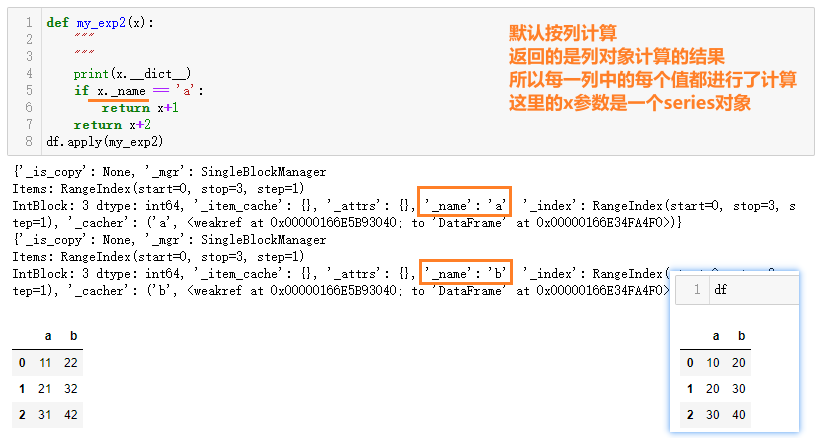
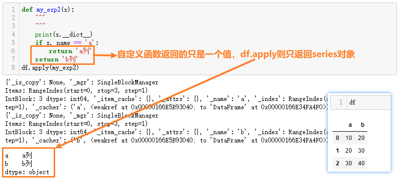
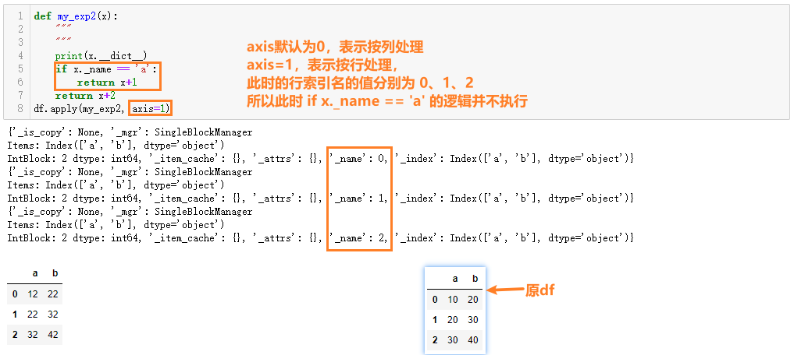
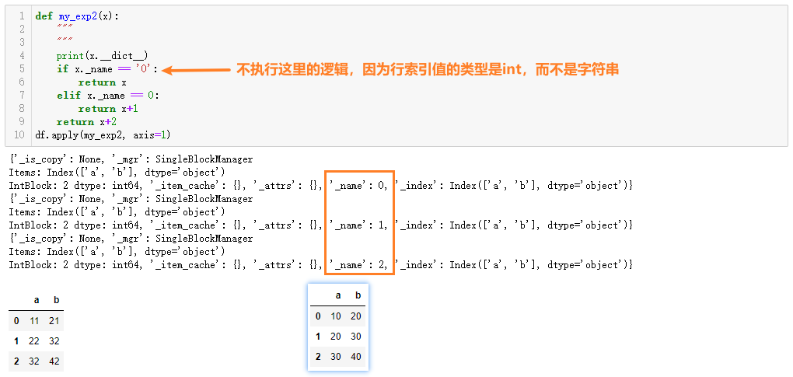
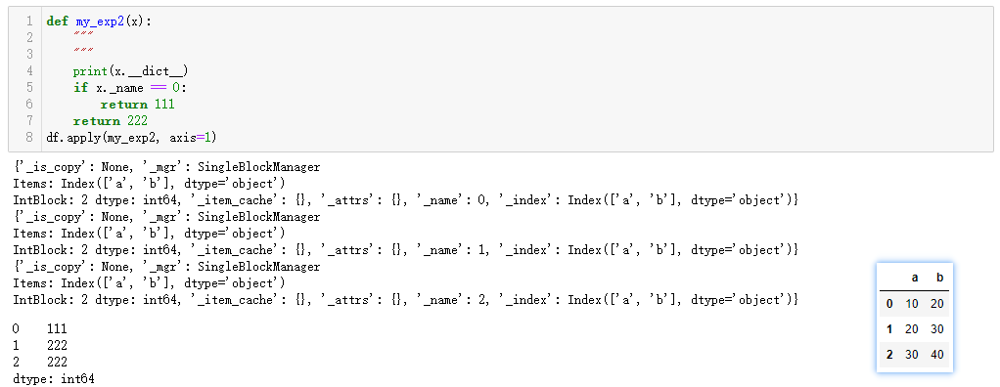
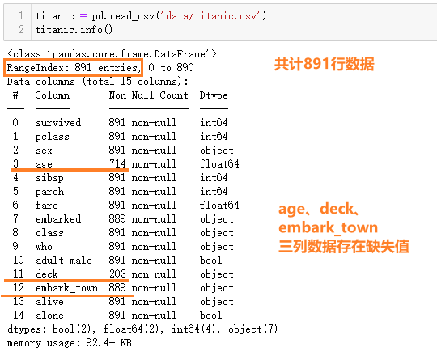
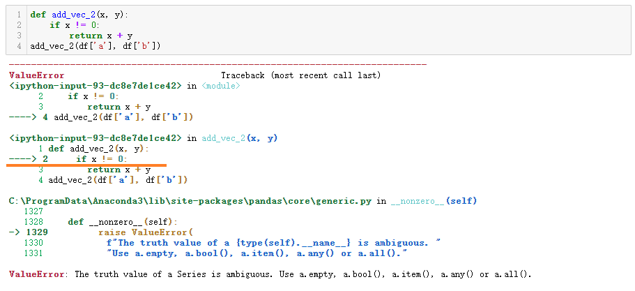
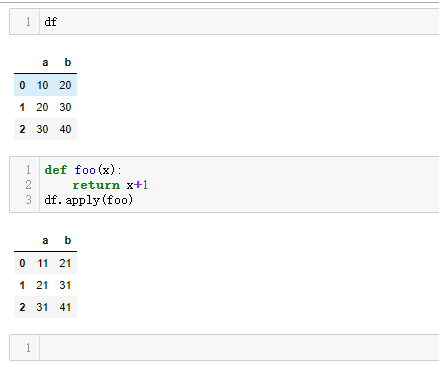
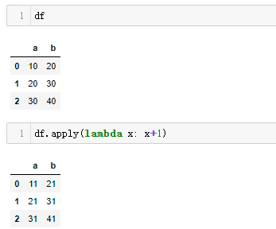

# apply自定义函数

## 学习目标

- 掌握apply的用法
- 知道如何创建向量化函数


## 1 简介

> pandas 的 `apply()` 函数可以作用于 `Series` 或者整个 `DataFrame`，功能也是自动遍历整个 `Series` 或者 `DataFrame`, 对每一个元素运行指定的函数。
>
> - Pandas提供了很多数据处理的API,但当提供的API不能满足需求的时候,需要自己编写数据处理函数, 这个时候可以使用apply函数
> - apply函数可以接收一个自定义函数, 可以将DataFrame的行/列数据传递给自定义函数处理
> - apply函数类似于编写一个for循环, 遍历行、列的每一个元素, 但比使用for循环效率高很多


## 2 Series的apply方法

- 数据准备

```python
import pandas as pd
df = pd.DataFrame({'a':[10,20,30], 'b':[20,30,40]})
df
# 输出结果如下
	a	b
0	10	20
1	20	30
2	30	40
```

- 创建一个自定义函数

```python
def my_sq(x):
    """自定义的apply函数：求平方
    """
    return x**2
```

- Series有一个apply方法, 该方法有一个func参数,当传入一个函数后,apply方法就会把传入的函数应用于Series的每个元素

```python
# 注意, series.apply(函数名)，把自定义的函数传递给apply的时候,不要加上圆括号
sq = df['a'].apply(my_sq)
sq
# 输出结果如下
0    100
1    400
2    900
Name: a, dtype: int64
```

- series的apply还可以接收多个参数

```python
def my_exp(x,e):
    return x+e
print(my_exp(2,3))
# series.apply(函数名, args=(参数1, 参数2, ...)) # args参数必须接收一个元祖
sq = df['a'].apply(my_exp, args=(3,))
print(sq)
# 输出结果如下
5
0    13
1    23
2    33
Name: a, dtype: int64
```

- series的apply还可以接收多个参数，还可以直接通过指定参数名传入参数

```python
def my_exp(x,e):
    return x+e
print(my_exp(2,3))
sq = df['a'].apply(my_exp, e=3)
print(sq)
# 输出结果如下
5
0    13
1    23
2    33
Name: a, dtype: int64
```


## 3 DataFrame的apply方法

> df的apply函数用法和series的用法基本一致，比如对自定义函数传入多个参数

### 3.1 按列执行

- `df.apply`默认按列执行

```python
def my_exp2(x):
    """
    """
    print(x.__dict__)
    if x._name == 'a':
        return x+1
    return x+2
df.apply(my_exp2)
# 输出结果如下图
```




- `df.apply`传入的自定义函数的返会结果如果不是一个series，而是一个值，则最终结果将无法作用于列中的每一行，`df.apply`只能返回一个series对象

```python
def my_exp2(x):
    """
    """
    print(x.__dict__)
    if x._name == 'a':
        return 'a列'
    return 'b列'
df.apply(my_exp2)
# 输出结果如下图
```




### 3.2 按行执行

- 相同的自定义函数，在调用df的apply函数时加一个`axis=1`参数，观察输出和返回的结果

```python
def my_exp2(x):
    """
    """
    print(x.__dict__)
    if x._name == 'a':
        return x+1
    return x+2
df.apply(my_exp2, axis=1)
# 输出结果如下图
```



- 注意当前的示例df的行索引值是int类型，此时我们修改自定义的函数，再来运行

```python
def my_exp2(x):
    """
    """
    print(x.__dict__)
    if x._name == '0':
        return x
    elif x._name == 0:
        return x+1
    return x+2
df.apply(my_exp2, axis=1)
# 输出结果如下图
```



- 同样的，如果自定义函数返回的是一个具体的值，那么按行处理数据也只返回每一行的第一个数据，组成一个series返回

```python
def my_exp2(x):
    """
    """
    print(x.__dict__)
    if x._name == 0:
        return 111
    return 222
df.apply(my_exp2, axis=1)
# 输出结果如下图
```




### 3.3 每一个值都执行

applymap函数可以对df对象中的每个值都执行自定义函数，分别返回结果构成新df对象，并返回；注意applymap函数是df对象独有的，series对象没有这个方法

```python
def my_exp3(x):
    # 应为是对df或series中的每个值做处理，比如int类型的值就没有__dict__属性
    # print(x.__dict__) 
    return x+3
df.applymap(my_exp3)
# 输出结果如下
	a	b
0	13	23
1	23	33
2	33	43
```


### 3.4  apply使用案例

> 接下来我们通过一个数据集，计算缺失值的占比以及非空值占比

#### 3.4.1 加载数据徒步查看确实情况

加载`data/titanic.csv`数据集，通过`df.info()`函数来查看数据集基本信息，从中发现缺失值

```python
#加载数据,使用info查看该数据集的基本特征
titanic = pd.read_csv('data/titanic.csv')
titanic.info()
# 输出结果如下图
```




#### 3.4.2 完成自定义函数

> 通过观察发现有3列数据存在缺失值，age和deck两列缺失值较多；此时我们就来完成几个自定义函数，分别来计算：
>
> - 缺失值总数
> - 缺失值占比
> - 非空值占比

- 缺失值数目

```python
import numpy as np
def count_missing(vec):
    """
    计算一个向量中缺失值的个数
    """
    #根据值是否缺失获取一个由True/False组成的向量
    null_vec = pd.isnull(vec)
    # 得到null_vec中null值的个数
    # null值对应True, True为1，False为0
    null_count = np.sum(null_vec)
    #返回向量中缺失值的个数
    return null_count
```

- 缺失值占比

```python
def prop_missing(vec):
    """
    向量中缺失值的占比
    """
    # 计算缺失值的个数
    # 这里使用刚刚编写的count_missing函数，返回向量vec中缺失值的总数
    null_count = count_missing(vec)
    #获得向量中元素的个数
    #也需要统计缺失值个数
    dem = vec.size
    return null_count/dem
```

- 非缺失值占比

```python
def prop_complete(vec):
    """
    向量中非缺失值(完整值)的占比
    """
    #先计算缺失值占的比例
    #然后用1减去缺失值的占比
    return 1-prop_missing(vec)
```


#### 3.4.3 计算每一列缺失值及非空值的占比

- 计算数据集中更列的缺失值

```python
titanic.apply(count_missing)
```

><font color='red'>显示结果:</font>
>
>```shell
>survived         0
>pclass           0
>sex              0
>age            177
>sibsp            0
>parch            0
>fare             0
>embarked         2
>class            0
>who              0
>adult_male       0
>deck           688
>embark_town      2
>alive            0
>alone            0
>dtype: int64
>```

- 计算缺失值占比

```python
titanic.apply(prop_missing)
```

><font color='red'>显示结果:</font>
>
>```shell
>survived       0.000000
>pclass         0.000000
>sex            0.000000
>age            0.198653
>sibsp          0.000000
>parch          0.000000
>fare           0.000000
>embarked       0.002245
>class          0.000000
>who            0.000000
>adult_male     0.000000
>deck           0.772166
>embark_town    0.002245
>alive          0.000000
>alone          0.000000
>dtype: float64
>```

- 计算非缺失值占比

```python
titanic.apply(prop_complete)
```

><font color='red'>显示结果:</font>
>
>```shell
>survived       1.000000
>pclass         1.000000
>sex            1.000000
>age            0.801347
>sibsp          1.000000
>parch          1.000000
>fare           1.000000
>embarked       0.997755
>class          1.000000
>who            1.000000
>adult_male     1.000000
>deck           0.227834
>embark_town    0.997755
>alive          1.000000
>alone          1.000000
>dtype: float64
>```


#### 3.4.4 计算每一行缺失值及非空值的占比

- 计算每一行缺失值的总数

```python
titanic.apply(count_missing, axis=1)
```

><font color='red'>显示结果:</font>
>
>```shell
>0      1
>1      0
>2      1
>3      0
>4      1
>      ..
>886    1
>887    0
>888    2
>889    0
>890    1
>Length: 891, dtype: int64
>```

- 计算每一行缺失值的占比

```python
titanic.apply(prop_missing, axis=1)
```

><font color='red'>显示结果:</font>
>
>```shell
>0      0.066667
>1      0.000000
>2      0.066667
>3      0.000000
>4      0.066667
>         ...   
>886    0.066667
>887    0.000000
>888    0.133333
>889    0.000000
>890    0.066667
>Length: 891, dtype: float64
>```

- 计算每一行非空值的占比

```python
titanic.apply(prop_complete, axis=1)
```

><font color='red'>显示结果:</font>
>
>```shell
>0      0.933333
>1      1.000000
>2      0.933333
>3      1.000000
>4      0.933333
>         ...   
>886    0.933333
>887    1.000000
>888    0.866667
>889    1.000000
>890    0.933333
>Length: 891, dtype: float64
>```

#### 3.4.5 按缺失值数量分别统计有多少行

```python
# 按缺失值数量统计各有多少行：有1个缺失值的是多少行、有2个缺失值的是多少行。。。
titanic.apply(count_missing, axis=1).value_counts()
```

><font color='red'>显示结果:</font>
>
>```shell
>1    549
>0    182
>2    160
>dtype: int64
>```


## 5 函数向量化

- 创建一个DataFrame

```python
df = pd.DataFrame({'a':[10,20,30],'b':[20,30,40]})
df
```

><font color='red'>显示结果:</font>
>
>|      |    a |    b |
>| ---: | ---: | ---: |
>|    0 |   10 |   20 |
>|    1 |   20 |   30 |
>|    2 |   30 |   40 |

- 此时我们创建一个函数，两个series计算求和

```python
def add_vec(x, y):
    return x + y
avg_2(df['a'], df['b'])
# 返回结果如下
0    30
1    50
2    70
dtype: int64
```

- 稍微修改函数，只加一个判断条件

```python
def add_vec_2(x, y):
    if x != 0:
        return x + y
add_vec_2(df['a'], df['b'])
# 显示结果如下图
```



- **上面函数中, 判断条件`if x!=0` , x是series对象，是一个向量,  但20是具体的数值，int类型的变量，是一个标量；向量和标量不能直接计算. 这个时候可以使用numpy.vectorize()将函数向量化**

```python
import numpy as np
# 通过np.vectorize返回一个新的函数
add_vec_3 = np.vectorize(add_vec_2)
add_vec_3(df['a'], df['b'])
# 返回结果如下
array([30, 50, 70], dtype=int64)
```

- 也可以在声明函数时，使用装饰器`@np.vectorize`，将函数向量化

```python
@np.vectorize
def add_vec_2(x, y):
    if x != 0:
        return x + y
    else:
        return x
add_vec_2(df['a'], df['b'])
# 返回结果如下
array([30, 50, 70], dtype=int64)
```

- **无论是装饰器声明，还是返回新函数，函数向量化的作用是为新函数传入参数的每一个值调用原函数**


## 6 lambda函数

- 假设我们现在要对df对象中每一个值+1，返回一个新的df；要求通过自定义函数、使用df.apply()函数来实现，过程如下图：



- 此时我们自定义的foo函数，在后续可能只使用这一次，那么就可以使用lambda匿名函数，具体就这个小demo使用方法如下

```python
df.apply(lambda x: x+1)
# 返回结果也如下图所示
```




- 当函数比较简单的时候,  没有必要创建一个函数, 可以使用lambda表达式创建匿名函数；lambda匿名函数的优点如下：
  - 使用Python写一些执行脚本时，使用lambda可以省去定义函数的过程，让代码更加精简。
  - 对于一些抽象的，不会别的地方再复用的函数，有时候给函数起个名字也是个难题，使用lambda不需要考虑命名的问题。
  - 使用lambda在某些时候让代码更容易理解。
- lambda匿名函数的含义如下

```python
# 关键字lambda表示匿名函数，冒号前是参数，可以有多个，用逗号隔开，冒号右边的返回值
df.apply(lambda x: x+1)
```


## 小结

- Series和DataFrame均可以通过apply传入自定义函数
- 有些时候需要通过np的vectorize函数才能进行向量化计算