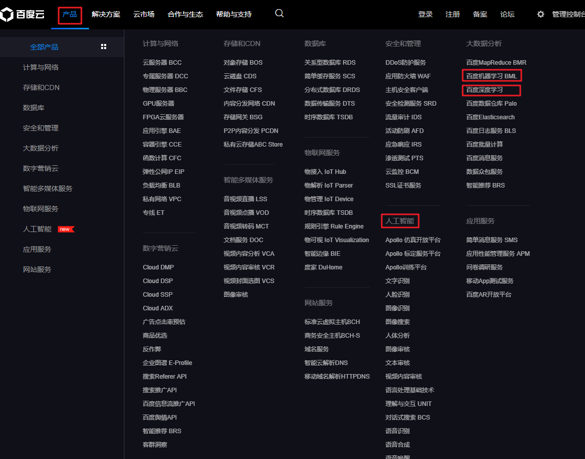

# 1.1 百度平台介绍

## 1.1.1 访问入口

我们要学习的三个平台都可以通过百度云入口（ https://cloud.baidu.com/ ）访问。在百度云的产品下面可以找到机器学习，深度学习和人工智能三个平台。



百度人工智能可以通过 http://ai.baidu.com/ 单独访问.

## 1.1.2 账号注册

要访问百度的这些服务，需要有百度账号,如果没有，需要注册一个。


## 1.1.3 开发环境

本课程在Python下开发，使用jupyter notebook 和 Pycharm,需要安装的Python包。打开anaconda 命令行：

* 创建一个新的虚拟环境。

```python
conda create --name ai
conda activate ai
```

* 安装包

```python
conda install matplotlib
conda install opencv
pip install alfred-py
```

