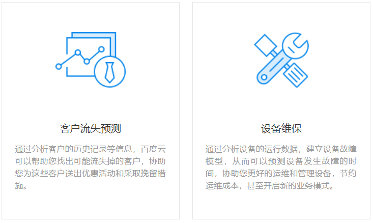
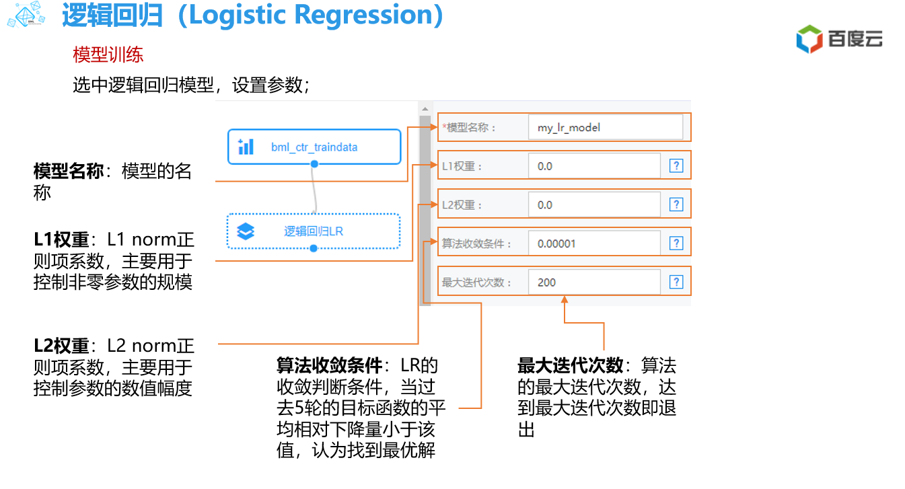

# 1.2 百度机器学习平台

## 1.2.1 介绍(目前处于公测中)

https://cloud.baidu.com/product/bml.html

百度自主研发的新一代机器学习平台，基于百度内部应用多年的机器学习算法库，提供实用的行业大数据解决方案 。打通百度用户画像数据，助您全面洞悉客户特征。助力您轻松挖掘数据金矿。

## 1.2.2 百度机器学习平台特点

- 产品功能：

  

- 产品优势:

  

## 1.2.3 使用场景

## 1.2.4 支持的机器学习算法

* 逻辑回归
* 深度神经网络DNN
* 聚类K-means
* 主题模型LDA
* 协同过滤算法CF
* 梯度提升决策树GBDT

## 1.2.5 申请开通

