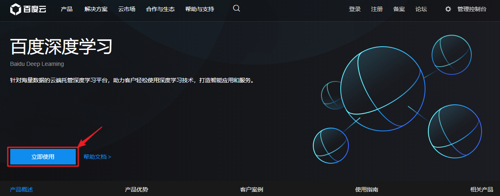
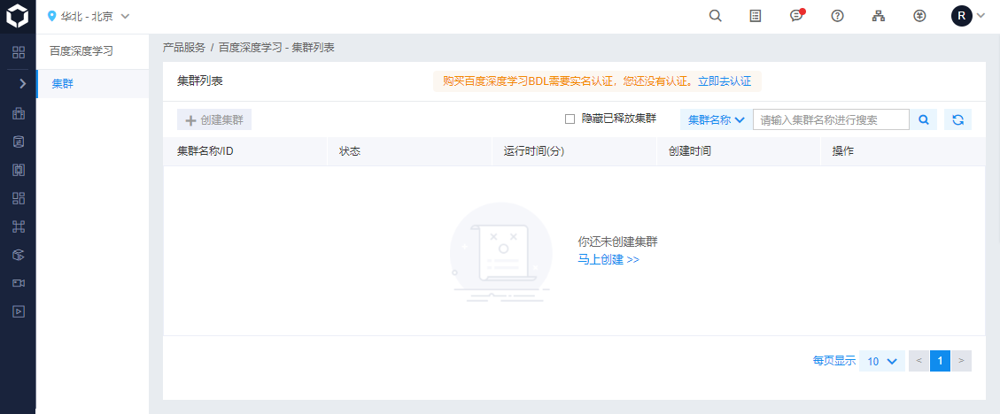
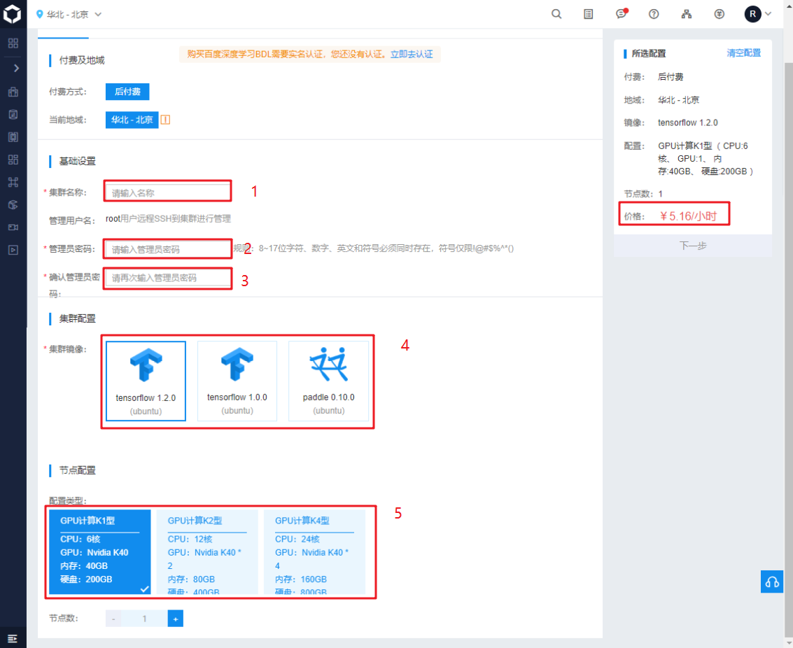
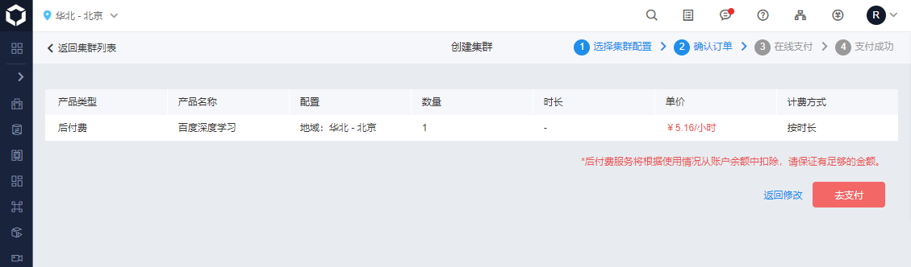
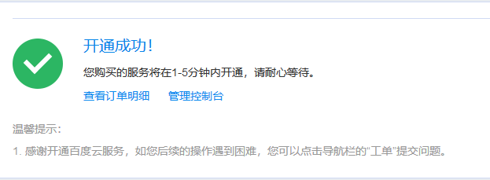
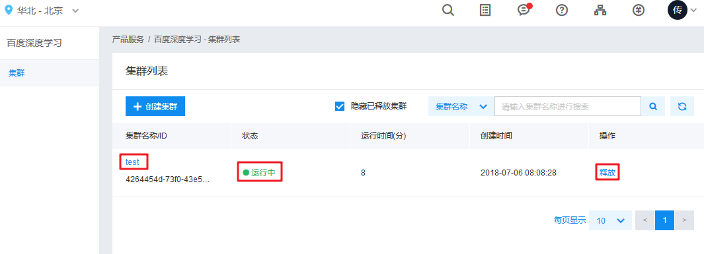
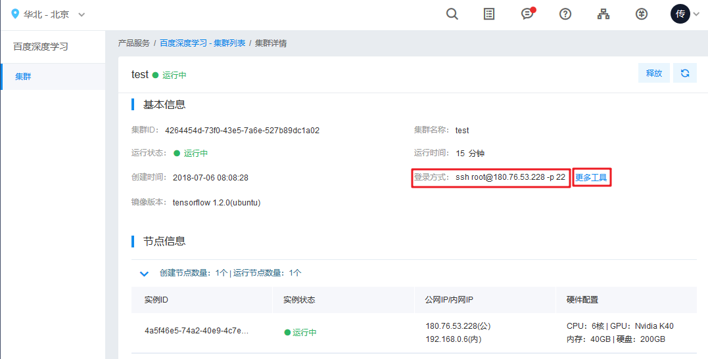
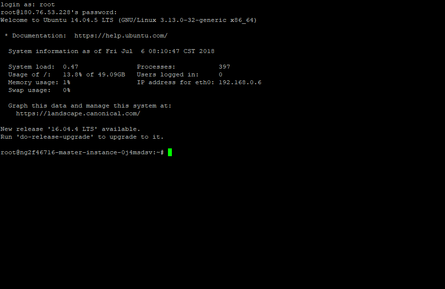
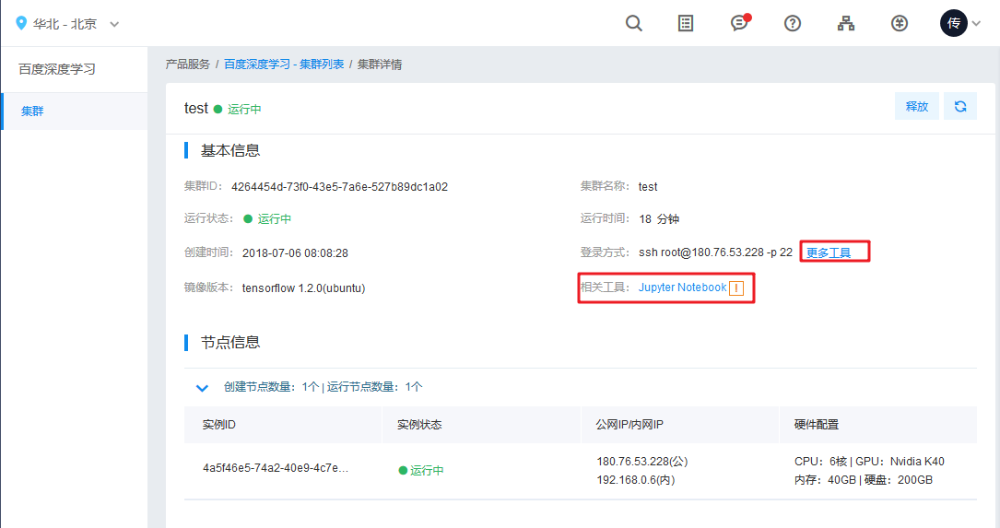

# 1.3 百度深度学习平台

## 1.3.1 介绍(需购买服务)

百度深度学习平台为开发者提供完整的面向海量数据的深度学习算法研发环境。开发者在平台上，不再需要关心繁琐的硬件、驱动、软件框架等环境的搭建、配置和维护问题，仅需要选择GPU资源规模和深度学习框架类型，即可开始深度学习的研发和调试。依托百度云分布式技术，为深度学习技术的研发和应用提供可靠性高、扩展灵活的云端托管服务。目前平台对深度学习框架的支持包含PaddlePaddle和TensorFlow。 

## 1.3.2 百度深度学习平台的特点

* 产品优势

  

## 1.3.3 使用步骤

1. 访问百度深度学习页面

   https://cloud.baidu.com/product/bdl.html

2. 在百度深度学习页面点击“立即使用”，登录并进入百度深度学习管理控制台

   

   

   

3. 点击马上创建，开始创建集群。

   

4. 创建集群，选择您所需要的开发环境。

   

   如图中所标识

   ​	第一步，填写集群名称

   ​	第二步，密码，这个密码在通过ssh登录集群时需要提供

   ​	第三步，选择深度学习的框架，可选tensorflow或者百度的paddle

   ​	第四步，选择硬件配置。不同的配置选择会有不同的价格提示。

   	第五步，选择下一步。

5. 支付。

   

6. 支付成功后，点击管理控制台可以查看创建的集群, 需要几分钟才能初始化好.

   

   

7. 刷新页面直到状态显示为运行中, 这时就已经开始计费, 直到点击释放操作释放集群. 

   

8. 点击上图中的集群名称可以看到创建的集群详情. 

   

9. 访问方式有两种: 一是通过ssh远程登录到主机, 上图显示了登录的IP地址, 用户名为root, 密码为创建集群时的管理密码. 

   

   第二种方式通过jupyter notebook. 点击更多工具可以看到jupyter notebook的访问链接.

   

   

10. 不使用时需要释放集群.