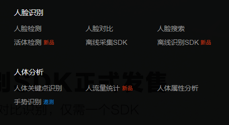
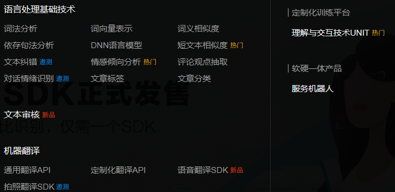
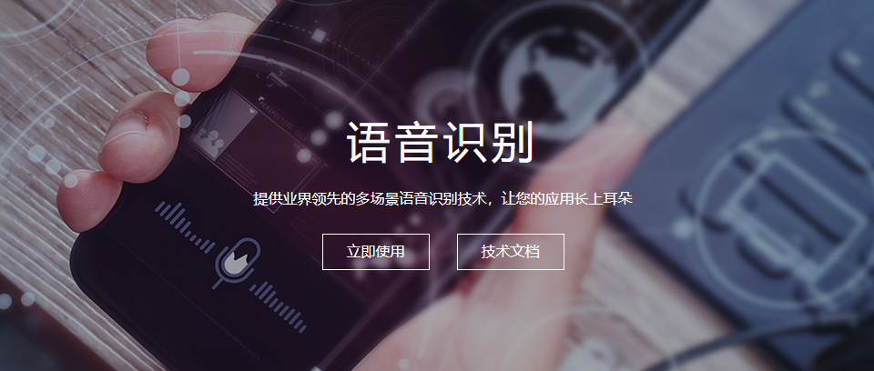
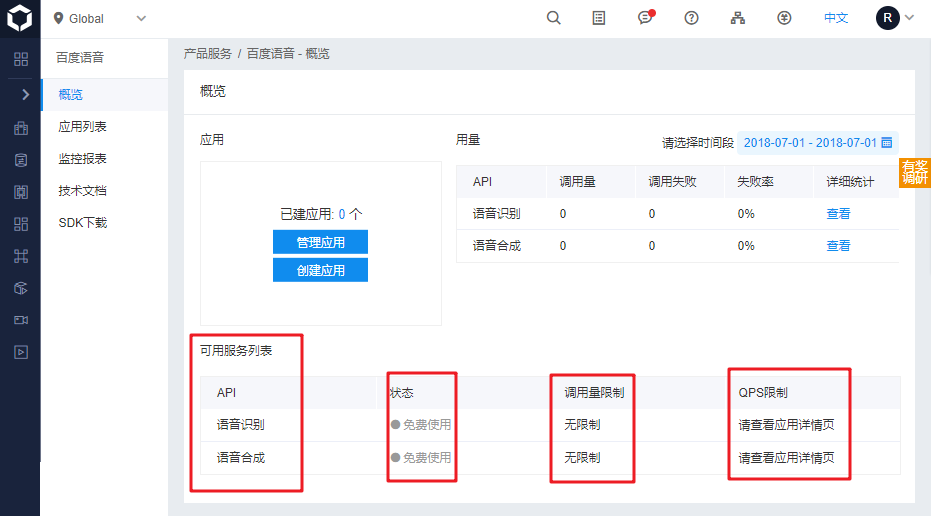
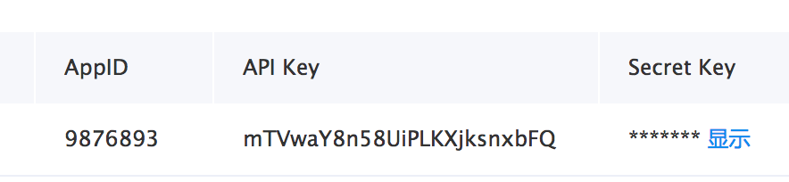
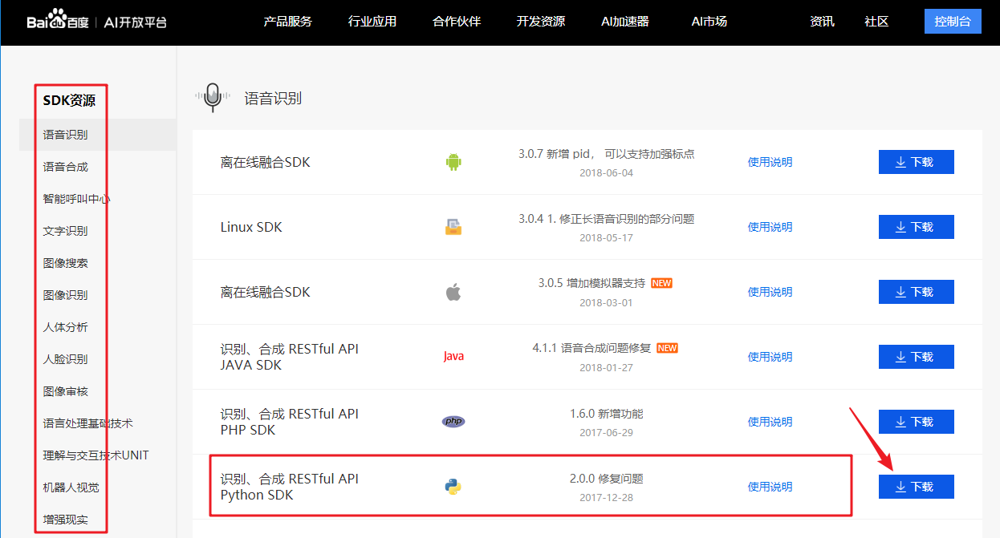

# 1.4 百度人工智能平台

## 1.4.1 特点

一般机器学习(包括深度学习)的开发流程:


百度人工智能平台基于百度自己搜集的大量人机交互数据来学习并生产模型，用户无需训练，所以其API能够由外部直接进行调用。因此，用户不需要弄懂其中的技术细节就能使用。 

## 1.4.2 功能介绍

http://ai.baidu.com/

提供的产品(服务)，我们主要介绍图像，语音和自然语言处理三部分。图像分为图像技术和人脸识别两部分。


* 人脸与人体识别

  

* 图像技术:

  

* 语音技术:

  

* 自然语言处理:

  

## 1.4.3 服务开通

以语音识别为例，其他的服务类似。

* 1 访问 http://ai.baidu.com/

* 2 从页面的 产品服务, 选择 语音技术, 然后选择 语音识别

   

* 3 选择立即使用

  

* 4 如果没有登录，会提醒登录

   

* 5 进入应用管理后台，这里可以管理应用和创建应用。

   

上面的页面也包含了很多有用信息：

  * 当前产品提供的服务列表，比如这里语音识别包含两种服务，语音识别和语音合成。
  * 收费状况，人工智能平台的服务都是有限条件下的免费使用。后面是具体的限制条件。
  * 调用量限制，比如每天可调用的次数。
  * QPS限制，QPS是Query Per Second的缩写, 指每秒的调用次数限制，是并发的限制数。如果需要高并发，就需要付费了。

左侧的应用列表可以看到已经创建的所有的应用列表。技术文档可以查询调用API的文档资料。也可以通过SDK下载安装需要的SDK。

* 6 创建应用.

  

* 7 获取密钥. 在创建完毕应用后，平台将会分配给应用相关凭证，主要为AppID、API Key、Secret Key。以上三个信息是应用实际开发的主要凭证，每个应用之间各不相同.下图为示例内容 



## 1.4.4 API 访问方式

百度人工智能产品通过两种方式访问:

* REST API 方式: 通过 REST API 的方式给开发者提供一个通用的 HTTP 接口.
* 服务端SDK 方式: 下载SDK到本地, 已经打包了REST API, 以函数接口的形式调用服务.

### 1.4.4.1 REST API 方式

* 获取Aceess Token
* 调用HTTP POST
* 分析结果

  1. 使用API Key 和 Secret Key 访问 服务指定的鉴权地址获取取 Access Token. Access Token的有效期为30天（以秒为单位），集成时注意在程序中定期请求新的token。 

     ```python
     # client_id 为官网获取的API Key, client_secret 为官网获取的Secret Key
     host = 'https://aip.baidubce.com/oauth/2.0/token?grant_type=client_credentials&client_id=z2y3XY7WKYOHvHPzz8fFBiAp&client_secret=sZkdg5ver7nI*********BU3WNyuH4X'
     
     # 发送请求
     request = urllib.request.Request(host)
     request.add_header('Content-Type', 'application/json; charset=UTF-8')
     response = urllib.request.urlopen(request)
     content = response.read()
     
     # 解码返回的JSON数据
     content_decoded = json.loads(content.decode('utf-8'))
     # 获得access_token
     access_token = content_decoded['access_token']
     ```

  2. 把参数和数据填写到 HTTP POST body中，通过HTTP POST 请求对应的服务，获得结果。

     ```python
     # 人脸检测与属性分析
     request_url = "https://aip.baidubce.com/rest/2.0/face/v3/detect"
     
     #二进制方式打开图片文件
     f = open(r'./stars.jpg', 'rb')
     # 对图片进行base64编码
     img = base64.b64encode(f.read())
     
     # 可以增加更多的特征
     params = {"max_face_num" : 10,
               "image" : img,
               "image_type" : "BASE64",
               "face_field" : "age,gender"}
     
     # 对参数进行编码
     params = urllib.parse.urlencode(params).encode()
     
     # access_token = '[调用鉴权接口获取的token]'
     request_url = request_url + "?access_token=" + access_token
     request = urllib.request.Request(url=request_url, data=params)
     request.add_header('Content-Type', 'application/json')
     response = urllib.request.urlopen(request)
     content = response.read()
     content_decoded = json.loads(content.decode('utf-8'))
     pprint.pprint(content_decoded)
     ```
  3.   分析返回的结果

     ```
     {'cached': 0,
      'error_code': 0,
      'error_msg': 'SUCCESS',
      'log_id': 2505792019979,
      'result': {'face_list': [{'age': 23,
                                'angle': {'pitch': -9.258248329,
                                          'roll': 0.008975180797,
                                          'yaw': -9.151642799},
                                'face_probability': 0.9910741448,
                                'face_token': '8dedde8cb1c5264e01426751312257d8',
                                'gender': {'probability': 0.9410704374,
                                           'type': 'male'},
                                'location': {'height': 35,
                                             'left': 155.9566498,
                                             'rotation': 0,
                                             'top': 160.5591888,
                                             'width': 45}},
      ......
     ```


### 1.4.4.2 SDK 方式 

SDK方式, 需下载安装相应语言的服务器端SDK.

* 实例化服务对象

  ```
  from aip import AipSpeech
  
  """ 你的 APPID AK SK """
  APP_ID = '你的 App ID'
  API_KEY = '你的 Api Key'
  SECRET_KEY = '你的 Secret Key'
  
  client = AipSpeech(APP_ID, API_KEY, SECRET_KEY)
  ```

  

* 调用函数

  ```python
  # 读取文件
  def get_file_content(filePath):
      with open(filePath, 'rb') as fp:
          return fp.read()
  
  # 识别本地文件
  client.asr(get_file_content('audio.pcm'), 'pcm', 16000, {
      'dev_pid': 1536,
  })
  ```

  


**SDK的安装**

* 在应用管理后台选择SDK下载，进入SDK下载页面。



* 由于我们以语音识别为例，在下载页面可以看到语音识别支持的各种环境下的SDK，我们用到Python SDK。**不过别着急下载**。

* 这个页面其实包含了所有人工智能平台的服务的SDK，可以直接往下滚动页面或者从左侧的列表选择其他功能的SDK。需要注意的是，每个服务的SDK包含了所有其他服务的SDK。这里的版本号，只是说明当前服务最新更新的版本号，比如这里语音识别的版本号为2.0.0，说明这个服务最新的更新包含在从2.0.0开始的SDK版本里面。由于我们要用到多个功能，只需要找到所有功能里面版本里最新的Python SDK。在这个页面搜索Python SDK，找到最新版本的SDK版本下载即可。目前是2.2.5。

* 下载最新SDK后，解压，以windows下anaconda 虚拟环境为例.

  ```
  # 运行 anaconda prompt, 改变目录到 解压的sdk目录
  cd C:\Users\Roy\Downloads\aip-python-sdk-2.2.5
  
  # 激活虚拟环境,假设用之前课程的虚拟环境是ai
  activate ai
  
  # 安装
  pip install .
  ```

  安装结果:

  ```
  (ai) C:\Users\Roy\Downloads\aip-python-sdk-2.2.5>pip install .
  Processing c:\users\roy\downloads\aip-python-sdk-2.2.5
  Requirement already satisfied: requests in d:\programdata\anaconda3\envs\ai\lib\site-packages (from baidu-aip==2.2.5.1) (2.19.1)
  Requirement already satisfied: idna<2.8,>=2.5 in d:\programdata\anaconda3\envs\ai\lib\site-packages (from requests->baidu-aip==2.2.5.1) (2.7)
  Requirement already satisfied: certifi>=2017.4.17 in d:\programdata\anaconda3\envs\ai\lib\site-packages (from requests->baidu-aip==2.2.5.1) (2018.4.16)
  Requirement already satisfied: urllib3<1.24,>=1.21.1 in d:\programdata\anaconda3\envs\ai\lib\site-packages (from requests->baidu-aip==2.2.5.1) (1.23)
  Requirement already satisfied: chardet<3.1.0,>=3.0.2 in d:\programdata\anaconda3\envs\ai\lib\site-packages (from requests->baidu-aip==2.2.5.1) (3.0.4)
  Building wheels for collected packages: baidu-aip
    Running setup.py bdist_wheel for baidu-aip ... done
    Stored in directory: C:\Users\Roy\AppData\Local\pip\Cache\wheels\94\fd\e4\a6c87d1dcc69c1e88bd6efda096f23d09441ca26161ce1d2d9
  Successfully built baidu-aip
  Installing collected packages: baidu-aip
    Found existing installation: baidu-aip 2.2.5.1
      Uninstalling baidu-aip-2.2.5.1:
        Successfully uninstalled baidu-aip-2.2.5.1
  Successfully installed baidu-aip-2.2.5.1
  ```

## 1.4.5 总结

  * 特点
  * 功能
  * 服务开通
  * API访问方式
    * REST API 方式
    * SDK 方式