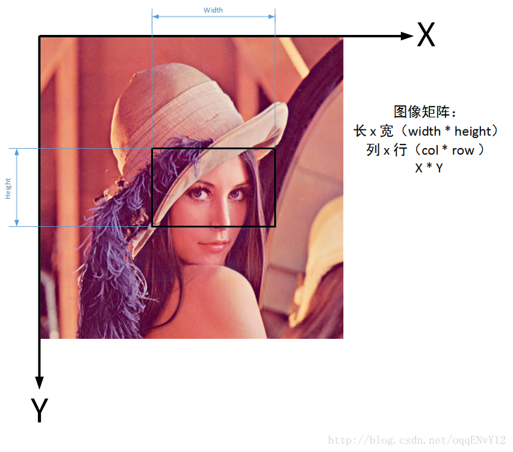

# 2.1 人脸识别

## 2.1.1人脸识别功能介绍

人脸检测，人脸对比和人脸查找

- 人脸检测 : 精准定位图中人脸，获得眼、口、鼻等72个关键点位置，分析性别、年龄、表情等多种人脸属性 

  

- 人脸对比 : 对比两张人脸的相似度，并给出相似度评分，从而判断是否同一个人 

  

- 人脸查找 : 针对一张人脸照片，在指定人脸集合中搜索，找出最相似的一张脸或多张人脸，并给出相似度分值

  

## 2.1.2 开通人脸识别服务

* 访问http://ai.baidu.com/, 选择人脸识别


* 选择立即使用,进入人脸识别管理控制台


* 在管理控制可以创建人脸识别应用和管理应用.


* 创建人脸识别应用，获取API Key 和 Secret Key

  通过人脸识别管理控制台，选择左边的应用列表，可以创建新的应用。也可以看到已经创建的应用列表。

  点击创建应用，填写应用名称，应用类型。默认包含了人脸识别相关的功能，也可以同时添加其他的功能。

  

  创建完成后，可以通过应用列表查看应用，并获得API Key和Secret Key。

  

## 2.1.3  人脸检测案例 (REST API)

识别照片中所有的人脸，标注边界框。展示人脸的核心关键点信息。展示人脸的属性，比如性别，年龄。

两种方式：

* REST API: 向API服务地址使用POST发送请求，必须在URL中带上参数access_token，POST中参数按照API接口说明调用即可。
* SDK API: 直接通过SDK创建相应的服务对象，调用对象的函数。

### 2.1.3.1 人脸检测接口

本案例通过HTTP POST方式访问服务器。POST请求的URL需要提供access_ok，access_ok的获取参见后面的代码部分。POST的body部分填充参数。

HTTP方法：`POST`

请求URL： `https://aip.baidubce.com/rest/2.0/face/v3/detect`

URL参数：

| 参数         | 值                                                           |
| ------------ | ----------------------------------------------------- |
| access_token | 通过API Key和Secret Key获取的access_token,参考“[Access Token获取](http://ai.baidu.com/docs#Beginner-Auth)” |

Header：

| 参数         | 值               |
| ------------ | ---------------- |
| Content-Type | application/json |

Body中放置请求参数，参数详情如下：

**请求参数**

| 参数         | 必选 | 类型   | 说明                                                         |
| ------------ | ---- | ------ | ------------------------------------------------------------ |
| image        | 是   | string | 图片信息(**总数据大小应小于10M**)，图片上传方式根据image_type来判断 |
| image_type   | 是   | string | 图片类型 **BASE64**:图片的base64值，base64编码后的图片数据，编码后的图片大小不超过2M； **URL**:图片的 URL地址( 可能由于网络等原因导致下载图片时间过长)； **FACE_TOKEN**: 人脸图片的唯一标识，调用人脸检测接口时，会为每个人脸图片赋予一个唯一的FACE_TOKEN，同一张图片多次检测得到的FACE_TOKEN是同一个。 |
| face_field   | 否   | string | 包括**age, beauty, expression, faceshape, gender, glasses, landmark,race,quality,facetype信息** 逗号分隔. 默认只返回face_token、人脸框、概率和旋转角度 |
| max_face_num | 否   | uint32 | 最多处理人脸的数目，默认值为1，仅检测图片中面积最大的那个人脸；**最大值10**，检测图片中面积最大的几张人脸。 |
| face_type    | 否   | string | 人脸的类型 **LIVE**表示生活照：通常为手机、相机拍摄的人像图片、或从网络获取的人像图片等 **IDCARD**表示身份证芯片照：二代身份证内置芯片中的人像照片 **WATERMARK**表示带水印证件照：一般为带水印的小图，如公安网小图 **CERT**表示证件照片：如拍摄的身份证、工卡、护照、学生证等证件图片 默认**LIVE** |

> 说明：
>
> **图片格式**：现支持PNG、JPG、JPEG、BMP，**不支持GIF图片** 
>
> **face_field参数**: 默认只返回人脸框、概率和旋转角度，age等更多属性，请在此参数中添加。

​	

- 返回结果。返回的具体字段和在请求时的参数face_field相关，只有填写相应的项，才会得到对应的结果。

| 字段              | 必选 | 类型   | 说明                                                         |
| ----------------- | ---- | ------ | ------------------------------------------------------------ |
| face_num          | 是   | int    | 检测到的图片中的人脸数量                                     |
| face_list         | 是   | array  | 人脸信息列表，具体包含的参数参考下面的列表。                 |
| +face_token       | 是   | string | 人脸图片的唯一标识                                           |
| +location         | 是   | array  | 人脸在图片中的位置                                           |
| ++left            | 是   | double | 人脸区域离左边界的距离                                       |
| ++top             | 是   | double | 人脸区域离上边界的距离                                       |
| ++width           | 是   | double | 人脸区域的宽度                                               |
| ++height          | 是   | double | 人脸区域的高度                                               |
| ++rotation        | 是   | int64  | 人脸框相对于竖直方向的顺时针旋转角，[-180,180]               |
| +face_probability | 是   | double | 人脸置信度，范围【0~1】，代表这是一张人脸的概率，0最小、1最大。 |
| +angel            | 是   | array  | 人脸旋转角度参数                                             |
| ++yaw             | 是   | double | 三维旋转之左右旋转角[-90(左), 90(右)]                        |
| ++pitch           | 是   | double | 三维旋转之俯仰角度[-90(上), 90(下)]                          |
| ++roll            | 是   | double | 平面内旋转角[-180(逆时针), 180(顺时针)]                      |
| +age              | 否   | double | 年龄 ，当**face_field包含age时返回**                         |
| +beauty           | 否   | int64  | 美丑打分，范围0-100，越大表示越美。当**face_fields包含beauty时返回** |
| +expression       | 否   | array  | 表情，当 **face_field包含expression时返回**                  |
| ++type            | 否   | string | **none**:不笑；**smile**:微笑；**laugh**:大笑                |
| ++probability     | 否   | double | 表情置信度，范围【0~1】，0最小、1最大。                      |
| +face_shape       | 否   | array  | 脸型，当**face_field包含faceshape时返回**                    |
| ++type            | 否   | double | **square**: 正方形 **triangle**:三角形 **oval**: 椭圆 **heart**: 心形 **round**: 圆形 |
| ++probability     | 否   | double | 置信度，范围【0~1】，代表这是人脸形状判断正确的概率，0最小、1最大。 |
| +gender           | 否   | array  | 性别，**face_field包含gender时返回**                         |
| ++type            | 否   | string | male:**男性** female:**女性**                                |
| ++probability     | 否   | double | 性别置信度，范围【0~1】，0代表概率最小、1代表最大。          |
| +glasses          | 否   | array  | 是否带眼镜，**face_field包含glasses时返回**                  |
| ++type            | 否   | string | **none**:无眼镜，**common**:普通眼镜，**sun**:墨镜           |
| ++probability     | 否   | double | 眼镜置信度，范围【0~1】，0代表概率最小、1代表最大。          |
| +race             | 否   | array  | 人种 **face_field包含race时返回**                            |
| ++type            | 否   | string | **yellow**: 黄种人 **white**: 白种人 **black**:黑种人 **arabs**: **阿拉伯人** |
| ++probability     | 否   | double | 人种置信度，范围【0~1】，0代表概率最小、1代表最大。          |
| +facetype         | 否   | array  | 真实人脸/卡通人脸 **face_field包含facetype时返回**           |
| ++type            | 否   | string | **human**: 真实人脸 **cartoon**: 卡通人脸                    |
| ++probability     | 否   | double | 人脸类型判断正确的置信度，范围【0~1】，0代表概率最小、1代表最大。 |
| +landmark         | 否   | array  | 4个关键点位置，左眼中心、右眼中心、鼻尖、嘴中心。**face_field包含landmark时返回** |
| +landmark72       | 否   | array  | 72个特征点位置 **face_field包含landmark时返回**              |
| +quality          | 否   | array  | 人脸质量信息。**face_field包含quality时返回**                |
| ++occlusion       | 否   | array  | 人脸各部分遮挡的概率，范围[0~1]，0表示完整，1表示不完整      |
| +++left_eye       | 否   | double | 左眼遮挡比例，[0-1] ，1表示完全遮挡                          |
| +++right_eye      | 否   | double | 右眼遮挡比例，[0-1] ， 1表示完全遮挡                         |
| +++nose           | 否   | double | 鼻子遮挡比例，[0-1] ， 1表示完全遮挡                         |
| +++mouth          | 否   | double | 嘴巴遮挡比例，[0-1] ， 1表示完全遮挡                         |
| +++left_cheek     | 否   | double | 左脸颊遮挡比例，[0-1] ， 1表示完全遮挡                       |
| +++right_cheek    | 否   | double | 右脸颊遮挡比例，[0-1] ， 1表示完全遮挡                       |
| +++chin           | 否   | double | 下巴遮挡比例，，[0-1] ， 1表示完全遮挡                       |
| ++blur            | 否   | double | 人脸模糊程度，范围[0~1]，0表示清晰，1表示模糊                |
| ++illumination    | 否   | double | 取值范围在[0~255], 表示脸部区域的光照程度 越大表示光照越好   |
| ++completeness    | 否   | int64  | 人脸完整度，0或1, 0为人脸溢出图像边界，1为人脸都在图像边界内 |


### 2.1.3.2 分析和实现步骤

- 1 创建人脸检测应用，获得应用API Key和 Secret Key。
- 2 获取access_token
- 3 准备照片，按照要求填写 HTTP Post 请求所需的参数
- 4 通过HTTP Post方式 调用人脸检测API
- 5 分析返回的结果，在原始照片上显示分析得到的结果

### 2.1.3.3 安装matplotlib 和 OpenCV (anaconda 环境下)

```python
conda install matplotlib
conda install opencv
```

### 2.1.3.3 代码中用的OpenCV库和函数

OpenCV的全称是Open Source Computer Vision Library，是一个跨平台的计算机视觉库。可用于开发实时的图像处理、计算机视觉以及模式识别程序。

* 在图像上画矩形, [cv2.rectangle](https://docs.opencv.org/3.0-last-rst/modules/imgproc/doc/drawing_functions.html#rectangle)

```python
cv2.rectangle(img, pt1, pt2, color[, thickness[, lineType[, shift]]])
        img – Image.
        pt1 – Vertex of the rectangle.
        pt2 – Vertex of the rectangle opposite to pt1 .
        color – Rectangle color or brightness (grayscale image).
        thickness – Thickness of lines that make up the rectangle. Negative values, 
        		like CV_FILLED , mean that the function has to draw a filled rectangle.
        lineType – Type of the line. See the line() description.
        shift – Number of fractional bits in the point coordinates.
```

* 在图像上显示文字, [cv2.putText](https://docs.opencv.org/3.0-last-rst/modules/imgproc/doc/drawing_functions.html#puttext)

```python
Python: cv2.putText(img, text, org, fontFace, fontScale, 
                    color[, thickness[, lineType[, bottomLeftOrigin]]])
    	img – Image.
		text – Text string to be drawn.
		org – Bottom-left corner of the text string in the image.
		fontFace – Font type. 
		fontScale – Font scale factor that is multiplied by the font-specific base size.
		color – Text color.
		thickness – Thickness of the lines used to draw a text.
		lineType – Line type. See the line for details.
		bottomLeftOrigin – When true, the image data origin is at the bottom-left corner.
        		Otherwise, it is at the top-left corner.
```

**补充** OpenCV中的坐标系



### 2.1.3.4 代码实现  

* 导入包

```python
import urllib.request, urllib.parse
import json
import base64
import pprint
import matplotlib.pyplot as plt
import matplotlib.image as mpimg
import cv2
```

* 获取access_token, URL需填上API key 和 Secret Key

```python
# client_id 为官网获取的API Key, client_secret 为官网获取的Secret Key

host = 'https://aip.baidubce.com/oauth/2.0/token?grant_type=client_credentials&client_id=z2y3XY7WKYOHvHPzz8fFBiAp&client_secret=sZkdg5ver7nI1Ve4GZGLnbBU3WNyuH4X'
request = urllib.request.Request(host)
request.add_header('Content-Type', 'application/json; charset=UTF-8')
response = urllib.request.urlopen(request)
content = response.read()
if(content):
    pprint(content)
```

返回的内容为:

```
b'{"access_token":"24.2da8481b79c9a1af30b2ab3034fce09b.2592000.1532659320.282335-11450557","session_key":"9mzdCXJCZUuxu9TX0wYWrOkKYDP+fzXT8O5BRux332Y+3s7zJOYn+pEUeeJJSzc9wnCNMd77DlsToOxxhta89U93qFkYGw==","scope":"public brain_ocr_general_basic brain_all_scope vis-faceverify_faceverify_h5-face-liveness vis-faceverify_FACE_V3 audio_voice_assistant_get audio_tts_post wise_adapt lebo_resource_base lightservice_public hetu_basic lightcms_map_poi kaidian_kaidian ApsMisTest_Test\\u6743\\u9650 vis-classify_flower lpq_\\u5f00\\u653e cop_helloScope ApsMis_fangdi_permission smartapp_snsapi_base iop_autocar","refresh_token":"25.f5372e53857a457083013cacbdbe97f0.315360000.1845427320.282335-11450557","session_secret":"0d69e0c51d6258d9014052ce624254a0","expires_in":2592000}\n'
```

* 从返回值中获取access_token为:

```python
# 解析返回的json数据, 获取access_token
# 注意：access_token的有效期为30天，切记需要每30天进行定期更换，或者每次请求都拉取新token；

content_decoded = json.loads(content.decode('utf-8'))
access_token = content_decoded['access_token']
```

* 显示原始照片:

```python
# 显示原始照片
img_stars = mpimg.imread('stars.jpeg')
plt.figure(figsize=(10,8), dpi=100)
plt.imshow(img_stars)
plt.axis('off')
plt.show()
```


- 调用HTTP post进行识别

  - 请求图片需经过 base64编码：图片的base64编码指将一副图片数据编码成一串字符串，使用该字符串代替图像数据。您可以首先得到图片的二进制，然后用Base64格式编码即可。
  - 返回的具体信息可以通过参数指定
  - urllib.request.Request(url, data=params), data参数需要进行编码

```python
'''
人脸检测与属性分析
'''

request_url = "https://aip.baidubce.com/rest/2.0/face/v3/detect"

#二进制方式打开图片文件
f = open(r'./stars.jpg', 'rb')
# 对图片进行base64编码
img = base64.b64encode(f.read())

# 可以增加更多的特征
params = {"max_face_num" : 10,
          "image" : img,
          "image_type" : "BASE64",
          "face_field" : "age,gender"}

# 对参数进行编码
params = bytes( urllib.parse.urlencode(params).encode())

# access_token = '[调用鉴权接口获取的token]'
request_url = request_url + "?access_token=" + access_token
request = urllib.request.Request(url=request_url, data=params)
request.add_header('Content-Type', 'application/json')
response = urllib.request.urlopen(request)
content = response.read()
content_decoded = json.loads(content.decode('utf-8'))
pprint.pprint(content_decoded)
```

输出结果为:

```
{'cached': 0,
 'error_code': 0,
 'error_msg': 'SUCCESS',
 'log_id': 2505792019979,
 'result': {'face_list': [{'age': 23,
                           'angle': {'pitch': -9.258248329,
                                     'roll': 0.008975180797,
                                     'yaw': -9.151642799},
                           'face_probability': 0.9910741448,
                           'face_token': '8dedde8cb1c5264e01426751312257d8',
                           'gender': {'probability': 0.9410704374,
                                      'type': 'male'},
                           'location': {'height': 35,
                                        'left': 155.9566498,
                                        'rotation': 0,
                                        'top': 160.5591888,
                                        'width': 45}},
                          {'age': 29,
                           'angle': {'pitch': 6.147875309,
                                     'roll': -22.10249901,
                                     'yaw': 2.283293724},
                           'face_probability': 1,
                           'face_token': '4f3221e9f1fa9ca47f5b402b16604104',
                           'gender': {'probability': 0.998374939,
                                      'type': 'male'},
                           'location': {'height': 33,
                                        'left': 650.4689331,
                                        'rotation': -22,
                                        'top': 177.0690918,
                                        'width': 38}},
                          {'age': 23,
                           'angle': {'pitch': -20.10438347,
                                     'roll': 7.798249722,
                                     'yaw': 24.56911087},
                           'face_probability': 1,
                           'face_token': '93ede45ccd153191afaf33be51109e30',
                           'gender': {'probability': 0.9881597757,
                                      'type': 'male'},
                           'location': {'height': 32,
                                        'left': 597.3019409,
                                        'rotation': 6,
                                        'top': 127.2078323,
                                        'width': 36}},
                          {'age': 30,
                           'angle': {'pitch': -3.31786871,
                                     'roll': 1.157485962,
                                     'yaw': -12.66856098},
                           'face_probability': 1,
                           'face_token': '505e61595d957d374639cdc9d8a3050a',
                           'gender': {'probability': 0.9994248152,
                                      'type': 'male'},
                           'location': {'height': 35,
                                        'left': 323.6441345,
                                        'rotation': 3,
                                        'top': 167.2293701,
                                        'width': 34}},
                          {'age': 29,
                           'angle': {'pitch': -14.26198959,
                                     'roll': -12.60011482,
                                     'yaw': 11.70687294},
                           'face_probability': 1,
                           'face_token': 'fc74ddcbfd4f451c0ec1cdba5511d586',
                           'gender': {'probability': 0.9213427305,
                                      'type': 'male'},
                           'location': {'height': 31,
                                        'left': 501.8504333,
                                        'rotation': -14,
                                        'top': 154.6962738,
                                        'width': 33}},
                          {'age': 22,
                           'angle': {'pitch': 4.590715408,
                                     'roll': -6.923788548,
                                     'yaw': -13.43703747},
                           'face_probability': 1,
                           'face_token': 'be7e50551a5558c76a9189880356206e',
                           'gender': {'probability': 0.9991489649,
                                      'type': 'female'},
                           'location': {'height': 30,
                                        'left': 238.607605,
                                        'rotation': -5,
                                        'top': 169.6268921,
                                        'width': 32}}],
            'face_num': 6},
 'timestamp': 1530443326}
```

- 显示识别效果
  - 调用OpenCV 的 rectangle函数按照返回的位置信息画边框。
  - 调用OpenCV的putText函数标记性别和年龄

```
# 检查返回的错误值, 如果为0 表示正确分析了图片
if (image_result['error_code'] == 0):
    # 获取 检测到的 人脸的数量
    print('检测到的人脸数量:', image_result['result']['face_num'])
    for face in image_result['result']['face_list']:
        loc = face['location']
        pt1 = (int(loc['left']), int(loc['top']))
        pt2 = (int(loc['left'] + loc['width']), int(loc['top']+loc['height']))
        # 按照检测到的位置画框
        cv2.rectangle(img_stars, pt1, pt2, color=(255,0,0), thickness=2)
        gender = face['gender']['type']
        age = face['age']
        cv2.putText(img_stars, "{}:{}".format(gender, age), (pt1[0], pt1[1]-20), 
                    fontFace=cv2.FONT_HERSHEY_SIMPLEX, fontScale=0.5, color=(255, 0, 0))
    
    plt.figure(figsize=(10,8), dpi=100)
    plt.imshow(img_stars)
    plt.axis('off')
    plt.show()
```

  识别的结果

```
检测到的人脸数量: 6
```


## 2.1.4 人脸检测(SDK)

SDK方式下，只需直接实例化对应服务的对象，然后调用具体的服务函数。

### 2.1.4.1 AipFace

AipFace是人脸识别的Python SDK客户端，为使用人脸识别的开发人员提供了一系列的交互方法。 

通过调用 AipFace的不同方法实现各种人脸识别的功能

* detect: 人脸检测
* search: 人脸搜索
* addUser: 人脸注册
* updateUser: 人脸更新
* match: 人脸匹配

```
AipFace(APP_ID, API_KEY, SECRET_KEY)
	APP id, API key和 Secret Key可以通过应用管理列表中查看获得
```
人脸检测API

```
AipFace.detect(image, imageType, options)
	image: 取决于image_type参数，传入BASE64字符串或URL字符串或FACE_TOKEN字符串
	imageType: 图片类型 BASE64:图片的base64值, URL:图片的 URL地址, FACE_TOKEN: 人脸图片的唯一标识
	options: 字典数据, 需要获取的检测特征
```


### 2.1.4.2 人脸检测实现步骤

* 从应用管理后台获得上面例子中创建的应用的App ID, API Key和, Secret_key，也可以单独再创建一个应用。

* 实例化AipFace 对象


```python
from aip import AipFace

""" 你的 APPID AK SK """
APP_ID = ‘11450557’
API_KEY = 'z2y3XY7WKYOHvHPzz8fFBiAp'
SECRET_KEY = '替换成你自己的Secret Key'

client = AipFace(APP_ID, API_KEY, SECRET_KEY)
```

* AipFace.detect(image,  image_type, options)

**人脸检测**：检测图片中的人脸并标记出位置信息;

```
#二进制方式打开图片文件
f = open(r'./stars.jpeg', 'rb')
# 对图片进行base64编码
image = base64.b64encode(f.read())

image64 = str(image, 'utf-8')
imageType = "BASE64"

""" 如果有可选参数 """
options = {}
options["face_field"] = "age"
options["max_face_num"] = 10
options["face_type"] = "LIVE"

""" 带参数调用人脸检测 """
result = client.detect(image64, imageType, options)
```

 具体参数意义和返回的结果的含义见前一个例子.

## 2.1.5 总结

人脸检测步骤

* 创建应用，获取API Key 和 Secret Key
* 获取Access Token
* 填写参数，构建HTTP POST
* 调用 REST API 进行检测
* 分析返回的结果