# 2.2 图像识别

## 2.2.1 功能介绍

| 产品功能             | 接口名称           | 接口能力简要描述                                             |
| -------------------- | ------------------ | ------------------------------------------------------------ |
| 通用图像分析         | 图像主体检测       | 识别图像中的主体具体坐标位置。                               |
|                      | 通用物体和场景识别 | 识别图片中的场景及物体标签，支持8w+标签类型。                |
| 细粒度图像识别       | 菜品识别           | 检测用户上传的菜品图片，返回具体的菜名、卡路里、置信度信息。 |
|                      | 车型识别           | 检测用户上传的车辆图片，识别所属车型，包括车辆品牌及具体型号、颜色、年份、位置信息。 |
|                      | logo商标识别       | 识别图片中包含的商品LOGO信息，返回LOGO品牌名称、在图片中的位置、置信度。 |
|                      | 动物识别           | 检测用户上传的动物图片，返回动物名称、置信度信息。           |
|                      | 植物识别           | 检测用户上传的植物图片，返回植物名称、置信度信息。           |
| EasyDL定制化图像识别 | 定制图像分类       | 自主训练图像分类模型，识别一张图中是否是某类物体/状态/场景，可以识别图片中主体单一的场景。 |
|                      | 定制物体检测       | 自主训练物体检测模型，在一张图包含多个物体的情况下，定制识别出每个物体的位置、数量、名称。可以识别图片中有多个主体的场景。 |

## 2.2.2 创建图像识别应用 

创建一个图像识别应用就可以调用图像识别类别下的通用图像分析和细粒度图像识别两个类别的所有接口，包括图像主体检测，通用物体，场景识别，菜品识别，车型识别，logo商品识别，动物识别和植物识别。

* 访问 http://ai.baidu.com/ ,  选择 产品服务，图像技术, 图像识别

  

  

* 选择上图的“立即使用”后，也许需要登录百度账号，就进入图像识别的管理控制台的概览页面。从这个页面可以看到已经创建了多少应用，API使用统计和可用的服务和使用限制。

  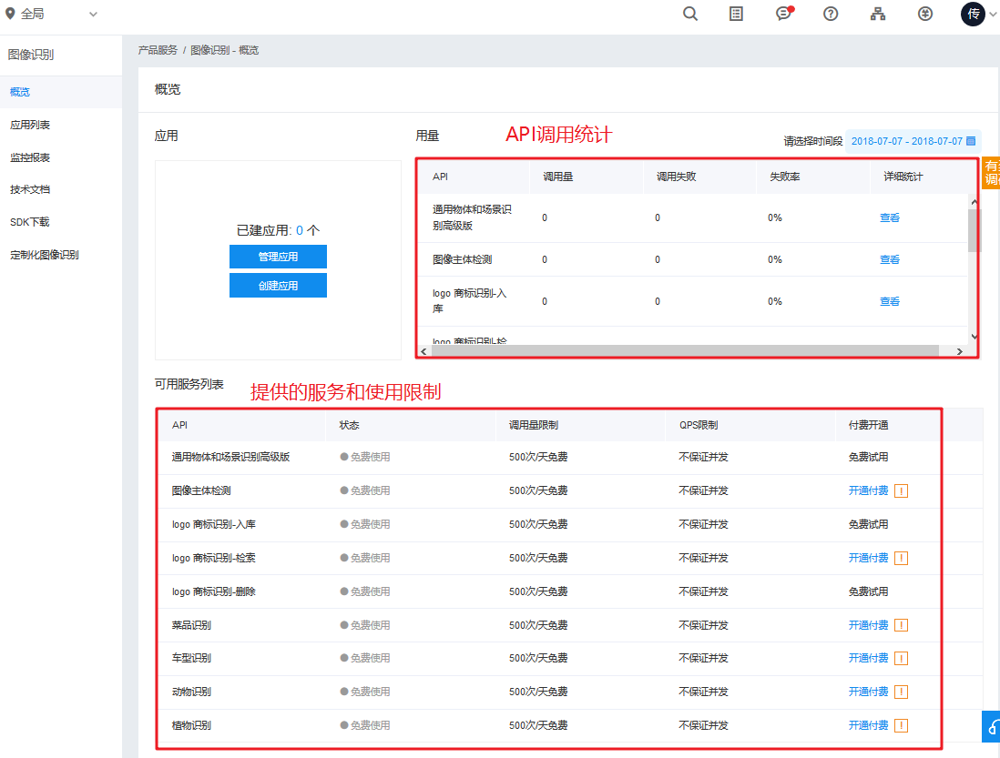

* 选择创建应用，填写应用名称，选择应用类型，选择接口，可以增加其他接口，填写应用描述，选择立即创建。

  

* 从应用列表可以看到创建的应用，并获得AppID，API Key 和 Secret Key。

  

  

## 2.2.3 图像识别SDK API 

### 2.2.3.1 注意事项

* 请求格式支持：PNG、JPG、JPEG、BMP、GIF
* 图片base64编码后大小不超过4M，最短边至少30px，最长边最大4096px，长宽比3：1以内 

### 2.2.3.2 AipImageClassify

AipImageClassify是图像识别的Python SDK客户端，为使用图像识别的开发人员提供了一系列的交互方法。 创建实例时需要提供应用的App_ID, API KEY 和 Secret Key。

参考如下代码新建一个AipImageClassify： 

```
from aip import AipImageClassify

""" 你的 APPID AK SK """
APP_ID = '你的 App ID'
API_KEY = '你的 Api Key'
SECRET_KEY = '你的 Secret Key'

client = AipImageClassify(APP_ID, API_KEY, SECRET_KEY)
```

### 2.2.3.3 通用物体识别 API

AipImageClassify的通用物体识别方法:
```python
client.advancedGeneral(image)
```

**通用物体识别 请求参数详情**

| 参数名称 | 是否必选 | 类型   | 说明                                                         |
| -------- | -------- | ------ | ------------------------------------------------------------ |
| image    | 是       | string | 图像数据，base64编码，要求base64编码后大小不超过4M，最短边至少15px，最长边最大4096px,支持jpg/png/bmp格式 |

**通用物体识别 返回数据参数详情**

| 字段       | 是否必选 | 类型          | 说明                                                      |
| ---------- | -------- | ------------- | --------------------------------------------------------- |
| log_id     | 是       | number        | 唯一的log id，用于问题定位                                |
| result_num | 是       | number        | 返回结果数目，及result数组中的元素个数                    |
| result     | 是       | array(object) | 标签结果数组                                              |
| +keyword   | 是       | string        | 图片中的物体或场景名称                                    |
| +score     | 是       | number        | 置信度，0-1                                               |
| +root      | 是       | string        | 识别结果的上层标签，有部分钱币、动漫、烟酒等tag无上层标签 |

**通用物体识别 返回示例**

```
{
    "result": [
        {
            "score": 0.996184,
            "root": "商品-电脑办公",
            "keyword": "台式机"
        },
        {
            "score": 0.799921,
            "root": "Logo",
            "keyword": "联想"
        },
        {
            "score": 0.424538,
            "root": "商品-电脑办公",
            "keyword": "电脑"
        },
        {
            "score": 0.213236,
            "root": "商品-电脑办公",
            "keyword": "服务器/工作站"
        },
        {
            "score": 0.10919,
            "root": "商品-数码产品",
            "keyword": "台式电脑"
        }
    ],
    "result_num": 5,
    "log_id": 2689001477
}
```

### 2.2.3.4 菜品识别 API

该请求用于菜品识别。即对于输入的一张图片（可正常解码，且长宽比适宜），输出图片的菜品名称、卡路里信息、置信度。 

```python
client.dishDetect(image, options)
```

**菜品识别 请求参数详情**

| 参数名称 | 是否必选 | 类型   | 说明                                                         |
| -------- | -------- | ------ | ------------------------------------------------------------ |
| image    | 是       | string | 图像数据，base64编码，要求base64编码后大小不超过4M，最短边至少15px，最长边最大4096px,支持jpg/png/bmp格式 |
| top_num  | 否       | string | 返回预测得分top结果数，默认为5                               |

**菜品识别 返回数据参数详情**

| 参数         | 类型 | 是否必须      | 说明                                   |
| ------------ | ---- | ------------- | -------------------------------------- |
| log_id       | 是   | number        | 唯一的log id，用于问题定位             |
| result_num   | 否   | number        | 返回结果数目，及result数组中的元素个数 |
| result       | 否   | array(object) | 菜品识别结果数组                       |
| +name        | 否   | string        | 菜名，示例：鱼香肉丝                   |
| +calorie     | 否   | number        | 卡路里，每100g的卡路里含量             |
| +probability | 否   | number        | 识别结果中每一行的置信度值，0-1        |

**菜品识别 返回示例**

```
{
  "log_id": 271468280,
  "result_num": 5,
  "result": [
          {
              "name": "烧烤（串类）",
              "calorie": 83.12,
              "probability": 0.35874313116074
          },
          {
              "name": "鱿鱼",
              "calorie": 402.12,
              "probability": 0.20610593259335
          },
          {
              "name": "板筋",
              "calorie": 333.55,
              "probability": 0.15860831737518
          },
          {
              "name": "鸡脆骨",
              "calorie": 661.33,
              "probability": 0.077698558568954
          },
          {
              "name": "麻辣烫",
              "calorie": 273.33,
              "probability": 0.041968926787376
          }
  ]
}
```

### 2.2.3.5 车辆识别

该请求用于检测一张车辆图片的具体车型。即对于输入的一张图片（可正常解码，且长宽比适宜），输出图片的车辆品牌及型号。 

```python
client.carDetect(image, options)
```

**车辆识别 请求参数详情**

| 参数名称 | 是否必选 | 类型   | 说明                                                         |
| -------- | -------- | ------ | ------------------------------------------------------------ |
| image    | 是       | string | 图像数据，base64编码，要求base64编码后大小不超过4M，最短边至少15px，最长边最大4096px,支持jpg/png/bmp格式 |
| top_num  | 否       | string | 返回预测得分top结果数，默认为5                               |

**车辆识别 返回数据参数详情**

| 参数   | 类型 | 是否必须      | 说明                       |
| ------ | ---- | ------------- | -------------------------- |
| log_id | 否   | number        | 唯一的log id，用于问题定位 |
| result | 否   | arrry(object) | 车型识别结果数组           |
| +name  | 否   | string        | 车型名称，示例：宝马x6     |
| +score | 否   | number        | 置信度，示例：0.5321       |

**车辆识别 返回示例**

```
{
  "log_id": 2399742249,
  "result": [
    {
      "name": "宝马X6",
      "score": 0.40009739995003
    },
    {
      "name": "宝马||X5",
      "score": 0.3136293888092
    },
    {
      "name": "宝马||X4",
      "score": 0.13881112635136
    }
  ]
}
```

### 2.2.3.6 错误信息

**错误返回格式**

若请求错误，服务器将返回的JSON文本包含以下参数：

- **error_code**：错误码。
- **error_msg**：错误描述信息，帮助理解和解决发生的错误。

**错误码**

| 错误码 | 错误信息                                | 描述                                                         |
| ------ | --------------------------------------- | ------------------------------------------------------------ |
| 4      | Open api request limit reached          | 集群超限额                                                   |
| 14     | IAM Certification failed                | IAM鉴权失败，建议用户参照文档自查生成sign的方式是否正确，或换用控制台中ak sk的方式调用 |
| 17     | Open api daily request limit reached    | 每天流量超限额                                               |
| 18     | Open api qps request limit reached      | QPS超限额                                                    |
| 19     | Open api total request limit reached    | 请求总量超限额                                               |
| 100    | Invalid parameter                       | 无效参数                                                     |
| 110    | Access token invalid or no longer valid | Access Token失效                                             |
| 111    | Access token expired                    | Access token过期                                             |
| 282000 | internal error                          | 服务器内部错误，请再次请求， 如果持续出现此类错误，请通过QQ群（649285136）或工单联系技术支持团队。 |
| 216100 | invalid param                           | 请求中包含非法参数，请检查后重新尝试                         |
| 216101 | not enough param                        | 缺少必须的参数，请检查参数是否有遗漏                         |
| 216102 | service not support                     | 请求了不支持的服务，请检查调用的url                          |
| 216103 | param too long                          | 请求中某些参数过长，请检查后重新尝试                         |
| 216110 | appid not exist                         | appid不存在，请重新核对信息是否为后台应用列表中的appid       |
| 216200 | empty image                             | 图片为空，请检查后重新尝试                                   |
| 216201 | image format error                      | 上传的图片格式错误，现阶段我们支持的图片格式为：PNG、JPG、JPEG、BMP，请进行转码或更换图片 |
| 216202 | image size error                        | 上传的图片大小错误，现阶段我们支持的图片大小为：base64编码后小于4M，分辨率不高于4096*4096，请重新上传图片 |
| 216203 | image size error                        | 上传的图片base64编码有误，请校验base64编码方式，并重新上传图片 |
| 216630 | recognize error                         | 识别错误，请再次请求，如果持续出现此类错误，请通过QQ群（649285136）或工单联系技术支持团队。 |
| 216631 | recognize bank card error               | 识别银行卡错误，出现此问题的原因一般为：您上传的图片非银行卡正面，上传了异形卡的图片或上传的银行卡正品图片不完整 |
| 216633 | recognize idcard error                  | 识别身份证错误，出现此问题的原因一般为：您上传了非身份证图片或您上传的身份证图片不完整 |
| 216634 | detect error                            | 检测错误，请再次请求，如果持续出现此类错误，请通过QQ群（649285136）或工单联系技术支持团队。 |
| 282003 | missing parameters: {参数名}            | 请求参数缺失                                                 |
| 282005 | batch  processing error                 | 处理批量任务时发生部分或全部错误，请根据具体错误码排查       |
| 282006 | batch task  limit reached               | 批量任务处理数量超出限制，请将任务数量减少到10或10以下       |
| 282100 | image transcode error                   | 图片压缩转码错误                                             |
| 282101 | image split limit reached               | 长图片切分数量超限                                           |
| 282102 | target detect error                     | 未检测到图片中识别目标                                       |
| 282103 | target recognize error                  | 图片目标识别错误                                             |
| 282114 | url size error                          | URL长度超过1024字节或为0                                     |
| 282808 | request id: xxxxx not exist             | request id xxxxx 不存在                                      |
| 282809 | result type error                       | 返回结果请求错误（不属于excel或json）                        |
| 282810 | image recognize error                   | 图像识别错误                                                 |
| 283300 | Invalid argument                        | 入参格式有误，可检查下图片编码、代码格式是否有误             |
| 336000 | Internal error                          | 服务器内部错误，请再次请求， 如果持续出现此类错误，请通过QQ群（185289236）或工单联系技术支持团队 |
| 336001 | Invalid Argument                        | 入参格式有误，比如缺少必要参数、图片base64编码错误等等，可检查下图片编码、代码格式是否有误。有疑问请通过QQ群（185289236）或工单联系技术支持团队 |

## 2.2.4 通用物体和场景识别
* 先安装一个python下的爬虫工具 alfred
```python
pip install alfred-py
```


* 爬几张家居的照片

```python
alfred scrap image -q 家居
```

* 实例化AipImageClassify, 参数为APP id, API Key 和 Secret Key

```python
from aip import AipImageClassify
from pprint import pprint

def general_detect(client, image_path):
    """
    通用物体识别
    :param client: AipImageClassif实例
    :param image_path: 图片路径
    :return: None
    """
    f = open(image_path, 'rb')

    result = client.advancedGeneral(f.read())

    pprint(result)

    return None

if __name__ == '__main__':
    aip = AipImageClassify('11506432', 'L4gIVi3pZeDWLx3TLCHe8rU5', 'D***l4jbBT6pjNsKzSxSRt')

    general_detect(aip, '家居\家居_05.jpg')
```

返回的结果: 

```python
{'log_id': 7970756042342177831,
 'result': [{'keyword': '起居室', 'root': '建筑-居家室内', 'score': 0.666436},
            {'keyword': '实木沙发', 'root': '商品-家具', 'score': 0.592746},
            {'keyword': '装修效果图', 'root': '非自然图像-其他', 'score': 0.41367},
            {'keyword': '沙发', 'root': '商品-家具', 'score': 0.190492},
            {'keyword': '室内装饰', 'root': '商品-家具', 'score': 0.02024}],
 'result_num': 5}
```

## 2.2.5 菜品识别

* 爬几张菜品照片

```python
alfred scrap image -q 菜品
```

* 实例化AipImageClassify
* 填写参数
* 调用dishDetect函数

```python
from aip import AipImageClassify
from pprint import pprint

def dish_detect(client, image_path):
    """
    菜品识别
    :param client: AipImageClassify实例
    :param image_path: 图片路径
    :return: None
    """
    with open(image_path, 'rb') as f:

        options={}
        options['top_num'] = 3
        result = client.dishDetect(f.read(), options)
        pprint(result)

    return None

if __name__ == '__main__':
    aip = AipImageClassify('11506432', 'L4gIVi3pZeDWLx3TLCHe8rU5', 'Du****6pjNsKzSxSRt')

    dish_detect(aip, '菜品\菜品_035.jpg')
```

检测结果

```python
{'log_id': 5399735413461829403,
 'result': [{'calorie': '128',
             'has_calorie': True,
             'name': '香辣蟹',
             'probability': '0.642212'},
            {'calorie': '102',
             'has_calorie': True,
             'name': '大闸蟹',
             'probability': '0.192288'},
            {'calorie': '肉蟹煲',
             'has_calorie': True,
             'name': '肉蟹煲',
             'probability': '0.0669314'}],
 'result_num': 3}
```


## 2.2.6 车辆识别案例 
* 爬几辆汽车图片用于识别,  差不多就可以ctrl+c终止
```python
alfred scrap image -q 宾利
```
* 实例化AipImageClassify类
* 读取图片
* 填写参数 top_num =3
* 调用carDetect函数

```python
from aip import AipImageClassify
from pprint import pprint

def car_detect(client, img_path):
    """
    :param client: AipImageClassify 实例
    :param img_path: 图片路径
    :return: None
    """
    # 读取图片
    f = open(img_path, 'rb')

    # 只需要排在前3个的预测
    options = {}
    options['top_num'] = 3

    # 调用函数预测
    result = client.carDetect(f.read(), options)

    # 打印结果
    pprint(result)

    return None

if __name__ == '__main__':
    # 实例化
    aip = AipImageClassify('11506432', 'L4gIVi3pZeDWLx3TLCHe8rU5', 'Du****BT6pjNsKzSxSRt')

    car_detect(aip, '宾利\宾利_056.jpg')

```

结果

```python
{'color_result': '黑色',
 'location_result': {'height': 278, 'left': 30, 'top': 50, 'width': 431},
 'log_id': 9014225912097263543,
 'result': [{'name': '宾利飞驰', 'score': 0.55269467830658, 'year': '2017'},
            {'name': '宾利欧陆', 'score': 0.44687646627426, 'year': '2017'},
            {'name': '奥迪TT',  'score': 6.3899002270773e-05, 'year': '2004-2017'}]}
```

## 2.2.7 EasyDL定制化图像识别

百度人工智能平台提供的服务是已经训练好的模型，但是不可能把所有用户需要解决的问题都囊括了，这时候就可以使用百度提供的EasyDL定制化图像识别，上传自己的数据集进行训练，得到自己的模型，又避免了从头开始收集并标记大量数据，并进行训练的过程.

### 2.2.7.1 特点

* 可视化操作界面
* 无需算法知识
* 需要的数据量更少
* 自动化训练图像识别模型，生成专属API接口
* 支持定制图像分类和物体检测

### 2.2.7.2 功能

**图像分类** 识别一张图中是否是某类物体/状态/场景。可以识别图片中主体单一的场景。

[应用场景] 1、图片内容检索，可定制识别各类物体 2、UGC内容审核 3、工业分拣或质检

**物体检测**： 在一张图包含多个物体的情况下，定制识别出每个物体的位置、数量、名称。可以识别图片中有多个主体的场景。

[应用场景] 1、物体计数，如零售行业货品摆放统计、医疗细胞计数 2、一图多物识别，识别一张图中多个物体

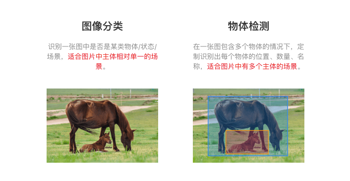

### 2.2.7.3 使用流程概述


## 2.2.8 EasyDL定制化图像分类案例

案例: 对水果进行分类, 三类水果的图片, 香蕉, 橘子和菠萝,训练一个模型对水果类型进行分类.每个类别的图片几张.

### 2.2.8.1 定制化服务步骤 

* 设计分类，每个分类为一种识别结果。

  **注意：目前单个模型的上限为1000类** 

* 准备数据

  * 每个分类需要准备**20张以上，如果想要较好的效果，建议100张起**图片。如果某些分类的图片具有相似性，需要增加更多图片 
  * 图片格式：png，bmp，jpeg。大小限制在4M以内。长宽比在3：1以内，其中最长边需要小于4096px，最短边需要大于30px，一个模型的图片总量限制**10万张**图片。 
  * 训练集图片需要和实际场景要识别的图片环境一致 。
  * 每个分类的图片需要覆盖实际场景里面尽量多的可能性。
  * 识别的主体在图片中占比较大 。

  按照不同的类别存放到不同的目录，目录为类别名称，只支持英文，并压缩为zip文件。

  

* 访问EasyDL定制化图像平台 http://ai.baidu.com/easydl/ , 点击开始训练模型

  

这个页面上的信息很有用, 可以看视频了解Easy DL, 如何训练图像分类模型 和 如何训练物体检测模型, 也可以看看论坛,上面有攻略和例子.

* 选择定制化图像识别的类型, 选择图像分类.

  

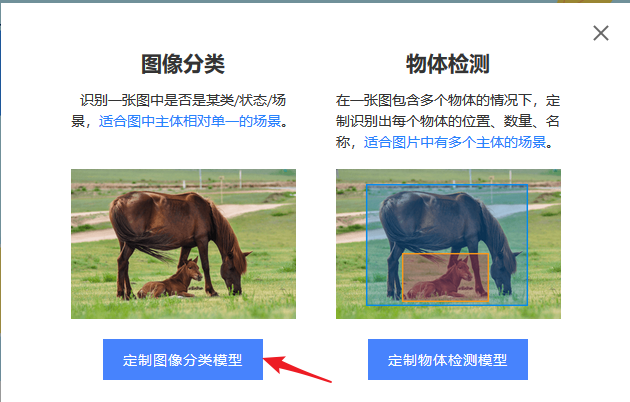

* 创建模型

  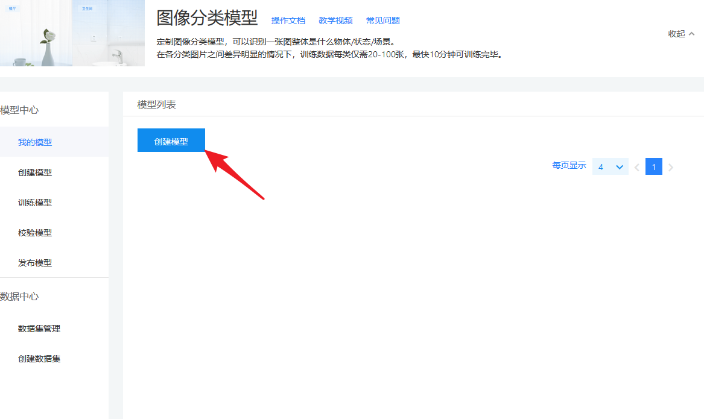

* 填写模型名称,联系方式, 功能描述, 选择下一步.

  

* 点下一步, 可以看到创建的模型, 但是除了删除, 没有其他的操作. 这是因为还没有数据集, 所以也无法开始训练.

  

* 选择创建数据集,上传数据集.

  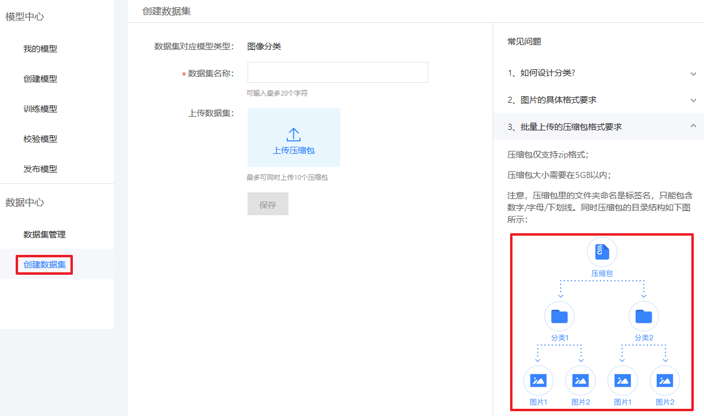

* 训练模型. 有了数据就可以开始训练模型, 选择左边的训练数据, 从选择模型列表选择创建的模型.

  

  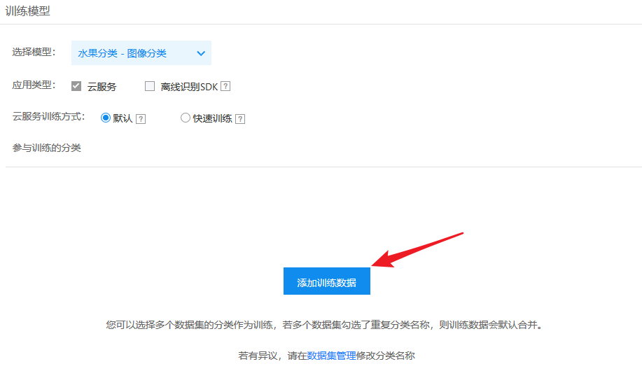

* 选择图片类别, 添加训练数据集, 点完成.

  

* 增加其他分类, 这样可以把不认识的类别都分到这一类, 然后开始训练, 等待训练结束.

  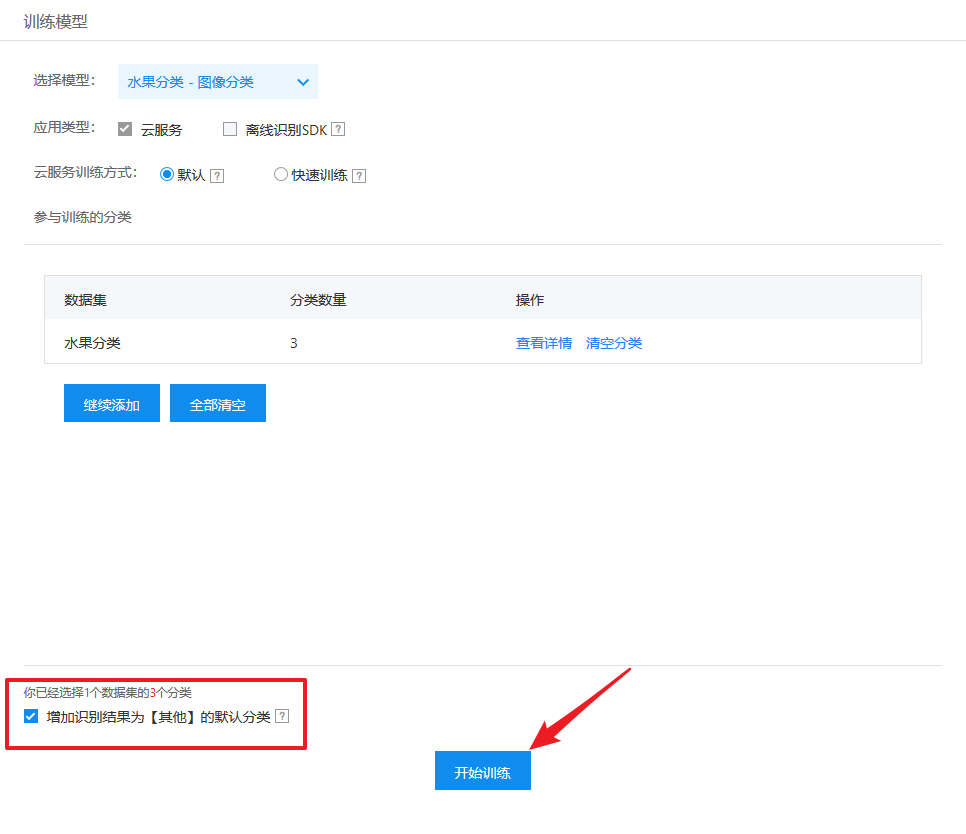

* 可以在"我的模型"中看到模型的状态和训练结果

  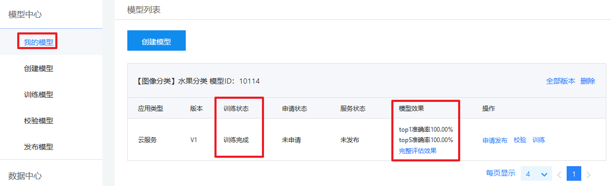

* 查看完整的训练结果

  如果单个分类/标签的图片量在100张以内，这个数据基本参考意义不大。 可以通过模型校验功能进行校验，或者发布为接口后测试 。

  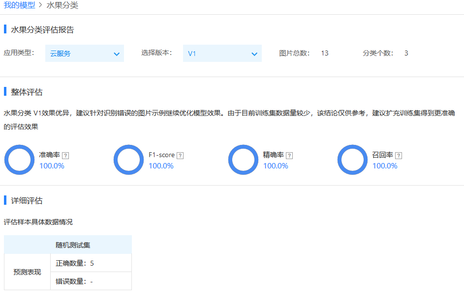

* 校验模型

  

* 申请发布模型.

  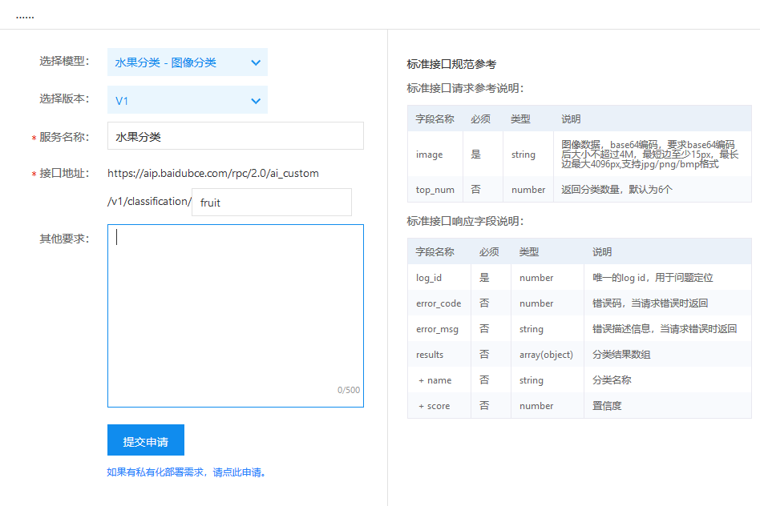

* 等待审核。

  

* 审核通过后的状态，审核成功，服务状态为已发布。

  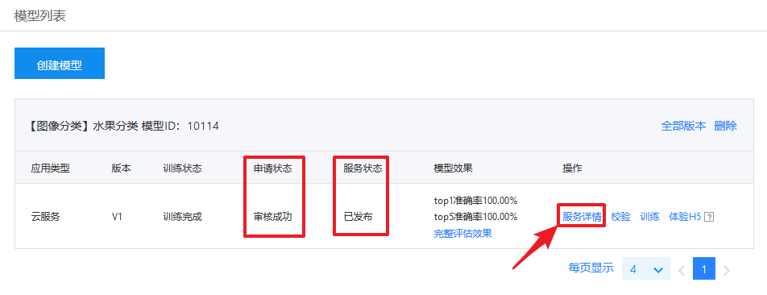

* 服务详情, 获取服务接口地址

  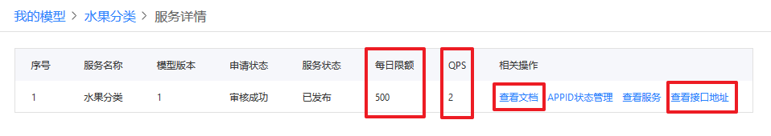

### 2.2.8.2 把应用和服务关联

类似于使用百度的服务一样，需要先创建应用或者把已经创建的应用添加给定制化服务。

* 先登录百度账号，并访问图像识别控制台，可以看到定制化的服务，但是并不能直接使用。

  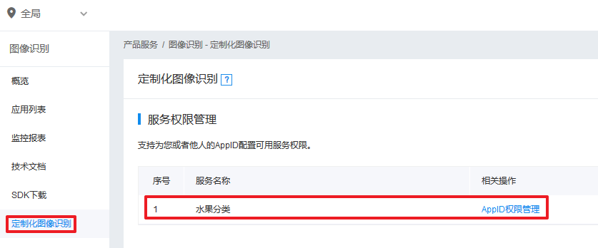

* 创建定制化图像应用并获取应用的APPID，或者获取已有应用的APPID. 点击上图的【AppID权限管理】,添加APPID. 课用APP就可以看到新添加的APP.现在就可以调用这个服务了, 流程和REST API一样.

  

### 2.2.8.3 获取Access Token API

**请求URL数据格式**

向授权服务地址`https://aip.baidubce.com/oauth/2.0/token`发送请求（推荐使用POST），并在URL中带上以下参数：

- **grant_type：** 必须参数，固定为`client_credentials`；

- **client_id：** 必须参数，应用的`API Key`；

- **client_secret：** 必须参数，应用的`Secret Key`；

  ```python
  'https://aip.baidubce.com/oauth/2.0/token?grant_type=client_credentials&client_id=【应用的API Key】&client_secret=【应用的Secret Key】
  ```

**服务器返回的JSON文本参数如下：**

- **access_token：** 要获取的Access Token；
- **expires_in：** Access Token的有效期(秒为单位，一般为1个月)；
- **其他参数忽略，暂时不用**;

例如：

```
{
  "refresh_token": "25.b55fe1d287227ca97aab219bb249b8ab.315360000.1798284651.282335-8574074",
  "expires_in": 2592000,
  "scope": "public wise_adapt",
  "session_key": "9mzdDZXu3dENdFZQurfg0Vz8slgSgvvOAUebNFzyzcpQ5EnbxbF+hfG9DQkpUVQdh4p6HbQcAiz5RmuBAja1JJGgIdJI",
  "access_token": "24.6c5e1ff107f0e8bcef8c46d3424a0e78.2592000.1485516651.282335-8574074",
  "session_secret": "dfac94a3489fe9fca7c3221cbf7525ff"
}
```

**若请求错误，服务器将返回的JSON文本包含以下参数：**

- **error：** 错误码；关于错误码的详细信息请参考下方鉴权认证错误码。

- **error_description：** 错误描述信息，帮助理解和解决发生的错误。

**例如认证失败返回：**

```
{
    "error": "invalid_client",
    "error_description": "unknown client id"
}
```

**鉴权认证错误码**

| error          | error_description            | 解释             |
| -------------- | ---------------------------- | ---------------- |
| invalid_client | unknown client id            | API Key不正确    |
| invalid_client | Client authentication failed | Secret Key不正确 |

### 2.2.8.4 定制化图像分类API

**请求说明**

HTTP 方法：`POST`

请求URL： 请首先在[定制化图像训练平台](http://ai.baidu.com/easydl/)进行自定义模型训练，完成训练后可在服务列表中查看并获取url。

URL参数：

| 参数         | 值                                                           |
| ------------ | ------------------------------------------------------------ |
| access_token | 通过API Key和Secret Key获取的access_token,参考“[Access Token获取](http://ai.baidu.com/docs#/Auth)” |

Header如下：

| 参数         | 值               |
| ------------ | ---------------- |
| Content-Type | application/json |

**注意**：如果出现336001的错误码很可能是因为请求方式错误，与其他图像识别服务不同的是定制化图像识别服务以json方式请求。

Body请求示例：

```
{
    "image": "<base64数据>",
    "top_num": 5
}
```

Body中放置请求参数，参数详情如下：

**请求参数**

| 参数    | 是否必选 | 类型   | 可选值范围 | 说明                                                         |
| ------- | -------- | ------ | ---------- | ------------------------------------------------------------ |
| image   | 是       | string | -          | 图像数据，base64编码，要求base64编码后大小不超过4M，最短边至少15px，最长边最大4096px,支持jpg/png/bmp格式 **注意请去掉头部** |
| top_num | 否       | number | -          | 返回分类数量，默认为6个                                      |

### 返回说明

**返回参数**

| 字段    | 是否必选 | 类型          | 说明                       |
| ------- | -------- | ------------- | -------------------------- |
| log_id  | 是       | number        | 唯一的log id，用于问题定位 |
| results | 否       | array(object) | 分类结果数组               |
| +name   | 否       | string        | 分类名称                   |
| +score  | 否       | number        | 置信度                     |

### 2.2.8.4 步骤和代码实现

* 获取Access Token, URL 为 图像识别的鉴权地址, 通过图像识别的API文档可以获得

  ```python
  # client_id 为应用的API Key， client_secret 为应用的Secret Key
  token_url = 'https://aip.baidubce.com/oauth/2.0/token?grant_type=client_credentials&client_id=EOKenHuXzwBUl78kqkGRg8kz&client_secret=rGrPL5TpFu7Eh1dcBzxn50U1276cis2P'
  
  # 构建http 请求
  request = urllib.request.Request(token_url)
  request.add_header('Content-Type', 'application/json; charset=UTF-8')
  
  # 发送请求
  response = urllib.request.urlopen(request)
  
  # 读取返回信息
  content = response.read()
  
  # 解析并获得access token
  access_token = json.loads(content.decode())['access_token']
  ```

* 读取需要分类的照片, 调用定制化的服务API进行分类

  服务URL,  可以去easyDL的模型中心找到这个URL http://ai.baidu.com/easydl/ , 这个地址也是之前创建服务时提供的地址

  ```python
  https://aip.baidubce.com/rpc/2.0/ai_custom/v1/classification/itcast_fruit
  ```

  调用接口代码:

  * 以二进制形式读取图片
  * 对图片数据base64编码, 并调用decode解码为string类型
  * 以字典形式构建参数
  * 把字典参数编码为JSON字符串并编码为utf-8 bytes
  * 构建http请求, 填写http头
  * 发送请求
  * 解析结果

  ```python
  # 读取照片调用接口对图片分类
  with open('banana.jpg', 'rb') as f:
      # 以二进制形式读取图片
      image_jpg = f.read()
      # 对图片数据base64编码, 并调用decode解码为string类型
      img64 = base64.b64encode(image_jpg).decode()
      
      params = {}
      params['image'] = img64
      params['top_num'] = 2
      
      # 把字典对象编码为JSON字符串 
      params = json.dumps(params).encode()
      
      # 服务URL 和 access token 参数
      api_url = 'https://aip.baidubce.com/rpc/2.0/ai_custom/v1/classification/itcast_fruit' + '?access_token=' + access_token
      
      # 构建http 请求
      request = urllib.request.Request(api_url, data=params)
      request.add_header('Content-Type', 'application/json; charset=UTF-8')
      
      # 发送请求
      response = urllib.request.urlopen(request)
      
      # 读取返回信息
      content = response.read()
      
      # 解析结果
      result = json.loads(content.decode())
      pprint(result)
  ```

  可能出现的错误:

* 没有把应用和定制化服务关联

  ```python
  {
      'error_code': 6, 
      'error_msg': 'No permission to access data'
  }
  ```

* 参数错误

  ```python
  {
      'error_code': 336001,
  	'error_msg': 'Invalid argument',
  	'log_id': 3151667044574823085
  }
  ```


### 2.2.8.5 模型迭代

  一个模型很难一次性就训练到最佳的效果，可能需要结合模型评估报告和校验结果不断扩充数据和调优。 当模型训练完毕后，会生成一个最新的版本号，首次V1、之后V2……以此类推，只要确定了一个模型后，之后有迭代需求只需要在训练模型中选择一个历史版本号，就可以基于历史版本进行迭代。 

**注意：如果模型已经是上线状态，依然支持模型迭代，只是需要在训练完毕后更新下线上服务接口。** 


### 2.2.8.6 可能存在的问题

* 数据处理失败或者状态异常

  图像分类模型上传处理失败，需先检查已上传的分类命名是否正确，是否存在中文命名、或者增加了空格；然后检查下数据图片量是否超过上限（10万张）；再检查图片中是否有损坏。

* 模型效果不好

  * 训练数据是否和实际场景要识别的图片一致 
  * 训练数据量是否太少 

## 2.2.9 EasyDL定制化图像物体检测

定制物体检测模型，可以检测出图片里面的所有目标物体名称、位置。适用于一张图片中要识别多个物体，物体计数等场景中。 在各检测物体之间差异明显的情况下，训练数据每个标签仅需覆盖20-100张图片，训练时间可能需要30分钟以上。 

### 2.2.9.1 步骤

* 创建模型
* 创建数据集，数据标注，上传数据并标记
* 训练模型并验证
* 上线服务

### 2.2.9.2 数据集准备和标记

* 设计标签：上传之前需要想好都有哪些标签，每个标签就是对这张照片希望识别出的全部结果的一个类别。

* 准备图片：基于设计好的标签准备图片数据，每种要识别出的标签在所有图片数量加起来需要有**20-100个**，如果某些标签的图片具有相似性，需要增加更多图片。 图片的格式和大小要求，拍摄要求和图像分类时一样的。

* 创建数据集

  

* 上传照片数据标注

  选择数据标注， 从数据集选择刚创建的数据集， 在右边的标签下面创建标签类别，标签不支持中文。

  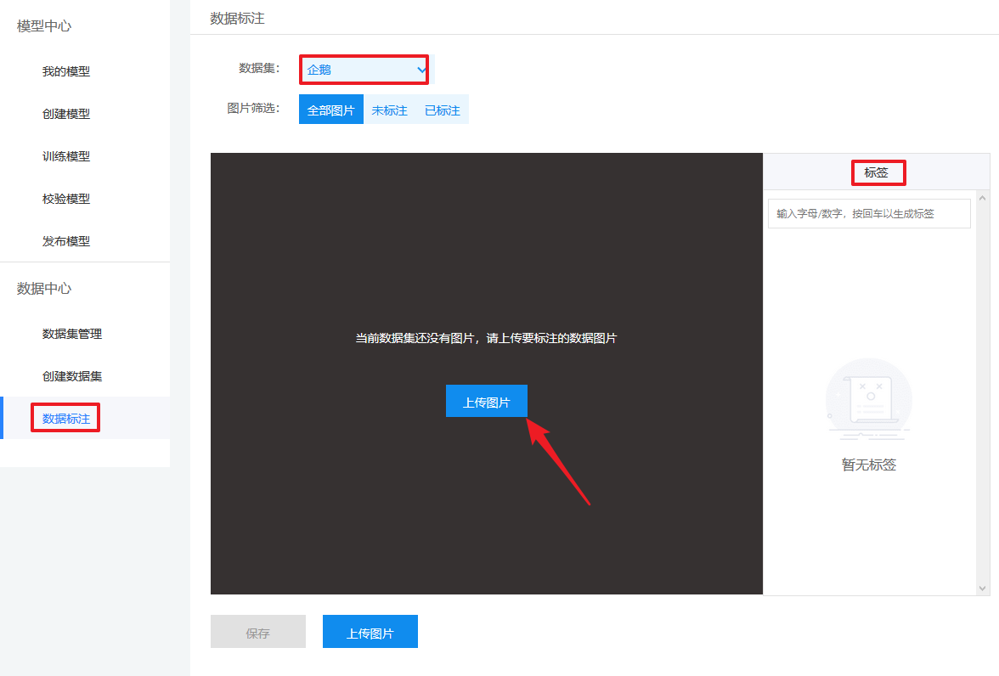

* 选择一张或者多张照片上传后，自动进入标记，标记照片。如果多余一个类别，需选择标签。标记完成后，选择保存。也可以选择上传照片继续上传并标记更多照片。

  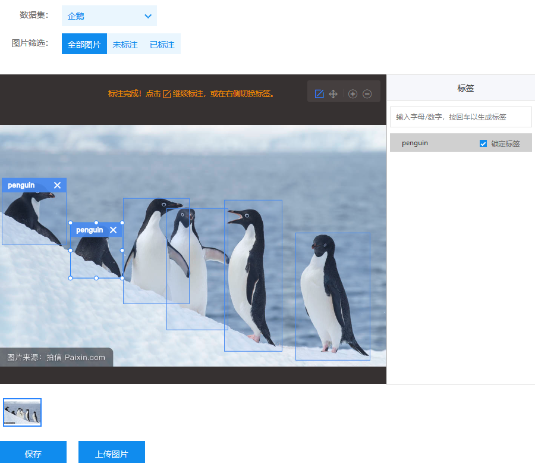

  

* 训练模型。选择刚创建的数据集和模型


### 2.2.9.3 物体检测API 

**请求说明**

HTTP 方法：`POST`

请求URL： 自定义模型训练完成训练并申请上线成功后可在服务列表中查看并获取url。

URL参数：

| 参数         | 值                                                           |
| ------------ | ------------------------------------------------------------ |
| access_token | 通过API Key和Secret Key获取的access_token,参考“[Access Token获取](http://ai.baidu.com/docs#/Auth)” |

Header如下：

| 参数         | 值               |
| ------------ | ---------------- |
| Content-Type | application/json |

**注意**：如果出现336001的错误码很可能是因为请求方式错误，与其他图像识别服务不同的是定制化图像识别服务以json方式请求。

Body请求示例：

```
{
    "image": "<base64数据>",
}
```

Body中放置请求参数，参数详情如下：

**请求参数**

| 参数      | 是否必选 | 类型   | 可选值范围 | 说明                                                         |
| --------- | -------- | ------ | ---------- | ------------------------------------------------------------ |
| image     | true     | string | -          | 图像数据，base64编码，要求base64编码后大小不超过4M，最短边至少15px，最长边最大4096px,支持jpg/png/bmp格式 **注意请去掉头部** |
| threshold | false    | number | -          | 默认值为0.3，请在我的模型列表-模型效果查看推荐阈值           |

### 返回说明

**返回参数**

| 字段      | 是否必选 | 类型          | 说明                                   |
| --------- | -------- | ------------- | -------------------------------------- |
| log_id    | 是       | number        | 唯一的log id，用于问题定位             |
| results   | 否       | array(object) | 识别结果数组                           |
| +name     | 否       | string        | 分类名称                               |
| +score    | 否       | number        | 置信度                                 |
| +location | 否       |               |                                        |
| ++left    | 否       | number        | 检测到的目标主体区域到图片左边界的距离 |
| ++top     | 否       | number        | 检测到的目标主体区域到图片上边界的距离 |
| ++width   | 否       | number        | 检测到的目标主体区域的宽度             |
| ++height  | 否       | number        | 检测到的目标主体区域的高度             |

## 2.2.10 图像识别的错误码

参见网站 http://ai.baidu.com/docs#/ImageClassify-API/14383696

