# 2.3 文字识别

提供多种场景下精准的图像文字识别技术服务 让应用看图识字，提升输入效率，优化用户体验 

## 2.3.1 功能

* 通用文字识别：多场景、多语种（支持中、英、葡、法、德、意、西、俄、日、韩、中英混合识别）的整体文字检测和识别，同时提供含位置信息版、含生僻字版和高精度版的高级服务 。

  

* 卡片证照识别：基于业界领先的深度学习技术，提供对二代居民身份证、银行卡、机动车驾驶证、机动车行驶证、中国大陆护照、各类名片的识别服务。

  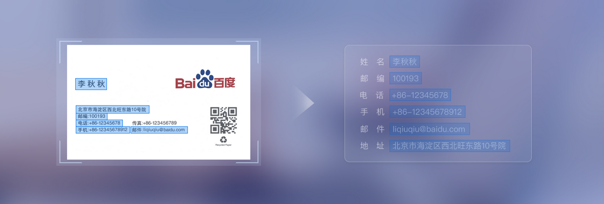

* 网络图片文字识别：能够快速准确识别各种网络图片中的文字，在复杂字体和复杂背景的情况下仍能保持非常高的识别准确率。 

  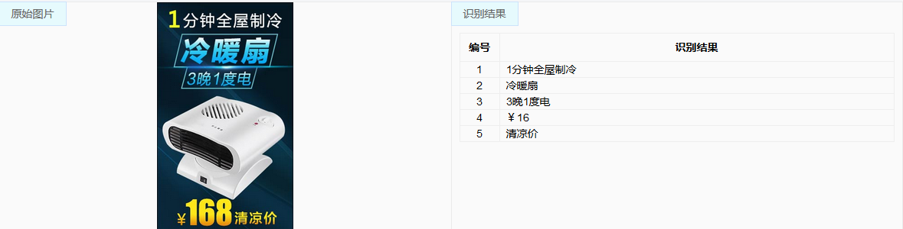

* 表格文字识别 : 自动识别表格线及表格内容，结构化输出表头、表尾及每个单元格的文字内容 帮助您快速便捷地完成纸质报表单据的电子化。

  

* 营业执照识别: 支持对营业执照关键字段的识别，包括单位名称、法人、地址、有效期、证件编号、社会信用代码等。

  

* 手写识别：能够对手写汉字和手写数字进行识别 

* 二维码识别 ：能够识别出二维码、条形码中对应的内容

* 彩票识别：能对大乐透、双色球彩票进行识别 。

* 数字识别：识别并返回图片中的数字内容，适用于手机号提取、快递单号提取、充值号码提取等场景。

* 车牌识别：支持对中国大陆机动车车牌的识别，包括地域编号和车牌号。

  

* 票据识别：支持对增值税发票的识别，结构化输出结果；对医疗票据、保险保单、银行兑票、购物小票、的士发票等各类票据进行通用识别，并按行输出所有文字结果。

  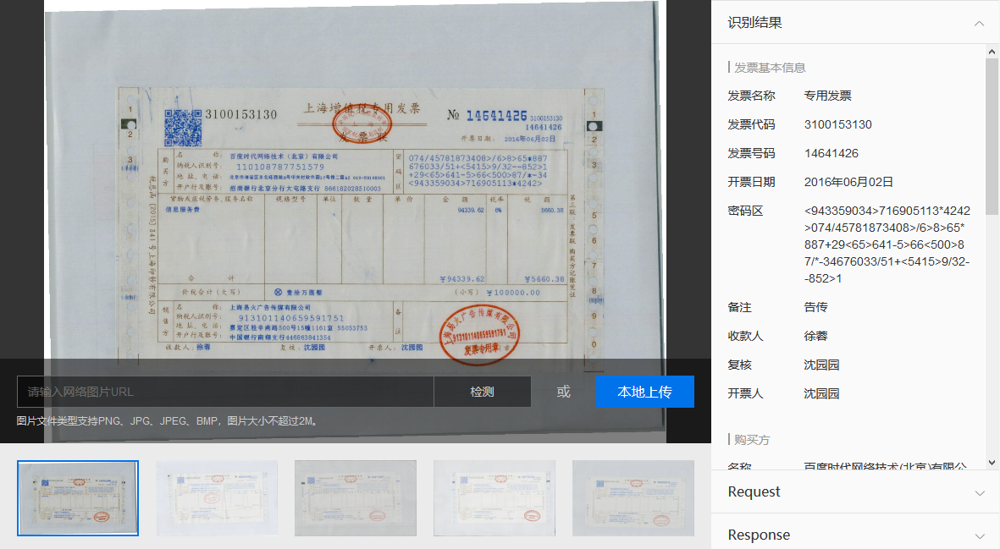

* 自定义模板文字识别：支持对各类票据、卡证制作自助化制作模板，结构化抽取数据。

| 接口名称                       | 接口能力简要描述                                             |
| ------------------------------ | ------------------------------------------------------------ |
| 通用文字识别                   | 识别图片中的文字信息                                         |
| 通用文字识别（高精度版）       | 更高精度地识别图片中的文字信息                               |
| 通用文字识别（含位置信息版）   | 识别图片中的文字信息（包含文字区域的坐标信息）               |
| 通用文字识别（高精度含位置版） | 更高精度地识别图片中的文字信息（包含文字区域的坐标信息）     |
| 通用文字识别（含生僻字版）     | 识别图片中的文字信息（包含对常见字和生僻字的识别）           |
| 网络图片文字识别               | 识别一些网络上背景复杂，特殊字体的文字                       |
| 手写识别                       | 识别手写中文汉字或数字                                       |
| 身份证识别                     | 识别身份证正反面的文字信息                                   |
| 银行卡识别                     | 识别银行卡的卡号并返回发卡行和卡片性质信息                   |
| 驾驶证识别                     | 识别机动车驾驶证所有关键字段                                 |
| 行驶证识别                     | 识别机动车行驶证所有关键字段                                 |
| 车牌识别                       | 对大陆车牌（包含新能源车牌）进行识别                         |
| 营业执照识别                   | 对营业执照进行识别                                           |
| 护照识别                       | 支持对中国大陆居民护照的资料页进行结构化识别，包含国家码、姓名、性别、护照号、出生日期、签发日期、有效期至、签发地点 |
| 名片识别                       | 提供对各类名片的结构化识别功能，提取姓名、邮编、邮箱、电话、网址、地址、手机号字段 |
| 表格文字识别 （异步接口）      | 自动识别表格线及表格内容，结构化输出表头、表尾及每个单元格的文字内容，提交图像和获取结果通过两个接口实现，稳定性更高 |
| 表格文字识别 （同步接口）      | 自动识别表格线及表格内容，结构化输出表头、表尾及每个单元格的文字内容，提交图像后实时获得返回结果，实效性更好 |
| 通用票据识别                   | 对各类票据图片（医疗票据，保险保单等）进行文字识别，并返回文字在图片中的位置信息 |
| 增值税发票识别                 | 对增值税发票进行文字识别，并结构化返回字段信息               |
| 二维码识别                     | 识别条形码、二维码中包含的URL或其他信息内容                  |
| 数字识别                       | 对图像中的阿拉伯数字进行识别提取，适用于快递单号、手机号、充值码提取等场景 |
| 彩票识别                       | 对大乐透、双色球彩票进行识别，并按行返回识别结果             |
| 自定义模板文字识别             | 自定义模板文字识别可以通过自助的模板制作，建立起键值的对应关系，一步完成非结构化到结构化的转换，实现自动化的数据录入 |

**目前需要提“商务咨询”开权限OCR的接口有：**

名片识别、护照识别、表格文字（同步接口）、手写识别、二维码识别、增值税发票识别、彩票识别、数字识别

## 2.3.2 安装OCR Python SDK

确认安装的人工智能SDK包含了最新的版本(https://ai.baidu.com/sdk#ocr)。

## 2.3.3 创建文字识别应用

* 登录控制台，选择文字识别

  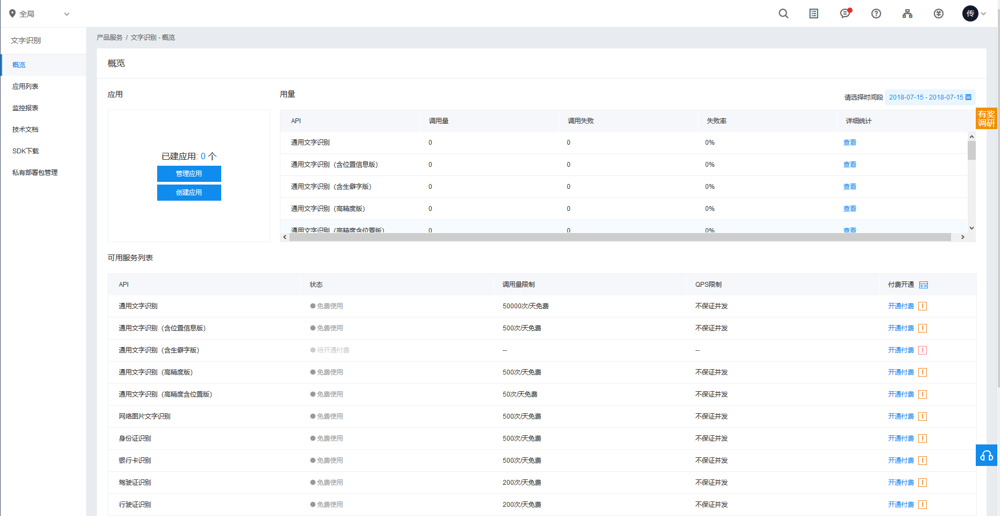

* 创建应用

  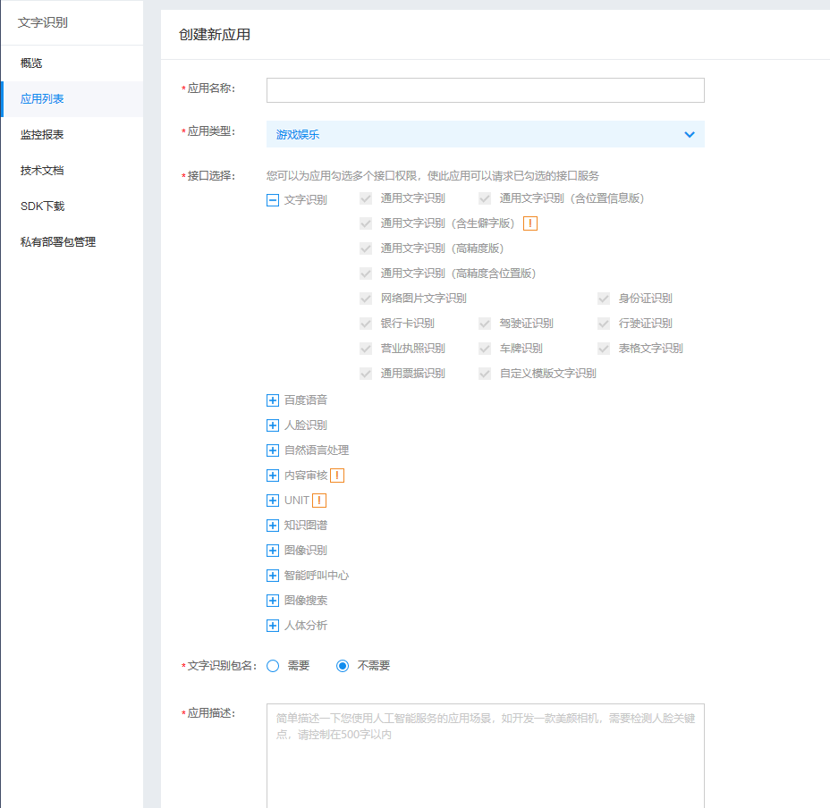

  * 从应用列表获取App ID, API Key 和Secret Key.

    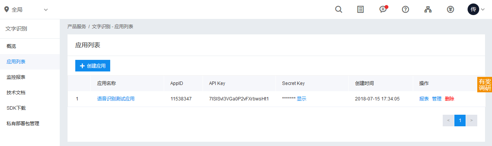

## 2.3.4 文字识别 Python 客户端 AipOcr

AipOcr是OCR的Python SDK客户端，为使用OCR的开发人员提供了一系列的交互方法。 

  ```python
  client = AipOcr(APP_ID, API_KEY, SECRET_KEY)
  ```

## 2.3.5 通用文字识别 

### 2.3.5.1 应用场景

* 拍照/涂抹识别 ：在书摘、笔记、搜索、翻译等移动应用中，实现拍照自动识别文字、涂抹识别指定区域文字，方便用户进行文本录入，提高产品易用性和用户体验。
* 内容审核与监管 ：识别图像和视频中的违规文字内容，进行违规处理和风险管控 。
* 视频内容分析 ：识别视频中的字幕、标题、弹幕、画面中的文字信息等内容，用于视频分类和标签提取、视频内容审核、营销分析等多种场景 。

### 2.3.5.2 通用文字识别 API 介绍

```python
""" 调用通用文字识别, 图片参数为本地图片 """
client.basicGeneral(image，options);
""" 调用通用文字识别, 图片参数为远程url图片 """
client.basicGeneralUrl(url, options)
```

**通用文字识别 请求参数详情**

| 参数名称         | 是否必选 | 类型   | 可选值范围                                  | 默认值  | 说明                                                         |
| ---------------- | -------- | ------ | ------------------------------------------- | ------- | ------------------------------------------------------------ |
| image            | 是       | string |                                             |         | 图像数据，base64编码，要求base64编码后大小不超过4M，最短边至少15px，最长边最大4096px,支持jpg/png/bmp格式 |
| url              | 是       | string |                                             |         | 图片完整URL，URL长度不超过1024字节，URL对应的图片base64编码后大小不超过4M，最短边至少15px，最长边最大4096px,支持jpg/png/bmp格式，当image字段存在时url字段失效 |
| language_type    | 否       | string | CHN_ENG ENG POR FRE GER ITA SPA RUS JAP KOR | CHN_ENG | 识别语言类型，默认为CHN_ENG。可选值包括： - CHN_ENG：中英文混合； - ENG：英文； - POR：葡萄牙语； - FRE：法语； - GER：德语； - ITA：意大利语； - SPA：西班牙语； - RUS：俄语； - JAP：日语； - KOR：韩语； |
| detect_direction | 否       | string | true false                                  | false   | 是否检测图像朝向，默认不检测，即：false。朝向是指输入图像是正常方向、逆时针旋转90/180/270度。可选值包括: - true：检测朝向； - false：不检测朝向。 |
| detect_language  | 否       | string | true false                                  | false   | 是否检测语言，默认不检测。当前支持（中文、英语、日语、韩语） |
| probability      | 否       | string | true false                                  |         | 是否返回识别结果中每一行的置信度                             |

**通用文字识别 返回数据参数详情**

| 字段             | 必选 | 类型   | 说明                                                         |
| ---------------- | ---- | ------ | ------------------------------------------------------------ |
| direction        | 否   | number | 图像方向，当detect_direction=true时存在。 - -1:未定义， - 0:正向， - 1: 逆时针90度， - 2:逆时针180度， - 3:逆时针270度 |
| log_id           | 是   | number | 唯一的log id，用于问题定位                                   |
| words_result_num | 是   | number | 识别结果数，表示words_result的元素个数                       |
| words_result     | 是   | array  | 定位和识别结果数组                                           |
| +words           | 否   | string | 识别结果字符串                                               |
| +probability     | 否   | object | 行置信度信息；如果输入参数 probability = true 则输出         |
| ++average        | 否   | number | 行置信度平均值                                               |
| ++variance       | 否   | number | 行置信度方差                                                 |
| ++min            | 否   | number | 行置信度最小值                                               |

**通用文字识别 返回示例**

```python
{'log_id': 6286237072820470273,
 'words_result_num': 12,
 'words_result': [{'words': '读者朋友:'},
                  {'words': '谢你对《北京易捷天下广告怀柔站》中“情轼墙“栏'},
                  {'words': '目的深切厚爱与热情关注,近日来本刊陆续收到许多人的咨'},
                  {'words': '海,反院栏目太小,使您有望多的话却无法表述清楚。为北'},
                  {'words': '本刊特推出一个“情小屋”栏目,您可以书信的形式交与'},
                  {'words': '我们。经过我们精美的设计,在本刊出,让单(1)了船'},
                  {'words': '你的心声,发现你的浪漫井吗针对您的要求,无天涯海角'},
                  {'words': '我们肥您表达的情过郎政快而到您好心爱的人手中1'},
                  {'words': '在,对所有刊驻的书信本刊有修改权。对于低俗过激的'},
                  {'words': '言本刊有权拒绝再登,每封倍限量多1600字左右,本栏'},
                  {'words': '日为袋服务收贵标准致电话:13716834562本刊保图此栏目'},
                  {'words': '的量终解释权!'}]
}
```

### 2.3.5.3 通用文字识别案例 

```python
from aip import AipOcr
from pprint import pprint

def general_ocr(client, image_path):
    """
    通用文字识别
    :param client: AipOcr客户端对象
    :param image_path: 图片路径
    :return: None
    """
    # 以二进制方式打开图片文件
    with open(image_path, 'rb') as f:

        # 准备参数
        options = {}
        options["language_type"] = "CHN_ENG"
        options["detect_direction"] = "true"
        options["probability"] = "true"

        # 调用识别函数
        result = client.basicGeneral(f.read(), options)
        pprint(result)

    return None

if __name__ == "__main__":
    # 实例化文字识别的客户端 AipOcr
    aip = AipOcr('11560811', 'gN0pPnWTQsuvDSrGXptq5Zyl', 'dVae********************SBLKEj')

    # 调用自定义函数
    general_ocr(aip, './data/images/报纸.png')
```

原始图片


运行结果

```python
{'log_id': 6260790921611607036,
 'direction': 0,
 'words_result_num': 48,
 'words_result': [{'probability': {'average': 0.642401,
                                   'min': 0.361678,
                                   'variance': 0.041866},
                   'words': '资讯…说叶把非:于少北s路境天下厂告少北成器设天下广'},
                  {'probability': {'average': 0.706126,
                                   'min': 0.573514,
                                   'variance': 0.012142},
                   'words': '2头+≌'},
                  {'probability': {'average': 0.550017,
                                   'min': 0.351237,
                                   'variance': 0.039513},
                   'words': '上辑'},
......
                  
                  {'probability': {'average': 0.514591,
                                   'min': 0.398368,
                                   'variance': 0.017167},
                   'words': '罐整前'},
                  {'probability': {'average': 0.62518,
                                   'min': 0.424526,
                                   'variance': 0.037598},
                   'words': '““M一这更'},
                  {'probability': {'average': 0.788764,
                                   'min': 0.425162,
                                   'variance': 0.033539},
                   'words': '地无是一么1'},
                  {'probability': {'average': 0.586831,
                                   'min': 0.39454,
                                   'variance': 0.036976},
                   'words': '要样'}]
}

```

### 2.3.5.4 通用文字识别（高精度版）

```python
""" 带参数调用通用文字识别（高精度版） """
options = {}
options["detect_direction"] = "true"
options["probability"] = "true"
client.basicAccurate(image, options)
```

返回示例

```python
{'direction': 0,
 'log_id': 5099671959247167726,
 'words_result': [{'probability': {'average': 0.998625,
                                   'min': 0.994716,
                                   'variance': 4e-06},
                   'words': '读者朋友:'},
                  {'probability': {'average': 0.858742,
                                   'min': 0.355289,
                                   'variance': 0.037209},
                   'words': '感谢你对《七京易捷天下广告怀柔站》中情感墙栏'},
                  {'probability': {'average': 0.933207,
                                   'min': 0.64045,
......
                   'words': '目为您服务收费标准致电话:13716834562本刊保图此栏目'},
                  {'probability': {'average': 0.929817,
                                   'min': 0.612618,
                                   'variance': 0.016996},
                   'words': '的最终解释权!'}],
 'words_result_num': 12}
```


### 2.3.5.4 通用文字识别（含位置信息版）

代码示例

```python
""" 如果有可选参数 """
options = {}
options["recognize_granularity"] = "big"
options["language_type"] = "CHN_ENG"
options["detect_direction"] = "true"
options["detect_language"] = "true"
options["vertexes_location"] = "true"
options["probability"] = "true"

""" 带参数调用通用文字识别（含位置信息版）, 图片参数为远程url图片 """
client.general(image, options)
```


返回示例

```python
{
"log_id": 3523983603,
"direction": 0, //detect_direction=true时存在
"words_result_num": 2,
"words_result": [
    {
        "location": {
            "left": 35,
            "top": 53,
            "width": 193,
            "height": 109
        },
        "words": "感动",
        "chars": [    //recognize_granularity=small时存在
            {
                "location": {
                    "left": 56,
                    "top": 65,
                    "width": 69,
                    "height": 88
                },
                "char": "感"
            },
            {
                "location": {
                    "left": 140,
                    "top": 65,
                    "width": 70,
                    "height": 88
                },
                "char": "动"
            }
        ]
    }
    ...
]
}
```

### 2.3.5.5 通用文字识别（含生僻字版） 

代码示例

```python
""" 如果有可选参数 """
options = {}
options["language_type"] = "CHN_ENG"
options["detect_direction"] = "true"
options["detect_language"] = "true"
options["probability"] = "true"

""" 带参数调用通用文字识别（含生僻字版）, 图片参数为本地图片 """
client.enhancedGeneral(image, options)
```

返回结果示例

```python
{
"log_id": 2471272194,
"words_result_num": 2,
"words_result":
    [
        {"words": " TSINGTAO"},
        {"words": "青島睥酒"}
    ]
}
```

## 2.3.6 汽车牌照识别

### 2.3.6.1 应用场景

* 停车场闸机识别 ：在停车场的闸机上使用车牌识别，自动识别车牌号码实现无卡、无人的停车场管理，方便快捷 。

* 道路违章检测 ：在交通道路上的摄像头中加入车牌识别结合违章判断，对违章的车辆号码进行自动识别，实现自动化的违章审计 。

### 2.3.6.2 车牌识别API 介绍

  代码示例

```python
""" 如果有可选参数 """
options = {}
options["multi_detect"] = "true"

""" 带参数调用车牌识别 """
client.licensePlate(image, options)
```

**车牌识别 请求参数详情**

| 参数名称     | 是否必选 | 类型   | 可选值范围 | 默认值 | 说明                                                         |
| ------------ | -------- | ------ | ---------- | ------ | ------------------------------------------------------------ |
| image        | 是       | string |            |        | 图像数据，base64编码，要求base64编码后大小不超过4M，最短边至少15px，最长边最大4096px,支持jpg/png/bmp格式 |
| multi_detect | 否       | string | true false | false  | 是否检测多张车牌，默认为false，当置为true的时候可以对一张图片内的多张车牌进行识别 |

**车牌识别 返回数据参数详情**

| 参数   | 类型   | 是否必须 | 说明                       |
| ------ | ------ | -------- | -------------------------- |
| log_id | uint64 | 是       | 请求标识码，随机数，唯一。 |
| Color  | string | 是       | 车牌颜色                   |
| number | string | 是       | 车牌号码                   |

**车牌识别 返回示例**

```
{
    "log_id": 3583925545,
    "words_result": {
        "color": "blue",
        "number": "苏HS7766"
    }
}
```

### 2.3.6.3 车牌识别代码

```python
def plate_ocr(client, image_path):
    # 打开图片
    with open(image_path, 'rb') as f:
        # 调用车牌识别函数
        result = client.licensePlate(f.read())
        pprint(result)


    return None

if __name__ == "__main__":
    aip = AipOcr('11538347', '7ISISvl3VGa0P2vFXrbwsHt1', 'YvsYc8qxFRtBXsOF254aNbmUQZG3d64L')
    
    plate_ocr(aip, '.\data\images\plate.jpg')
```

运行结果

```python
{'log_id': 7172011679853036679,
 'words_result': {'color': 'unknown',
                  'number': '京G88888',
                  'probability': [1.0,
                                  1.0,
                                  0.999980092048645,
                                  0.999969482421875,
                                  0.9999850988388062,
                                  0.9999785423278809,
                                  0.9999675750732422],
                  'vertexes_location': [{'x': 195, 'y': 267},
                                        {'x': 383, 'y': 270},
                                        {'x': 382, 'y': 316},
                                        {'x': 195, 'y': 313}]}}
```

## 2.3.7 票据识别：通用票据和增值税发票

### 2.3.7.1 介绍

对医疗票据、保险保单、银行兑票、购物小票、的士发票等各类票据进行通用识别，并按行输出所有文字结果 。支持对增值税发票的识别，结构化输出结果，需要申请合作。

* 通用票据

  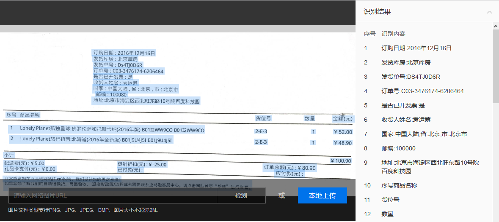

* 增值税发票

  

### 2.3.7.2 通用票据SDK API

  ```python

""" 如果有可选参数 """
options = {}
options["recognize_granularity"] = "big"
options["probability"] = "true"
options["accuracy"] = "normal"
options["detect_direction"] = "true"

""" 带参数调用通用票据识别 """
client.receipt(image, options)
  ```

**通用票据识别 请求参数详情**

| 参数名称              | 是否必选 | 类型   | 可选值范围                                    | 默认值 | 说明                                                         |
| --------------------- | -------- | ------ | --------------------------------------------- | ------ | ------------------------------------------------------------ |
| image                 | 是       | string |                                               |        | 图像数据，base64编码，要求base64编码后大小不超过4M，最短边至少15px，最长边最大4096px,支持jpg/png/bmp格式 |
| recognize_granularity | 否       | string | big - 不定位单字符位置 small - 定位单字符位置 | small  | 是否定位单字符位置，big：不定位单字符位置，默认值；small：定位单字符位置 |
| probability           | 否       | string | true false                                    |        | 是否返回识别结果中每一行的置信度                             |
| accuracy              | 否       | string | normal - 使用快速服务                         |        | normal 使用快速服务，1200ms左右时延；缺省或其它值使用高精度服务，1600ms左右时延 |
| detect_direction      | 否       | string | true false                                    | false  | 是否检测图像朝向，默认不检测，即：false。朝向是指输入图像是正常方向、逆时针旋转90/180/270度。可选值包括: - true：检测朝向； - false：不检测朝向。 |

**通用票据识别 返回数据参数详情**

| 字段             | 是否必选 | 类型    | 说明                                                         |
| ---------------- | -------- | ------- | ------------------------------------------------------------ |
| log_id           | 是       | number  | 唯一的log id，用于问题定位                                   |
| words_result_num | 是       | number  | 识别结果数，表示words_result的元素个数                       |
| words_result     | 是       | array() | 定位和识别结果数组                                           |
| +location        | 是       | object  | 位置数组（坐标0点为左上角）                                  |
| ++left           | 是       | number  | 表示定位位置的长方形左上顶点的水平坐标                       |
| ++top            | 是       | number  | 表示定位位置的长方形左上顶点的垂直坐标                       |
| ++width          | 是       | number  | 表示定位位置的长方形的宽度                                   |
| ++height         | 是       | number  | 表示定位位置的长方形的高度                                   |
| +words           | 是       | string  | 识别结果字符串                                               |
| +chars           | 否       | array() | 单字符结果，recognize_granularity=small时存在                |
| ++location       | 是       | array() | 位置数组（坐标0点为左上角）                                  |
| +++left          | 是       | number  | 表示定位位置的长方形左上顶点的水平坐标                       |
| +++top           | 是       | number  | 表示定位位置的长方形左上顶点的垂直坐标                       |
| +++width         | 是       | number  | 表示定位定位位置的长方形的宽度                               |
| +++height        | 是       | number  | 表示位置的长方形的高度                                       |
| +++char          | 是       | string  | 单字符识别结果                                               |
| +probability     | 否       | object  | 识别结果中每一行的置信度值，包含average：行置信度平均值，variance：行置信度方差，min：行置信度最小值 |

**通用票据识别 返回示例**

```
{
    "log_id": 2661573626,
    "words_result": [
        {
            "location": {
                "left": 10,
                "top": 3,
                "width": 121,
                "height": 24
            },
            "words": "姓名:小明明",
            "chars": [
                {
                    "location": {
                        "left": 16,
                        "top": 6,
                        "width": 17,
                        "height": 20
                    },
                    "char": "姓"
                }
                ...
            ]
        },
        {
            "location": {
                "left": 212,
                "top": 3,
                "width": 738,
                "height": 24
            },
            "words": "卡号/病案号:105353990标本编号:150139071送检科室:血液透析门诊病房",
            "chars": [
                {
                    "location": {
                        "left": 218,
                        "top": 6,
                        "width": 18,
                        "height": 21
                    },
                    "char": "卡"
                }
                ...
            ]
        }
    ],
    "words_result_num": 2
}
```

### 2.3.7.3 通用票据识别代码

```python
# 定义识别函数
def receipt_ocr(client, image_path):
    # 打开图片
    with open(image_path, 'rb') as f:
        """ 如果有可选参数 """
        options = {}
        options["recognize_granularity"] = "big"
        options["probability"] = "true"
        options["accuracy"] = "normal"
        options["detect_direction"] = "true"

        """ 带参数调用通用票据识别 """
        result = client.receipt(f.read(), options)

        pprint(result)

    return None

if __name__ == "__main__":
    # 实例化 AipOcr
    aip = AipOcr('11538347', '7ISISvl3VGa0P2vFXrbwsHt1', 'YvsYc8qxFR*******ZG3d64L')

    receipt_ocr(aip, '.\data\images\增值税发票.jpg')
```

## 2.3.8 自定义模板文字识别和分类管理器 

### 2.3.8.1 介绍

自定义模版文字识别是一款可以针对各种票据、卡证实现字段名和字段值对应提取的OCR产品；比如：当你需要识别某一种证件（比如房产证），但是百度官方还没有针对这种类型的证件推出具体的模版识别接口，而使用通用文字识别无法实现字段名和字段值对应化的提取，这种情况下您可以使用自定义模版文字识别产品，实现结构化的数据提取。

### 2.3.8.2 模板制作步骤（以增值税发票为例）

* 访问自定义模板文字识别主页面 http://ai.baidu.com/tech/ocr/iocr ，点击“立即使用”，进入“模板管理”页面。

  

*  点击“创建模板”

  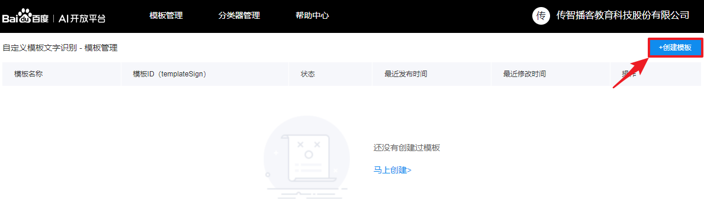

* 点击“点击选择图片”

  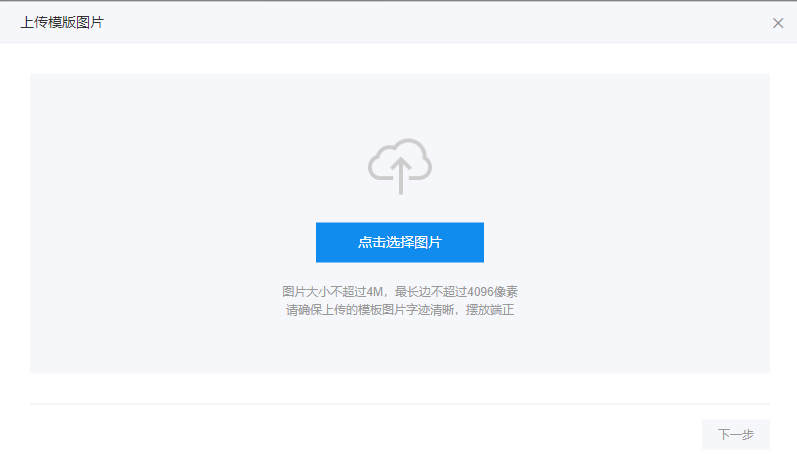

* 在电脑里选择模板图片，图片要求：

  * 图片要求摆放端正、平整，拍摄时避免过曝，阴影等不良情况

  * 单字像素16\*16到60*60之间

  * 图片大小在200-800kb之间 

    **注意** 判断图片是否符合标准有2种方式,任选其一：

    （1）在电脑“画图”工具中可查看，点击“画图”工具中，”选择“，框住单字，查看是否符合标准

    （2）或，在“通用票据识别”demo中，上传图片，能够识别，则该图片符合要求。

    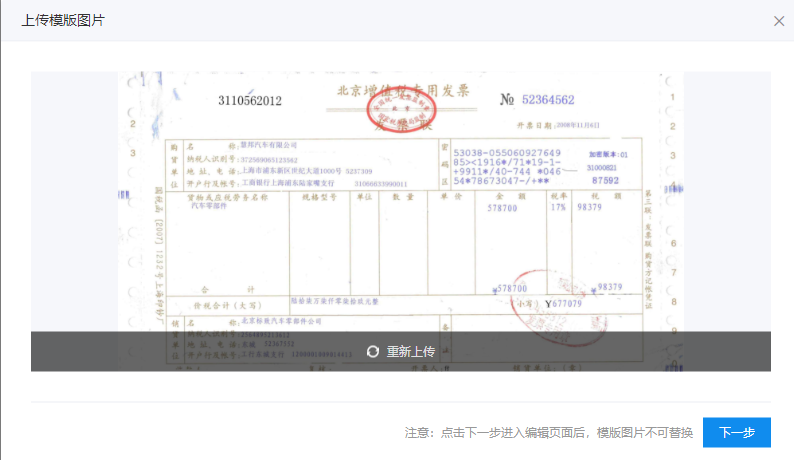

* 点击下一步，进入“编辑模板”页面，完成四步：基本信息，框选参照字段，框选识别区，测试发布。

  * 基本信息：填写模板名称

  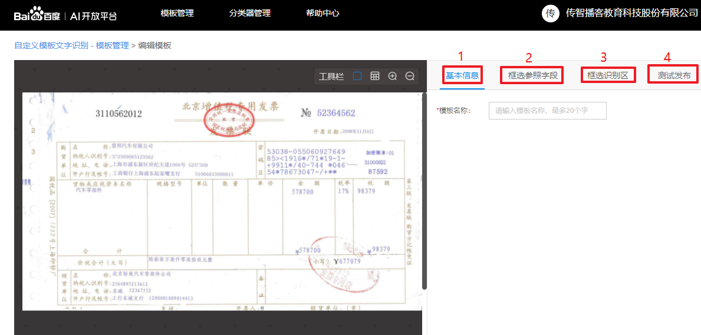

  - 框选参照字段：框选图片中固定不变的文字段，后期上传的图片会以此为依据进行扭正，参照点的选取会影响图片的识别率。

    - 参照字段要求：同位置同字，清晰，分散，简单，唯一，8个以上

    - 四不：不选特殊字符（最好只选字，数字等），不选难识别的容易出错的，不选会变化的，不选跨行的

    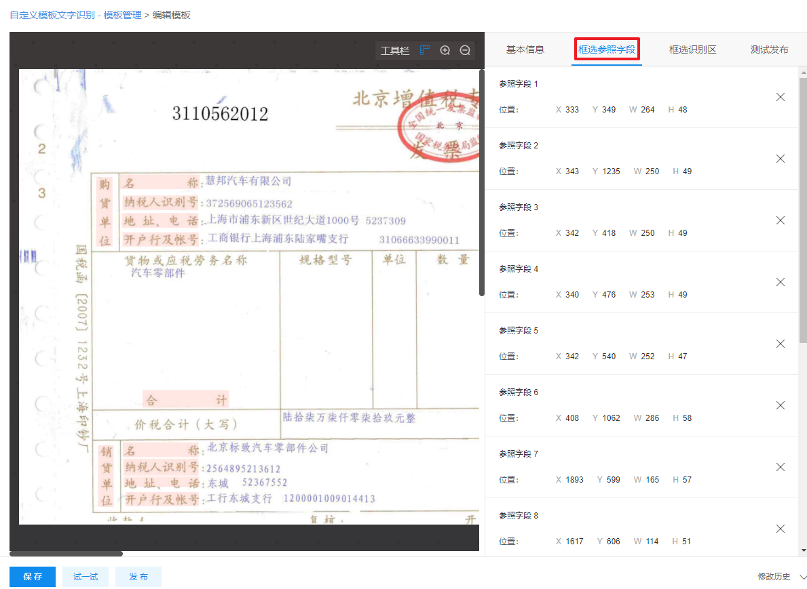

  - 框选识别区：框选需要识别的内容所在的位置区域。 给每个识别区取字段名。

    

  - 测试发布：点击“保存”，点击“试一试”，上传需要识别的图片 进行测试。如果能够成功识别，可以点击“立即发布”，完成模板的定义。

    

    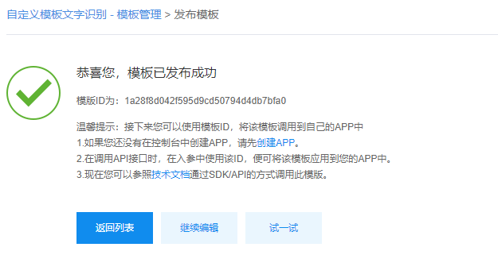

### 2.3.8.3 自定义模版文字识别API 

```python
""" 调用自定义模版文字识别 """
client.custom(image, templateSign);
```

**自定义模版文字识别 请求参数详情**

| 参数名称     | 是否必选 | 类型   | 说明                                                         |
| ------------ | -------- | ------ | ------------------------------------------------------------ |
| image        | 是       | string | 图像数据，base64编码，要求base64编码后大小不超过4M，最短边至少15px，最长边最大4096px,支持jpg/png/bmp格式 |
| templateSign | 是       | string | 您在自定义文字识别平台制作的模版的ID                         |

**自定义模版文字识别 返回数据参数详情**

| 字段       | 是否必选   | 类型           | 说明                                                      |
| ---------- | ---------- | -------------- | --------------------------------------------------------- |
| error_code | number     | number         | 0代表成功，如果有错误码返回可以参考下方错误码列表排查问题 |
| error_msg  | 是         | string         | 具体的失败信息，可以参考下方错误码列表排查问题            |
| data       | jsonObject | 识别返回的结果 |                                                           |

**自定义模版文字识别 返回示例**

```python
{'error_code': 0,
 'error_msg': '',
    'data': {'isStructured': True,
          'logId': '153200556034161',
          'ret': [{'location': {'height': 9,
                                'left': 136,
                                'top': 100,
                                'width': 15},
                   'probability': {'average': 0.960999,
                                   'min': 0.846632,
                                   'variance': 0.00436},
                   'word': '个人',
                   'word_name': '买方名称'},
                  {'location': {'height': 11,
                                'left': 132,
                                'top': 296,
                                'width': 74},
                   'probability': {'average': 0.903599,
                                   'min': 0.435438,
                                   'variance': 0.029529},
                   'word': '上海圆迈贸易有限公司',
                   'word_name': '卖方名称'},
                  {'location': {'height': 12,
                                'left': 461,
                                'top': 268,
                                'width': 42},
                   'probability': {'average': 0.978144,
                                   'min': 0.893464,
                                   'variance': 0.001793},
                   'word': '93.46',
                   'word_name': '金额'}],
          'scores': 1.0,
          'templateSign': '1a28f8d042f595d9cd50794d4db7bfa0'}
}
```


### 2.3.8.4 自定义模版文字识别代码示例

```python
from aip import AipOcr
from pprint import pprint

# 实例化文字识别客户端，参数为应用的App ID， API Key 和 Secret Key
aip = AipOcr('11554123', 'ZTiXeZUw5QWjWTwyGMTjo1Q2', 'QUBq*******************VpbaGB8q')

# 以只读和二进制方式打开图片文件
with open('增值税发票.jpg', 'rb') as f:
    # 读取图片内容
    img = f.read()
    # 模板ID
    templateSign = '1a28f8d042f595d9cd50794d4db7bfa0'
    
    # 调用 识别函数
    result = aip.custom(img, templateSign)
    pprint(result)

```


### 2.3.8.5 创建分类器

如果通过自定义模板文字识别定制了大量模板，就需要人工先对各类票据进行分类，再选择对应的模板进行结构化识别。为了节省用户票据分类的成本，百度加入了模板自动分类功能，客户在“分类器管理”标签中可以针对所有的自定义模板和百度平台已有的系统模板（如身份证、银行卡、驾驶证等）创建分类器，实现模板的自动分类。 

* 创建分类器。点击“分类器管理”，再点击“创建分类器”

  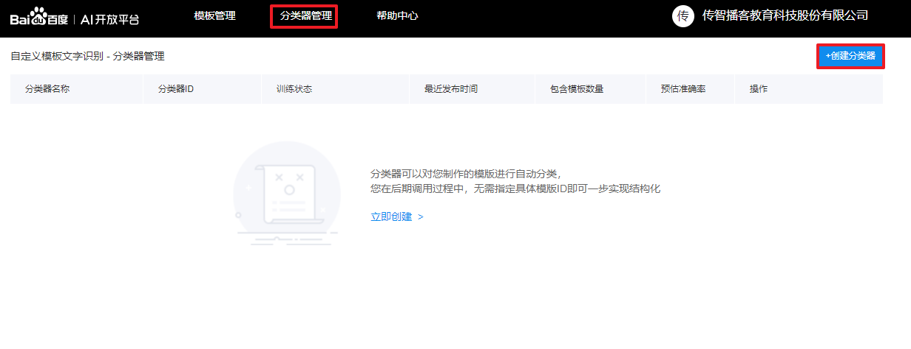

* 输入分类器名称和该分类器的应用场景/功能描述后点击确定进入编辑页面

  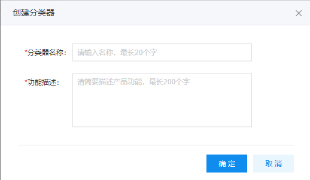

* 选择参与分类的模板。

  需要分类的模板分为“我的模板”和“系统模板”，我的模板指客户在自定义模板文字识别中创建的模板，系统模板指百度官网预置的模板（包含了：身份证正面、身份证反面、银行卡、驾驶证、行驶证、车牌、营业执照、护照、增值税发票）。客户可以根据业务需要添加模板参与分类。

  

* 上传对应模板的训练集。参与分类的如果是百度预置的模板，无需上传训练集，如果参与分类的是自己制作的模板则需要准备30到100张同模板的票据打包成ZIP包以后点击“编辑训练集”上传该训练集。

  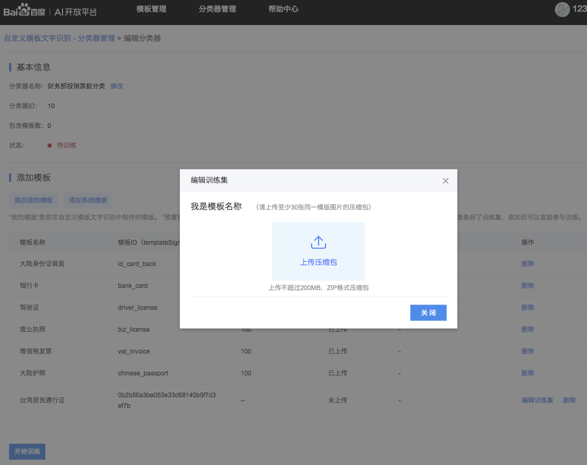

* 当所有的自定义模板都已经上传了符合要求（30到100张、同模板）的训练集后点击“开始训练”。可以在分类器管理页面查看预计完成的时间并通过刷新查看当前状态。 

  

  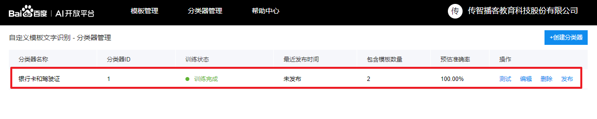

* 训练完成后进行效果测试
  当您的分类器训练完成后您可以在分类器管理页面点击“测试”上传图片进行分类测试，如果测试结果没有问题点击“发布”，即可通过API调用该接口，参数classifierId指定某个已发布的分类器，即可实现该分类器中任意模板的自动识别。如果对分类结果不满意，建议检查训练集数据中是否包含了较多噪声数据，或尝试增加训练集内的图片数量。

### 2.3.8.6 分类器API

**请求方法**

HTTP 方法：`POST`

请求URL： `https://aip.baidubce.com/rest/2.0/solution/v1/iocr/recognise`

URL参数：

| 参数         | 值                                                           |
| ------------ | ------------------------------------------------------------ |
| access_token | 通过API Key和Secret Key获取的access_token,参考“[Access Token获取](http://ai.baidu.com/docs#/Auth)” |

Header如下：

| 参数         | 值                                |
| ------------ | --------------------------------- |
| Content-Type | application/x-www-form-urlencoded |

Body中放置请求参数，参数详情如下：

**请求参数**

| 参数         | 是否必选 | 类型   | 可选值范围 | 说明                                                         |
| ------------ | -------- | ------ | ---------- | ------------------------------------------------------------ |
| image        | true     | string | -          | 图像数据，base64编码后进行urlencode，要求base64编码和urlencode后大小不超过4M，最短边至少15px，最长边最大4096px,支持jpg/png/bmp格式 |
| templateSign | false    | string | -          | 您在自定义文字识别平台制作的模板的ID，举例：Nsdax2424asaAS791823112 |
| classifierId | false    | int    | -          | 分类器Id。这个参数和templateSign至少存在一个，优先使用templateSign。存在templateSign时，表示使用指定模板；如果没有templateSign而有classifierId，表示使用分类器去判断使用哪个模板 |

**返回参数**

| 字段          | 类型       | 说明                                                         |
| ------------- | ---------- | ------------------------------------------------------------ |
| error_code    | int        | 0代表成功，如果有错误码返回可以参考下方错误码列表排查问题    |
| error_msg     | string     | 如果error_code具体的失败信息，可以参考下方错误码列表排查问题 |
| data          | jsonObject | 识别返回的结果                                               |
| +isStructured | boolean    | 表示是否结构话成功，true为成功，false为失败；成功时候，返回结构化的识别结果；失败时，如果能识别，返回类似通用文字识别的结果，如果不能识别，返回空 |
| +logId        | string     | 调用的日志id                                                 |
| +templateSign | string     | 使用的tenplateSign                                           |
| +scores       | float      | 分类器的得分，直接选择时为1.0F                               |
| +ret          | jsonArray  | 识别出来的字段数组，每一个单元里包含以下几个元素             |
| ++word_name   | string     | isStructured 为 true 时存在，表示字段的名字；如果 isStructured 为 false 时，不存在 |
| ++word        | string     | 识别的字符串或单字                                           |

**返回结果示例**

```python
{'data': {'isStructured': True,
          'logId': '153302879295072',
          'ret': [{'word': 'NO VALID',
                   'word_name': 'valid_date'},
                  {'word': '966666 213818 710515',
                   'word_name': 'bank_card_number'},
                  {'word': 1, 
                   'word_name': 'bank_card_type'},
                  {'word': '兴业银行',
                   'word_name': 'bank_name'}],
          'scores': 0.8322,
          'templateSign': 'bank_card'},
 'error_code': 0,
 'error_msg': ''}

```

### 2.3.8.7 分类器请求代码示例

```python
# 获取access token
# 调用api 进行分类

import urllib.request, urllib.parse
import json
from pprint import pprint
import base64


# 定义Classifier 类
class Classifier(object):
    def __init__(self, app_id, api_key, secret_key):
        self.app_id = app_id
        self.api_key = api_key
        self.secret_key = secret_key
        self.token_url = 'https://aip.baidubce.com/oauth/2.0/token'
        self.service_url = 'https://aip.baidubce.com/rest/2.0/solution/v1/iocr/recognise'

    def get_token(self):
        """
        获取 access token
        :return: access token
        """
        grant_type = 'client_credentials'
        client_id = self.api_key
        client_secret = self.secret_key

        # 构建url地址和参数
        url = self.token_url + '?grant_type=' + grant_type + '&client_id=' + client_id + '&client_secret=' + client_secret

        # 构建http 请求
        request = urllib.request.Request(url)
        request.add_header('Content-Type', 'application/json; charset=UTF-8')

        # 发送http请求
        response = urllib.request.urlopen(request)
        content = response.read()

        # pprint(json.loads(content.decode()))
        return json.loads(content.decode())['access_token']

    def classify(self, token, image, classifierId):
        """
       	自动选择模板，然后识别图片的文字
        :param token: access token
        :param image: 已经读取好的图片数据, 还未进行base64编码
        :return: 返回分类结果
        """
        # 构建服务url + 参数: access_token
        url = self.service_url + '?access_token=' + token

        # 对图片进行base64编码
        img64 = base64.b64encode(image)

        # 构建 http 请求 body
        params = {}
        params['image'] = img64
        params['classifierId'] = classifierId

        # 把字典数据编码为字符串
        params = urllib.parse.urlencode(params).encode()

        # 构建http 请求
        request = urllib.request.Request(url, params)
        request.add_header('Content-Type', 'application/x-www-form-urlencoded; charset=UTF-8')

        # 发送请求
        response = urllib.request.urlopen(request)
        content = response.read()
        result = json.loads(content.decode())
        return result


if __name__ == "__main__":
    # 实例化分类器类
    classifier = Classifier('11560811', 'gN0pPnWTQsuvDSrGXptq5Zyl', 'dVaefK5FYkfD1AxhYOb9dg2EeDSBLKEj')

    # 调用get_token获取access_token
    token = classifier.get_token()
    pprint(token)

    # 读取图片, 调用classify函数
    with open('./data/images/card1.JPG', 'rb') as f:
        image = f.read()
        ret = classifier.classify(token, image, 1)
        pprint(ret)
```

