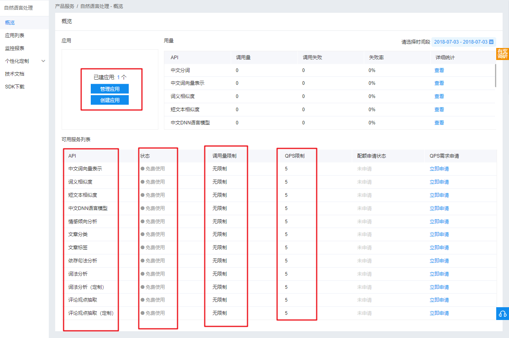
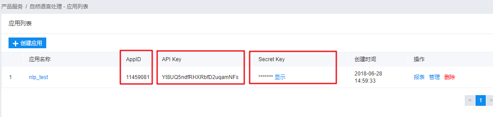

# 4.1 自然语言处理基础技术

## 4.1.1介绍

语言处理基础技术: 提供国际领先的自然语言处理技术，帮助你的产品更好的理解这个世界  

- 词法分析 : 识别出文本串中的基本词汇（分词），对这些词汇进行重组、标注组合后词汇的词性，并进一步识别出命名实体 
- 中文词向量表示 : 通过训练的方法，将语言词表中的词映射成一个长度固定的向量，实现文本的可计算。
- 中文DNN语言模型 : 通过计算给定词组成的句子的概率，从而判断所组成的句子是否符合客观语言表达习惯。
- 短文本相似度 : 提供不同短文本之间相似度的计算。
- 评论观点抽取 : 对给定的评论文本，自动分析评论关注点和观点，输出评论观点标签及评论观点极性。
- 依存句法分析 :  输入中文句子，即可获得该句的依存句法结构信息。
- 词义相似度 ：依托全网海量优质数据和深度神经网络技术，通过词语向量化来计算两个词之间的相似度。
- 情感倾向分析 ：对含主观信息的文本进行情感极性判断，为口碑分析、话题监控、舆情分析等应用提供基础技术支持。
- 文章标签 ：对文章的标题和内容进行深度分析，输出能够反映文章关键信息的主题、话题、实体等多维度标签以及对应的置信度。
- 文章分类 ：对文章按照内容类型进行自动分类 。
- 对话情绪识别 ：针对用户日常沟通文本背后所蕴含情绪的一种直观检测，可自动识别出当前会话者所表现出的情绪类别及其置信度。

# 4.1.2 创建应用

* 通过人工智能主页或者控制台，选择 人工智能->自然语言处理，进入自然语言处理的管理控制台

  

概述页面显示可用的服务列表，状态为免费试用，调用量限制，每秒的并发访问限制数量。可以选择创建应用新建一个应用。

* 建立新的自然语言处理应用

  

填写具体的信息，然后立即创建，从应用列表可以看到已经创建的应用。

* 从应用列表获取SDK需要的AppID, API Key 和 Secret Key。

  

## 4.1.3 自然语言处理的API
由于功能比较多这里选择两个功能介绍
* 新建AipNlp，AipNlp是自然语言处理的Python SDK客户端，为使用自然语言处理的开发人员提供了一系列的交互方法。 
```
client = AipNlp(APP_ID, API_KEY, SECRET_KEY)
```
APP_ID，API_KEY和SECRET_KEY为从应用列表获得的三项值

## 4.1.4 情感分析倾向分析

### 4.1.4.1 情感分析倾向API

* 情感倾向分析, 对包含主观观点信息的文本进行情感极性类别（积极、消极、中性）的判断，并给出相应的置信度。
```python
AipNlp.sentimentClassify(text)
```

**情感倾向分析 请求参数详情**

| 参数名称 | 是否必选 | 类型   | 说明                              |
| -------- | -------- | ------ | --------------------------------- |
| text     | 是       | string | 文本内容（GBK编码），最大2048字节 |

**情感倾向分析 返回数据参数详情**

| 参数           | 是否必须 | 类型   | 说明                                         |
| -------------- | -------- | ------ | -------------------------------------------- |
| text           | 是       | string | 输入的文本内容                               |
| items          | 是       | array  | 输入的词列表                                 |
| +sentiment     | 是       | number | 表示情感极性分类结果, 0:负向，1:中性，2:正向 |
| +confidence    | 是       | number | 表示分类的置信度                             |
| +positive_prob | 是       | number | 表示属于积极类别的概率                       |
| +negative_prob | 是       | number | 表示属于消极类别的概率                       |

**情感倾向分析 返回示例**

```
{
    "text":"苹果是一家伟大的公司",
    "items":[
        {
            "sentiment":2,    //表示情感极性分类结果
            "confidence":0.40, //表示分类的置信度
            "positive_prob":0.73, //表示属于积极类别的概率
            "negative_prob":0.27  //表示属于消极类别的概率
        }
    ]
}
```

### 4.1.4.2 情感分析案例代码

* 实例化AipNlp 对象

```python
from aip import AipNlp
import pprint

# 从应用列表获取下面三个参数
APP_ID = '11459081'
API_KEY = 'Yt8UQ5ndfRHXRbfD2uqamNFs'
SECRET_KEY = 'IzAviO4IS5dk3vtAiGWPySG8GYK8Q9WO'

client = AipNlp(APP_ID, API_KEY, SECRET_KEY)
```

* 调用sentimentClassify

```python
text = '''#微镜头#【他们训练的样子，真帅！[威武]】近日，武警上海总队机动一支队
		“猎豹”突击队在上海郊区和某近海岛礁展开一场魔鬼周极限训练。7天6夜，他们冒着
		暴雨、顶着近40℃的高温，先后完成了极限体能、山林地追逃、大城市反恐等5大类
		近60个课目的研训。戳图↓为他们打call！[赞]（央视记者王殿甲 图/马长伟 
		王知洲 胡文华） '''

""" 调用情感倾向分析 """
result = client.sentimentClassify(text);
pprint.pprint(result)
```

分析结果

```
{'items': [{'confidence': 0.948825,
            'negative_prob': 0.0230286,
            'positive_prob': 0.976971,
            'sentiment': 2}],
 'log_id': 5065687380255273558,
 'text': '#微镜头#【他们训练的样子，真帅！[威武]】近日，武警上海总队机动一支队\n'
         '\t\t“猎豹”突击队在上海郊区和某近海岛礁展开一场魔鬼周极限训练。7天6夜，他们冒着\n'
         '\t\t暴雨、顶着近40℃的高温，先后完成了极限体能、山林地追逃、大城市反恐等5大类\n'
         '\t\t近60个课目的研训。戳图↓为他们打call！[赞]（央视记者王殿甲 图/马长伟 \n'
         '\t\t王知洲 胡文华） '}
```

## 4.1.5 评论观点抽取案例

### 4.1.5.1 评论观点抽取API

* 评论观点抽取， 评论观点抽取接口用来提取一条评论句子的关注点和评论观点，并输出评论观点标签及评论观点极性。
```python
AipNlp.commentTag(text, options)
	text：需要进行分析的文本
	options：字典数据，选择行业类型，可选值见下表。
```
**评论观点抽取 请求参数详情**

| 参数名称 | 是否必选 | 类型   | 可选值范围                                                   | 说明                               |
| -------- | -------- | ------ | ------------------------------------------------------------ | ---------------------------------- |
| text     | 是       | string |                                                              | 评论内容（GBK编码），最大10240字节 |
| type     | 否       | string | 1 - 酒店 2 - KTV3 - 丽人 4 - 美食餐饮 5 - 旅游 6 - 健康 7 - 教育 8 - 商业 9 - 房产 10 - 汽车 11 - 生活 12 - 购物 13 - 3C | 评论行业类型，默认为4（餐饮美食）  |

**返回参数**

| 参数      | 类型   | 描述                                                |
| --------- | ------ | --------------------------------------------------- |
| log_id    | uint64 | 请求唯一标识码                                      |
| prop      | string | 匹配上的属性词                                      |
| adj       | string | 匹配上的描述词                                      |
| sentiment | int    | 该情感搭配的极性（0表示消极，1表示中性，2表示积极） |
| begin_pos | int    | 该情感搭配在句子中的开始位置                        |
| end_pos   | int    | 该情感搭配在句子中的结束位置                        |
| abstract  | string | 对应于该情感搭配的短句摘要                          |

**返回示例**

```
{
	"items": [
		{
	    "prop":"电池",  
        "adj": "不给力", 
        "sentiment": 0, 
        "begin_pos": 8, 
        "end_pos": 18,
		"abstract":"三星电脑<span>电池不给力</span>"
	    }
    ]
}
```

### 4.1.5.2  评论观点抽取代码 

* 实例化AipNlp 对象

```python
from aip import AipNlp
import pprint

# 从应用列表获取下面三个参数
APP_ID = '11459081'
API_KEY = 'Yt8UQ5ndfRHXRbfD2uqamNFs'
SECRET_KEY = 'IzAviO4IS5dk3vtAiGWPySG8GYK8Q9WO'

client = AipNlp(APP_ID, API_KEY, SECRET_KEY)
```
* 调用commenTag函数

```python
# 文本从某餐饮网站摘取
text = '''中午饭点去的，人不算多，服务很热情，点了葱香肥牛、五花肉，团购了芝士锅，
    牛肉和五花肉都是服务员代烤的，味道不错，芝士锅量很大但是味道一般，总体还是不错的。'''
    
""" 调用情感倾向分析 """

# 通过options填写行业信息, 4表示餐饮行业
options = {}
options['type'] = 4

result = client.commentTag(text, options)
pprint.pprint(result)
```

返回的分析结果

```python
{'items': [{'abstract': '<span>服务很热情</span>',
            'adj': '好',
            'begin_pos': 0,
            'end_pos': 10,
            'prop': '服务态度',
            'sentiment': 2},
           {'abstract': '<span>味道不错</span>',
            'adj': '不错',
            'begin_pos': 0,
            'end_pos': 8,
            'prop': '味道',
            'sentiment': 2},
           {'abstract': '芝士锅量很大但是<span>味道一般</span>',
            'adj': '一般',
            'begin_pos': 16,
            'end_pos': 24,
            'prop': '味道',
            'sentiment': 0},
           {'abstract': '<span>总体还是不错</span>的',
            'adj': '不错',
            'begin_pos': 0,
            'end_pos': 12,
            'prop': '总体',
            'sentiment': 2}],
'log_id': 3478734507494261450}
```